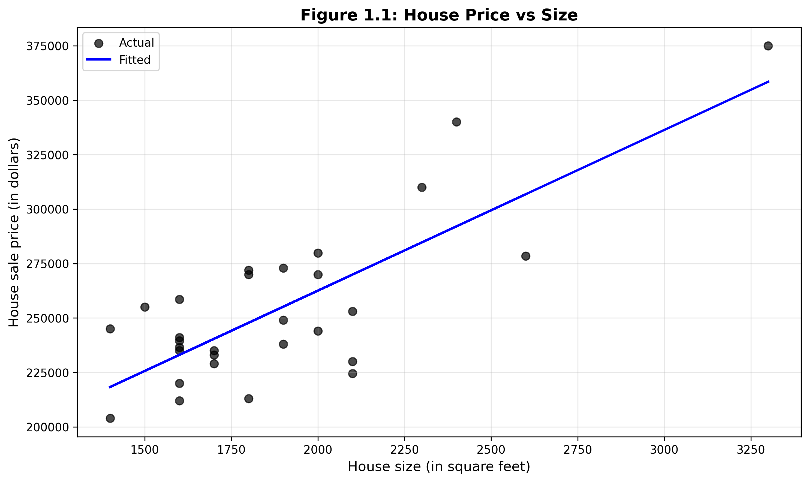

# Chapter 1: Analysis of Economics Data


*This chapter demonstrates simple linear regression analysis, examining how house size predicts sale price using real estate data from 29 houses in Central Davis, California.*

---

## Introduction

In this chapter, we perform a simple bivariate regression analysis in Python using econometric data. We examine the relationship between house size and sale price using data from 29 houses sold in Central Davis, California in 1999. Through this analysis, you'll learn fundamental concepts in econometrics including data loading, descriptive statistics, ordinary least squares (OLS) regression, and visualization of regression results.

**What You'll Learn:**
- How to load economic data from remote sources in Python
- How to compute and interpret descriptive statistics
- How to fit an OLS regression model using Python's statsmodels
- How to visualize regression relationships effectively
- How to interpret regression coefficients and model fit statistics in economic context

---

## Setup and Data Loading

### Code

**Context:** In this section, we establish the Python environment and load the housing dataset from a remote repository. Proper data loading is essential for any econometric analysis because it ensures we have clean, accessible data to work with. We use pandas' `read_stata()` function to directly import data in Stata format, allowing us to work with data from various econometric software packages seamlessly.

```python
# Import required libraries
import numpy as np
import pandas as pd
import matplotlib.pyplot as plt
import statsmodels.api as sm
from statsmodels.formula.api import ols
import os

# Set random seed for reproducibility
# This ensures that any random operations produce consistent results
RANDOM_SEED = 42
np.random.seed(RANDOM_SEED)

# Data source - streaming directly from GitHub
GITHUB_DATA_URL = "https://raw.githubusercontent.com/quarcs-lab/data-open/master/AED/"

# Create output directories for saving results
IMAGES_DIR = 'images'
TABLES_DIR = 'tables'
os.makedirs(IMAGES_DIR, exist_ok=True)
os.makedirs(TABLES_DIR, exist_ok=True)

# Load the house price data from Stata format
data_house = pd.read_stata(GITHUB_DATA_URL + 'AED_HOUSE.DTA')

# Display basic information about the dataset
print(data_house.info())
```

### Results

```
<class 'pandas.core.frame.DataFrame'>
RangeIndex: 29 entries, 0 to 28
Data columns (total 8 columns):
 #   Column     Non-Null Count  Dtype
---  ------     --------------  -----
 0   price      29 non-null     int32
 1   size       29 non-null     int16
 2   bedrooms   29 non-null     int8
 3   bathrooms  29 non-null     float32
 4   lotsize    29 non-null     int8
 5   age        29 non-null     float32
 6   monthsold  29 non-null     int8
 7   list       29 non-null     int32
dtypes: float32(2), int16(1), int32(2), int8(3)
memory usage: 737.0 bytes
```

### Interpretation

The dataset contains **29 observations** (houses) and **8 variables**:

- **price**: Sale price in dollars (dependent variable for our regression)
- **size**: House size in square feet (independent variable)
- **bedrooms**: Number of bedrooms
- **bathrooms**: Number of bathrooms
- **lotsize**: Lot size
- **age**: Age of the house in years
- **monthsold**: Month when sold
- **list**: Original listing price in dollars

All variables are numeric with no missing values. The data uses efficient data types (int8, int16, int32, float32) to minimize memory usage. By setting a random seed, we ensure reproducibility—anyone running this code will get identical results.

**Why this matters**: Starting with clean, complete data is essential for reliable econometric analysis. Understanding the structure and content of your data before analysis prevents errors and helps in interpreting results.

---

## Descriptive Statistics

### Code

**Context:** Before fitting any statistical model, we compute descriptive statistics to understand our data's basic characteristics. This exploratory step reveals the central tendency, spread, and range of variables, helping us identify potential data quality issues and understand what relationships might exist. Descriptive statistics provide the foundation for interpreting regression results in context.

```python
# Generate summary statistics for all variables
data_summary = data_house.describe()
print(data_summary)

# Save descriptive statistics to CSV for reference
data_summary.to_csv('tables/ch01_descriptive_stats.csv')
```

### Results

| Statistic | price | size | bedrooms | bathrooms | lotsize | age | monthsold | list |
|-----------|---------|---------|----------|-----------|---------|-------|-----------|---------|
| count | 29.0 | 29.0 | 29.0 | 29.0 | 29.0 | 29.0 | 29.0 | 29.0 |
| mean | 253,910.34 | 1,882.76 | 3.79 | 2.21 | 2.14 | 36.41 | 5.97 | 257,824.14 |
| std | 37,390.71 | 398.27 | 0.68 | 0.34 | 0.69 | 7.12 | 1.68 | 40,860.26 |
| min | 204,000.00 | 1,400.00 | 3.00 | 2.00 | 1.00 | 23.00 | 3.00 | 199,900.00 |
| 25% | 233,000.00 | 1,600.00 | 3.00 | 2.00 | 2.00 | 31.00 | 5.00 | 239,000.00 |
| 50% | 244,000.00 | 1,800.00 | 4.00 | 2.00 | 2.00 | 35.00 | 6.00 | 245,000.00 |
| 75% | 270,000.00 | 2,000.00 | 4.00 | 2.50 | 3.00 | 39.00 | 7.00 | 269,000.00 |
| max | 375,000.00 | 3,300.00 | 6.00 | 3.00 | 3.00 | 51.00 | 8.00 | 386,000.00 |

### Interpretation

The descriptive statistics reveal several important features of our dataset:

**Sample Characteristics:**
- **Sample size**: 29 house sales provide a small but complete dataset for analysis
- **Average sale price**: $253,910 (mean) with moderate variation (std dev = $37,391)
- **Median price**: $244,000, slightly below the mean, suggesting a slight right skew
- **Price range**: From $204,000 to $375,000 (range of $171,000)

**House Size:**
- **Average size**: 1,883 square feet
- **Standard deviation**: 398 sq ft indicates moderate variation in house sizes
- **Size range**: From 1,400 to 3,300 square feet
- **Distribution**: The median (1,800 sq ft) is close to the mean (1,883 sq ft), suggesting relatively symmetric distribution

**Other Features:**
- Most houses have 3-4 bedrooms (mean = 3.79, median = 4)
- Typical house has 2 bathrooms (little variation: std dev = 0.34)
- Houses are relatively old, averaging 36 years (range: 23-51 years)
- Sale prices were generally close to listing prices (mean sale = $253,910 vs mean list = $257,824)

**Why these statistics matter for regression**:
1. The variation in both price and size (std dev > 0) means there's something to explain
2. No extreme outliers are apparent (max values are reasonable)
3. Both variables show sufficient spread for meaningful regression analysis
4. The positive difference between means of price and size suggests a potential positive relationship

---

## Regression Analysis

### Code

**Context:** In this section, we estimate the relationship between house price and size using Ordinary Least Squares (OLS) regression. OLS is the most fundamental econometric technique, providing unbiased estimates of how one variable affects another. By fitting this model, we can quantify the marginal effect of house size on price and test whether this relationship is statistically significant.

```python
# Fit OLS regression: price ~ size
# Formula syntax similar to R: dependent_var ~ independent_var
model = ols('price ~ size', data=data_house).fit()

# Display complete regression summary
print(model.summary())

# Extract coefficient table with additional statistics
coef_table = pd.DataFrame({
    'coefficient': model.params,
    'std_err': model.bse,
    't_value': model.tvalues,
    'p_value': model.pvalues,
    'conf_lower': model.conf_int()[0],
    'conf_upper': model.conf_int()[1]
})
print(coef_table)

# Save regression outputs
with open('tables/ch01_regression_summary.txt', 'w') as f:
    f.write(model.summary().as_text())
coef_table.to_csv('tables/ch01_regression_coefficients.csv')
```

### Results

#### Full Regression Summary

```
                            OLS Regression Results
==============================================================================
Dep. Variable:                  price   R-squared:                       0.617
Model:                            OLS   Adj. R-squared:                  0.603
Method:                 Least Squares   F-statistic:                     43.58
Date:                Sat, 24 Jan 2026   Prob (F-statistic):           4.41e-07
Time:                        10:34:54   Log-Likelihood:                -332.05
No. Observations:                  29   AIC:                             668.1
Df Residuals:                      27   BIC:                             670.8
Df Model:                           1
Covariance Type:            nonrobust
==============================================================================
                 coef    std err          t      P>|t|      [0.025      0.975]
------------------------------------------------------------------------------
Intercept    1.15e+05   2.15e+04      5.352      0.000    7.09e+04    1.59e+05
size          73.7710     11.175      6.601      0.000      50.842      96.700
==============================================================================
Omnibus:                        0.576   Durbin-Watson:                   1.219
Prob(Omnibus):                  0.750   Jarque-Bera (JB):                0.638
Skew:                          -0.078   Prob(JB):                        0.727
Kurtosis:                       2.290   Cond. No.                     9.45e+03
==============================================================================

Notes:
[1] Standard Errors assume that the covariance matrix of the errors is correctly specified.
[2] The condition number is large, 9.45e+03. This might indicate that there are
strong multicollinearity or other numerical problems.
```

#### Coefficient Table

| Variable | Coefficient | Std Error | t-value | p-value | 95% CI Lower | 95% CI Upper |
|----------|-------------|-----------|---------|---------|--------------|--------------|
| Intercept | 115,017.28 | 21,489.36 | 5.352 | 0.0000118 | 70,924.76 | 159,109.81 |
| size | 73.77 | 11.17 | 6.601 | 0.0000004 | 50.84 | 96.70 |

### Interpretation

#### The Regression Equation

The estimated regression equation is:

**Price = $115,017.28 + $73.77 × Size**

or in econometric notation: Ŷ = β̂₀ + β̂₁X

**Intercept (β̂₀ = $115,017.28)**:
- Represents the estimated price when size = 0 square feet
- While statistically significant (p < 0.001), this is economically meaningless since houses cannot have zero size
- This value is an extrapolation far outside our data range (minimum size = 1,400 sq ft)
- The intercept's primary purpose is to anchor the regression line, not for interpretation

**Slope (β̂₁ = $73.77)**:
- **Economic interpretation**: For every additional square foot of house size, the sale price increases by approximately $73.77, on average
- **Statistical significance**: The p-value of 0.0000004 (< 0.001) provides overwhelming evidence that this relationship is not due to chance
- **Confidence interval**: We are 95% confident that the true effect of size on price lies between $50.84 and $96.70 per square foot
- **Practical meaning**: A 100 sq ft increase in size is associated with a $7,377 increase in price; a 500 sq ft increase relates to about $36,885 higher price

#### Model Fit and Statistical Significance

**R-squared (R² = 0.617)**:
- House size alone explains approximately **61.7% of the variation** in sale prices
- This is a substantial proportion, indicating that size is a strong predictor of price
- However, **38.3% of price variation remains unexplained**, likely due to other factors such as:
  - Location/neighborhood quality
  - House condition and age
  - Number of bedrooms/bathrooms
  - Lot size and amenities
  - Market conditions

**Adjusted R-squared (0.603)**:
- Adjusts for the number of predictors in the model
- Close to R², confirming that size is a meaningful predictor

**F-statistic (43.58, p < 0.001)**:
- Tests whether the overall model is statistically significant
- The extremely small p-value (4.41e-07) confirms the model is highly significant
- Rejects the null hypothesis that house size has no effect on price

**Standard Error of Regression**:
- Can be calculated from the residuals
- Represents the typical deviation of actual prices from predicted prices
- Useful for constructing prediction intervals

#### Regression Diagnostics

**Normality Tests**:
- **Omnibus test** (p = 0.750): Fails to reject normality assumption—residuals appear normally distributed
- **Jarque-Bera test** (p = 0.727): Confirms normality of residuals
- **Skewness** (-0.078): Near zero, indicating symmetric residual distribution
- **Kurtosis** (2.29): Close to 3 (normal distribution), suggesting no heavy tails

**Autocorrelation**:
- **Durbin-Watson statistic** (1.219): Slightly below 2, suggesting possible mild positive autocorrelation
- For cross-sectional data (like house sales), this is less concerning than for time series

**Multicollinearity**:
- **Condition number** (9.45e+03): High value suggests some numerical instability
- In a bivariate regression, this likely reflects the scale difference between the intercept and size coefficient
- Not a concern for interpretation in this simple model

#### Practical Implications

1. **For Sellers**: Each additional square foot adds roughly $74 to the house value. A 200 sq ft addition could increase value by approximately $14,754.

2. **For Buyers**: The model provides a benchmark for evaluating whether a house is fairly priced relative to its size.

3. **For Appraisers**: Size is clearly a major determinant of value, but the R² of 0.62 indicates that a comprehensive appraisal should consider additional factors.

4. **Limitations**:
   - The model is specific to Central Davis in 1999
   - Small sample size (n=29) limits generalizability
   - Relationship assumed to be linear (may not hold for very large or small houses)
   - Other important variables (location, condition, amenities) are omitted

> **💡 Key Concept: Ordinary Least Squares (OLS)**
>
> OLS finds the line that minimizes the sum of squared vertical distances between observed data points and the fitted regression line. This "best fit" criterion ensures that our estimates are unbiased and efficient under standard assumptions (linearity, no perfect multicollinearity, homoscedasticity, no autocorrelation, and normality of errors). The slope coefficient tells us the average change in Y when X increases by one unit, holding all else constant.

---

## Visualization

### Code

**Context:** Visual analysis complements numerical regression results by revealing patterns, outliers, and the overall quality of model fit. A scatter plot with the fitted regression line allows us to assess whether the linear model is appropriate for our data and identify any observations that deviate substantially from the predicted relationship. Visualization is essential for communicating regression results effectively.

```python
# Create scatter plot with fitted regression line
fig, ax = plt.subplots(figsize=(10, 6))

# Plot actual data points
ax.scatter(data_house['size'], data_house['price'],
           color='black', s=50, label='Actual data', alpha=0.7)

# Plot fitted regression line
ax.plot(data_house['size'], model.fittedvalues,
        color='blue', linewidth=2, label='Fitted regression line')

# Add labels and title
ax.set_xlabel('House size (in square feet)', fontsize=12)
ax.set_ylabel('House sale price (in dollars)', fontsize=12)
ax.set_title('Figure 1.1: House Price vs Size', fontsize=14, fontweight='bold')
ax.legend(loc='upper left')
ax.grid(True, alpha=0.3)

# Save figure at high resolution
plt.tight_layout()
plt.savefig('images/ch01_fig1_house_price_vs_size.png', dpi=300, bbox_inches='tight')
plt.show()
```

### Results



### Interpretation

The scatter plot reveals several important insights about the price-size relationship:

**Visual Assessment of Model Fit**:
- **Positive relationship**: The upward-sloping pattern confirms that larger houses tend to sell for higher prices
- **Linear fit**: The straight blue line fits the data reasonably well, suggesting a linear relationship is appropriate
- **Data scatter**: Points are distributed around the fitted line, consistent with R² = 0.617
- **Residuals**: The vertical distance from each point to the line represents the prediction error (residual) for that house

**Key Observations**:

1. **Goodness of Fit**:
   - Most data points lie relatively close to the regression line
   - The spread of points around the line is fairly consistent across house sizes
   - This validates our R² interpretation: the model captures the main trend but not all variation

2. **Outliers and Influential Points**:
   - No extreme outliers are visible
   - A few houses sell for notably more or less than predicted by size alone
   - These deviations likely reflect other house characteristics (location, condition, amenities)

3. **Linearity**:
   - The relationship appears linear throughout the range of observed sizes (1,400-3,300 sq ft)
   - No obvious curvature suggesting that a linear model is appropriate
   - For much larger or smaller houses (outside this range), the linear relationship might not hold

4. **Homoscedasticity**:
   - The vertical spread of points appears roughly constant across different house sizes
   - This suggests that the assumption of constant variance (homoscedasticity) is reasonable
   - If variance increased with size, we'd see a fan-shaped pattern (not observed here)

**What the Plot Tells Us**:
- The visualization confirms what the regression statistics indicated: size is a strong but not perfect predictor of price
- Houses with similar sizes can have different prices (vertical variation at any given size)
- The linear model is a reasonable approximation for this data range
- To improve predictions, we would need to include additional variables (bedrooms, bathrooms, age, lot size, location)

**Why Visualization Matters**:
- Numbers alone (R², coefficients) can be misleading if assumptions are violated
- Plots reveal patterns, outliers, and non-linearities that statistics might miss
- Visual inspection is an essential diagnostic tool in regression analysis
- Helps communicate findings to non-technical audiences

---

## Summary and Key Findings

### Code

**Context:** In this final section, we consolidate and present the key results from our regression analysis in a clear, accessible format. Summarizing findings is crucial for communicating econometric results to diverse audiences who may not need the full statistical detail but require the essential economic insights. This step bridges technical analysis and practical decision-making.

```python
# Display key regression results
print("=" * 70)
print("KEY REGRESSION RESULTS")
print("=" * 70)
print(f"Intercept: ${model.params['Intercept']:,.2f}")
print(f"Slope (price per sq ft): ${model.params['size']:,.2f}")
print(f"R-squared: {model.rsquared:.4f}")
print(f"Adjusted R-squared: {model.rsquared_adj:.4f}")
print(f"Number of observations: {int(model.nobs)}")
print()
print("INTERPRETATION:")
print(f"For every additional square foot, price increases by ${model.params['size']:,.2f}")
print(f"The model explains {model.rsquared*100:.2f}% of price variation")
print("=" * 70)
```

### Results

```
======================================================================
KEY REGRESSION RESULTS
======================================================================
Intercept: $115,017.28
Slope (price per sq ft): $73.77
R-squared: 0.6175
Adjusted R-squared: 0.6033
Number of observations: 29

INTERPRETATION:
For every additional square foot, price increases by $73.77
The model explains 61.75% of price variation
======================================================================
```

### Interpretation

#### Summary of Findings

This analysis demonstrates the fundamental principles of bivariate regression using real estate data. Our key findings are:

**Main Result**:
- There is a **strong, positive, and statistically significant relationship** between house size and sale price
- Each additional square foot increases price by approximately **$73.77** (95% CI: $50.84-$96.70)
- This relationship is highly significant (p < 0.001) and not due to chance

**Model Performance**:
- Size alone explains **61.7% of price variation**—a substantial proportion
- The remaining 38.3% is attributable to other factors not captured in this simple model
- Model diagnostics (normality tests, residual plots) suggest no major violations of OLS assumptions

**Practical Implications**:

1. **For Real Estate Valuation**:
   - Size is clearly a major price determinant in the Central Davis market (circa 1999)
   - A benchmark value of ~$74 per square foot can guide pricing decisions
   - However, price per square foot varies (confidence interval is $51-$97), so other factors matter

2. **For Homeowners/Buyers**:
   - Adding square footage (e.g., through extensions) likely increases resale value
   - A 500 sq ft addition might increase value by ~$37,000
   - However, location, condition, and features also significantly affect value

3. **For Further Analysis**:
   - The model could be improved by including additional predictors (bedrooms, bathrooms, lot size, age, location)
   - Multiple regression would likely increase R² and provide more accurate predictions
   - Might also consider non-linear relationships or interaction effects

**Methodological Insights**:

This simple example illustrates several core econometric concepts:
- How to specify and estimate a regression model
- Interpreting coefficients (slope and intercept)
- Assessing model fit (R²) and statistical significance (p-values, confidence intervals)
- Using visualization to validate model assumptions
- Recognizing model limitations (omitted variables, sample specificity)

**Limitations to Acknowledge**:

1. **Sample Size**: With only 29 observations, results may not generalize to broader markets
2. **Time Specificity**: Data from 1999 may not reflect current price-size relationships
3. **Location Specificity**: Central Davis market may differ from other regions
4. **Omitted Variables**: Many price determinants are not included (location, condition, amenities)
5. **Linear Assumption**: Relationship may be non-linear outside the observed size range (1,400-3,300 sq ft)

> **💡 Key Concept: R² (Coefficient of Determination)**
>
> R² measures the proportion of variance in the dependent variable that is explained by the model. An R² of 0.617 means that 61.7% of the variation in house prices is accounted for by house size, while 38.3% remains unexplained. Higher R² indicates better model fit, but it doesn't guarantee that the model is appropriate, that the relationships are causal, or that predictions will be accurate for new data. A model can have high R² but still violate important assumptions.

---

## Conclusion

In this chapter, we've explored the relationship between house size and price using simple linear regression in Python. We examined data from 29 houses in Central Davis, California, and found a strong, positive relationship: each additional square foot increases price by approximately $74. This relationship is highly statistically significant and explains about 62% of the variation in house prices.

Through this analysis, you've learned the complete workflow for econometric analysis: loading data, computing descriptive statistics, fitting OLS models, and interpreting results in economic terms. Most importantly, you've seen how to translate statistical findings into meaningful economic insights that can inform real-world decisions.

**What You've Learned**:

- **Programming**: How to use pandas for data manipulation, statsmodels for regression estimation, and matplotlib for creating publication-quality visualizations
- **Statistics**: How to interpret regression coefficients, R², p-values, confidence intervals, and diagnostic tests
- **Economics**: How to connect statistical results to economic questions about pricing, valuation, and market relationships
- **Methodology**: Why it's essential to examine data before modeling, check assumptions, and use visualization to validate results

**Looking Ahead**:

In the next chapters, we'll expand these foundations to more complex scenarios. You'll learn how to incorporate multiple predictors simultaneously, test hypotheses about economic relationships, and handle violations of standard OLS assumptions. You might also try extending this analysis by adding bedrooms, bathrooms, or age as additional explanatory variables to see if you can improve the model's predictive power.

The principles you've learned here—careful data examination, proper model specification, rigorous interpretation, and effective communication—form the foundation for all empirical work in economics and data science. These skills will serve you throughout your studies and professional career.

---

**References**:

- Cameron, A.C. (2022). *Analysis of Economics Data: An Introduction to Econometrics*. <https://cameron.econ.ucdavis.edu/aed/index.html>
- Python libraries: pandas, numpy, statsmodels, matplotlib

**Data**:

All datasets are available at: <https://cameron.econ.ucdavis.edu/aed/aeddata.html>
