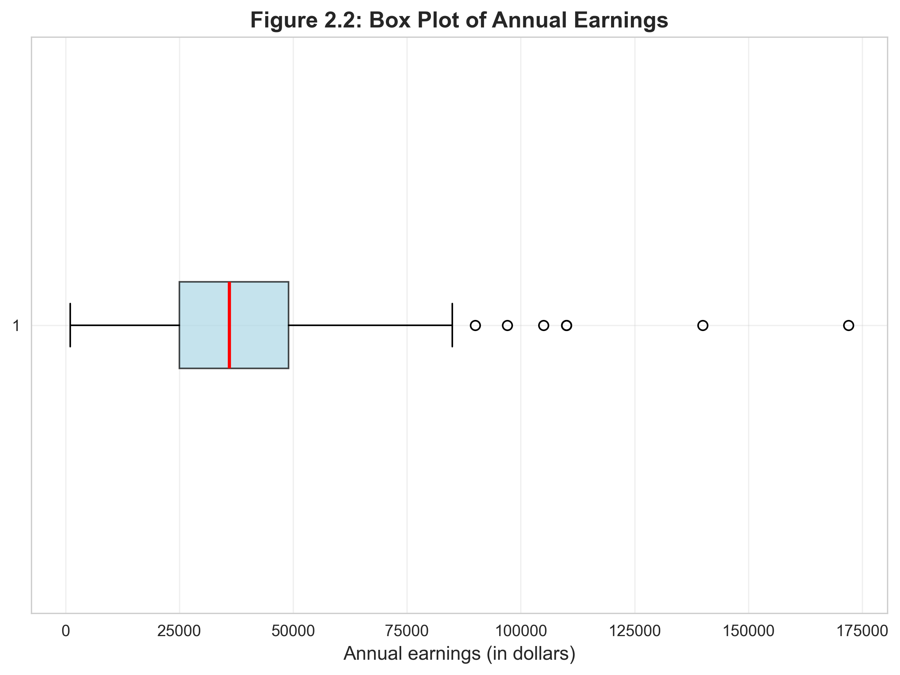
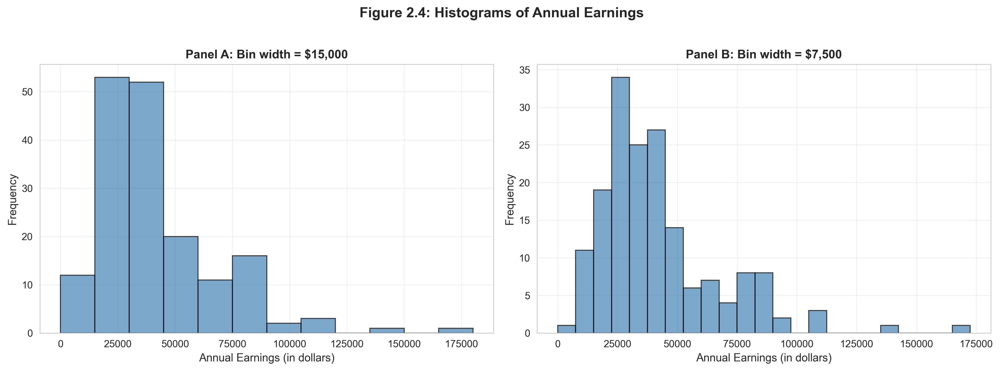
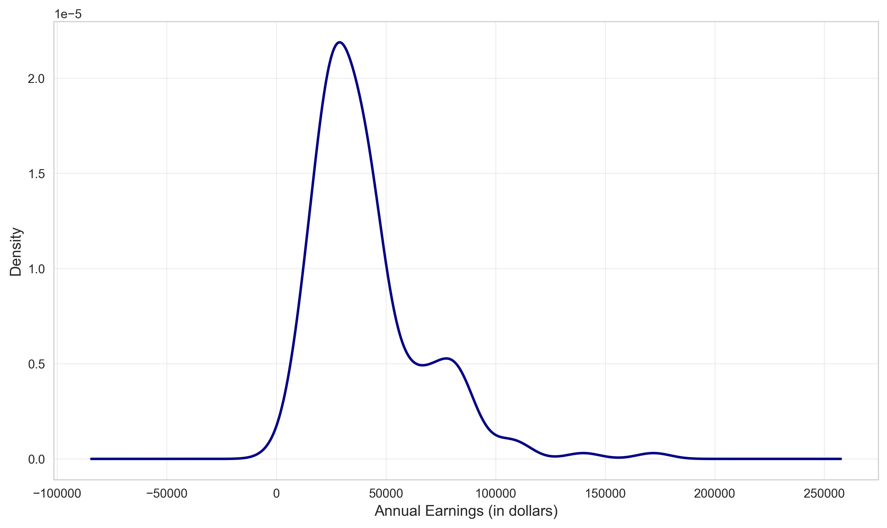
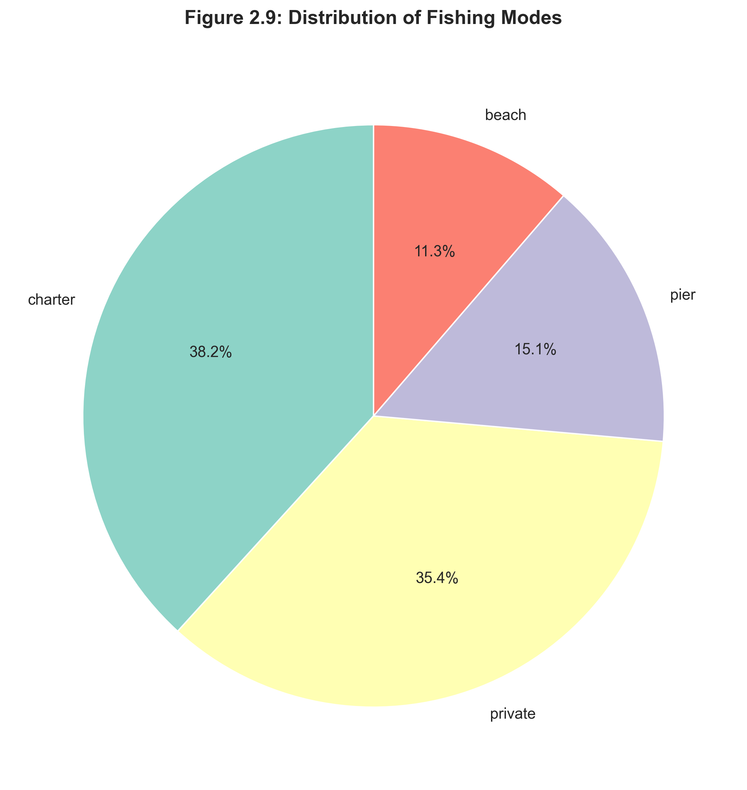
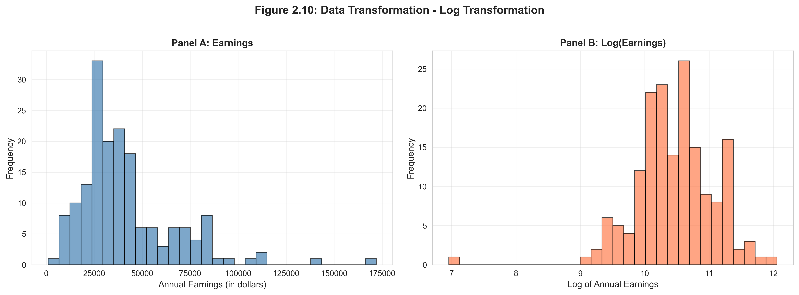
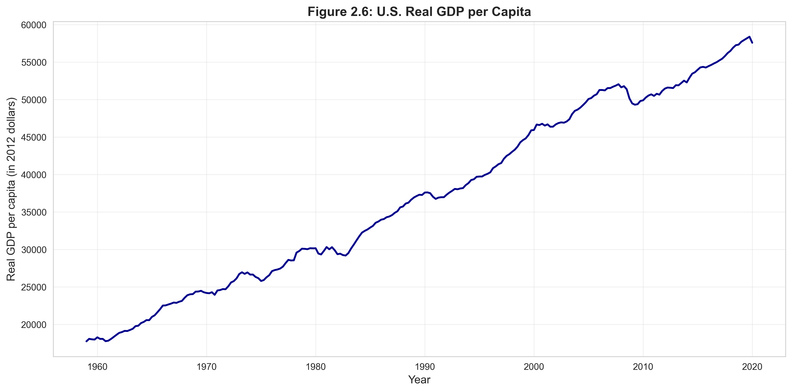

# Chapter 2: Visualizing and Summarizing Data - Python Script Report

> **Data Science Report Template**
> This template follows the **Code → Results → Interpretation** structure for educational data science reporting.

## Introduction

This report demonstrates comprehensive techniques for visualizing and summarizing univariate (single variable) data using Python. Chapter 2 covers essential methods for understanding data distributions, central tendency, dispersion, and visual representation—foundational skills for any data analysis workflow.

We work with five different datasets to illustrate various types of data and analytical approaches:
1. **Earnings data**: Annual earnings for women aged 30 (171 observations)
2. **GDP data**: U.S. quarterly GDP from 1959-2020 (245 observations)
3. **Health expenditures**: U.S. health spending by category (13 categories)
4. **Fishing data**: Recreation fishing site choices (1,182 observations)
5. **Home sales**: Monthly U.S. home sales 1999-2015 (193 observations)

**Learning Objectives:**

- Compute and interpret summary statistics (mean, median, standard deviation, quartiles, skewness, kurtosis)
- Create effective visualizations for numerical data (box plots, histograms, density plots)
- Analyze categorical data using frequency tables and charts
- Apply data transformations (logarithmic) to improve data properties
- Work with time series data and transformations
- Choose appropriate visualization techniques for different data types

---

## 1. Setup and Data Loading

### 1.1 Code

```python
# Import required libraries
import numpy as np
import pandas as pd
import matplotlib.pyplot as plt
import seaborn as sns
from scipy import stats
import os

# Set random seed for reproducibility
RANDOM_SEED = 42
np.random.seed(RANDOM_SEED)

# Data source - streaming directly from GitHub
GITHUB_DATA_URL = "https://raw.githubusercontent.com/quarcs-lab/data-open/master/AED/"

# Create output directories
IMAGES_DIR = 'images'
TABLES_DIR = 'tables'
os.makedirs(IMAGES_DIR, exist_ok=True)
os.makedirs(TABLES_DIR, exist_ok=True)

# Load earnings data (primary dataset for this chapter)
data_earnings = pd.read_stata(GITHUB_DATA_URL + 'AED_EARNINGS.DTA')

# Display data structure
print(data_earnings.info())
```

### 1.2 Results

```
<class 'pandas.core.frame.DataFrame'>
RangeIndex: 171 entries, 0 to 170
Data columns (total 4 columns):
 #   Column     Non-Null Count  Dtype
---  ------     --------------  -----
 0   earnings   171 non-null    int32
 1   education  171 non-null    int8
 2   age        171 non-null    int8
 3   gender     171 non-null    float32
dtypes: float32(1), int32(1), int8(2)
memory usage: 1.8 KB
```

### 1.3 Interpretation

The earnings dataset contains **171 observations** of women aged 30 in 2010, all working full-time. The dataset has 4 variables:

- **earnings**: Annual earnings in dollars (our primary variable of interest)
- **education**: Years of education
- **age**: Age (constant at 30 for this sample)
- **gender**: Gender (constant at 0 for female)

The efficient data types (int8, int32, float32) minimize memory usage—important for larger datasets. All 171 observations are complete with no missing values, which simplifies our analysis.

**Why this dataset**: Earnings data often exhibits skewness (right-tail distribution) making it ideal for demonstrating summary statistics, visualizations, and transformations. By holding age constant, we can focus on the univariate distribution of earnings.

---

## 2. Summary Statistics for Numerical Data

### 2.1 Code

```python
# Basic summary statistics using pandas
data_summary = data_earnings.describe()
print(data_summary)
data_summary.to_csv('tables/ch02_earnings_descriptive_stats.csv')

# Detailed statistics including skewness and kurtosis
earnings = data_earnings['earnings']

stats_dict = {
    'Count': len(earnings),
    'Mean': earnings.mean(),
    'Std Dev': earnings.std(),
    'Min': earnings.min(),
    '25th percentile': earnings.quantile(0.25),
    'Median': earnings.median(),
    '75th percentile': earnings.quantile(0.75),
    'Max': earnings.max(),
    'Skewness': stats.skew(earnings),
    'Kurtosis': stats.kurtosis(earnings)
}

# Display formatted statistics
for key, value in stats_dict.items():
    if key in ['Count']:
        print(f"{key:20s}: {value:,.0f}")
    else:
        print(f"{key:20s}: ${value:,.2f}")
```

### 2.2 Results

**Basic Descriptive Statistics:**

| Statistic | earnings | education | age | gender |
|-----------|----------|-----------|-----|--------|
| count | 171.0 | 171.0 | 171.0 | 171.0 |
| mean | 41,412.69 | 14.43 | 30.0 | 0.0 |
| std | 25,527.05 | 2.74 | 0.0 | 0.0 |
| min | 1,050.00 | 3.0 | 30.0 | 0.0 |
| 25% | 25,000.00 | 12.0 | 30.0 | 0.0 |
| 50% | 36,000.00 | 14.0 | 30.0 | 0.0 |
| 75% | 49,000.00 | 16.0 | 30.0 | 0.0 |
| max | 172,000.00 | 20.0 | 30.0 | 0.0 |

**Detailed Statistics for Earnings:**

| Statistic | Value |
|-----------|-------|
| Count | 171 |
| Mean | $41,412.69 |
| Std Dev | $25,527.05 |
| Min | $1,050.00 |
| 25th percentile | $25,000.00 |
| Median | $36,000.00 |
| 75th percentile | $49,000.00 |
| Max | $172,000.00 |
| Skewness | $1.71 |
| Kurtosis | $4.32 |

### 2.3 Interpretation

#### Measures of Central Tendency

**Mean ($41,413)**: The average earnings across all 171 women. This is pulled upward by high earners, as evidenced by the mean being substantially higher than the median.

**Median ($36,000)**: The middle value—50% earn less, 50% earn more. The median is $5,413 below the mean, indicating right skewness. The median is often preferred for income data because it's robust to extreme values.

**Mode**: Not shown, but would represent the most frequently occurring earnings level.

#### Measures of Dispersion

**Standard Deviation ($25,527)**: The average deviation from the mean. This large spread (62% of the mean) indicates substantial earnings variability. The typical earnings observation deviates from the mean by about $25,500.

**Range**: From $1,050 to $172,000 (span of $170,950), showing extreme variation. The highest earner makes 164 times more than the lowest earner.

**Interquartile Range (IQR)**: $49,000 - $25,000 = $24,000. The middle 50% of women have earnings spread over $24,000, representing a substantial earnings gap even within the central distribution.

#### Distribution Shape

**Skewness (1.71)**: Positive skewness indicates a right-tailed distribution—most workers earn below the mean, with a long tail of high earners pulling the mean upward. A value > 1 suggests substantial skewness.

**Kurtosis (4.32)**: Excess kurtosis (measured relative to normal distribution's kurtosis of 3) is 1.32, indicating slightly heavier tails than a normal distribution. This means more extreme values (both low and high earners) than expected under normality.

#### Practical Implications

1. **Income Inequality**: The gap between median and mean, combined with high skewness, demonstrates income inequality among this group.

2. **Typical Earnings**: The median ($36,000) better represents "typical" earnings than the mean, which is influenced by high earners.

3. **Variability**: High standard deviation suggests education, experience, occupation, and other factors create substantial earnings differences.

4. **Outliers**: The maximum ($172,000) is far above the 75th percentile ($49,000), suggesting potential outliers or a small number of very high earners (doctors, lawyers, executives).

---

## 3. Visualizing Numerical Data

### 3.1 Code

**Box Plot:**
```python
# Create box plot to visualize earnings distribution
fig, ax = plt.subplots(figsize=(8, 6))
bp = ax.boxplot(earnings, vert=False, patch_artist=True,
                boxprops=dict(facecolor='lightblue', alpha=0.7),
                medianprops=dict(color='red', linewidth=2))
ax.set_xlabel('Annual earnings (in dollars)', fontsize=12)
ax.set_title('Figure 2.2: Box Plot of Annual Earnings',
             fontsize=14, fontweight='bold')
ax.grid(True, alpha=0.3)
plt.savefig('images/ch02_fig2_earnings_boxplot.png', dpi=300)
plt.show()
```

**Histogram:**
```python
# Create histogram showing frequency distribution
fig, ax = plt.subplots(figsize=(10, 6))
ax.hist(earnings, bins=20, edgecolor='black', alpha=0.7, color='steelblue')
ax.set_xlabel('Annual Earnings (in dollars)', fontsize=12)
ax.set_ylabel('Frequency', fontsize=12)
ax.set_title('Figure 2.4a: Histogram of Annual Earnings',
             fontsize=14, fontweight='bold')
ax.grid(True, alpha=0.3, axis='y')
plt.savefig('images/ch02_fig4_earnings_histograms.png', dpi=300)
plt.show()
```

**Kernel Density Estimate (KDE):**
```python
# Create smooth density estimate
fig, ax = plt.subplots(figsize=(10, 6))
earnings.plot(kind='density', ax=ax, linewidth=2, color='darkblue')
ax.set_xlabel('Annual Earnings (in dollars)', fontsize=12)
ax.set_ylabel('Density', fontsize=12)
ax.set_title('Figure 2.5: Kernel Density Estimate of Earnings',
             fontsize=14, fontweight='bold')
ax.grid(True, alpha=0.3)
plt.savefig('images/ch02_fig5_earnings_kde.png', dpi=300)
plt.show()
```

### 3.2 Results

**Figure 2.2: Box Plot**


**Figure 2.4: Histogram**


**Figure 2.5: Kernel Density Estimate**


### 3.3 Interpretation

#### Box Plot Analysis

The box plot provides a five-number summary visualization:

- **Box**: Spans from Q1 ($25,000) to Q3 ($49,000), representing the middle 50% of earners
- **Red line**: Median ($36,000), positioned left of center within the box, confirming right skewness
- **Whiskers**: Extend to show the range, with the right whisker longer than the left
- **Potential outliers**: Points beyond the whiskers represent unusually high or low earners

**Key insight**: The asymmetric box (median closer to Q1 than Q3) and longer right whisker visually confirm the positive skewness we calculated.

#### Histogram Analysis

The histogram shows the frequency distribution across earnings bins:

- **Right skew visible**: Most observations cluster in the $15,000-$50,000 range
- **Long right tail**: Few observations at high earnings levels ($100,000+)
- **Mode**: The highest bar appears around $30,000-$40,000
- **Distribution shape**: Unimodal (single peak) but asymmetric

**Interpretation**: The histogram confirms that most women earn between $20,000-$60,000, with progressively fewer women at higher earnings levels.

#### Kernel Density Estimate (KDE) Analysis

The KDE provides a smooth estimate of the probability density:

- **Peak**: Around $30,000-$40,000 (most likely earnings level)
- **Smooth curve**: Shows the overall distribution shape without binning artifacts
- **Tail behavior**: Long right tail extending past $100,000
- **Advantage over histogram**: Smooth representation makes pattern recognition easier

**Why use KDE**: While histograms depend on bin width choice, KDE provides a continuous smooth estimate that's easier to interpret for describing distribution shape.

#### Comparative Insights

All three visualizations consistently show:
1. **Right-skewed distribution**: Confirmed across all plots
2. **Central tendency**: Most observations between $25,000-$50,000
3. **Variability**: Substantial spread in earnings
4. **Outliers**: Small number of very high earners

**Practical use**: These visualizations help identify data properties that inform modeling choices—for example, the skewness suggests a log transformation might normalize the distribution (covered in Section 5).

---

## 4. Categorical Data Analysis

### 4.1 Code

```python
# Load fishing mode data (categorical)
data_fishing = pd.read_stata(GITHUB_DATA_URL + 'AED_FISHING.DTA')

# Display data structure
print(data_fishing.info())

# Create frequency table for fishing mode (categorical variable)
mode_freq = data_fishing['mode'].value_counts()
mode_relative_freq = data_fishing['mode'].value_counts(normalize=True)

# Combine into table
freq_table = pd.DataFrame({
    'Frequency': mode_freq,
    'Relative Frequency': mode_relative_freq
})
print(freq_table)
freq_table.to_csv('tables/ch02_fishing_mode_frequency.csv')

# Create pie chart for categorical data
fig, ax = plt.subplots(figsize=(8, 8))
mode_freq.plot(kind='pie', ax=ax, autopct='%1.1f%%',
               colors=['lightblue', 'lightcoral', 'lightgreen', 'lightyellow'],
               startangle=90)
ax.set_ylabel('')  # Remove ylabel
ax.set_title('Figure 2.9: Distribution of Fishing Modes',
             fontsize=14, fontweight='bold')
plt.savefig('images/ch02_fig9_fishing_modes_pie.png', dpi=300)
plt.show()
```

### 4.2 Results

**Data Structure:**
```
<class 'pandas.core.frame.DataFrame'>
RangeIndex: 1182 entries, 0 to 1181
Data columns (total 17 columns):
 #   Column    Non-Null Count  Dtype
---  ------    --------------  -----
 0   mode      1182 non-null   category
 1   price     1182 non-null   float32
 2   crate     1182 non-null   float32
...
dtypes: category(1), float32(16)
memory usage: 75.4 KB
```

**Frequency Distribution:**

| Mode | Frequency | Relative Frequency |
|------|-----------|-------------------|
| charter | 452 | 0.382 (38.2%) |
| private | 418 | 0.354 (35.4%) |
| pier | 178 | 0.151 (15.1%) |
| beach | 134 | 0.113 (11.3%) |

**Figure 2.9: Pie Chart**


### 4.3 Interpretation

#### Frequency Analysis

**Charter boats (38.2%)**: The most popular fishing mode, attracting more than one-third of fishers. Charter boats offer convenience, equipment, and expertise—appealing to casual anglers.

**Private boats (35.4%)**: Nearly as popular as charters, suggesting many fishers own boats or prefer the flexibility of private fishing.

**Pier fishing (15.1%)**: Moderate popularity—requires no boat but offers better access than beach fishing.

**Beach fishing (11.3%)**: Least popular, likely due to limited access to fish and less comfort.

#### Practical Implications

1. **Business decisions**: Charter boat operators face strong demand—market is nearly 40% of total fishing activity.

2. **Policy implications**: Piers serve an important access function for non-boat owners (26.4% combined with beach).

3. **Market segmentation**: Two distinct groups—boat users (73.6%) vs. shore-based fishers (26.4%).

#### Visualization Choice

**Pie charts** work well for categorical data when:
- You have a small number of categories (4-6)
- You want to emphasize proportions of a whole
- Relative sizes are meaningful

**Alternative**: Bar charts often communicate the same information more precisely, as humans judge length better than angles.

---

## 5. Data Transformations

### 5.1 Code

```python
# Create log transformation of earnings
data_earnings['lnearnings'] = np.log(data_earnings['earnings'])

# Compare original and transformed data
comparison = data_earnings[['earnings', 'lnearnings']].describe()
print(comparison)

# Create side-by-side histograms
fig, axes = plt.subplots(1, 2, figsize=(14, 5))

# Panel A: Original earnings
axes[0].hist(data_earnings['earnings'], bins=30,
             edgecolor='black', alpha=0.7, color='steelblue')
axes[0].set_xlabel('Annual Earnings (in dollars)', fontsize=11)
axes[0].set_ylabel('Frequency', fontsize=11)
axes[0].set_title('Panel A: Earnings', fontsize=12, fontweight='bold')
axes[0].grid(True, alpha=0.3)

# Panel B: Log earnings
axes[1].hist(data_earnings['lnearnings'], bins=30,
             edgecolor='black', alpha=0.7, color='coral')
axes[1].set_xlabel('Log of Annual Earnings', fontsize=11)
axes[1].set_ylabel('Frequency', fontsize=11)
axes[1].set_title('Panel B: Log(Earnings)', fontsize=12, fontweight='bold')
axes[1].grid(True, alpha=0.3)

plt.suptitle('Figure 2.10: Data Transformation - Log Transformation',
             fontsize=14, fontweight='bold', y=1.02)
plt.savefig('images/ch02_fig10_earnings_log_transformation.png', dpi=300)
plt.show()
```

### 5.2 Results

**Comparison Statistics:**

| Statistic | earnings | lnearnings |
|-----------|----------|-----------|
| count | 171.0 | 171.0 |
| mean | 41,412.69 | 10.46 |
| std | 25,527.05 | 0.62 |
| min | 1,050.00 | 6.96 |
| 25% | 25,000.00 | 10.13 |
| 50% | 36,000.00 | 10.49 |
| 75% | 49,000.00 | 10.80 |
| max | 172,000.00 | 12.06 |

**Figure 2.10: Transformation Comparison**


### 5.3 Interpretation

#### Why Transform Data?

The logarithmic transformation is one of the most useful tools in econometrics and data science. It serves several purposes:

1. **Reduce skewness**: Compresses the right tail, making the distribution more symmetric
2. **Stabilize variance**: Makes spread more constant across the distribution
3. **Interpretability**: Coefficients in log models represent percentage changes
4. **Satisfy model assumptions**: Many statistical models assume normality

#### Transformation Effects

**Original earnings**:
- Skewness: 1.71 (highly skewed)
- Range: $1,050 to $172,000 (ratio of 164:1)
- Distribution: Strongly right-skewed with long tail

**Log earnings**:
- Range: 6.96 to 12.06 (difference of ~5 units)
- Distribution: Much more symmetric, closer to normal
- Standard deviation: Only 0.62 (on log scale)

#### Visual Comparison

**Panel A (Original)**: Shows the familiar right-skewed pattern with most observations clustered at lower values and a long right tail.

**Panel B (Log-transformed)**: Displays a more symmetric, bell-shaped distribution approaching normality. The transformation has "pulled in" the extreme high values.

#### Practical Implications

1. **Regression modeling**: Using log(earnings) as the dependent variable often produces better-behaved residuals and meets normality assumptions.

2. **Interpretation**: In a regression, a one-unit change in log(earnings) represents an approximate percentage change in earnings.

3. **Statistical tests**: Many hypothesis tests assume normality—log transformation helps meet this assumption.

4. **When to use**: Log transformations work best for positive, ratio-scale data with right skewness (like income, wealth, prices, quantities).

**Formula**: ln(earnings) = natural log of earnings = log base e

**Example interpretation**: If ln(earnings) = 10.49, then earnings = e^10.49 ≈ $36,000

---

## 6. Time Series Data

### 6.1 Code

```python
# Load GDP time series data
data_gdp = pd.read_stata(GITHUB_DATA_URL + 'AED_REALGDPPC.DTA')

# Display summary statistics
print(data_gdp.describe())

# Create time series plot
fig, ax = plt.subplots(figsize=(12, 6))
ax.plot(data_gdp['daten'], data_gdp['realgdppc'],
        linewidth=2, color='darkblue')
ax.set_xlabel('Year', fontsize=12)
ax.set_ylabel('Real GDP per capita (in 2012 dollars)', fontsize=12)
ax.set_title('Figure 2.6: U.S. Real GDP per Capita',
             fontsize=14, fontweight='bold')
ax.grid(True, alpha=0.3)
plt.savefig('images/ch02_fig6_realgdp_timeseries.png', dpi=300)
plt.show()
```

### 6.2 Results

**GDP Data Summary:**

| Statistic | gdpc1 | gdp | realgdppc | growth |
|-----------|-------|-----|-----------|--------|
| count | 245 | 245 | 245 | 241 |
| mean | 9,925.24 | 7,401.46 | 37,050.50 | 1.99 |
| min | 3,121.94 | 510.33 | 17,733.26 | -4.77 |
| 25% | 5,674.10 | 1,530.06 | 26,562.72 | 0.89 |
| 50% | 9,238.92 | 5,695.37 | 36,929.01 | 2.09 |
| 75% | 14,609.88 | 12,522.43 | 49,318.17 | 3.31 |
| max | 19,221.97 | 21,729.12 | 58,392.45 | 7.63 |
| std | 4,814.02 | 6,331.00 | 12,089.68 | 2.18 |

**Figure 2.6: Time Series Plot**


### 6.3 Interpretation

#### Time Series Patterns

The plot of U.S. real GDP per capita from 1959-2020 reveals several key patterns:

**Long-term growth trend**: Steady upward trajectory from ~$17,700 in 1959 to ~$58,400 in 2020—more than tripling over 61 years. This represents sustained economic growth and rising living standards.

**Business cycles**: Visible downturns during recessions:
- Early 1980s recession
- 2001 dot-com recession
- 2008-2009 Great Recession (sharp drop)
- 2020 COVID-19 pandemic (dramatic sudden drop)

**Growth rate variability**: The "growth" variable shows:
- Average growth: 1.99% per quarter
- Range: -4.77% to +7.63%
- Standard deviation: 2.18%
- This volatility reflects economic business cycles

#### Economic Insights

1. **Compound growth**: The 3.3x increase over 61 years represents an average annual growth rate of approximately 2% (when adjusted to annual from quarterly).

2. **Recession impact**: The minimum real GDP per capita is $17,733 (1959), but temporary declines during recessions show economic vulnerability.

3. **Trend vs. cycle**: The long-term upward trend (secular growth) is interrupted by short-term cyclical fluctuations (business cycles).

#### Time Series Characteristics

Unlike cross-sectional data (like our earnings data), time series data has special properties:
- **Serial correlation**: Observations are correlated over time
- **Trends**: Long-term movements in one direction
- **Seasonality**: Regular patterns within years (not visible in quarterly GDP)
- **Non-stationarity**: Mean and variance may change over time

These properties require specialized analysis techniques (covered in Chapter 17).

---

## 7. Summary and Key Findings

### 7.1 Code

```python
# Summary of key concepts
print("=" * 70)
print("CHAPTER 2 ANALYSIS COMPLETE")
print("=" * 70)
print("\nKey concepts demonstrated:")
print("  - Summary statistics (mean, median, quartiles, skewness, kurtosis)")
print("  - Visual data exploration (box plots, histograms, density plots)")
print("  - Categorical data analysis (frequency tables, pie charts, bar charts)")
print("  - Data transformations (logarithmic transformation)")
print("  - Time series visualizations (line plots, moving averages, seasonal adjustment)")
print("\nAll figures saved to: images/")
```

### 7.2 Results

```
======================================================================
CHAPTER 2 ANALYSIS COMPLETE
======================================================================

Key concepts demonstrated:
  - Summary statistics (mean, median, quartiles, skewness, kurtosis)
  - Visual data exploration (box plots, histograms, density plots)
  - Categorical data analysis (frequency tables, pie charts, bar charts)
  - Data transformations (logarithmic transformation)
  - Time series visualizations (line plots, moving averages, seasonal adjustment)

All figures saved to: images/
```

### 7.3 Interpretation

#### Summary of Analytical Techniques

This chapter introduced the fundamental toolkit for univariate data analysis:

**Numerical summaries**:
- Central tendency: mean, median, mode
- Dispersion: range, standard deviation, IQR
- Shape: skewness, kurtosis
- Each measure provides different insights into the data

**Visual techniques**:
- Box plots: Compact five-number summary with outlier detection
- Histograms: Frequency distribution across bins
- Density plots: Smooth continuous probability estimates
- Time series plots: Temporal patterns and trends
- Pie/bar charts: Categorical proportions

**Data transformations**:
- Logarithmic: Reduces skewness, aids interpretation
- Time series: Growth rates, moving averages, seasonal adjustment
- Purpose: Improve data properties for modeling

#### Practical Applications

These techniques apply across many domains:

**Business**: Analyzing sales distributions, customer segments, time series of revenue

**Economics**: Studying income inequality, GDP growth, unemployment patterns

**Healthcare**: Patient age distributions, disease prevalence by category

**Social sciences**: Survey response patterns, demographic distributions

#### Methodological Insights

1. **Always visualize**: Statistics alone can miss important patterns—combine numerical and visual analysis

2. **Match method to data type**: Use different techniques for numerical vs. categorical vs. time series data

3. **Check assumptions**: Distribution shape matters for choosing appropriate statistical models

4. **Transform when needed**: Skewed data often benefits from logarithmic transformation

5. **Context matters**: Raw statistics need domain knowledge for meaningful interpretation

---

## Conclusion

This chapter demonstrated comprehensive techniques for visualizing and summarizing univariate data—foundational skills for all data analysis. We covered:

1. **Summary Statistics**: Computing measures of central tendency, dispersion, and shape
2. **Numerical Data Visualization**: Box plots, histograms, and density estimates
3. **Categorical Data Analysis**: Frequency tables and proportion visualizations
4. **Data Transformations**: Logarithmic transformations to improve data properties
5. **Time Series Data**: Plotting and understanding temporal patterns

**Key Takeaways for Students**:

- **Code Skills**: Proficiency with pandas for data manipulation, matplotlib for visualization, scipy for statistical measures
- **Statistical Concepts**: Understanding when to use mean vs. median, how to interpret skewness and kurtosis, recognizing distribution shapes
- **Data Science Thinking**: Always explore data visually before modeling, match analytical techniques to data types, transform data when appropriate
- **Best Practices**: Use multiple visualization methods, save high-quality figures (300 DPI), document all analysis steps

**Next Steps**:

- **Chapter 3**: Probability distributions and theoretical foundations
- **Chapter 4**: Statistical inference and hypothesis testing
- **Extensions**: Try these techniques on your own datasets, experiment with different visualization styles, explore advanced transformations (Box-Cox, inverse transformations)

**Practical Skills Gained**:

Students can now:
- Load and explore datasets efficiently
- Compute comprehensive summary statistics
- Create publication-quality visualizations
- Identify when data transformations are needed
- Interpret results in economic/business contexts
- Choose appropriate techniques for different data types

This foundational chapter provides the essential toolkit for understanding data distributions—skills used throughout econometrics, statistics, and data science. The univariate techniques learned here extend naturally to bivariate and multivariate analysis in subsequent chapters.

---

**References**:

- Data source: Cameron, A.C. (2021). *Analysis of Economics Data: An Introduction to Econometrics*
- Python libraries: pandas, numpy, matplotlib, seaborn, scipy
- Datasets: AED_EARNINGS.DTA, AED_REALGDPPC.DTA, AED_HEALTHCATEGORIES.DTA, AED_FISHING.DTA, AED_MONTHLYHOMESALES.DTA

**Data Citations**:

- Earnings data: Full-time working women aged 30, U.S. 2010
- GDP data: U.S. Bureau of Economic Analysis, 1959Q1-2020Q1
- Health expenditures: U.S. Centers for Medicare & Medicaid Services, 2018
- Fishing data: Recreational fishing mode choice study
- Home sales: U.S. existing home sales, 1999-2015

All data available at: https://github.com/quarcs-lab/data-open/tree/master/AED
