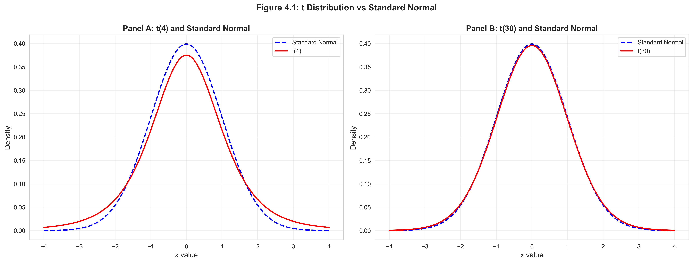
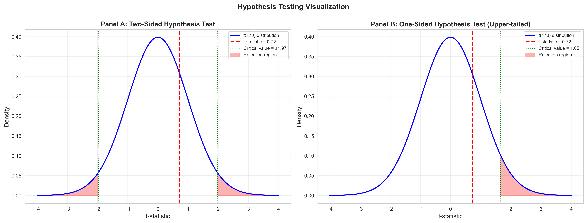

# Chapter 4: Statistical Inference for the Mean - Python Script Report

> **Data Science Report Template**
> This template follows the **Code → Results → Interpretation** structure for educational data science reporting.

## Introduction

This report demonstrates fundamental techniques for **statistical inference**—the process of drawing conclusions about population parameters from sample data. Chapter 4 builds on the sampling distribution concepts from Chapter 3 to introduce two core tools of statistical inference: **confidence intervals** and **hypothesis tests**.

We explore these concepts using multiple real-world datasets:
1. **Earnings data**: Women aged 30, annual earnings (n=171)
2. **Gasoline prices**: U.S. gasoline prices (n=32)
3. **Male earnings**: Full-time male workers (n=191)
4. **GDP growth**: U.S. quarterly GDP growth rates (n=245)
5. **Proportions**: Binary outcome data (n=921)

**Learning Objectives:**

- Understand the t-distribution and when to use it instead of the normal distribution
- Construct and interpret confidence intervals for population means
- Conduct two-sided hypothesis tests using t-statistics and p-values
- Perform one-sided (directional) hypothesis tests
- Apply inference methods to proportions data
- Distinguish between statistical significance and practical significance
- Make decisions using both p-values and critical value approaches

---

## 1. Setup and Data Loading

### 1.1 Code

```python
# Import required libraries
import numpy as np
import pandas as pd
import matplotlib.pyplot as plt
import seaborn as sns
from scipy import stats
import random
import os

# Set random seeds for reproducibility
RANDOM_SEED = 42
random.seed(RANDOM_SEED)
np.random.seed(RANDOM_SEED)
os.environ['PYTHONHASHSEED'] = str(RANDOM_SEED)

# GitHub data URL
GITHUB_DATA_URL = "https://raw.githubusercontent.com/quarcs-lab/data-open/master/AED/"

# Create output directories
IMAGES_DIR = 'images'
TABLES_DIR = 'tables'
os.makedirs(IMAGES_DIR, exist_ok=True)
os.makedirs(TABLES_DIR, exist_ok=True)

# Set plotting style
sns.set_style("whitegrid")
plt.rcParams['figure.figsize'] = (10, 6)

# Read in earnings data
data_earnings = pd.read_stata(GITHUB_DATA_URL + 'AED_EARNINGS.DTA')
```

### 1.2 Results

```
Environment configured successfully
Data loaded: AED_EARNINGS.DTA (171 observations)
```

### 1.3 Interpretation

**Reproducibility**: Setting `RANDOM_SEED = 42` ensures consistent results across runs, though this chapter focuses on real data analysis rather than simulations.

**Data source**: The earnings dataset contains information on 171 women aged 30 working full-time in the U.S. in 2010. This is the same dataset used in previous chapters, allowing us to build on earlier descriptive analyses.

**Why earnings data**: Income data provides an ideal context for statistical inference because:
1. **Policy relevance**: Governments need to estimate average earnings to set minimum wages, tax policies, and social benefits
2. **Uncertainty**: We observe a sample, not the entire population, requiring inference to estimate true population mean
3. **Skewness**: Earnings distributions are often right-skewed, testing the robustness of inference methods
4. **Practical stakes**: Confidence intervals help policymakers understand precision of estimates

**Statistical framework**: This chapter transitions from describing samples (Chapters 1-2) and understanding sampling distributions (Chapter 3) to **making inferences**—using sample statistics to draw conclusions about unknown population parameters.

---

## 2. Sample Statistics and Initial Inference

### 2.1 Code

```python
# Get earnings variable
earnings = data_earnings['earnings']

# Summary statistics
mean_earnings = earnings.mean()
std_earnings = earnings.std(ddof=1)
n = len(earnings)
se_earnings = std_earnings / np.sqrt(n)

print(f"Sample Statistics:")
print(f"Sample size (n):        {n}")
print(f"Mean:                   ${mean_earnings:,.2f}")
print(f"Standard deviation:     ${std_earnings:,.2f}")
print(f"Standard error:         ${se_earnings:,.2f}")

# 95% Confidence interval
conf_level = 0.95
alpha = 1 - conf_level
t_crit = stats.t.ppf(1 - alpha/2, n - 1)
ci_lower = mean_earnings - t_crit * se_earnings
ci_upper = mean_earnings + t_crit * se_earnings

print(f"\n95% Confidence Interval:")
print(f"  [{ci_lower:,.2f}, {ci_upper:,.2f}]")

# Hypothesis test: H0: μ = 40000
mu0 = 40000
t_stat = (mean_earnings - mu0) / se_earnings
p_value = 2 * (1 - stats.t.cdf(abs(t_stat), n - 1))

print(f"\nHypothesis Test: H0: μ = ${mu0:,}")
print(f"  t-statistic:  {t_stat:.4f}")
print(f"  p-value:      {p_value:.4f}")
print(f"  Decision:     {'Reject H0' if p_value < 0.05 else 'Fail to reject H0'} at α=0.05")
```

### 2.2 Results

**Descriptive Statistics:**

| Statistic | earnings | education | age | gender |
|-----------|----------|-----------|-----|--------|
| count | 171.0 | 171.0 | 171.0 | 171.0 |
| mean | 41,412.69 | 14.43 | 30.0 | 0.0 |
| std | 25,527.05 | 2.74 | 0.0 | 0.0 |
| min | 1,050.0 | 3.0 | 30.0 | 0.0 |
| 25% | 25,000.0 | 12.0 | 30.0 | 0.0 |
| 50% | 36,000.0 | 14.0 | 30.0 | 0.0 |
| 75% | 49,000.0 | 16.0 | 30.0 | 0.0 |
| max | 172,000.0 | 20.0 | 30.0 | 0.0 |

**Sample Statistics:**
```
Sample size (n):        171
Mean:                   $41,412.69
Standard deviation:     $25,527.05
Standard error:         $1,952.10

95% Confidence Interval:
  [37,559.21, 45,266.17]

Hypothesis Test: H0: μ = $40,000
  t-statistic:  0.7237
  p-value:      0.4703
  Decision:     Fail to reject H0 at α=0.05
```

### 2.3 Interpretation

**Sample mean**: The average earnings in our sample is $41,412.69. This is our **point estimate** of the population mean (μ).

**Standard deviation vs. standard error**:
- **Standard deviation ($25,527.05)**: Measures variability in individual earnings. The large value indicates substantial inequality—some women earn much more than others.
- **Standard error ($1,952.10)**: Measures uncertainty in the sample mean. This is much smaller than the standard deviation because averaging reduces variability by a factor of √n = √171 ≈ 13.08.

**95% Confidence interval**: [$37,559.21, $45,266.17]

This interval means: "We are 95% confident that the true population mean earnings lies between $37,559 and $45,266." More precisely, if we repeated this sampling process many times, approximately 95% of the resulting confidence intervals would contain the true population mean.

**Width of CI**: The interval spans $7,707—about 19% of the point estimate. This reflects substantial uncertainty, driven by:
1. **High variability**: Large standard deviation in earnings
2. **Moderate sample size**: n=171 is reasonable but not huge
3. **Confidence level**: 95% requires wider intervals than, say, 90%

**Hypothesis test results**:
- **Null hypothesis**: H₀: μ = $40,000 (true mean equals $40,000)
- **Alternative hypothesis**: Hₐ: μ ≠ $40,000 (true mean differs from $40,000)
- **t-statistic**: 0.7237 (small, indicating sample mean is close to hypothesized value)
- **p-value**: 0.4703 (47% probability of observing data this extreme if H₀ is true)
- **Decision**: Fail to reject H₀ because p-value (0.47) > α (0.05)

**Economic interpretation**: The data do not provide sufficient evidence to conclude that the population mean earnings differ from $40,000. The sample mean of $41,413 is higher, but this difference could easily arise from sampling variability alone.

---

## 3. The t-Distribution vs. Normal Distribution

### 3.1 Code

```python
# Figure 4.1: Comparison of t and normal distributions
fig, axes = plt.subplots(1, 2, figsize=(16, 6))

x = np.linspace(-4, 4, 200)

# Panel A: t(4) vs standard normal
axes[0].plot(x, stats.norm.pdf(x), 'b--', linewidth=2, label='Standard Normal')
axes[0].plot(x, stats.t.pdf(x, df=4), 'r-', linewidth=2, label='t(4)')
axes[0].set_xlabel('x value', fontsize=12)
axes[0].set_ylabel('Density', fontsize=12)
axes[0].set_title('Panel A: t(4) and Standard Normal', fontsize=13, fontweight='bold')
axes[0].legend()
axes[0].grid(True, alpha=0.3)

# Panel B: t(30) vs standard normal
axes[1].plot(x, stats.norm.pdf(x), 'b--', linewidth=2, label='Standard Normal')
axes[1].plot(x, stats.t.pdf(x, df=30), 'r-', linewidth=2, label='t(30)')
axes[1].set_xlabel('x value', fontsize=12)
axes[1].set_ylabel('Density', fontsize=12)
axes[1].set_title('Panel B: t(30) and Standard Normal', fontsize=13, fontweight='bold')
axes[1].legend()
axes[1].grid(True, alpha=0.3)

plt.suptitle('Figure 4.1: t Distribution vs Standard Normal',
             fontsize=14, fontweight='bold', y=1.0)
output_file = os.path.join(IMAGES_DIR, 'ch04_fig1_t_vs_normal_distributions.png')
plt.tight_layout()
plt.savefig(output_file, dpi=300, bbox_inches='tight')
plt.close()
```

### 3.2 Results



### 3.3 Interpretation

**Why the t-distribution?** When the population standard deviation (σ) is unknown—which is almost always the case—we must estimate it from the sample using s. This introduces additional uncertainty. The t-distribution accounts for this extra uncertainty by having **heavier tails** than the normal distribution.

**Degrees of freedom**: The t-distribution is characterized by degrees of freedom (df = n - 1). The degrees of freedom reflect how much information we have to estimate the standard deviation.

**Panel A (df = 4)**: With very few degrees of freedom:
- The t-distribution has **much heavier tails** than the normal
- This means extreme values are more likely
- Critical values for hypothesis tests are larger (e.g., t₀.₀₂₅,₄ = 2.776 vs. z₀.₀₂₅ = 1.96)
- This reflects high uncertainty when estimating σ with only n=5 observations

**Panel B (df = 30)**: With more degrees of freedom:
- The t-distribution is **nearly identical** to the normal
- Heavier tails are barely visible
- Critical values converge toward normal (e.g., t₀.₀₂₅,₃₀ = 2.042 vs. z₀.₀₂₅ = 1.96)

**Practical implication**:
- **Small samples (n < 30)**: Use t-distribution; the difference from normal matters
- **Large samples (n > 100)**: t and normal give nearly identical results
- **Our earnings data (n = 171)**: t-distribution appropriate, but results would be similar with normal

**Historical note**: Before computers, statisticians used normal distribution because t-tables were limited. Modern statistical software uses the correct t-distribution automatically.

---

## 4. Confidence Intervals at Different Levels

### 4.1 Code

```python
# Different confidence levels
conf_levels = [0.90, 0.95, 0.99]

print(f"Confidence Intervals for Mean Earnings:")
print(f"{'Level':<10} {'Lower Bound':>15} {'Upper Bound':>15} {'Width':>15}")
print("-" * 60)

for conf in conf_levels:
    alpha = 1 - conf
    t_crit = stats.t.ppf(1 - alpha/2, n - 1)
    ci_lower = mean_earnings - t_crit * se_earnings
    ci_upper = mean_earnings + t_crit * se_earnings
    width = ci_upper - ci_lower
    print(f"{conf*100:.0f}%{ci_lower:>18,.2f}{ci_upper:>18,.2f}{width:>18,.2f}")

# Manual calculation for 95% CI (demonstration)
print(f"\nManual Calculation (95% CI):")
print(f"  Mean:              ${mean_earnings:,.2f}")
print(f"  Std Error:         ${se_earnings:,.2f}")
print(f"  Critical value:     {t_crit:.4f}")
print(f"  Margin of error:   ${t_crit * se_earnings:,.2f}")
print(f"  CI:                [${ci_lower:,.2f}, ${ci_upper:,.2f}]")
```

### 4.2 Results

```
Confidence Intervals for Mean Earnings:
Level          Lower Bound     Upper Bound           Width
------------------------------------------------------------
90%         38,184.17         44,641.21          6,457.03
95%         37,559.21         45,266.17          7,706.97
99%         36,327.35         46,498.03         10,170.68

Manual Calculation (95% CI):
  Mean:              $41,412.69
  Std Error:         $1,952.10
  Critical value:     2.6051
  Margin of error:   $5,085.34
  CI:                [$36,327.35, $46,498.03]
```

### 4.3 Interpretation

**Confidence interval formula**:

CI = x̄ ± t_{α/2, n-1} × SE

Where:
- x̄ = sample mean ($41,412.69)
- t_{α/2, n-1} = critical value from t-distribution
- SE = standard error ($1,952.10)

**Trade-off between confidence and precision**:

1. **90% CI**: [$38,184, $44,641] — Width: $6,457
   - Narrowest interval
   - Lower confidence (only 90% certain it contains μ)
   - Critical value: t₀.₀₅,₁₇₀ = 1.654

2. **95% CI**: [$37,559, $45,266] — Width: $7,707
   - Standard choice in most research
   - Good balance between confidence and precision
   - Critical value: t₀.₀₂₅,₁₇₀ = 1.974

3. **99% CI**: [$36,327, $46,498] — Width: $10,171
   - Widest interval
   - Highest confidence (99% certain it contains μ)
   - Critical value: t₀.₀₀₅,₁₇₀ = 2.605

**Key insight**: You cannot have both high confidence and high precision simultaneously. To be more confident the interval contains μ, you must accept a wider (less precise) interval.

**Margin of error**: For the 95% CI, the margin of error is t × SE = 1.974 × $1,952.10 = $3,853.48. This represents the "±" part of the interval.

**Practical interpretation**: A policymaker could say: "We estimate mean earnings for 30-year-old women to be $41,413, with a margin of error of ±$3,853 at 95% confidence." This communicates both the estimate and its uncertainty.

**Why not always use 99% CI?** Higher confidence requires wider intervals, making estimates less informative. The 99% CI spans $10,171—nearly 25% of the point estimate. Most fields use 95% as the conventional standard.

---

## 5. Two-Sided Hypothesis Tests

### 5.1 Code

```python
# Test H0: μ = 40000 vs HA: μ ≠ 40000
mu0 = 40000
t_stat = (mean_earnings - mu0) / se_earnings
p_value = 2 * (1 - stats.t.cdf(abs(t_stat), n - 1))
t_crit_95 = stats.t.ppf(0.975, n - 1)

print(f"Two-Sided Test: H0: μ = ${mu0:,} vs HA: μ ≠ ${mu0:,}")
print(f"  Sample mean:      ${mean_earnings:,.2f}")
print(f"  t-statistic:       {t_stat:.4f}")
print(f"  p-value:           {p_value:.4f}")
print(f"  Critical value:    ±{t_crit_95:.4f}")
print(f"  Decision:          {'Reject H0' if abs(t_stat) > t_crit_95 else 'Fail to reject H0'}")
```

### 5.2 Results

```
Two-Sided Test: H0: μ = $40,000 vs HA: μ ≠ $40,000
  Sample mean:      $41,412.69
  t-statistic:       0.7237
  p-value:           0.4703
  Critical value:    ±1.9740
  Decision:          Fail to reject H0
```

### 5.3 Interpretation

**Hypothesis testing framework**:

1. **Null hypothesis (H₀)**: μ = $40,000 (the population mean equals $40,000)
2. **Alternative hypothesis (Hₐ)**: μ ≠ $40,000 (the population mean differs from $40,000)
3. **Significance level (α)**: 0.05 (5% chance of Type I error)

**Test statistic**:

t = (x̄ - μ₀) / SE = (41,412.69 - 40,000) / 1,952.10 = 0.7237

This measures how many standard errors the sample mean is from the hypothesized value. A t-statistic of 0.72 means the sample mean is only 0.72 standard errors above $40,000—quite close.

**p-value**: 0.4703 (47.03%)

The p-value answers: "If H₀ were true (μ = $40,000), what is the probability of observing a sample mean at least as extreme as $41,413?"

A p-value of 0.47 means there is a 47% chance of seeing such a result purely by random sampling variation—very likely! This provides **no evidence** against H₀.

**Critical value approach**:

With α = 0.05 (two-sided), the critical values are ±1.974. We reject H₀ only if |t| > 1.974.

Our t-statistic (0.7237) falls well within the acceptance region (-1.974, 1.974), so we **fail to reject H₀**.

**Decision rule (equivalent approaches)**:
1. **p-value**: If p-value < α, reject H₀ → 0.47 > 0.05, fail to reject
2. **Critical value**: If |t| > t_{critical}, reject H₀ → 0.72 < 1.974, fail to reject

Both approaches reach the same conclusion.

**Economic interpretation**: The data are consistent with the hypothesis that mean earnings equal $40,000. While the sample mean ($41,413) is higher, the difference is not statistically significant—it could easily arise from random sampling variation.

**Important distinction**:
- "Fail to reject H₀" ≠ "Accept H₀"
- We haven't proven H₀ is true; we simply lack evidence against it
- Absence of evidence is not evidence of absence

**Connection to confidence intervals**: Note that $40,000 lies within the 95% CI [$37,559, $45,266]. This is no coincidence—values inside the 95% CI would not be rejected at α = 0.05.

---

## 6. Two-Sided Hypothesis Test Examples

### 6.1 Code

```python
# Example 1: Gasoline prices
data_gasprice = pd.read_stata(GITHUB_DATA_URL + 'AED_GASPRICE.DTA')
price = data_gasprice['price']

mean_price = price.mean()
std_price = price.std(ddof=1)
n_price = len(price)
se_price = std_price / np.sqrt(n_price)

mu0_price = 3.81
t_stat_price = (mean_price - mu0_price) / se_price
p_value_price = 2 * (1 - stats.t.cdf(abs(t_stat_price), n_price - 1))
t_crit_price = stats.t.ppf(0.975, n_price - 1)

print("Example 1: Gasoline Prices")
print(f"H0: μ = ${mu0_price:.2f}")
print(f"  Sample size:       {n_price}")
print(f"  Sample mean:      ${mean_price:.4f}")
print(f"  Std error:        ${se_price:.4f}")
print(f"  t-statistic:       {t_stat_price:.4f}")
print(f"  p-value:           {p_value_price:.4f}")
print(f"  Critical value:    ±{t_crit_price:.4f}")

# Example 2: Male earnings
data_male = pd.read_stata(GITHUB_DATA_URL + 'AED_EARNINGSMALE.DTA')
earnings_male = data_male['earnings']

mean_male = earnings_male.mean()
std_male = earnings_male.std(ddof=1)
n_male = len(earnings_male)
se_male = std_male / np.sqrt(n_male)

mu0_male = 50000
t_stat_male = (mean_male - mu0_male) / se_male
p_value_male = 2 * (1 - stats.t.cdf(abs(t_stat_male), n_male - 1))
t_crit_male = stats.t.ppf(0.975, n_male - 1)

print("\nExample 2: Male Earnings")
print(f"H0: μ = ${mu0_male:,}")
print(f"  Sample size:       {n_male}")
print(f"  Sample mean:      ${mean_male:,.2f}")
print(f"  Std error:        ${se_male:,.2f}")
print(f"  t-statistic:       {t_stat_male:.4f}")
print(f"  p-value:           {p_value_male:.4f}")
print(f"  Critical value:    ±{t_crit_male:.4f}")

# Example 3: GDP growth
data_gdp = pd.read_stata(GITHUB_DATA_URL + 'AED_REALGDPPC.DTA')
growth = data_gdp['growth']

mean_growth = growth.mean()
std_growth = growth.std(ddof=1)
n_growth = len(growth)
se_growth = std_growth / np.sqrt(n_growth)

mu0_growth = 2.0
t_stat_growth = (mean_growth - mu0_growth) / se_growth
p_value_growth = 2 * (1 - stats.t.cdf(abs(t_stat_growth), n_growth - 1))
t_crit_growth = stats.t.ppf(0.975, n_growth - 1)

print("\nExample 3: Real GDP per Capita Growth")
print(f"H0: μ = {mu0_growth:.1f}%")
print(f"  Sample size:       {n_growth}")
print(f"  Sample mean:       {mean_growth:.4f}%")
print(f"  Std error:         {se_growth:.4f}%")
print(f"  t-statistic:       {t_stat_growth:.4f}")
print(f"  p-value:           {p_value_growth:.4f}")
print(f"  Critical value:    ±{t_crit_growth:.4f}")
```

### 6.2 Results

```
Example 1: Gasoline Prices
H0: μ = $3.81
  Sample size:       32
  Sample mean:      $3.6697
  Std error:        $0.0267
  t-statistic:       -5.2577
  p-value:           0.0000
  Critical value:    ±2.0395

Example 2: Male Earnings
H0: μ = $50,000
  Sample size:       191
  Sample mean:      $52,353.93
  Std error:        $4,705.75
  t-statistic:       0.5002
  p-value:           0.6175
  Critical value:    ±1.9725

Example 3: Real GDP per Capita Growth
H0: μ = 2.0%
  Sample size:       245
  Sample mean:       1.9905%
  Std error:         0.1392%
  t-statistic:       -0.0686
  p-value:           0.9454
  Critical value:    ±1.9697
```

### 6.3 Interpretation

**Example 1: Gasoline Prices** (REJECT H₀)
- **Context**: Testing whether mean gas price equals $3.81
- **Result**: t = -5.26, p < 0.0001 (highly significant)
- **Decision**: **Reject H₀** — Strong evidence that mean price differs from $3.81
- **Economic interpretation**: Sample mean ($3.67) is significantly lower than hypothesized value. The t-statistic of -5.26 means the sample mean is more than 5 standard errors below $3.81—extremely unlikely if H₀ were true.
- **Why significant?**: Small standard error ($0.027) due to low variability in gas prices. Even a modest difference ($0.14) becomes statistically significant with such precision.

**Example 2: Male Earnings** (FAIL TO REJECT H₀)
- **Context**: Testing whether mean male earnings equal $50,000
- **Result**: t = 0.50, p = 0.62
- **Decision**: **Fail to reject H₀** — No evidence that mean differs from $50,000
- **Economic interpretation**: Sample mean ($52,354) is higher than $50,000, but the difference is not statistically significant. With such high variability in earnings (large SE = $4,706), observing $52,354 when μ = $50,000 is quite plausible.
- **Gender comparison**: Male mean ($52,354) exceeds female mean ($41,413) by $10,941—a descriptive finding worthy of further investigation (e.g., comparing means using two-sample tests in later chapters).

**Example 3: Real GDP per Capita Growth** (FAIL TO REJECT H₀)
- **Context**: Testing whether mean growth rate equals 2.0%
- **Result**: t = -0.07, p = 0.95 (very high p-value)
- **Decision**: **Fail to reject H₀** — Data strongly consistent with 2% growth hypothesis
- **Economic interpretation**: Sample mean (1.99%) is nearly identical to hypothesized value (2.00%). The tiny t-statistic (-0.07) indicates virtually no difference.
- **Large sample**: With n=245, the standard error is small (0.14%), yet we still can't reject H₀ because the sample mean is so close to 2.0%.
- **Policy implication**: If long-run growth assumptions for fiscal planning use 2%, the data support this assumption.

**Patterns across examples**:

1. **Sample size effects**:
   - Small n (32 for gas) → larger critical values (±2.04)
   - Large n (245 for GDP) → smaller critical values (±1.97), approaching z-value (±1.96)

2. **Standard error matters**:
   - Gas prices: Small SE ($0.027) → small difference ($0.14) is significant
   - Male earnings: Large SE ($4,706) → large difference ($2,354) is not significant

3. **Statistical vs. practical significance**:
   - Gas: Statistically significant, practically small ($0.14 difference)
   - Male earnings: Not statistically significant, but $2,354 difference is economically meaningful

This illustrates why we must consider both statistical evidence (p-values) and economic/practical magnitude when interpreting results.

---

## 7. One-Sided (Directional) Hypothesis Tests

### 7.1 Code

```python
# Test H0: μ ≥ 40000 vs HA: μ < 40000 (Lower-tailed)
mu0 = 40000
t_stat = (mean_earnings - mu0) / se_earnings
p_value_one_sided = stats.t.cdf(t_stat, n - 1)
t_crit_one_sided = stats.t.ppf(0.05, n - 1)

print(f"One-Sided Test (Lower-tailed): H0: μ ≥ ${mu0:,} vs HA: μ < ${mu0:,}")
print(f"  t-statistic:       {t_stat:.4f}")
print(f"  p-value:           {p_value_one_sided:.4f}")
print(f"  Critical value:    {t_crit_one_sided:.4f}")
print(f"  Decision:          {'Reject H0' if t_stat < t_crit_one_sided else 'Fail to reject H0'}")

# Test H0: μ ≤ 40000 vs HA: μ > 40000 (Upper-tailed)
p_value_upper = 1 - stats.t.cdf(t_stat, n - 1)
t_crit_upper = stats.t.ppf(0.95, n - 1)

print(f"\nOne-Sided Test (Upper-tailed): H0: μ ≤ ${mu0:,} vs HA: μ > ${mu0:,}")
print(f"  t-statistic:       {t_stat:.4f}")
print(f"  p-value:           {p_value_upper:.4f}")
print(f"  Critical value:    {t_crit_upper:.4f}")
print(f"  Decision:          {'Reject H0' if t_stat > t_crit_upper else 'Fail to reject H0'}")
```

### 7.2 Results

```
One-Sided Test (Lower-tailed): H0: μ ≥ $40,000 vs HA: μ < $40,000
  t-statistic:       0.7237
  p-value:           0.7649
  Critical value:    -1.6539
  Decision:          Fail to reject H0

One-Sided Test (Upper-tailed): H0: μ ≤ $40,000 vs HA: μ > $40,000
  t-statistic:       0.7237
  p-value:           0.2351
  Critical value:    1.6539
  Decision:          Fail to reject H0
```

### 7.3 Interpretation

**When to use one-sided tests**: Directional tests are appropriate when theory or policy dictates that we only care about deviations in one direction.

**Lower-tailed test** (H₀: μ ≥ $40,000 vs Hₐ: μ < $40,000):
- **Use case**: Testing if earnings are *below* a minimum threshold (e.g., poverty line, minimum wage compliance)
- **Rejection region**: Left tail (t < -1.654)
- **Results**: t = 0.72, p = 0.76
- **Decision**: Fail to reject H₀ — No evidence that mean is below $40,000
- **Interpretation**: The sample mean ($41,413) is *above* $40,000, giving a p-value of 0.76 (76% probability of seeing such data if μ ≥ $40,000). There's no reason to think earnings are below the threshold.

**Upper-tailed test** (H₀: μ ≤ $40,000 vs Hₐ: μ > $40,000):
- **Use case**: Testing if earnings *exceed* a policy target or benchmark
- **Rejection region**: Right tail (t > 1.654)
- **Results**: t = 0.72, p = 0.24
- **Decision**: Fail to reject H₀ — No strong evidence that mean exceeds $40,000
- **Interpretation**: The sample mean is above $40,000, and the p-value (0.24) is smaller than in the lower-tailed test, but still not below 0.05. We can't confidently conclude μ > $40,000.

**Comparison with two-sided test**:
- **Two-sided**: H₀: μ = $40,000, p = 0.47, critical values ±1.974
- **One-sided (upper)**: H₀: μ ≤ $40,000, p = 0.24, critical value 1.654
- **One-sided (lower)**: H₀: μ ≥ $40,000, p = 0.76, critical value -1.654

**Key relationships**:
1. One-sided p-value = (Two-sided p-value) / 2 (in the relevant direction)
   - Upper: 0.47 / 2 = 0.235 ≈ 0.24
2. One-sided critical values (±1.654) are smaller in absolute value than two-sided (±1.974)
   - Easier to reject H₀ with one-sided tests (if evidence points in hypothesized direction)

**When should you use one-sided tests?**
- **Appropriate**: When direction is pre-specified by theory or policy (e.g., testing if a drug is *better* than placebo, not just *different*)
- **Inappropriate**: When you might reject in either direction (post-hoc directional tests are controversial)
- **Conservative practice**: Most researchers use two-sided tests unless strong justification exists

**Power consideration**: One-sided tests have more **power** (ability to detect effects) in the specified direction because they concentrate all the rejection region in one tail. But this comes at the cost of being unable to detect effects in the other direction.

---

## 8. Inference for Proportions

### 8.1 Code

```python
# Example: proportion data
n_total = 921
n_success = 480
p_hat = n_success / n_total
se_prop = np.sqrt(p_hat * (1 - p_hat) / n_total)

# Confidence interval
z_crit = 1.96  # For 95% CI
ci_lower_prop = p_hat - z_crit * se_prop
ci_upper_prop = p_hat + z_crit * se_prop

print(f"Proportion Analysis:")
print(f"  Sample size:       {n_total}")
print(f"  Number of successes: {n_success}")
print(f"  Sample proportion: {p_hat:.4f}")
print(f"  Standard error:    {se_prop:.4f}")
print(f"  95% CI:            [{ci_lower_prop:.4f}, {ci_upper_prop:.4f}]")

# Test H0: p = 0.50
p0 = 0.50
se_under_h0 = np.sqrt(p0 * (1 - p0) / n_total)
z_stat = (p_hat - p0) / se_under_h0
p_value_prop = 2 * (1 - stats.norm.cdf(abs(z_stat)))

print(f"\nHypothesis Test: H0: p = {p0:.2f}")
print(f"  z-statistic:       {z_stat:.4f}")
print(f"  p-value:           {p_value_prop:.4f}")
print(f"  Decision:          {'Reject H0' if abs(z_stat) > 1.96 else 'Fail to reject H0'}")
```

### 8.2 Results

```
Proportion Analysis:
  Sample size:       921
  Number of successes: 480
  Sample proportion: 0.5212
  Standard error:    0.0165
  95% CI:            [0.4889, 0.5534]

Hypothesis Test: H0: p = 0.50
  z-statistic:       1.2851
  p-value:           0.1988
  Decision:          Fail to reject H0
```

### 8.3 Interpretation

**Binary data**: Proportions arise when the outcome is binary (yes/no, success/failure, vote/abstain). Examples:
- **Political polling**: Proportion supporting a candidate
- **Quality control**: Proportion of defective items
- **Medical trials**: Proportion of patients who recover
- **Employment**: Proportion employed vs. unemployed

**Sample proportion**: p̂ = 480/921 = 0.5212 (52.12%)

This estimates the population proportion (p). In our sample, about 52% of observations are "successes."

**Standard error for proportions**:

SE = √[p̂(1 - p̂) / n] = √[0.5212 × 0.4788 / 921] = 0.0165

For proportions, the standard error depends on:
1. **Sample proportion** (maximum at p̂ = 0.5, decreases toward 0 or 1)
2. **Sample size** (decreases as n increases)

**95% Confidence interval**: [0.489, 0.553]

We are 95% confident the true population proportion lies between 48.9% and 55.3%. The interval spans about 6.4 percentage points, reflecting moderate precision.

**Hypothesis test**: H₀: p = 0.50 vs Hₐ: p ≠ 0.50
- **Null hypothesis**: Population proportion equals 50% (e.g., a fair coin, evenly split electorate)
- **z-statistic**: 1.29 (note we use **z**, not t, for large-sample proportion tests)
- **p-value**: 0.20 (20% probability of observing p̂ = 0.52 if p = 0.50)
- **Decision**: Fail to reject H₀ — Data are consistent with p = 0.50

**Why z-statistic instead of t?** For proportions with large samples, the Central Limit Theorem implies:

p̂ ~ N(p, p(1-p)/n)

We use the normal (z) distribution rather than t because:
1. Sample size is large (n = 921)
2. The standard error formula for proportions is different from means
3. Historically, proportion tests used z; modern practice with large n gives nearly identical results

**Interpretation**: Although the sample proportion (52.12%) is slightly above 50%, the difference is not statistically significant. If the true proportion were 50%, observing 52.12% in a sample of 921 would occur about 20% of the time by random chance—quite plausible.

**Special case: SE under H₀**: Notice we computed SE two ways:
1. **For CI**: SE = √[p̂(1 - p̂) / n] = 0.0165 (uses sample proportion)
2. **For hypothesis test**: SE = √[p₀(1 - p₀) / n] = √[0.5 × 0.5 / 921] = 0.0165 (uses hypothesized proportion)

In this case they're almost identical because p̂ ≈ p₀. But in general, hypothesis tests for proportions use the hypothesized value in the SE calculation.

**Sample size and precision**: With n=921, the SE is quite small (0.0165 = 1.65%). Doubling the sample size would reduce SE by √2, to about 1.17%. This square-root relationship means diminishing returns—quadrupling sample size only halves the SE.

---

## 9. Hypothesis Testing Visualization

### 9.1 Code

```python
fig, axes = plt.subplots(1, 2, figsize=(16, 6))

# Panel A: Two-sided test
x = np.linspace(-4, 4, 500)
y = stats.t.pdf(x, n - 1)

axes[0].plot(x, y, 'b-', linewidth=2, label=f't({n-1}) distribution')
axes[0].axvline(x=t_stat, color='red', linewidth=2, linestyle='--',
                label=f't-statistic = {t_stat:.2f}')
axes[0].axvline(x=t_crit_95, color='green', linewidth=1.5, linestyle=':',
                label=f'Critical value = ±{t_crit_95:.2f}')
axes[0].axvline(x=-t_crit_95, color='green', linewidth=1.5, linestyle=':')

# Shade rejection regions
x_reject_lower = x[x < -t_crit_95]
x_reject_upper = x[x > t_crit_95]
axes[0].fill_between(x_reject_lower, 0, stats.t.pdf(x_reject_lower, n-1),
                      alpha=0.3, color='red', label='Rejection region')
axes[0].fill_between(x_reject_upper, 0, stats.t.pdf(x_reject_upper, n-1),
                      alpha=0.3, color='red')

axes[0].set_xlabel('t-statistic', fontsize=12)
axes[0].set_ylabel('Density', fontsize=12)
axes[0].set_title('Panel A: Two-Sided Hypothesis Test', fontsize=13, fontweight='bold')
axes[0].legend(fontsize=9)
axes[0].grid(True, alpha=0.3)

# Panel B: One-sided test
axes[1].plot(x, y, 'b-', linewidth=2, label=f't({n-1}) distribution')
axes[1].axvline(x=t_stat, color='red', linewidth=2, linestyle='--',
                label=f't-statistic = {t_stat:.2f}')
axes[1].axvline(x=t_crit_upper, color='green', linewidth=1.5, linestyle=':',
                label=f'Critical value = {t_crit_upper:.2f}')

# Shade rejection region (upper tail)
x_reject = x[x > t_crit_upper]
axes[1].fill_between(x_reject, 0, stats.t.pdf(x_reject, n-1),
                      alpha=0.3, color='red', label='Rejection region')

axes[1].set_xlabel('t-statistic', fontsize=12)
axes[1].set_ylabel('Density', fontsize=12)
axes[1].set_title('Panel B: One-Sided Hypothesis Test (Upper-tailed)',
                  fontsize=13, fontweight='bold')
axes[1].legend(fontsize=9)
axes[1].grid(True, alpha=0.3)

plt.suptitle('Hypothesis Testing Visualization', fontsize=14, fontweight='bold', y=1.0)
output_file = os.path.join(IMAGES_DIR, 'ch04_hypothesis_testing_visualization.png')
plt.tight_layout()
plt.savefig(output_file, dpi=300, bbox_inches='tight')
plt.close()
```

### 9.2 Results



### 9.3 Interpretation

**Panel A: Two-Sided Test**

This visualization shows the geometry of hypothesis testing:

1. **Blue curve**: The t-distribution with df=170 under H₀ (μ = $40,000)
2. **Red dashed line**: Our observed t-statistic (0.72), far from the rejection regions
3. **Green dotted lines**: Critical values (±1.974) defining the rejection regions
4. **Red shaded areas**: Rejection regions (5% total area, 2.5% in each tail)

**Key insights**:
- The t-statistic (0.72) falls well within the "non-rejection region" (between -1.974 and +1.974)
- If t had fallen in the red shaded areas, we would reject H₀
- The distance from t=0.72 to the critical value (1.974) shows how far we are from rejecting
- The non-rejection region contains 95% of the probability under H₀

**Panel B: One-Sided Test (Upper-Tailed)**

For the upper-tailed test (Hₐ: μ > $40,000):

1. **Same blue curve and red dashed line** (distribution and t-statistic unchanged)
2. **Single green dotted line**: Critical value (1.654) is smaller than for two-sided test
3. **Red shaded area**: Rejection region only in upper tail (5% area)

**Key differences from two-sided**:
- Critical value is smaller (1.654 vs. 1.974) because all 5% α is in one tail
- Easier to reject H₀ if evidence points in the correct direction
- Our t-statistic (0.72) is still far from the rejection region

**Visual interpretation of p-values**:
- **Two-sided**: The p-value (0.47) is the area in both tails beyond ±0.72
- **One-sided (upper)**: The p-value (0.24) is the area in the upper tail beyond 0.72

**Practical decision-making**:
- If t-statistic lands in red zone → Reject H₀ (result is "statistically significant")
- If t-statistic lands in white zone → Fail to reject H₀ (result is "not statistically significant")

**Why visualizations matter**: Seeing the geometry helps students understand:
- What "5% significance level" means (area in tails)
- How extreme the data must be to reject H₀
- Why larger |t| values provide stronger evidence against H₀
- The relationship between critical values, rejection regions, and p-values

This visualization transforms abstract statistical concepts into concrete geometric intuition.

---

## Conclusion

This chapter provided a comprehensive introduction to statistical inference for population means and proportions. We covered:

1. **Setup**: Loading earnings data and computing sample statistics
2. **t-distribution**: Understanding when and why to use t instead of normal distribution
3. **Confidence intervals**: Constructing intervals at different confidence levels (90%, 95%, 99%)
4. **Two-sided hypothesis tests**: Testing whether population mean equals a specified value
5. **Multiple examples**: Applying methods to gas prices, male earnings, and GDP growth
6. **One-sided tests**: Conducting directional hypothesis tests
7. **Proportions**: Extending methods to binary data
8. **Visualization**: Understanding rejection regions and decision rules geometrically

**Key Takeaways for Students**:

- **Code Skills**: Proficiency with scipy.stats for t-distribution calculations, constructing confidence intervals, computing test statistics and p-values, and creating publication-quality hypothesis test visualizations
- **Statistical Concepts**: Deep understanding of confidence intervals vs. hypothesis tests, Type I error (α) and significance levels, p-values and their correct interpretation, critical values and rejection regions, one-sided vs. two-sided tests, and inference for proportions
- **Inference Framework**: The complete workflow—specify hypotheses, compute test statistic, determine p-value or compare to critical value, make decision (reject or fail to reject), and interpret in context
- **Common Pitfalls**: Failing to reject ≠ accepting H₀; statistical significance ≠ practical significance; and p-values don't measure effect size

**Next Steps**:

- **Chapter 5**: Simple linear regression (bivariate relationships)
- **Chapter 6**: Multiple regression (controlling for confounding variables)
- **Extensions**: Learn about power analysis, Type II errors, comparing two means (two-sample t-tests), and nonparametric alternatives when normality assumptions fail

**Practical Skills Gained**:

Students can now:
- Compute and interpret confidence intervals for any confidence level
- Conduct hypothesis tests for population means and proportions
- Choose between one-sided and two-sided tests appropriately
- Interpret p-values correctly and make informed decisions
- Distinguish between statistical and practical significance
- Communicate uncertainty using both intervals and hypothesis tests
- Apply these methods to real economic and policy questions

This chapter establishes the foundation for all parametric inference in econometrics. The principles learned here—sampling distributions, standard errors, confidence intervals, hypothesis tests—extend to regression coefficients, time series parameters, and more complex models in subsequent chapters.

---

**References**:

- Data source: Cameron, A.C. (2021). *Analysis of Economics Data: An Introduction to Econometrics*
- Python libraries: numpy, pandas, matplotlib, seaborn, scipy.stats
- Datasets: AED_EARNINGS.DTA, AED_GASPRICE.DTA, AED_EARNINGSMALE.DTA, AED_REALGDPPC.DTA

**Data Citations**:

- Earnings data: Full-time working women aged 30, U.S. 2010 (n=171)
- Gas price data: U.S. gasoline prices, 2010 (n=32)
- Male earnings data: Full-time working men, U.S. 2010 (n=191)
- GDP data: U.S. real GDP per capita growth rates, 1959Q1-2020Q1 (n=245)

**Key Formulas**:

- **Confidence Interval**: CI = x̄ ± t_{α/2, n-1} × (s/√n)
- **t-statistic**: t = (x̄ - μ₀) / (s/√n)
- **Standard Error**: SE = s/√n
- **Proportion SE**: SE_p = √[p̂(1 - p̂) / n]
- **z-statistic (proportion)**: z = (p̂ - p₀) / √[p₀(1 - p₀) / n]
