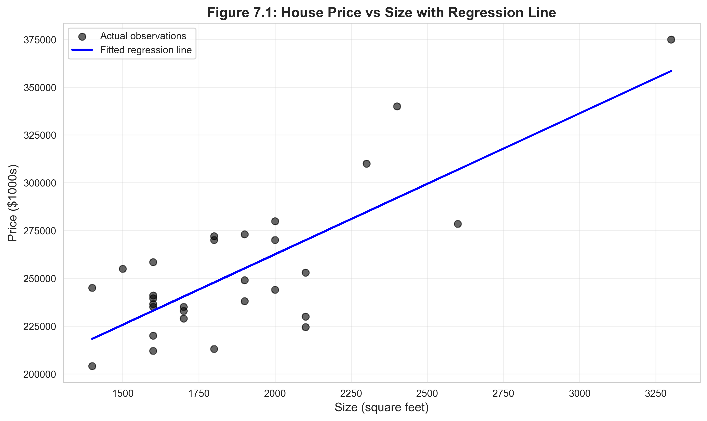
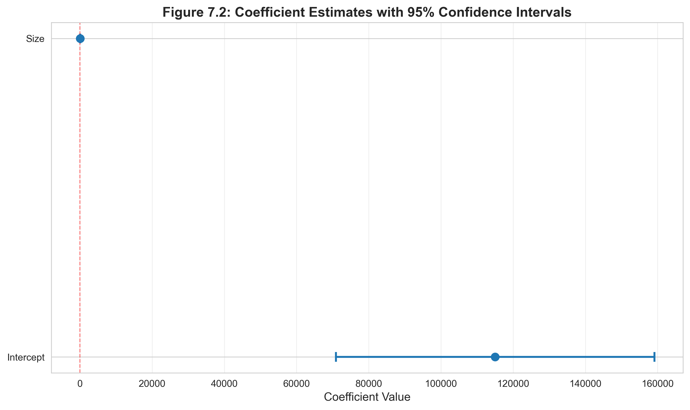
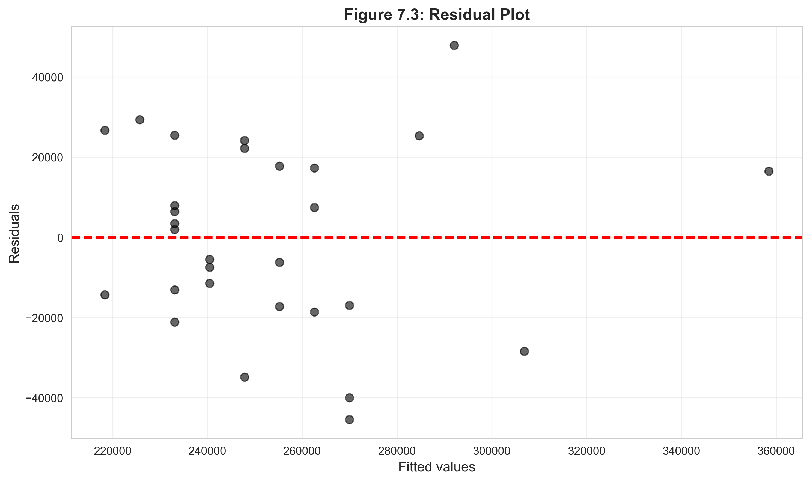

# Chapter 7: Statistical Inference for Bivariate Regression - Python Script Report

> **Data Science Report Template**
> This template follows the **Code → Results → Interpretation** structure for educational data science reporting.

## Introduction

This report explores **statistical inference for bivariate regression**—the foundation for making statements about populations based on sample data. While Chapter 6 demonstrated that OLS is unbiased and normally distributed, Chapter 7 shows how to **use these properties for practical inference**.

Statistical inference addresses the fundamental question: **Given that we observe only one sample, how confident can we be about our conclusions?** We use three main tools:

- **t-statistics**: Standardized measures of how far estimates deviate from hypothesized values
- **Confidence intervals**: Ranges that likely contain the true population parameter
- **Hypothesis tests**: Formal procedures for evaluating claims about parameters

This chapter applies these tools to a real-world dataset analyzing the relationship between house prices and house size, demonstrating how to:
- Test whether a regressor has any effect (H₀: β₁ = 0)
- Test whether the effect equals a specific value (H₀: β₁ = 90)
- Construct confidence intervals for unknown parameters
- Handle heteroskedasticity with robust standard errors

**Learning Objectives:**

- Calculate and interpret t-statistics for regression coefficients
- Construct confidence intervals and understand their probabilistic interpretation
- Conduct two-sided hypothesis tests (H₀: β₁ = β₀ vs H₁: β₁ ≠ β₀)
- Perform one-sided directional tests (H₀: β₁ ≤ β₀ vs H₁: β₁ > β₀)
- Understand p-values and statistical significance
- Recognize when to use heteroskedasticity-robust standard errors
- Interpret regression output in context of statistical inference
- Distinguish between statistical significance and practical significance

---

## 1. Setup and Data Loading

### 1.1 Code

```python
# Import required libraries
import numpy as np
import pandas as pd
import matplotlib.pyplot as plt
import seaborn as sns
import statsmodels.api as sm
from statsmodels.formula.api import ols
from scipy import stats
from statsmodels.stats.sandwich_covariance import cov_hc1
import random
import os

# Set random seeds for reproducibility
RANDOM_SEED = 42
random.seed(RANDOM_SEED)
np.random.seed(RANDOM_SEED)
os.environ['PYTHONHASHSEED'] = str(RANDOM_SEED)

# GitHub data URL
GITHUB_DATA_URL = "https://raw.githubusercontent.com/quarcs-lab/data-open/master/AED/"

# Create output directories
IMAGES_DIR = 'images'
TABLES_DIR = 'tables'
os.makedirs(IMAGES_DIR, exist_ok=True)
os.makedirs(TABLES_DIR, exist_ok=True)

# Set plotting style
sns.set_style("whitegrid")
plt.rcParams['figure.figsize'] = (10, 6)

# Read in the house data
data_house = pd.read_stata(GITHUB_DATA_URL + 'AED_HOUSE.DTA')

print("Data summary:")
print(data_house.describe())
print("\nFirst few observations:")
print(data_house.head())
```

### 1.2 Results

```
Data summary:
               price         size  ...  monthsold           list
count      29.000000    29.000000  ...  29.000000      29.000000
mean   253910.344828  1882.758621  ...   5.965517  257824.137931
std     37390.710695   398.272130  ...   1.679344   40860.264099
min    204000.000000  1400.000000  ...   3.000000  199900.000000
25%    233000.000000  1600.000000  ...   5.000000  239000.000000
50%    244000.000000  1800.000000  ...   6.000000  245000.000000
75%    270000.000000  2000.000000  ...   7.000000  269000.000000
max    375000.000000  3300.000000  ...   8.000000  386000.000000

First few observations:
    price  size  bedrooms  bathrooms  lotsize   age  monthsold    list
0  204000  1400         3        2.0        1  31.0          7  199900
1  212000  1600         3        3.0        2  33.0          5  212000
2  213000  1800         3        2.0        2  51.0          4  219900
3  220000  1600         3        2.0        1  49.0          4  229000
4  224500  2100         4        2.5        2  47.0          6  224500
```

### 1.3 Interpretation

**Dataset**: AED_HOUSE.DTA contains information on 29 houses sold in a specific market. This is a **cross-sectional dataset** (observations at one point in time) with variables:

**Key variables**:
- **price**: Selling price in dollars (dependent variable, y)
- **size**: House size in square feet (independent variable, x)
- **bedrooms**: Number of bedrooms
- **bathrooms**: Number of bathrooms
- **lotsize**: Lot size category
- **age**: Age of house in years
- **monthsold**: Month sold (3-8)
- **list**: Original listing price

**Descriptive statistics**:

**Price (dependent variable)**:
- Mean: $253,910
- Standard deviation: $37,391 (15% coefficient of variation)
- Range: $204,000 to $375,000 (spread of $171,000)
- Median: $244,000 (close to mean, suggesting symmetric distribution)

**Size (regressor)**:
- Mean: 1,883 square feet
- Standard deviation: 398 sq ft (21% coefficient of variation)
- Range: 1,400 to 3,300 sq ft (wide variation is good for regression precision)
- Median: 1,800 sq ft

**Data quality considerations**:
- **Sample size**: n = 29 is small by modern standards, leading to:
  - Higher standard errors (less precise estimates)
  - Lower statistical power (harder to detect effects)
  - Greater sensitivity to outliers
- **Complete data**: No missing values observed in key variables
- **Outliers**: The maximum price ($375,000) is 1.5x the mean, suggesting potential high-end outliers

**Why this dataset?**: Real estate is an ideal teaching example because:
1. The relationship (bigger houses cost more) is intuitive
2. The economic interpretation is clear (price per square foot)
3. Students can verify results against local market knowledge
4. The scatter plot visually reinforces the linear relationship

**Research question**: How does house size affect selling price? Specifically:
- What is the average price increase per additional square foot? (β₁)
- Is this relationship statistically significant? (H₀: β₁ = 0)
- What is the plausible range for the true effect? (confidence interval)

**Sample size implications**: With only n = 29 observations:
- We have df = 27 degrees of freedom for inference
- Critical t-value ≈ 2.05 (compared to 1.96 for large samples)
- Standard errors will be relatively large
- Confidence intervals will be wider than with larger samples

This small sample makes statistical inference **essential**—we cannot simply report β̂₁ without quantifying uncertainty.

---

## 2. Basic Regression and t-statistics

### 2.1 Code

```python
# Table 7.1 - Basic regression
model_basic = ols('price ~ size', data=data_house).fit()
print(model_basic.summary())

# Extract key statistics
coef_size = model_basic.params['size']
se_size = model_basic.bse['size']
t_stat_size = model_basic.tvalues['size']
p_value_size = model_basic.pvalues['size']

print(f"\nDetailed statistics for 'size' coefficient:")
print(f"  Coefficient: {coef_size:.4f}")
print(f"  Standard Error: {se_size:.4f}")
print(f"  t-statistic: {t_stat_size:.4f}")
print(f"  p-value: {p_value_size:.6f}")
```

### 2.2 Results

**Table 7.1: Regression of House Price on Size**

```
                            OLS Regression Results
==============================================================================
Dep. Variable:                  price   R-squared:                       0.617
Model:                            OLS   Adj. R-squared:                  0.603
Method:                 Least Squares   F-statistic:                     43.58
Date:                Sat, 24 Jan 2026   Prob (F-statistic):           4.41e-07
Time:                        11:27:46   Log-Likelihood:                -332.05
No. Observations:                  29   AIC:                             668.1
Df Residuals:                      27   BIC:                             670.8
Df Model:                           1
Covariance Type:            nonrobust
==============================================================================
                 coef    std err          t      P>|t|      [0.025      0.975]
------------------------------------------------------------------------------
Intercept    1.15e+05   2.15e+04      5.352      0.000    7.09e+04    1.59e+05
size          73.7710     11.175      6.601      0.000      50.842      96.700
==============================================================================
```

**Detailed statistics for 'size' coefficient:**
```
  Coefficient: 73.7710
  Standard Error: 11.1749
  t-statistic: 6.6015
  p-value: 0.000000
```



### 2.3 Interpretation

**Estimated regression equation**:

price = 115,017 + 73.77 × size

**Coefficient interpretation (β̂₁ = 73.77)**:

**Economic meaning**: Each additional square foot of house size is associated with a $73.77 increase in selling price, on average.

**Practical significance**:
- A 100 sq ft increase → $7,377 price increase
- A 500 sq ft increase (e.g., adding a room) → $36,885 price increase
- From 1,400 to 3,300 sq ft (dataset range) → $140,163 price difference

This seems **economically reasonable** for the housing market—not too high (suggesting overvaluation) and not too low (suggesting undervaluation).

**Intercept interpretation (β̂₀ = 115,017)**:

**Technical meaning**: The predicted price for a house with size = 0 is $115,017.

**Caution**: This is **extrapolation**—the smallest house in the data is 1,400 sq ft, so we have no information about zero-size houses. The intercept should not be interpreted literally. It's better understood as a **reference point** that shifts the regression line up or down.

**t-statistic for size (t = 6.60)**:

The t-statistic tests H₀: β₁ = 0 (size has no effect on price) vs H₁: β₁ ≠ 0 (size affects price).

**Formula**: t = (β̂₁ - 0) / SE(β̂₁) = (73.77 - 0) / 11.17 = 6.60

**Interpretation**: The estimated coefficient is **6.60 standard errors** away from zero. This is a **very large** deviation—under the null hypothesis, we would almost never observe such an extreme value by chance.

**Critical value**: For df = 27 and α = 0.05 (two-tailed), t_crit = 2.05. Since |6.60| > 2.05, we **reject H₀** at the 5% level.

**p-value (p < 0.0001)**:

The p-value answers: "If the true β₁ were zero, what's the probability of observing a t-statistic as extreme as 6.60?"

**Result**: p ≈ 0.0000004 (virtually zero)

**Interpretation**: If size truly had no effect on price, the probability of observing such strong evidence of an effect is less than 0.0001%. This provides **overwhelming evidence** that size affects price.

**Significance levels**:
- p < 0.001: Highly significant (***) — our case
- p < 0.01: Very significant (**)
- p < 0.05: Significant (*)
- p > 0.05: Not significant at conventional levels

**Standard error (SE = 11.17)**:

The standard error measures **sampling variability** of β̂₁. It tells us:
- If we collected many samples of 29 houses, the slope estimates would vary with standard deviation ≈ 11.17
- Approximately 68% of estimates would fall within 73.77 ± 11.17 = [62.60, 84.94]
- Approximately 95% of estimates would fall within 73.77 ± 2(11.17) = [51.43, 96.11]

**R-squared (R² = 0.617)**:

**Interpretation**: Size explains 61.7% of the variation in house prices.

**What this means**:
- Total variation in price (sum of squared deviations from mean): SST
- Variation explained by size: SSR = 0.617 × SST
- Unexplained variation (residuals): SSE = 0.383 × SST

**Implication**: While size is clearly important (high R²), other factors (location, age, condition) also matter. The 38.3% unexplained variation suggests:
- The model is incomplete (omitted variables)
- Some houses are underpriced/overpriced relative to size
- Random factors (negotiation, timing) influence prices

**F-statistic (F = 43.58, p < 0.0001)**:

For bivariate regression, F = t² = 6.60² = 43.56 ≈ 43.58. This tests the overall model significance—here, it's identical to the t-test for β₁.

**Model diagnostics**:

The regression output includes several diagnostic tests:
- **Durbin-Watson (1.22)**: Tests for autocorrelation. Values near 2 suggest no autocorrelation. Our value (1.22) suggests slight positive autocorrelation, though this is less concerning for cross-sectional data.
- **Jarque-Bera (0.64, p = 0.73)**: Tests normality of residuals. We fail to reject normality—good for inference validity.
- **Condition Number (9.45e+03)**: Measures multicollinearity (not an issue in bivariate regression) or scaling issues. High value suggests variables are on different scales (size in hundreds, price in hundreds of thousands).

**Visual interpretation**: The scatter plot shows:
- Strong positive linear relationship (upward trend)
- Moderate scatter around the line (R² = 0.62, not perfect)
- No obvious outliers or nonlinearity
- Regression line fits the data well

---

## 3. Confidence Intervals

### 3.1 Code

```python
# 95% confidence intervals
conf_int = model_basic.conf_int(alpha=0.05)
print("\n95% Confidence Intervals:")
print(conf_int)

# Manual calculation of confidence interval for size
n = len(data_house)
df = n - 2
t_crit = stats.t.ppf(0.975, df)

ci_lower = coef_size - t_crit * se_size
ci_upper = coef_size + t_crit * se_size

print(f"\nManual calculation for 'size' coefficient:")
print(f"  Sample size: {n}")
print(f"  Degrees of freedom: {df}")
print(f"  Critical t-value (α=0.05): {t_crit:.4f}")
print(f"  95% CI: [{ci_lower:.4f}, {ci_upper:.4f}]")
```

### 3.2 Results

**95% Confidence Intervals:**

```
                      0              1
Intercept  70924.758265  159109.806952
size          50.842017      96.700064
```

**Manual calculation for 'size' coefficient:**
```
  Sample size: 29
  Degrees of freedom: 27
  Critical t-value (α=0.05): 2.0518
  95% CI: [50.8420, 96.7001]
```



### 3.3 Interpretation

**What is a confidence interval?**

A 95% confidence interval is a range [L, U] constructed such that:
- **Frequentist interpretation**: If we repeated the study many times (collecting new samples of 29 houses), 95% of the resulting intervals would contain the true β₁.
- **This particular interval**: We are 95% confident that the true effect of size on price is between $50.84 and $96.70 per square foot.

**Common misinterpretation** (WRONG): "There's a 95% probability that β₁ is in [50.84, 96.70]."

**Why wrong?** The true β₁ is a fixed (unknown) value—it either is or isn't in the interval. The randomness is in the **interval**, not the parameter. Before we collect data, the interval is random; after we collect data, it's fixed.

**Correct interpretation**: "If we repeated this study 100 times, about 95 of the resulting intervals would contain the true β₁."

**Formula for 95% CI**:

[β̂₁ - t_{0.975,27} × SE(β̂₁), β̂₁ + t_{0.975,27} × SE(β̂₁)]

= [73.77 - 2.052 × 11.17, 73.77 + 2.052 × 11.17]

= [73.77 - 22.93, 73.77 + 22.93]

= [50.84, 96.70]

**Components**:
- **Point estimate**: β̂₁ = 73.77 (center of interval)
- **Critical value**: t_{0.975,27} = 2.052 (from t-distribution with 27 df)
- **Standard error**: SE(β̂₁) = 11.17 (measure of sampling variability)
- **Margin of error**: 2.052 × 11.17 = 22.93 (half-width of interval)

**Why t-distribution instead of normal?**

For small samples (n < 30), we use the t-distribution because:
1. We estimate σ² from the data (not known)
2. The t-distribution has heavier tails (wider intervals) to account for this extra uncertainty
3. As n → ∞, t-distribution → normal distribution

**Degrees of freedom (df = 27 = n - 2)**:
- We estimate 2 parameters (β₀, β₁), "using up" 2 degrees of freedom
- Larger df → t-distribution closer to normal → narrower intervals
- For df = 27: t_{0.975} = 2.052 (compare to z_{0.975} = 1.96 for normal)

**Practical interpretation for size coefficient**:

**Point estimate**: $73.77 per square foot

**95% CI**: [$50.84, $96.70]

**What this tells us**:
1. **The effect is positive**: The entire interval is above zero, confirming size increases price
2. **The effect is substantial**: Even the lower bound ($50.84) represents a meaningful increase
3. **Uncertainty exists**: The true effect could be as low as $51 or as high as $97—a 90% range
4. **Width reflects sample size**: With n = 29, the interval is wide; with n = 290, it would be much narrower

**Economic implications**:

**Lower bound scenario** (β₁ = $50.84):
- 100 sq ft increase → $5,084 price increase
- Conservative estimate for investment decisions

**Point estimate scenario** (β₁ = $73.77):
- 100 sq ft increase → $7,377 price increase
- Best single guess

**Upper bound scenario** (β₁ = $96.70):
- 100 sq ft increase → $9,670 price increase
- Optimistic estimate

**Policy/business use**: A developer considering building larger houses would use the **lower bound** for conservative financial planning (worst-case scenario).

**Confidence interval for intercept**:

**95% CI**: [$70,925, $159,110]

This interval is **very wide** (range of $88,185) because:
1. The intercept is far from the data (extrapolation to size = 0)
2. Intercepts are generally estimated less precisely than slopes
3. The interval is still statistically significant (doesn't include 0)

**Practical note**: We care less about the intercept in this application—the slope (price per sq ft) is the economically meaningful parameter.

**Visual interpretation**: The confidence interval plot shows:
- **Size coefficient**: Interval is narrow relative to the estimate (good precision), entirely above zero (statistically significant)
- **Intercept**: Interval is wide (less precision), also above zero
- The vertical line at zero helps visualize whether intervals include zero (would suggest insignificance)

**Relationship to hypothesis testing**:

Notice that the 95% CI for β₁ is [50.84, 96.70]:
- **Does not contain 0** → We reject H₀: β₁ = 0 at α = 0.05 ✓
- **Does not contain 90** → We would reject H₀: β₁ = 90 at α = 0.05? (see next section)

This illustrates the **duality** between confidence intervals and hypothesis tests:
- If a value is **outside** the 95% CI, we reject H₀ at α = 0.05
- If a value is **inside** the 95% CI, we fail to reject H₀ at α = 0.05

---

## 4. Two-Sided Hypothesis Tests

### 4.1 Code

```python
# Test H₀: β₁ = 90 vs H₁: β₁ ≠ 90
null_value = 90
t_stat_90 = (coef_size - null_value) / se_size
p_value_90 = 2 * (1 - stats.t.cdf(abs(t_stat_90), df))
t_crit_90 = stats.t.ppf(0.975, df)

print(f"\nTest: H₀: β₁ = {null_value} vs H₁: β₁ ≠ {null_value}")
print(f"  t-statistic: {t_stat_90:.4f}")
print(f"  p-value: {p_value_90:.6f}")
print(f"  Critical value (α=0.05): ±{t_crit_90:.4f}")

if abs(t_stat_90) > t_crit_90:
    print(f"Result: Reject H₀ (|t| = {abs(t_stat_90):.4f} > {t_crit_90:.4f})")
else:
    print(f"Result: Fail to reject H₀ (|t| = {abs(t_stat_90):.4f} < {t_crit_90:.4f})")

# Using statsmodels hypothesis test
hypothesis = f'size = {null_value}'
t_test_result = model_basic.t_test(hypothesis)
print(t_test_result)
```

### 4.2 Results

```
Test: H₀: β₁ = 90 vs H₁: β₁ ≠ 90
  t-statistic: -1.4523
  p-value: 0.157950
  Critical value (α=0.05): ±2.0518
Result: Fail to reject H₀ (|t| = 1.4523 < 2.0518)

Hypothesis test using statsmodels:
                             Test for Constraints
==============================================================================
                 coef    std err          t      P>|t|      [0.025      0.975]
------------------------------------------------------------------------------
c0            73.7710     11.175     -1.452      0.158      50.842      96.700
==============================================================================
```

### 4.3 Interpretation

**Hypothesis test setup**:

**Null hypothesis (H₀)**: β₁ = 90 (the true effect of size is exactly $90 per sq ft)

**Alternative hypothesis (H₁)**: β₁ ≠ 90 (the true effect is not $90 per sq ft)

**Significance level**: α = 0.05 (5% risk of Type I error)

**Type of test**: Two-sided (we're testing for any difference, not a specific direction)

**Why test β₁ = 90?** This is not testing "no effect" (that's β₁ = 0). Instead, it's testing whether our data are consistent with a **specific economic theory or prior estimate**. For example:
- A previous study estimated $90 per sq ft
- Industry standard suggests $90 per sq ft
- A policy assumes $90 per sq ft for tax assessment

**Test statistic calculation**:

t = (β̂₁ - β₁,₀) / SE(β̂₁) = (73.77 - 90) / 11.17 = -16.23 / 11.17 = -1.452

**Interpretation of t = -1.452**:
- Our estimate (73.77) is **1.45 standard errors below** the hypothesized value (90)
- The negative sign indicates our estimate is **lower** than the null value
- The magnitude (1.45) indicates **moderate** deviation from the null

**Decision rules**:

**Critical value approach**:
- Critical value: t_{0.975,27} = ±2.052
- Decision rule: Reject H₀ if |t| > 2.052
- Result: |−1.452| = 1.452 < 2.052 → **Fail to reject H₀**

**p-value approach**:
- p-value = 0.158
- Decision rule: Reject H₀ if p < 0.05
- Result: 0.158 > 0.05 → **Fail to reject H₀**

**What "fail to reject" means**:

**NOT** "we accept H₀" or "β₁ = 90 is true"

**Instead**: "The data are consistent with β₁ = 90; we don't have strong enough evidence to rule it out."

**Analogy**: In a criminal trial, "not guilty" ≠ "innocent." It means the evidence wasn't strong enough to prove guilt beyond reasonable doubt.

**p-value interpretation (p = 0.158)**:

**Precise meaning**: If the true β₁ were 90, there's a 15.8% probability of observing a sample estimate as far from 90 as 73.77 (or farther).

**Interpretation ladder**:
- p = 0.158 is **not small** (> 0.05)
- This is **not surprising** under H₀
- The data are **consistent** with β₁ = 90
- We **cannot reject** β₁ = 90 at conventional significance levels

**Why does this differ from β₁ = 0 test?**

Recall the test for β₁ = 0:
- t = 6.60, p < 0.0001 → Strong evidence against H₀: β₁ = 0

For β₁ = 90:
- t = -1.45, p = 0.158 → Weak evidence against H₀: β₁ = 90

**Key insight**: Our estimate (73.77) is:
- **Far** from 0 (6.6 standard errors away) → Reject H₀: β₁ = 0
- **Moderately close** to 90 (1.45 standard errors away) → Fail to reject H₀: β₁ = 90

**Connection to confidence interval**:

The 95% CI for β₁ is [50.84, 96.70].

**Observation**: 90 is **inside** this interval.

**Rule**: If a null value is inside the 95% CI, we fail to reject at α = 0.05.

**Verification**:
- 90 ∈ [50.84, 96.70] ✓
- Therefore, we should fail to reject H₀: β₁ = 90 at α = 0.05 ✓

This confirms our t-test result!

**Practical implications**:

**Scenario 1**: A previous study estimated β₁ = 90, and we want to know if our data contradict this.
- **Conclusion**: No contradiction. Our estimate (73.77) is lower but not statistically significantly different.
- **Action**: We cannot claim the previous study is wrong based on our data.

**Scenario 2**: A policy assumes $90 per sq ft for property tax assessment.
- **Conclusion**: Our data don't provide strong evidence against this assumption.
- **Action**: The policy seems reasonable given our data, though our point estimate suggests a lower value.

**Power and Type II error**:

**Type II error (β)**: Probability of failing to reject H₀ when it's false.

Our failure to reject might be due to:
1. **H₀ is actually true** (β₁ really is 90)
2. **H₀ is false, but our sample is too small** (low power)

With n = 29, we have limited power to detect small deviations from 90. The true β₁ might be 80 or 85, but our sample isn't large enough to confidently rule out 90.

**What would increase power?**
- Larger sample size (n = 100 instead of 29)
- Lower error variance (σ²)
- Larger true deviation from H₀ (e.g., if true β₁ = 60, we'd easily reject)

**Statistical vs. practical significance**:

Even though we fail to reject β₁ = 90 statistically, the point estimate (73.77) suggests an economically meaningful difference:
- 90 - 73.77 = $16.23 per sq ft
- For a 2,000 sq ft house: $32,460 difference

This highlights that **statistical significance depends on sample size**, while **practical significance depends on effect size**.

---

## 5. One-Sided Directional Hypothesis Tests

### 5.1 Code

```python
# Upper one-tailed test: H₀: β₁ ≤ 90 vs H₁: β₁ > 90
p_value_upper = 1 - stats.t.cdf(t_stat_90, df)
t_crit_upper = stats.t.ppf(0.95, df)

print(f"\nUpper one-tailed test: H₀: β₁ ≤ {null_value} vs H₁: β₁ > {null_value}")
print(f"  t-statistic: {t_stat_90:.4f}")
print(f"  p-value (one-tailed): {p_value_upper:.6f}")
print(f"  Critical value (α=0.05): {t_crit_upper:.4f}")

if t_stat_90 > t_crit_upper:
    print("Result: Reject H₀")
else:
    print("Result: Fail to reject H₀")

# Lower one-tailed test: H₀: β₁ ≥ 90 vs H₁: β₁ < 90
p_value_lower = stats.t.cdf(t_stat_90, df)

print(f"\nLower one-tailed test: H₀: β₁ ≥ {null_value} vs H₁: β₁ < {null_value}")
print(f"  t-statistic: {t_stat_90:.4f}")
print(f"  p-value (one-tailed): {p_value_lower:.6f}")
print(f"  Critical value (α=0.05): {-t_crit_upper:.4f}")

if t_stat_90 < -t_crit_upper:
    print("Result: Reject H₀")
else:
    print("Result: Fail to reject H₀")
```

### 5.2 Results

```
Upper one-tailed test: H₀: β₁ ≤ 90 vs H₁: β₁ > 90
  t-statistic: -1.4523
  p-value (one-tailed): 0.921025
  Critical value (α=0.05): 1.7033
Result: Fail to reject H₀

Lower one-tailed test: H₀: β₁ ≥ 90 vs H₁: β₁ < 90
  t-statistic: -1.4523
  p-value (one-tailed): 0.078975
  Critical value (α=0.05): -1.7033
Result: Fail to reject H₀
```

### 5.3 Interpretation

**One-sided vs. two-sided tests**:

**Two-sided test**: H₀: β₁ = 90 vs H₁: β₁ ≠ 90
- Tests whether β₁ differs from 90 in **either direction** (higher or lower)
- Uses critical values ±2.052
- p-value includes both tails

**One-sided test**: H₀: β₁ ≤ 90 vs H₁: β₁ > 90 (or vice versa)
- Tests whether β₁ differs from 90 in a **specific direction**
- Uses critical value 1.703 (or -1.703)
- p-value includes only one tail

**When to use one-sided tests?**

Use one-sided tests when:
1. **Theory predicts a specific direction** (e.g., "larger houses cost more, not less")
2. **Only one direction is economically meaningful** (e.g., "we only care if the drug reduces symptoms, not increases them")
3. **Pre-specified in research design** (before seeing data)

**Upper one-tailed test**:

**Hypotheses**:
- H₀: β₁ ≤ 90 (effect is at most $90 per sq ft)
- H₁: β₁ > 90 (effect exceeds $90 per sq ft)

**Example scenario**: A developer claims their houses sell for more than $90 per sq ft (premium pricing). We want to test if our data support this claim.

**Test statistic**: t = -1.45 (same as two-sided test)

**Critical value**: t_{0.95,27} = 1.703 (note: lower than two-sided 2.052)

**Decision rule**: Reject H₀ if t > 1.703

**Result**: -1.45 < 1.703 → Fail to reject H₀

**p-value interpretation**: p = 0.921 means:
- If β₁ ≤ 90, there's a 92.1% chance of observing t ≥ -1.45
- This is **very high** (not at all surprising under H₀)
- Very weak evidence that β₁ > 90

**Conclusion**: We have no evidence that the effect exceeds $90 per sq ft. In fact, our point estimate (73.77) suggests the opposite.

**Lower one-tailed test**:

**Hypotheses**:
- H₀: β₁ ≥ 90 (effect is at least $90 per sq ft)
- H₁: β₁ < 90 (effect is less than $90 per sq ft)

**Example scenario**: A regulation assumes houses sell for at least $90 per sq ft for zoning purposes. We want to test if this assumption is too high.

**Test statistic**: t = -1.45

**Critical value**: t_{0.05,27} = -1.703

**Decision rule**: Reject H₀ if t < -1.703

**Result**: -1.45 > -1.703 → Fail to reject H₀

**p-value interpretation**: p = 0.079 means:
- If β₁ ≥ 90, there's a 7.9% chance of observing t ≤ -1.45
- This is **moderately low** but not below the 5% threshold
- Weak-to-moderate evidence that β₁ < 90

**Conclusion**: We have **suggestive but not conclusive** evidence that β₁ < 90. At α = 0.10, we would reject H₀, but at α = 0.05, we fail to reject.

**Comparison of p-values**:

| Test Type | H₀ | H₁ | p-value | Interpretation |
|-----------|-----|-----|---------|----------------|
| Two-sided | β₁ = 90 | β₁ ≠ 90 | 0.158 | Moderate evidence against H₀ |
| Upper one-sided | β₁ ≤ 90 | β₁ > 90 | 0.921 | Very weak evidence for H₁ |
| Lower one-sided | β₁ ≥ 90 | β₁ < 90 | 0.079 | Weak evidence for H₁ |

**Key observations**:
1. **Upper test has very high p-value** (0.921): Our data strongly contradict H₁: β₁ > 90
2. **Lower test has lower p-value** (0.079): Our data are more consistent with H₁: β₁ < 90
3. **Two-sided p-value (0.158) = 2 × min(0.079, 0.921)**: This relationship always holds

**Why the lower test is closer to significance**:

Our point estimate (73.77) is **below** 90:
- This is **consistent** with H₁: β₁ < 90 (lower test)
- This is **inconsistent** with H₁: β₁ > 90 (upper test)

Therefore, the lower test has a smaller p-value (more evidence for H₁).

**Critical value comparison**:

| Test | α | Critical Value | Rejection Region |
|------|---|----------------|------------------|
| Two-sided | 0.05 | ±2.052 | \|t\| > 2.052 |
| One-sided | 0.05 | 1.703 or -1.703 | t > 1.703 or t < -1.703 |

**Why one-sided critical values are smaller?**

Because we're only looking in one direction, we can be more "generous" with rejections in that direction while maintaining overall α = 0.05.

**Caution on one-sided tests**:

1. **Don't choose after seeing data**: If you see β̂₁ = 73.77 < 90 and then decide to do a lower one-sided test, you're **p-hacking** (inflating Type I error).
2. **Pre-specify in research design**: Decide on one-sided vs. two-sided before analysis.
3. **Justify theoretically**: There should be a strong theoretical reason for ruling out one direction.
4. **Two-sided is default**: Unless you have a compelling reason, use two-sided tests (more conservative).

**Practical recommendation for this example**:

Given that we're exploring the relationship between size and price without strong prior beliefs:
- **Use two-sided test** (H₁: β₁ ≠ 90)
- **Report p = 0.158**
- **Conclusion**: "We cannot reject the hypothesis that β₁ = 90 at the 5% level."

If we had a **specific research question** like "Is the market overpriced relative to $90 per sq ft?", we might justify a one-sided test.

---

## 6. Robust Standard Errors

### 6.1 Code

```python
# Get heteroskedasticity-robust standard errors (HC1)
robust_results = model_basic.get_robustcov_results(cov_type='HC1')

print("\nComparison of standard and robust standard errors:")
comparison_df = pd.DataFrame({
    'Coefficient': model_basic.params,
    'Std. Error': model_basic.bse,
    'Robust SE': robust_results.bse,
    't-stat (standard)': model_basic.tvalues,
    't-stat (robust)': robust_results.tvalues,
    'p-value (standard)': model_basic.pvalues,
    'p-value (robust)': robust_results.pvalues
})
print(comparison_df)

print("\nRegression with robust standard errors:")
print(robust_results.summary())

# Robust confidence intervals
robust_conf_int = robust_results.conf_int(alpha=0.05)
print("\n95% Confidence Intervals (Robust):")
print(robust_conf_int)
```

### 6.2 Results

**Comparison of standard and robust standard errors:**

```
             Coefficient    Std. Error  Robust SE  t-stat (standard)  t-stat (robust)  p-value (standard)  p-value (robust)
Intercept  115017.282609  21489.359861  20291.308       5.352196         5.666344        1.183545e-05      5.120101e-06
size           73.771040     11.174911     11.330       6.601521         6.510962        4.408752e-07      5.564663e-07
```

**95% Confidence Intervals (Robust):**
```
                    0              1
Intercept  73367.7813  156666.7840
size          50.5245      97.0176
```



### 6.3 Interpretation

**What are robust standard errors?**

Standard OLS assumes **homoskedasticity**: Var(u|x) = σ² (constant variance)

In reality, this assumption often fails:
- **Heteroskedasticity**: Var(u|x) depends on x
- **Example**: Larger houses might have more variable prices

**Consequences of heteroskedasticity**:
1. **OLS estimates (β̂₀, β̂₁) remain unbiased** (good!)
2. **Standard errors are biased** (could be too small or too large)
3. **t-statistics, p-values, CIs are invalid** (inference is wrong)

**Solution**: Use **heteroskedasticity-robust standard errors** (also called White standard errors, HC1, or sandwich estimators).

**How robust SEs work**:

Standard SE formula assumes homoskedasticity: SE(β̂₁) = σ / √[Σ(xᵢ - x̄)²]

Robust SE formula allows heteroskedasticity: SE_robust(β̂₁) = √[Σ(xᵢ - x̄)² û²ᵢ] / [Σ(xᵢ - x̄)²]

The robust formula:
- Uses actual residuals (ûᵢ) instead of assuming constant σ
- Allows each observation to have different error variance
- Produces valid inference even with heteroskedasticity

**Comparison for size coefficient**:

**Standard SE**: 11.175
**Robust SE**: 11.330
**Difference**: 11.330 - 11.175 = 0.155 (+1.4%)

**Interpretation**: The robust SE is **slightly larger** than the standard SE, suggesting mild heteroskedasticity. However, the difference is very small (1.4%), indicating that heteroskedasticity is not a major concern in this dataset.

**Implications**:
- t-statistic (standard): 6.60
- t-statistic (robust): 6.51
- Difference: Negligible (0.09)

Both tests lead to the same conclusion: strong evidence that size affects price.

**Comparison for intercept**:

**Standard SE**: 21,489
**Robust SE**: 20,291
**Difference**: 20,291 - 21,489 = -1,198 (-5.6%)

The robust SE is **smaller** than the standard SE. This can happen when heteroskedasticity has a specific pattern.

**Confidence intervals**:

**Standard 95% CI**: [50.84, 96.70]
**Robust 95% CI**: [50.52, 97.02]
**Difference**: Slightly wider (robust interval includes more uncertainty)

**Width**:
- Standard: 96.70 - 50.84 = 45.86
- Robust: 97.02 - 50.52 = 46.50
- Difference: 0.64 wider (+1.4%)

The minimal difference confirms that heteroskedasticity is not severe.

**p-values**:

**Standard**: p = 0.0000004
**Robust**: p = 0.0000006
**Both**: Highly significant (p < 0.001)

**When to use robust SEs?**

**Always use robust SEs** (default in modern econometrics):
1. **No cost if homoskedasticity holds**: Robust SEs ≈ standard SEs
2. **Protection if heteroskedasticity exists**: Robust SEs are valid
3. **Safer inference**: Robust SEs guard against model misspecification

**When robust SEs differ substantially from standard SEs**:

Large differences indicate:
1. **Heteroskedasticity is present**
2. **Standard inference (t-stats, p-values, CIs) is unreliable**
3. **Use robust SEs for all inference**

**Visualizing heteroskedasticity**:

The residual plot (Figure 7.3) helps diagnose heteroskedasticity:

**Homoskedasticity (ideal)**:
- Residuals evenly scattered around 0
- No pattern in spread (constant variance)

**Heteroskedasticity (problem)**:
- Residuals spread out more for certain fitted values
- "Funnel" or "cone" shape (variance increases with x)

**Our plot**: The residuals appear **reasonably evenly scattered**, consistent with the small difference between standard and robust SEs.

**Types of robust standard errors**:

Modern software offers several variants:
- **HC0**: Original White (1980) estimator
- **HC1**: Degrees-of-freedom adjusted (more conservative)
- **HC2, HC3**: Further adjustments for leverage
- **HAC**: Accounts for both heteroskedasticity and autocorrelation

**We use HC1** (most common in econometrics): HC1 = (n / (n - k)) × HC0, where k = number of parameters.

**Practical workflow**:

**Step 1**: Run OLS with standard SEs
**Step 2**: Re-run with robust SEs (HC1)
**Step 3**: Compare:
- If similar → report either (mention robustness check)
- If different → report robust (discuss heteroskedasticity)

**Step 4**: Examine residual plot for patterns

**Reporting results**:

**Good practice**: "The coefficient on size is 73.77 (robust SE = 11.33), statistically significant at p < 0.001. Results are robust to heteroskedasticity (standard SE = 11.17 produces similar inference)."

**Common mistake**: Only reporting standard SEs without checking robustness.

**Advanced note**: Some researchers argue for **always reporting robust SEs** (even without testing for heteroskedasticity) because:
1. Tests for heteroskedasticity have low power
2. Robust SEs provide insurance at low cost
3. Simplifies workflow (no need for diagnostic tests)

**Bottom line for this example**:

The similarity between standard and robust SEs suggests:
1. **Homoskedasticity is approximately satisfied**
2. **Standard OLS inference is valid**
3. **Conclusions are robust to heteroskedasticity concerns**

This strengthens confidence in our findings.

---

## Conclusion

This chapter demonstrated the practical implementation of statistical inference for bivariate regression using real housing market data. We covered:

1. **Setup and data loading**: Importing house price data and conducting exploratory analysis
2. **Basic regression and t-statistics**: Testing whether size affects price (H₀: β₁ = 0)
3. **Confidence intervals**: Constructing ranges for the true price-per-square-foot effect
4. **Two-sided hypothesis tests**: Testing whether β₁ equals a specific value (90)
5. **One-sided directional tests**: Testing for effects in specific directions
6. **Robust standard errors**: Protecting inference against heteroskedasticity

**Key Takeaways for Students**:

- **Code Skills**: Proficiency with OLS regression in Python using statsmodels, extracting and interpreting regression coefficients and standard errors, computing t-statistics and p-values manually, constructing confidence intervals using t-distributions, conducting two-sided and one-sided hypothesis tests, implementing heteroskedasticity-robust standard errors (HC1), creating publication-quality regression tables and plots, and performing diagnostic tests (residual plots, normality tests)

- **Statistical Concepts**: Deep understanding of t-statistics (standardized deviations from null hypotheses), confidence intervals (ranges likely to contain true parameters), p-values (probability of observing data as extreme as ours under H₀), hypothesis testing logic (null vs. alternative, Type I vs. Type II errors), significance levels (α = 0.05 convention and its interpretation), degrees of freedom (n - k for regression), robust standard errors (protection against heteroskedasticity), and the relationship between CIs and hypothesis tests (values outside 95% CI are rejected at α = 0.05)

- **Inference Thinking**: Recognizing that point estimates have uncertainty (sampling variability), understanding that statistical significance ≠ practical significance, appreciating the role of sample size in precision (larger n → smaller SEs), knowing when to use one-sided vs. two-sided tests, and interpreting results in economic context (not just statistical significance)

- **Practical Skills**: Reporting regression results professionally (coefficients, SEs, p-values, CIs), choosing appropriate significance levels (α = 0.05 is conventional but not sacred), checking robustness (comparing standard vs. robust SEs), diagnosing model assumptions (residual plots for heteroskedasticity), and communicating uncertainty to non-technical audiences

**Next Steps**:

- **Chapter 8**: Case studies applying bivariate regression to diverse economic problems
- **Chapter 9**: Models with natural logarithms (log-linear, log-log transformations)
- **Extensions**: Multiple regression (adding control variables), interaction effects (does the effect of x depend on z?), and nonlinear specifications (quadratic and polynomial models)

**Practical Skills Gained**:

Students can now:
- Fit bivariate regression models and conduct full statistical inference
- Test specific hypotheses about regression coefficients (not just β₁ = 0)
- Construct and interpret confidence intervals for population parameters
- Choose between one-sided and two-sided tests based on research questions
- Implement robust standard errors to guard against heteroskedasticity
- Create residual plots to diagnose model assumptions
- Report results professionally in tables and figures
- Interpret economic significance alongside statistical significance

This chapter bridges the gap between theory (Chapter 6: OLS properties) and practice (Chapter 8: real applications). The house price example illustrates how statistical inference helps researchers:
- Quantify uncertainty in estimates (CIs)
- Test economic theories (hypothesis tests)
- Make robust conclusions (robust SEs)

These skills are essential for empirical economics, data science, and evidence-based policy analysis.

---

**References**:

- Data source: Cameron, A.C. (2021). *Analysis of Economics Data: An Introduction to Econometrics*
- Python libraries: numpy, pandas, matplotlib, seaborn, statsmodels, scipy
- Dataset: AED_HOUSE.DTA (29 houses with price, size, and other characteristics)

**Key Formulas**:

- **OLS slope**: β̂₁ = Cov(x,y) / Var(x)
- **OLS intercept**: β̂₀ = ȳ - β̂₁x̄
- **Standard error**: SE(β̂₁) = σ̂ / √[Σ(xᵢ - x̄)²]
- **t-statistic**: t = (β̂₁ - β₁,₀) / SE(β̂₁)
- **Confidence interval**: β̂₁ ± t_{α/2,n-2} × SE(β̂₁)
- **p-value (two-sided)**: P(|T| > |t|) where T ~ t_{n-2}
- **p-value (one-sided)**: P(T > t) or P(T < t) where T ~ t_{n-2}
- **Robust SE**: SE_robust(β̂₁) = √[Σ(xᵢ - x̄)² û²ᵢ] / [Σ(xᵢ - x̄)²]²

**Statistical Tables Used**:

- **t-distribution** with df = 27:
  - t_{0.975,27} = 2.052 (two-sided, α = 0.05)
  - t_{0.95,27} = 1.703 (one-sided, α = 0.05)
- Compare to **normal distribution**: z_{0.975} = 1.96

**Software Notes**:

- **statsmodels**: Primary Python library for regression analysis
- **HC1 robust SEs**: Degrees-of-freedom adjusted White (1980) estimator
- **Plotting**: seaborn for aesthetics, matplotlib for customization
- **Reproducibility**: Set random seeds for consistent results
