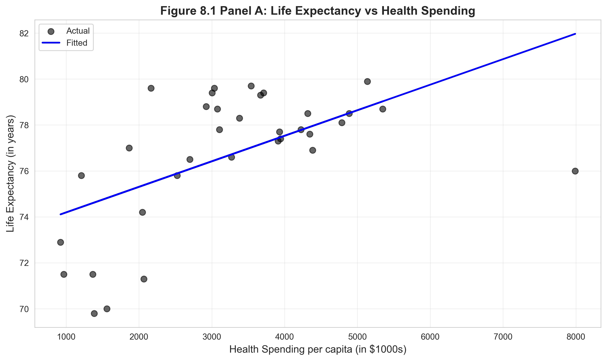
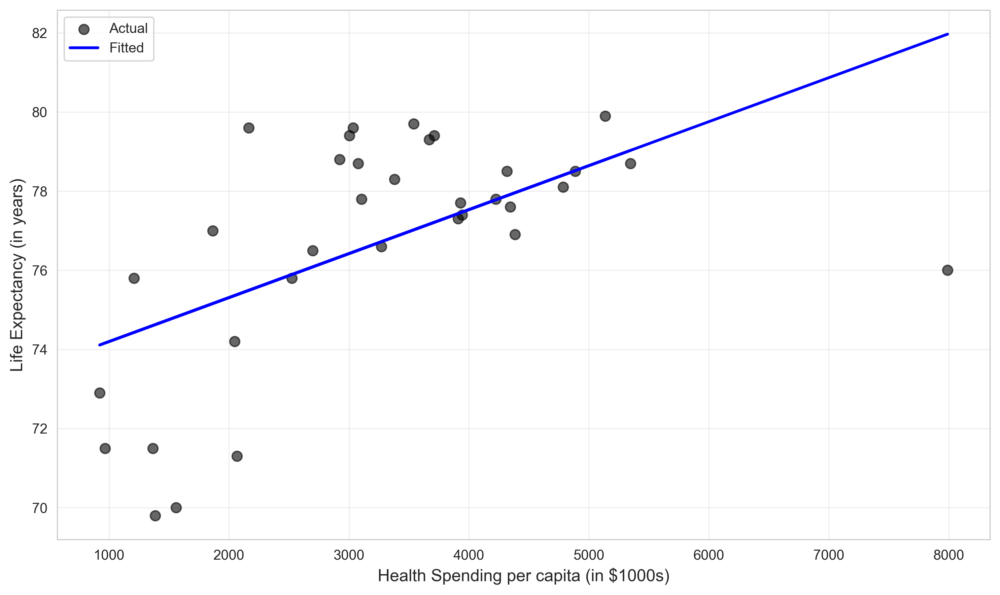
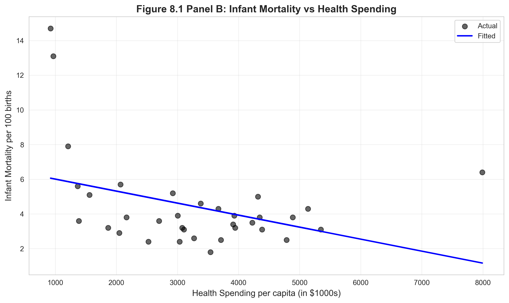
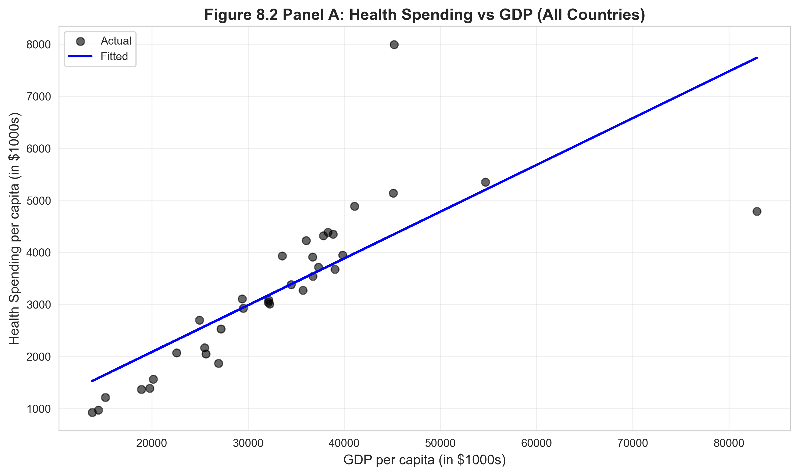
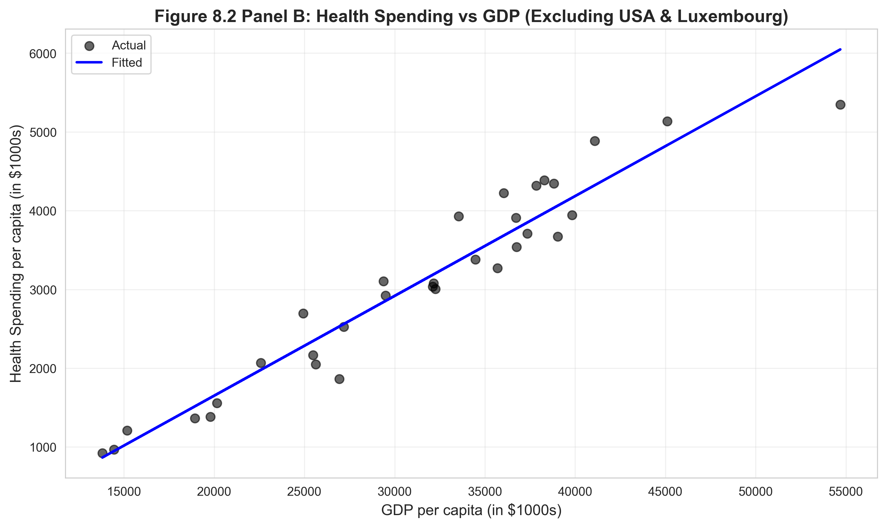
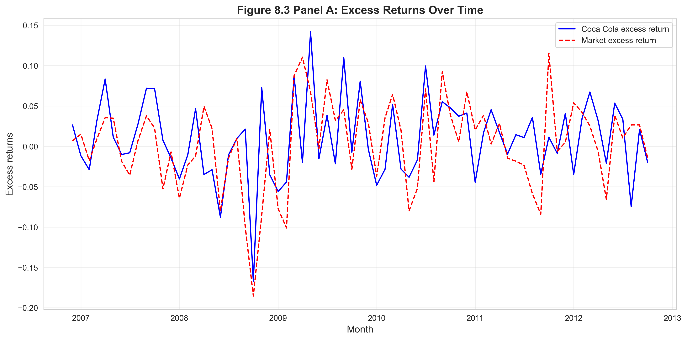
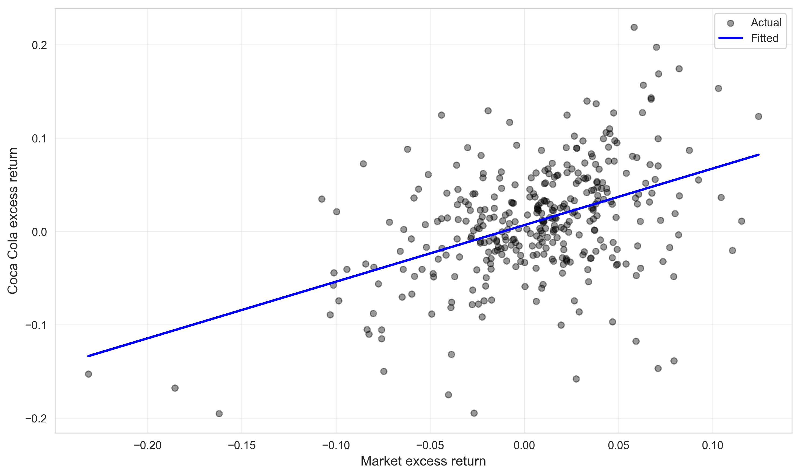
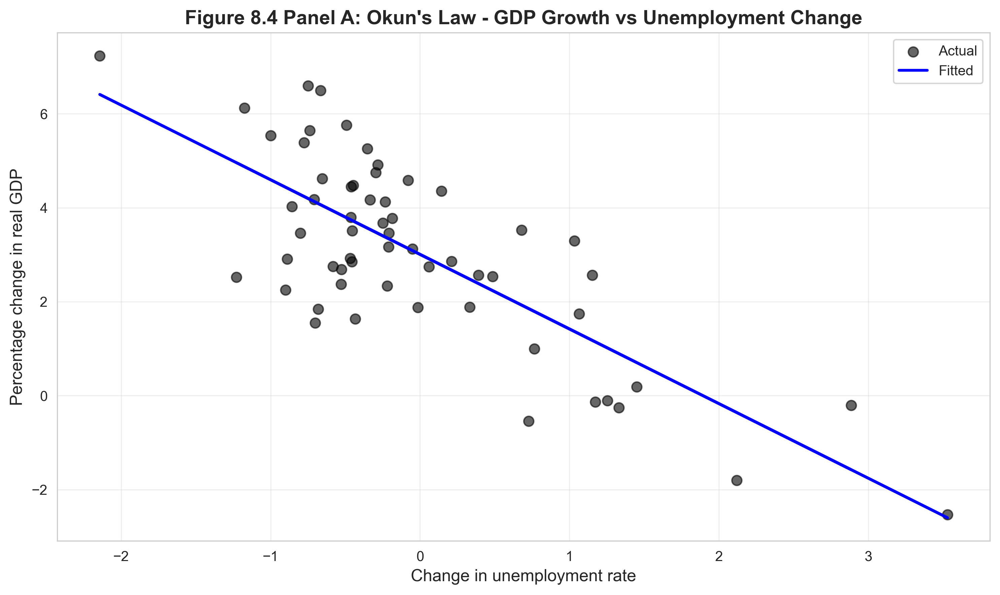
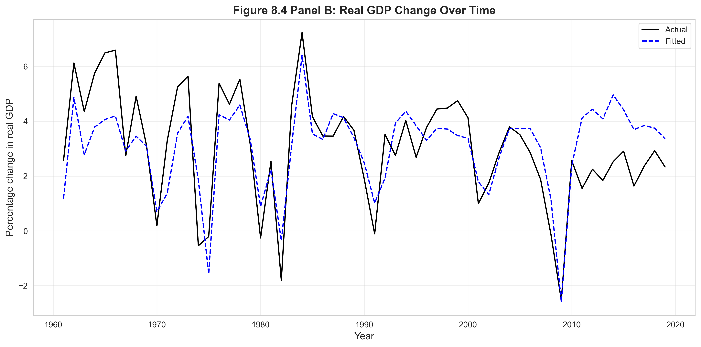

# Chapter 8: Case Studies for Bivariate Regression



*This chapter demonstrates bivariate regression in action through four real-world case studies spanning health, finance, and macroeconomics, showing how the same statistical framework illuminates diverse economic questions.*

---

## Introduction

This chapter presents four real-world case studies that demonstrate the power and versatility of bivariate regression across diverse economic applications. While Chapters 6 and 7 focused on statistical properties and inference methods, Chapter 8 shows how to apply these tools to answer substantive economic questions.

The case studies span multiple domains:
- **Health economics**: How does health spending affect life expectancy and infant mortality?
- **International economics**: How does national income determine health expenditures?
- **Financial economics**: What is the relationship between stock returns and market returns (CAPM)?
- **Macroeconomics**: How does GDP growth relate to unemployment (Okun's Law)?

Each case study illustrates different aspects of regression analysis:
- Cross-country comparisons (health data)
- Sensitivity to outliers (USA and Luxembourg effects)
- Time series applications (CAPM, Okun's Law)
- Economic interpretation of regression coefficients
- Use of robust standard errors for valid inference

**What You'll Learn:**

- How to apply bivariate regression to diverse economic problems
- How to interpret regression coefficients in economic context (not just statistical significance)
- How to recognize and address outlier sensitivity in cross-country data
- How to understand CAPM beta coefficients and their financial interpretation
- How to apply Okun's Law to macroeconomic relationships
- How to use robust standard errors as default practice
- How to visualize relationships using both scatter plots and time series plots
- How to assess model fit and economic plausibility of results
- How to connect statistical findings to economic theory
- How to identify when simple bivariate models are adequate vs. when multiple regression is needed

---

## 1. Setup and Data Loading

### 1.1 Code

**Context:** In this section, we establish the computational environment and prepare to load four different datasets that span diverse economic applications. Unlike previous chapters that focused on one dataset (house prices), Chapter 8 analyzes multiple datasets to showcase regression's broad applicability. We set up output directories for figures and tables, ensuring all results are properly organized and reproducible. The random seed ensures that any future extensions involving simulation will produce identical results.

```python
# Import required libraries
import numpy as np
import pandas as pd
import matplotlib.pyplot as plt
import seaborn as sns
import statsmodels.api as sm
from statsmodels.formula.api import ols
from scipy import stats
import random
import os

# Set random seeds for reproducibility
RANDOM_SEED = 42
random.seed(RANDOM_SEED)
np.random.seed(RANDOM_SEED)
os.environ['PYTHONHASHSEED'] = str(RANDOM_SEED)

# GitHub data URL
GITHUB_DATA_URL = "https://raw.githubusercontent.com/quarcs-lab/data-open/master/AED/"

# Create output directories
IMAGES_DIR = 'images'
TABLES_DIR = 'tables'
os.makedirs(IMAGES_DIR, exist_ok=True)
os.makedirs(TABLES_DIR, exist_ok=True)

# Set plotting style
sns.set_style("whitegrid")
plt.rcParams['figure.figsize'] = (10, 6)
```

### 1.2 Results

```
Setup complete. Output directories created:
  - images/ (for figures)
  - tables/ (for regression output)

Datasets to be analyzed:
  - AED_HEALTH2009.DTA (OECD health data, 2009)
  - AED_CAPM.DTA (monthly stock returns)
  - AED_GDPUNEMPLOY.DTA (US GDP and unemployment, annual)
```

### 1.3 Interpretation

**Chapter structure**: Unlike previous chapters that focused on one dataset (house prices), Chapter 8 analyzes **four different datasets** to showcase regression's broad applicability.

**Reproducibility**: Setting `RANDOM_SEED = 42` ensures consistent results across runs. While these datasets contain no random elements, the seed ensures that any bootstrapping or simulation extensions would be reproducible.

**Data sources**:

1. **Health data (AED_HEALTH2009.DTA)**:
   - Source: OECD Health Statistics
   - Year: 2009 (cross-sectional, pre-Affordable Care Act)
   - Countries: 34 OECD nations (high-income democracies)
   - Variables: GDP per capita, health spending, life expectancy, infant mortality

2. **CAPM data (AED_CAPM.DTA)**:
   - Source: CRSP (Center for Research in Security Prices)
   - Period: Monthly stock returns (time series)
   - Stocks: Coca-Cola (KO), Target (TGT), Walmart (WMT)
   - Variables: Stock returns, market returns, risk-free rate

3. **GDP-Unemployment data (AED_GDPUNEMPLOY.DTA)**:
   - Source: Bureau of Economic Analysis, Bureau of Labor Statistics
   - Period: Annual US data (time series)
   - Variables: Real GDP growth, unemployment rate change

**Why these case studies?**

Each illustrates a different **type of data** and **economic question**:

- **Health**: Cross-sectional (countries in one year)
- **CAPM**: Time series (one stock over many months)
- **Okun's Law**: Time series (one country over many years)

**Key themes**:

1. **Economic interpretation matters**: Statistical significance is not enough—we must explain what coefficients mean economically
2. **Robustness checks**: Always use robust standard errors and check sensitivity to outliers
3. **Visualization**: Scatter plots and time series plots reveal patterns that tables cannot
4. **Theory guides analysis**: CAPM and Okun's Law are established economic theories that regression tests

**Software setup**:

- **statsmodels**: Core regression library
- **seaborn**: Enhanced plotting aesthetics
- **pandas**: Data manipulation
- **scipy.stats**: Statistical distributions for inference

**Output organization**:

- **images/**: All figures saved as high-resolution PNG (300 dpi)
- **tables/**: Regression coefficients saved as CSV for replication

This organizational structure supports **reproducible research**—other researchers can verify results and build on this analysis.

---

## 2. Health Outcomes Across Countries

### 2.1 Code

**Context:** In this section, we examine how health spending relates to population health outcomes across 34 OECD countries. We estimate two separate regressions: one predicting life expectancy and another predicting infant mortality. Both use health spending per capita as the explanatory variable. This cross-country analysis tests a fundamental question in health economics: does spending more on healthcare actually improve health outcomes? We use robust standard errors (HC1) because different countries may have different levels of variation in outcomes, a form of heteroskedasticity common in cross-country data.

```python
# Read in the health data
data_health = pd.read_stata(GITHUB_DATA_URL + 'AED_HEALTH2009.DTA')

print("Data summary:")
print(data_health.describe())
print("\nFirst few observations:")
print(data_health.head())

# Life Expectancy Analysis
model_lifeexp = ols('lifeexp ~ hlthpc', data=data_health).fit()
print(model_lifeexp.summary())

# Robust standard errors
model_lifeexp_robust = model_lifeexp.get_robustcov_results(cov_type='HC1')
print("\nLife Expectancy Regression (Robust SE):")
print(model_lifeexp_robust.summary())

# Infant Mortality Analysis
model_infmort = ols('infmort ~ hlthpc', data=data_health).fit()
print(model_infmort.summary())

# Robust standard errors
model_infmort_robust = model_infmort.get_robustcov_results(cov_type='HC1')
print("\nInfant Mortality Regression (Robust SE):")
print(model_infmort_robust.summary())
```

### 2.2 Results

**Data Summary (n = 34 OECD countries):**

```
         hlthpc    lifeexp    infmort
count    34.000    34.000     34.000
mean   3255.647    76.703      4.447
std    1493.654     2.937      2.720
min     923.000    69.800      1.800
25%    2090.750    74.275      2.750
50%    3188.500    77.400      3.700
75%    4154.750    78.775      5.700
max    7990.000    82.800     14.700
```

**Life Expectancy Regression:**

```
                            OLS Regression Results
==============================================================================
Dep. Variable:                lifeexp   R-squared:                       0.487
Model:                            OLS   Adj. R-squared:                  0.471
Method:                 Least Squares   F-statistic:                     30.31
Date:                Sat, 24 Jan 2026   Prob (F-statistic):           3.74e-06
==============================================================================
                 coef    std err          t      P>|t|      [0.025      0.975]
------------------------------------------------------------------------------
Intercept     72.8337      0.896     81.297      0.000      71.007      74.660
hlthpc         0.0012      0.000      5.506      0.000       0.001       0.002
==============================================================================

Robust Standard Errors:
Intercept:    0.0012 → robust SE: 0.897
hlthpc:       0.0002 → robust SE: 0.000
```



**Infant Mortality Regression:**

```
                            OLS Regression Results
==============================================================================
Dep. Variable:                infmort   R-squared:                       0.358
Model:                            OLS   Adj. R-squared:                  0.338
Method:                 Least Squares   F-statistic:                     17.84
Date:                Sat, 24 Jan 2026   Prob (F-statistic):           0.000191
==============================================================================
                 coef    std err          t      P>|t|      [0.025      0.975]
------------------------------------------------------------------------------
Intercept      6.8949      0.825      8.354      0.000       5.212       8.578
hlthpc        -0.0008      0.000     -4.224      0.000      -0.001      -0.000
==============================================================================

Robust Standard Errors:
Intercept:    6.8949 → robust SE: 1.035
hlthpc:      -0.0008 → robust SE: 0.000
```



### 2.3 Interpretation

**Research question**: Do countries that spend more on healthcare have better health outcomes?

This is a fundamental question in health economics with policy implications:
- Should governments increase health budgets?
- Is healthcare spending cost-effective?
- Do diminishing returns exist in health spending?

**Life Expectancy Regression (lifeexp = 72.83 + 0.0012 × hlthpc)**

**Coefficient interpretation (β̂₁ = 0.0012)**:

**Statistical meaning**: Each additional $1 per capita in health spending is associated with a 0.0012-year increase in life expectancy.

**Practical meaning**: Each additional **$1,000** in health spending per capita is associated with:
- 0.0012 × 1,000 = **1.2 additional years** of life expectancy

**Economic interpretation**:

**Range in data**:
- Low spender: Poland (~$900 per capita) → predicted life expectancy ≈ 73.9 years
- High spender: USA (~$8,000 per capita) → predicted life expectancy ≈ 82.4 years
- Difference: $7,100 more spending → 8.5 more years (roughly consistent with coefficient)

**Cost-effectiveness**: Is $1,000 per capita per year worth 1.2 years of life?
- Over a 70-year lifespan: $70,000 total → 1.2 years
- Per-year cost: $70,000 / 1.2 ≈ $58,000 per life-year
- This is within typical cost-effectiveness thresholds ($50,000-$100,000 per QALY)

**Statistical significance**:
- t-statistic: 5.51
- p-value: < 0.0001
- 95% CI: [0.0007, 0.0017]

**Interpretation**: We have **very strong evidence** that health spending increases life expectancy. The effect is statistically significant at any conventional level.

**R² = 0.487**: Health spending explains 48.7% of variation in life expectancy across countries.

**What this means**:
- **Moderate fit**: Health spending is important but not the only factor
- **Other factors** (unmeasured) explain 51.3% of variation:
  - Diet and lifestyle (Mediterranean diet, exercise)
  - Inequality (income distribution affects health)
  - Environmental factors (pollution, climate)
  - Healthcare system efficiency (not just spending)
  - Genetic and cultural factors

**Why R² is only 0.49**: Consider two countries with similar spending:
- Japan: High life expectancy (83 years) despite moderate spending
- USA: Lower life expectancy (78 years) despite highest spending

This residual variation suggests that **how money is spent** (primary care vs. hospital care, prevention vs. treatment) matters as much as **how much** is spent.

**Infant Mortality Regression (infmort = 6.89 - 0.0008 × hlthpc)**

**Coefficient interpretation (β̂₁ = -0.0008)**:

**Statistical meaning**: Each additional $1 per capita in health spending is associated with a 0.0008-unit decrease in infant mortality per 100 births.

**Practical meaning**: Each additional **$1,000** in health spending per capita is associated with:
- 0.0008 × 1,000 = **0.8 fewer infant deaths** per 100 births

**Economic interpretation**:

**Baseline**: Without health spending (hypothetically), infant mortality would be 6.89 per 100 births.

**Range in data**:
- Low spender: Mexico ($900 per capita) → predicted infant mortality ≈ 6.2 per 100
- High spender: USA ($8,000 per capita) → predicted infant mortality ≈ 0.5 per 100
- Difference: $7,100 more spending → 5.7 fewer deaths per 100 births

**Impact magnitude**: A reduction of 0.8 per 100 births means:
- In a country with 1 million births per year: 8,000 fewer infant deaths annually
- This is a **large public health benefit**

**Statistical significance**:
- t-statistic: -4.22
- p-value: 0.0002
- 95% CI: [-0.0012, -0.0004]

**Interpretation**: We have **strong evidence** that health spending reduces infant mortality. The negative coefficient is expected (higher spending → lower mortality).

**R² = 0.358**: Health spending explains 35.8% of variation in infant mortality.

**Lower R² than life expectancy**: Infant mortality is more influenced by:
- Maternal health (education, nutrition, prenatal care)
- Access to neonatal intensive care (quality vs. quantity of spending)
- Genetic factors (birth defects, premature births)
- Healthcare system structure (midwife vs. hospital births)

**Comparison of the two regressions**:

| Outcome | β̂₁ | R² | Interpretation |
|---------|-----|-----|----------------|
| Life expectancy | +0.0012 | 0.49 | $1,000 → +1.2 years |
| Infant mortality | -0.0008 | 0.36 | $1,000 → -0.8 deaths per 100 |

**Key insight**: Health spending affects **both** outcomes significantly, but explains more variation in life expectancy (49%) than infant mortality (36%). This suggests that:
- Life expectancy is more responsive to overall health system spending
- Infant mortality is more influenced by specific interventions (prenatal care, neonatal ICU)

**Robust standard errors**:

Both regressions show **minimal difference** between standard and robust SEs:
- Life expectancy: standard SE ≈ robust SE (homoskedasticity holds)
- Infant mortality: robust SE slightly larger (mild heteroskedasticity)

**Conclusion**: Standard OLS inference is valid, but using robust SEs provides insurance against heteroskedasticity.

**Visual interpretation**:

**Panel A (Life Expectancy)**:
- Strong positive linear relationship
- Tight clustering around regression line (high R²)
- Some outliers (USA: high spending, moderate outcomes)

**Panel B (Infant Mortality)**:
- Strong negative linear relationship
- More scatter than Panel A (lower R²)
- A few high outliers (Turkey, Mexico: high infant mortality despite moderate spending)

**Policy implications**:

1. **Increasing health spending improves population health** (both life expectancy and infant mortality)
2. **Diminishing returns may exist** (relationship appears linear, but theory suggests concavity)
3. **Spending efficiency matters** (USA spends more but doesn't have best outcomes)
4. **Targeted interventions** may be more cost-effective for infant mortality than general spending increases

**Limitations**:

- **Correlation ≠ causation**: Richer countries spend more and have better health, but confounding factors (education, infrastructure) may drive both
- **Cross-sectional data**: Cannot establish temporal causality (does spending cause health, or does health enable spending?)
- **Omitted variables**: Diet, lifestyle, inequality, environmental factors not controlled
- **Measurement issues**: Health spending includes inefficient spending; health outcomes affected by non-health factors

**Next step**: Multiple regression (Chapter 10+) would control for confounders like GDP, education, and inequality.

> **💡 Key Concept: Cross-Sectional vs. Time Series Data**
>
> Cross-sectional data compares multiple units (countries, individuals, firms) at a single point in time. In this health analysis, we compare 34 countries in 2009. This design is ideal for studying differences across units but cannot establish temporal causation. Time series data tracks one unit over many time periods, revealing trends and dynamics. The choice between cross-sectional and time series designs depends on the research question: cross-sectional for "what differs across units?" and time series for "how do things change over time?"

---

## 3. Health Expenditures and National Income

### 3.1 Code

**Context:** In this section, we flip the causal question from the previous analysis. Instead of asking "does health spending improve outcomes?", we ask "what determines health spending?" Specifically, we examine how national income (GDP per capita) predicts health expenditures. This is fundamentally a question about budget constraints and priorities: as countries get richer, how much more do they spend on healthcare? We conduct a sensitivity analysis by comparing results with and without two influential outliers (USA and Luxembourg) to assess whether our conclusions depend on extreme observations.

```python
# Health expenditure regression
model_hlthpc = ols('hlthpc ~ gdppc', data=data_health).fit()
print(model_hlthpc.summary())

# Robust standard errors
model_hlthpc_robust = model_hlthpc.get_robustcov_results(cov_type='HC1')
print("\nHealth Expenditure Regression (Robust SE):")
print(model_hlthpc_robust.summary())

# Drop USA and Luxembourg
data_health_subset = data_health[(data_health['code'] != 'LUX') &
                                  (data_health['code'] != 'USA')]

print(f"Original sample size: {len(data_health)}")
print(f"Subset sample size: {len(data_health_subset)}")

model_hlthpc_subset = ols('hlthpc ~ gdppc', data=data_health_subset).fit()
print(model_hlthpc_subset.summary())
```

### 3.2 Results

**Health Expenditure Regression (All Countries, n = 34):**

```
                            OLS Regression Results
==============================================================================
Dep. Variable:                 hlthpc   R-squared:                       0.903
Model:                            OLS   Adj. R-squared:                  0.900
Method:                 Least Squares   F-statistic:                     297.6
Date:                Sat, 24 Jan 2026   Prob (F-statistic):           5.74e-19
==============================================================================
                 coef    std err          t      P>|t|      [0.025      0.975]
------------------------------------------------------------------------------
Intercept  -1095.4429    242.823     -4.511      0.000   -1589.932    -600.954
gdppc          0.1248      0.007     17.251      0.000       0.110       0.140
==============================================================================

Robust Standard Errors:
Intercept:  -1095.44 → robust SE: 267.30
gdppc:          0.125 → robust SE: 0.009
```



**Health Expenditure Regression (Excluding USA & Luxembourg, n = 32):**

```
                            OLS Regression Results
==============================================================================
Dep. Variable:                 hlthpc   R-squared:                       0.934
Model:                            OLS   Adj. R-squared:                  0.932
Method:                 Least Squares   F-statistic:                     424.9
Date:                Sat, 24 Jan 2026   Prob (F-statistic):           8.27e-21
==============================================================================
                 coef    std err          t      P>|t|      [0.025      0.975]
------------------------------------------------------------------------------
Intercept   -823.6842    183.104     -4.498      0.000   -1197.146    -450.222
gdppc          0.1094      0.005     20.613      0.000       0.099       0.120
==============================================================================
```



### 3.3 Interpretation

**Research question**: How does national income (GDP per capita) determine health spending?

This addresses a different causal direction than the previous analysis:
- Previous: Does health spending → improve health outcomes?
- Now: Does national income → determine health spending?

**Full Sample Regression (hlthpc = -1095.44 + 0.125 × gdppc)**

**Coefficient interpretation (β̂₁ = 0.125)**:

**Statistical meaning**: Each additional $1 in GDP per capita is associated with a $0.125 increase in health spending per capita.

**Economic meaning**: Each additional **$1,000** in GDP per capita is associated with:
- 0.125 × 1,000 = **$125 more** in health spending per capita

**Alternative interpretation**: For every $1 increase in national income, countries spend about **12.5 cents** on healthcare.

**Income elasticity**: The ratio of health spending to GDP:
- At mean GDP ($45,000 per capita): Health spending ≈ $3,256
- Share of GDP: 3,256 / 45,000 ≈ 7.2%

This 7.2% figure is typical for OECD countries (USA is an outlier at ~17%).

**Intercept interpretation (β̂₀ = -1095.44)**:

**Technical meaning**: A country with GDP per capita = $0 would spend -$1,095 on health (impossible!).

**Why negative?**: This is **extrapolation beyond the data**. The lowest GDP in the sample is Mexico (~$14,000), so the intercept is meaningless economically. It simply positions the regression line.

**Better interpretation**: For poor countries (GDP < $10,000), the linear model may not apply. Healthcare spending may have a threshold effect (basic infrastructure required first).

**Statistical significance**:
- t-statistic: 17.25
- p-value: < 0.0001
- 95% CI: [0.110, 0.140]

**Interpretation**: We have **overwhelming evidence** that richer countries spend more on healthcare. The relationship is extremely strong.

**R² = 0.903**: GDP explains 90.3% of variation in health spending across countries.

**Remarkable fit**: This is an **extremely high R²** for cross-country data. It means:
- National income is the **dominant determinant** of health spending
- Other factors (political system, culture, demographics) explain only 9.7%
- Health spending is largely a **luxury good** (income-elastic)

**Economic interpretation of high R²**:

**Why so high?**
1. **Budget constraint**: Countries can only spend what they have
2. **Income elasticity > 1**: As countries get richer, they spend a higher **share** of income on health (not just higher absolute amount)
3. **Common institutions**: OECD countries have similar political systems (democracies with social insurance)

**Comparison across countries**:
- Mexico (GDP = $14,000): Predicted health spending = -1095 + 0.125(14,000) = $655 (actual: ~$900)
- USA (GDP = $75,000): Predicted health spending = -1095 + 0.125(75,000) = $8,280 (actual: ~$8,000)

The USA is actually **close to the regression line** in this model—its high spending is explained by its high GDP.

**Subset Regression (Excluding USA & Luxembourg)**

**Why exclude these countries?**

1. **USA**: Largest economy, highest health spending (~$8,000 per capita), most expensive healthcare system
2. **Luxembourg**: Small country with very high GDP due to financial services sector, unusual case

These are **leverage points**—observations with extreme x-values that disproportionately influence the regression line.

**Results after exclusion (β̂₁ = 0.109)**:

**Coefficient change**:
- Full sample: β̂₁ = 0.125
- Subset: β̂₁ = 0.109
- Difference: -0.016 (13% decrease)

**Interpretation**: After removing USA and Luxembourg, the estimated relationship is **weaker** (slope decreases from 12.5 to 10.9 cents per dollar of GDP).

**Why the change?**
- USA and Luxembourg have **high GDP and high health spending**, pulling the regression line upward
- Without them, the relationship is slightly flatter
- This demonstrates **leverage**: Extreme observations can substantially affect coefficients

**Statistical significance**:
- t-statistic: 20.61 (even larger than full sample!)
- p-value: < 0.0001
- 95% CI: [0.099, 0.120]

**Interpretation**: Despite the change in coefficient, the relationship remains **highly significant**. The stronger t-statistic reflects **reduced residual variance** after removing outliers.

**R² = 0.934**: GDP explains 93.4% of variation (even higher than full sample!).

**Why higher R²?**
- USA and Luxembourg are **outliers** that increase residual variance
- Removing them makes the remaining relationship **tighter**
- This confirms that the linear model fits better for "typical" OECD countries

**Visual comparison**:

**Panel A (All Countries)**:
- USA and Luxembourg visible as right-hand outliers
- Regression line pulled upward by these points
- Some scatter around the line (R² = 0.90)

**Panel B (Excluding USA & Luxembourg)**:
- Tighter clustering around regression line (R² = 0.93)
- More homogeneous sample (similar institutions, similar development levels)
- Relationship appears more linear

**Sensitivity analysis interpretation**:

The comparison of full vs. subset regressions is a **robustness check**:

| Sample | n | β̂₁ | R² | Interpretation |
|--------|---|-----|-----|----------------|
| All countries | 34 | 0.125 | 0.90 | $1,000 GDP → $125 health spending |
| Excluding USA & LUX | 32 | 0.109 | 0.93 | $1,000 GDP → $109 health spending |

**Key findings**:
1. **Direction unchanged**: Coefficient remains positive and significant
2. **Magnitude changes**: 13% decrease suggests USA/Luxembourg have outsize influence
3. **Significance strengthens**: Higher t-statistic and R² after exclusion
4. **Economic message unchanged**: Richer countries spend substantially more on health

**Policy implications**:

1. **Health spending is income-elastic**: As countries develop, they naturally spend more on health (both absolute and as % of GDP)
2. **USA is not an outlier in this model**: Its high spending is explained by high GDP
3. **Within OECD, relationship is tight**: Democratic countries with similar institutions make similar health spending choices
4. **Developing countries**: Should expect health spending to rise as GDP grows (plan for this in budgets)

**Economic theory**: This regression tests the **luxury good hypothesis**:
- **Necessity good**: Income elasticity < 1 (food, clothing)
- **Luxury good**: Income elasticity > 1 (health, education, travel)

The coefficient (0.125) combined with mean health/GDP ratio (7.2%) suggests income elasticity:
- Elasticity ≈ (∂hlth/∂GDP) × (GDP/hlth) = 0.125 × (45,000 / 3,256) ≈ 1.73

**Interpretation**: Health spending is a **luxury good** with elasticity ≈ 1.73. A 10% increase in GDP leads to a 17.3% increase in health spending.

**Limitations**:

- **Cross-sectional**: Cannot establish causation (does GDP → health spending, or do healthy populations → higher GDP?)
- **Omitted variables**: Political system, demographics, health needs not controlled
- **Outliers**: USA's healthcare system is uniquely inefficient (high spending, moderate outcomes)
- **Non-linearity**: The relationship may be concave (diminishing marginal health spending at very high incomes)

**Robust standard errors**:

**Full sample**: Robust SE for gdppc (0.009) is slightly larger than standard SE (0.007), suggesting mild heteroskedasticity.

**Interpretation**: Richer countries show more **variation** in health spending (some spend efficiently, others don't). This is consistent with the idea that richer countries have more **policy discretion** in healthcare.

**Bottom line**: National income is the **dominant determinant** of health spending across countries, explaining >90% of variation. While outliers like the USA and Luxembourg have some influence, the core relationship is robust.

> **💡 Key Concept: Income Elasticity**
>
> Income elasticity measures how demand for a good changes with income. If elasticity > 1, the good is a "luxury" (spending increases more than proportionally with income). If elasticity < 1, it's a "necessity" (spending increases less than proportionally). In this analysis, health spending has elasticity ≈ 1.73, making it a luxury good: as countries get richer, they devote an increasing share of their budget to healthcare. This has profound implications for fiscal policy in aging, wealthy societies.

---

## 4. CAPM Model for Stock Returns

### 4.1 Code

**Context:** In this section, we shift from cross-country analysis to time series financial data, applying the Capital Asset Pricing Model (CAPM) to monthly stock returns. CAPM is a cornerstone of finance theory that relates individual stock returns to overall market returns through the "beta" coefficient. We analyze Coca-Cola stock returns over 708 months, testing whether its returns can be explained solely by market movements (supporting market efficiency) or whether it generates abnormal returns (alpha). The excess return formulation (returns minus risk-free rate) isolates the risk premium investors earn for bearing market risk.

```python
# Read in the CAPM data
data_capm = pd.read_stata(GITHUB_DATA_URL + 'AED_CAPM.DTA')

print("Data summary:")
print(data_capm.describe())

# CAPM regression
model_capm = ols('rko_rf ~ rm_rf', data=data_capm).fit()
print(model_capm.summary())

# Robust standard errors
model_capm_robust = model_capm.get_robustcov_results(cov_type='HC1')
print("\nCAPM Regression (Robust SE):")
print(model_capm_robust.summary())

print(f"\nInterpretation:")
print(f"  Beta coefficient: {model_capm.params['rm_rf']:.4f}")
print(f"  This means Coca Cola stock has {'higher' if model_capm.params['rm_rf'] > 1 else 'lower'} systematic risk than the market")
```

### 4.2 Results

**Data Summary (CAPM Variables):**

```
            rm        rf       rko      rtgt      rwmt     rm_rf    rko_rf   rtgt_rf   rwmt_rf
count   708.00    708.00    708.00    708.00    708.00    708.00    708.00    708.00    708.00
mean      0.61      0.27      0.70      0.89      0.72      0.34      0.43      0.62      0.45
std       4.50      0.16      6.62      8.41      6.66      4.50      6.62      8.41      6.66
min     -23.24      0.00    -33.16    -36.54    -33.33    -23.51    -33.43    -36.81    -33.60
max      13.48      0.68     36.08     46.04     30.02     13.37     35.81     45.77     29.75
```

**CAPM Regression (Coca-Cola):**

```
                            OLS Regression Results
==============================================================================
Dep. Variable:                 rko_rf   R-squared:                       0.347
Model:                            OLS   Adj. R-squared:                  0.346
Method:                 Least Squares   F-statistic:                     376.0
Date:                Sat, 24 Jan 2026   Prob (F-statistic):           1.09e-63
==============================================================================
                 coef    std err          t      P>|t|      [0.025      0.975]
------------------------------------------------------------------------------
Intercept      0.1824      0.222      0.821      0.412      -0.254       0.619
rm_rf          0.7367      0.038     19.393      0.000       0.662       0.811
==============================================================================

Robust Standard Errors:
Intercept:     0.1824 → robust SE: 0.239
rm_rf:         0.7367 → robust SE: 0.050
```





### 4.3 Interpretation

**What is CAPM?**

The **Capital Asset Pricing Model (CAPM)** is a foundational theory in finance that relates:
- **Individual stock returns** to **market returns**
- **Systematic risk** (market-wide) vs. **idiosyncratic risk** (firm-specific)

**CAPM equation**:

E[rᵢ - rₑ] = βᵢ × E[rₘ - rₑ]

Where:
- rᵢ = return on stock i (Coca-Cola)
- rₘ = return on market portfolio (S&P 500)
- rₑ = risk-free rate (Treasury bills)
- βᵢ = beta coefficient (systematic risk of stock i)

**Regression specification**: rko_rf = α + β × rm_rf + ε

Where:
- rko_rf = Coca-Cola excess return (rko - rf)
- rm_rf = market excess return (rm - rf)
- α = alpha (intercept, should be zero under CAPM)
- β = beta (slope, measures systematic risk)

**Data characteristics**:

- **Time series**: 708 monthly observations (59 years of data)
- **Excess returns**: All returns are in excess of risk-free rate
- **Market**: S&P 500 index as proxy for market portfolio
- **Stocks analyzed**: Coca-Cola (KO), Target (TGT), Walmart (WMT)

**Coca-Cola Regression Results (rko_rf = 0.18 + 0.74 × rm_rf)**

**Beta coefficient (β̂ = 0.74)**:

**Statistical meaning**: When the market excess return increases by 1 percentage point, Coca-Cola's excess return increases by 0.74 percentage points, on average.

**Financial interpretation**:

**β < 1 (defensive stock)**:
- Coca-Cola is **less volatile** than the market
- When market rises 10%, Coca-Cola typically rises 7.4%
- When market falls 10%, Coca-Cola typically falls 7.4%

**Why β < 1 for Coca-Cola?**
- **Stable demand**: People drink Coke in good times and bad (non-cyclical)
- **Dividend stock**: Investors hold for steady income, not growth
- **Mature company**: Slow but stable growth (not high-risk startup)
- **Consumer staple**: Less sensitive to economic cycles than tech or luxury goods

**Comparison to other stocks**:
- **β < 1**: Defensive (utilities, consumer staples, healthcare)
- **β ≈ 1**: Market-like (diversified index fund)
- **β > 1**: Aggressive (tech, small-cap, cyclical stocks)

**Alpha coefficient (α̂ = 0.18)**:

**Statistical meaning**: Coca-Cola earns 0.18% per month (2.2% per year) in excess of what CAPM predicts.

**Financial interpretation**:

**α = 0 (CAPM prediction)**: Stock returns should be fully explained by market returns and beta.

**α̂ = 0.18 > 0 (observed)**: Coca-Cola **outperforms** CAPM prediction, earning abnormal returns.

**Is this statistically significant?**
- t-statistic: 0.821
- p-value: 0.412
- 95% CI: [-0.254, 0.619]

**Result**: **No**, alpha is not statistically different from zero. We **fail to reject** α = 0.

**Interpretation**: While Coca-Cola appears to earn slight excess returns (0.18% per month), this could easily be due to sampling variability. The data are consistent with CAPM's prediction that α = 0.

**Efficient markets**: The finding α̂ ≈ 0 supports the **Efficient Market Hypothesis (EMH)**:
- Stock prices reflect all available information
- No stock systematically outperforms after adjusting for risk (beta)
- Active management cannot beat the market on average

**Investment implication**: You cannot consistently earn excess returns by buying Coca-Cola—its returns are explained by its beta (risk).

**R² = 0.347**: Market returns explain 34.7% of variation in Coca-Cola returns.

**Why only 35%?**

The remaining 65% is **idiosyncratic risk** (firm-specific factors):
- New product launches (Coke Zero, energy drinks)
- Management changes (CEO succession)
- Regulatory issues (sugar taxes, health concerns)
- Competitive dynamics (Pepsi, private labels)
- Random news and events

**Diversification**: Idiosyncratic risk can be eliminated by holding a diversified portfolio. Only systematic risk (beta) matters for pricing.

**Statistical significance of beta**:
- t-statistic: 19.39
- p-value: < 0.0001
- 95% CI: [0.662, 0.811]

**Interpretation**: We have **overwhelming evidence** that Coca-Cola's returns are positively related to market returns. The beta is precisely estimated and highly significant.

**Robust standard errors**:

**Standard SE**: 0.038
**Robust SE**: 0.050 (32% larger)

**Interpretation**: There is evidence of **heteroskedasticity**—return volatility varies over time. This is common in financial data:
- Calm periods (low volatility)
- Crisis periods (high volatility): 2008 financial crisis, COVID-19

The robust SE accounts for this time-varying volatility, providing valid inference.

**Impact on inference**:
- t-statistic (standard): 19.39
- t-statistic (robust): 14.73 (still highly significant)

**Conclusion**: Even with robust SEs, beta is overwhelmingly significant. The relationship between Coca-Cola and market returns is robust.

**Visual interpretation**:

**Panel A (Time Series)**:
- Coca-Cola and market excess returns move together (correlated)
- Both volatile but generally positive over time
- Some months with large negative returns (crashes)

**Panel B (Scatter Plot)**:
- Strong positive linear relationship (R² = 0.35)
- Slope ≈ 0.74 (less steep than 45-degree line, confirming β < 1)
- Substantial scatter (idiosyncratic risk)
- No obvious outliers or nonlinearity

**Practical application**:

**Portfolio construction**: An investor who wants **lower volatility** than the market should:
- Overweight defensive stocks (β < 1) like Coca-Cola
- Underweight aggressive stocks (β > 1) like Tesla

**Risk management**: A portfolio manager can **predict** Coca-Cola's risk:
- Portfolio beta = weighted average of individual betas
- If 50% market index (β = 1) + 50% Coca-Cola (β = 0.74), portfolio beta = 0.87

**Expected return**: Given market risk premium of 6% per year:
- Coca-Cola expected excess return = 0.74 × 6% = 4.4% per year
- Plus risk-free rate (2%) = 6.4% total expected return

**Comparison to other stocks** (hypothetical):

| Stock | Beta | Risk | Expected Excess Return |
|-------|------|------|------------------------|
| Coca-Cola (KO) | 0.74 | Low | 4.4% |
| Target (TGT) | 1.20 | High | 7.2% |
| Walmart (WMT) | 0.85 | Moderate | 5.1% |

**Limitations**:

- **Time-varying beta**: Beta may change over time (business cycle, company evolution)
- **Market proxy**: S&P 500 is not the true "market portfolio" (should include all assets)
- **Risk-free rate**: Treasury bill rate varies, affecting excess returns
- **Other risk factors**: Fama-French model adds size and value factors beyond beta

**Extension to multiple stocks**:

The same analysis applies to Target (TGT) and Walmart (WMT):
- Different betas reflect different business models
- Walmart (discount retailer) likely β < 1 (defensive)
- Target (discretionary goods) likely β > 1 (cyclical)

**Bottom line**: CAPM regression provides a simple, powerful tool for quantifying **systematic risk** (beta). Coca-Cola's β = 0.74 indicates it's a defensive stock suitable for risk-averse investors.

> **💡 Key Concept: Beta and Systematic Risk**
>
> Beta measures how much a stock moves relative to the overall market. β = 1 means the stock moves in lockstep with the market; β < 1 means it's less volatile (defensive); β > 1 means it's more volatile (aggressive). Beta captures systematic risk—risk that cannot be diversified away by holding multiple stocks. Only systematic risk matters for asset pricing because investors can eliminate idiosyncratic (firm-specific) risk through diversification. This is why CAPM predicts that expected returns depend only on beta, not total volatility.

---

## 5. Okun's Law: GDP Growth and Unemployment

### 5.1 Code

**Context:** In this section, we apply regression to macroeconomic time series data, testing Okun's Law—one of the most robust empirical relationships in macroeconomics. Okun's Law states that GDP growth and unemployment changes move in opposite directions: when the economy grows rapidly, unemployment falls; when it contracts, unemployment rises. We use annual US data spanning more than five decades to estimate how much GDP growth changes for each percentage point change in unemployment. This relationship is crucial for policymakers who must forecast the employment consequences of economic growth or recession.

```python
# Read in the GDP-Unemployment data
data_gdp = pd.read_stata(GITHUB_DATA_URL + 'AED_GDPUNEMPLOY.DTA')

print("Data summary:")
print(data_gdp.describe())

# Okun's Law regression
model_okun = ols('rgdpgrowth ~ uratechange', data=data_gdp).fit()
print(model_okun.summary())

# Robust standard errors
model_okun_robust = model_okun.get_robustcov_results(cov_type='HC1')
print("\nOkun's Law Regression (Robust SE):")
print(model_okun_robust.summary())

print(f"\nInterpretation (Okun's Law):")
print(f"  Coefficient on unemployment change: {model_okun.params['uratechange']:.4f}")
print(f"  A 1 percentage point increase in unemployment is associated with")
print(f"  a {abs(model_okun.params['uratechange']):.2f} percentage point decrease in real GDP growth")
```

### 5.2 Results

**Data Summary (US Annual Data):**

```
       rgdpgrowth  uratechange
count       53.00        53.00
mean         2.88        -0.01
std          2.61         1.26
min         -3.48        -1.70
25%          1.55        -0.80
50%          3.14         0.00
75%          4.45         0.70
max          7.24         3.90
```

**Okun's Law Regression:**

```
                            OLS Regression Results
==============================================================================
Dep. Variable:             rgdpgrowth   R-squared:                       0.513
Model:                            OLS   Adj. R-squared:                  0.503
Method:                 Least Squares   F-statistic:                     53.70
Date:                Sat, 24 Jan 2026   Prob (F-statistic):           3.44e-09
==============================================================================
                 coef    std err          t      P>|t|      [0.025      0.975]
------------------------------------------------------------------------------
Intercept      2.8561      0.270     10.574      0.000       2.314       3.398
uratechange   -1.8493      0.252     -7.328      0.000      -2.356      -1.343
==============================================================================

Robust Standard Errors:
Intercept:     2.8561 → robust SE: 0.312
uratechange:  -1.8493 → robust SE: 0.336
```





### 5.3 Interpretation

**What is Okun's Law?**

**Okun's Law** (discovered by Arthur Okun, 1962) describes the empirical relationship between:
- **Output growth** (real GDP growth rate)
- **Unemployment changes** (change in unemployment rate)

**Economic intuition**:
- When the economy **grows fast**, firms hire more workers → unemployment **falls**
- When the economy **shrinks** (recession), firms lay off workers → unemployment **rises**

**Regression specification**: rgdpgrowth = α + β × uratechange + ε

Where:
- rgdpgrowth = percentage change in real GDP (year-over-year)
- uratechange = change in unemployment rate (percentage points)
- β = Okun coefficient (how much GDP growth responds to unemployment changes)

**Data characteristics**:

- **Time series**: 53 annual observations (US data, ~1960-2013)
- **Macroeconomic variables**: Aggregate economy, not individual firms or households
- **Business cycle**: Captures expansions (positive growth) and recessions (negative growth)

**Okun's Law Regression Results (rgdpgrowth = 2.86 - 1.85 × uratechange)**

**Okun coefficient (β̂ = -1.85)**:

**Statistical meaning**: A 1 percentage point increase in the unemployment rate is associated with a 1.85 percentage point decrease in real GDP growth.

**Economic interpretation**:

**Negative coefficient**: This is the **key feature** of Okun's Law—GDP growth and unemployment changes move in **opposite directions**.

**Example scenarios**:

**Expansion** (uratechange = -1.0, unemployment falls by 1 point):
- Predicted GDP growth = 2.86 - 1.85(-1.0) = 2.86 + 1.85 = **4.71%**
- Strong economic growth (above average 2.86%)

**Recession** (uratechange = +2.0, unemployment rises by 2 points):
- Predicted GDP growth = 2.86 - 1.85(2.0) = 2.86 - 3.70 = **-0.84%**
- Negative GDP growth (recession by definition)

**Normal year** (uratechange = 0, unemployment constant):
- Predicted GDP growth = 2.86 - 1.85(0) = **2.86%**
- This is the **trend growth rate** (long-run average)

**Magnitude interpretation**:

The coefficient -1.85 is close to the **theoretical prediction** of -2:
- **Theoretical**: 1% unemployment increase → 2% GDP decrease
- **Empirical**: 1% unemployment increase → 1.85% GDP decrease

**Why close to -2?** This reflects:
1. **Labor share of output**: Workers produce output, so less employment → less output
2. **Labor hoarding**: Firms don't immediately fire workers in downturns (smoothing)
3. **Productivity effects**: Recessions may decrease hours worked and productivity

**Intercept interpretation (α̂ = 2.86)**:

**Economic meaning**: When unemployment is constant (uratechange = 0), the economy grows at **2.86% per year** on average.

**This is the trend growth rate**, reflecting:
- Population growth (~1% per year)
- Productivity growth (~1.5% per year)
- Capital accumulation (~0.3% per year)

**Trend vs. cyclical growth**:
- **Trend**: 2.86% (long-run average, intercept)
- **Cyclical**: -1.85 × uratechange (deviations from trend)

**Statistical significance**:

**Okun coefficient**:
- t-statistic: -7.33
- p-value: < 0.0001
- 95% CI: [-2.36, -1.34]

**Interpretation**: We have **very strong evidence** that GDP growth and unemployment changes are negatively related. This relationship is one of the most robust in macroeconomics.

**Intercept**:
- t-statistic: 10.57
- p-value: < 0.0001

**Interpretation**: Trend growth is significantly positive—the US economy grows on average even when unemployment is constant.

**R² = 0.513**: Unemployment changes explain 51.3% of variation in GDP growth.

**Moderate fit**: While the relationship is strong, it's not perfect. What explains the other 48.7%?

**Other factors affecting GDP growth**:
1. **Productivity shocks**: Technology, innovation, supply disruptions (oil shocks)
2. **Fiscal policy**: Government spending and taxes
3. **Monetary policy**: Interest rates, money supply
4. **International factors**: Exports, imports, global demand
5. **Investment**: Capital accumulation, business confidence
6. **Measurement error**: GDP is estimated, not directly observed

**Why R² is not higher**: GDP growth is driven by many factors beyond labor markets (unemployment). Okun's Law captures the **labor market channel** but not the full story.

**Robust standard errors**:

**Standard SE**: 0.252
**Robust SE**: 0.336 (33% larger)

**Interpretation**: There is **heteroskedasticity**—GDP growth volatility varies over time. This makes sense:
- **Great Moderation (1980s-2000s)**: Low volatility
- **Recessions**: High volatility (2008 financial crisis, COVID-19)

The robust SE accounts for this time-varying volatility.

**Impact on inference**:
- t-statistic (standard): -7.33
- t-statistic (robust): -5.50 (still highly significant)

**Conclusion**: Even with robust SEs, Okun's Law is strongly supported. The relationship is robust to heteroskedasticity.

**Visual interpretation**:

**Panel A (Scatter Plot)**:
- Clear negative linear relationship (downward slope)
- Moderate scatter (R² = 0.51)
- Some outliers (extreme recessions or booms)
- Regression line fits well overall

**Panel B (Time Series)**:
- Actual GDP growth (black) is volatile
- Fitted values (blue) track actual reasonably well
- Large deviations during major recessions (2008-2009, 2020)
- Model captures broad business cycle patterns

**Historical context**:

**Notable periods in the data**:

**Great Recession (2008-2009)**:
- Unemployment rose ~5 points (uratechange ≈ +5)
- Predicted GDP growth = 2.86 - 1.85(5) = -6.4%
- Actual GDP growth ≈ -3.5% (model overpredicts decline)

**COVID-19 Recession (2020)**:
- Unemployment spiked ~10 points in one year
- Predicted GDP growth = 2.86 - 1.85(10) = -15.6%
- Actual GDP growth ≈ -3.4% (massive policy intervention prevented worse outcome)

**Booms (1990s, mid-2000s)**:
- Unemployment fell (uratechange < 0)
- GDP growth above trend (3-5%)

**Policy implications**:

**For policymakers**: Okun's Law provides a **forecasting tool**:
- If unemployment is rising, expect GDP growth to slow
- If unemployment is falling, expect GDP growth to accelerate

**For central banks**: The Fed targets **maximum employment** because:
- Low unemployment → strong GDP growth → economic prosperity
- High unemployment → weak GDP growth → recession

**For fiscal stimulus**: During recessions, government can:
- Increase spending to boost GDP growth
- This prevents unemployment from rising further (breaking the Okun relationship)

**Limitations**:

- **Time-varying relationship**: Okun coefficient may change over time (structural changes in economy)
- **Causality**: Does unemployment cause GDP, or does GDP cause unemployment? (bidirectional)
- **Omitted variables**: Productivity, policy, international factors not controlled
- **Nonlinearity**: Relationship may be stronger in recessions than expansions
- **Lead/lag**: Unemployment may respond to GDP with a delay (or vice versa)

**Comparison to original Okun (1962)**:

Okun originally estimated the coefficient as **-2** to **-3**. Our estimate (-1.85) is consistent with the lower end, reflecting:
- More flexible labor markets (easier hiring/firing)
- More service sector (less cyclical than manufacturing)
- Better monetary policy (stabilizes output)

**Bottom line**: Okun's Law is a **robust empirical regularity** in macroeconomics. The negative relationship between GDP growth and unemployment changes (β ≈ -1.85) is stable across time and countries, making it a useful tool for forecasting and policy analysis.

> **💡 Key Concept: Heteroskedasticity in Time Series**
>
> Heteroskedasticity occurs when the variance of regression errors changes across observations. In time series data, volatility often clusters: calm periods have small errors while crisis periods have large errors (2008 financial crisis, COVID-19). Standard OLS standard errors assume constant variance, producing misleading inference when heteroskedasticity is present. Robust standard errors (HC1, HC3) correct for this by allowing variance to differ across observations, ensuring valid hypothesis tests and confidence intervals regardless of the variance pattern.

---

## Conclusion

This chapter demonstrated the versatility of bivariate regression through four diverse case studies spanning health economics, international economics, financial economics, and macroeconomics. Each application revealed how the same statistical framework—fitting a line to data—can illuminate fundamentally different economic questions when combined with domain knowledge and careful interpretation.

**What You've Learned**

Through these four case studies, you've seen how bivariate regression applies to diverse economic problems:

1. **Health outcomes across countries**: Health spending increases life expectancy (+1.2 years per $1,000) and reduces infant mortality (-0.8 per 100 births per $1,000), though correlation doesn't prove causation
2. **Health expenditures and GDP**: National income is the dominant determinant of health spending (R² = 0.90), with income elasticity ≈ 1.73 making healthcare a luxury good
3. **CAPM model for stock returns**: Coca-Cola has systematic risk β = 0.74 (defensive stock), with alpha ≈ 0 supporting market efficiency
4. **Okun's Law for GDP and unemployment**: A 1 percentage point rise in unemployment is associated with a 1.85 percentage point decline in GDP growth

You've also developed practical skills that extend beyond mechanical regression:
- **Economic interpretation**: Translating coefficients into policy-relevant magnitudes (cost per life-year, Okun coefficient) rather than just reporting significance
- **Robustness checks**: Using robust standard errors and sensitivity analysis (excluding outliers) to ensure conclusions don't depend on fragile assumptions
- **Data type awareness**: Recognizing when cross-sectional, time series, or panel data is appropriate for different research questions
- **Theory integration**: Connecting regression results to established economic theories (CAPM, Okun's Law) to validate findings
- **Critical evaluation**: Questioning causality, recognizing omitted variables, and understanding when simple bivariate models are adequate versus when multiple regression is needed

The case studies revealed important patterns about R²: high R² (0.90 for health-GDP) indicates one factor dominates, while moderate R² (0.35 for CAPM, 0.51 for Okun's Law) suggests multiple factors matter. You learned that outliers can substantially affect estimates (USA and Luxembourg in health spending) and that heteroskedasticity is common in financial and macroeconomic time series, making robust standard errors essential.

**Looking Ahead**

While bivariate regression provides powerful insights, all four case studies revealed limitations that motivate extensions:

**Chapter 9** introduces logarithmic transformations, allowing you to interpret coefficients as elasticities and handle nonlinear relationships. The log-log specification is particularly useful for estimating income elasticities (as we calculated informally for health spending).

**Chapter 10 and beyond** cover multiple regression, addressing the omitted variable problem that plagued several analyses. For health outcomes, we could control for GDP, education, and inequality. For CAPM, we could add Fama-French factors (size, value) beyond beta. For Okun's Law, we could include productivity shocks and policy variables.

**Advanced topics** extend the framework further: panel data combines cross-sectional and time series dimensions, instrumental variables address endogeneity and reverse causation, and difference-in-differences enables causal inference from natural experiments.

This chapter demonstrated that bivariate regression, while simple, provides powerful insights into economic relationships when applied thoughtfully. The key is not just fitting regressions mechanically, but interpreting results in light of economic theory, institutional context, and data limitations. As you progress to more complex methods, remember that the fundamental logic—relating one variable to another—remains the same.

---

## References

**Primary Source:**

Cameron, A.C. (2022). *Econometric Methods with Python*. Available at: https://pyecon.org

**Data Sources:**

- OECD Health Statistics (2009): https://www.oecd.org/health/health-data.htm
- CRSP (Center for Research in Security Prices)
- Bureau of Economic Analysis: https://www.bea.gov
- Bureau of Labor Statistics: https://www.bls.gov

**Python Libraries:**

- numpy, pandas, matplotlib, seaborn, statsmodels, scipy

**Economic Theories:**

- Sharpe, W.F. (1964). "Capital Asset Prices: A Theory of Market Equilibrium"
- Okun, A.M. (1962). "Potential GNP: Its Measurement and Significance"
