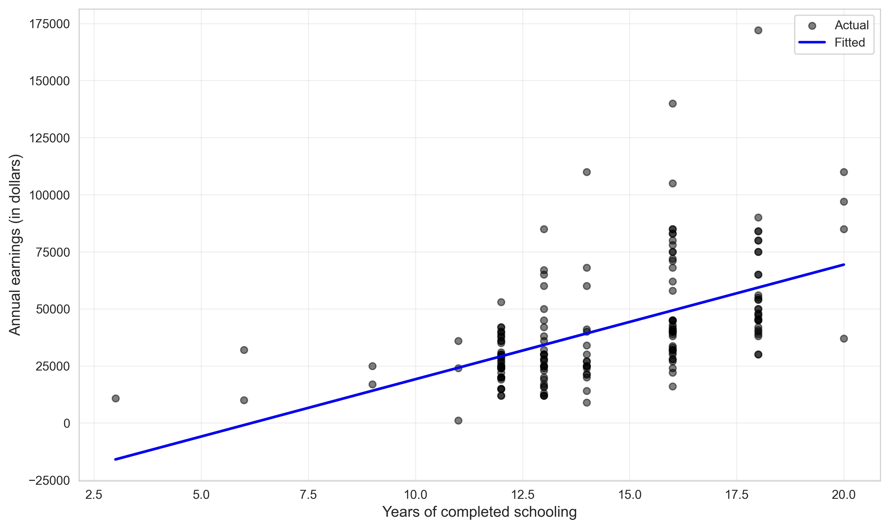
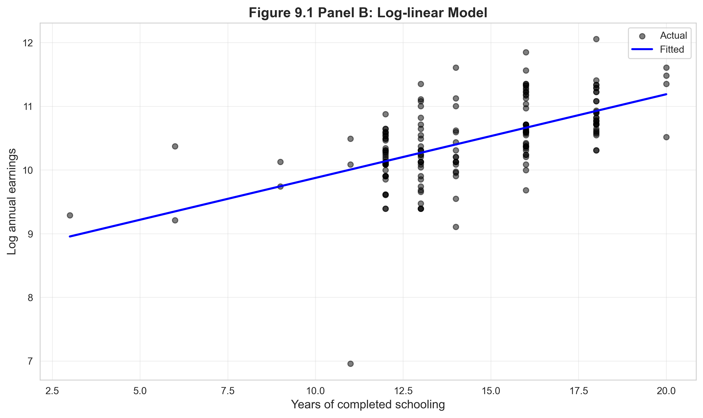
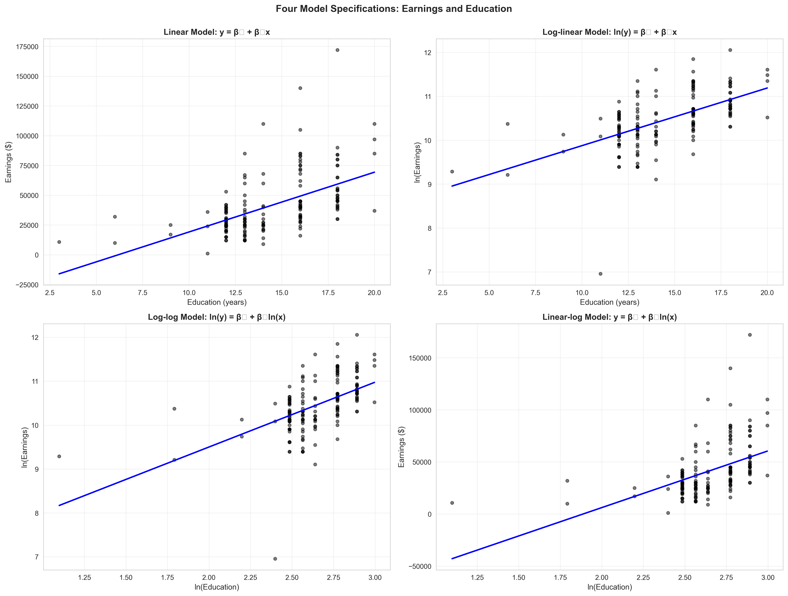
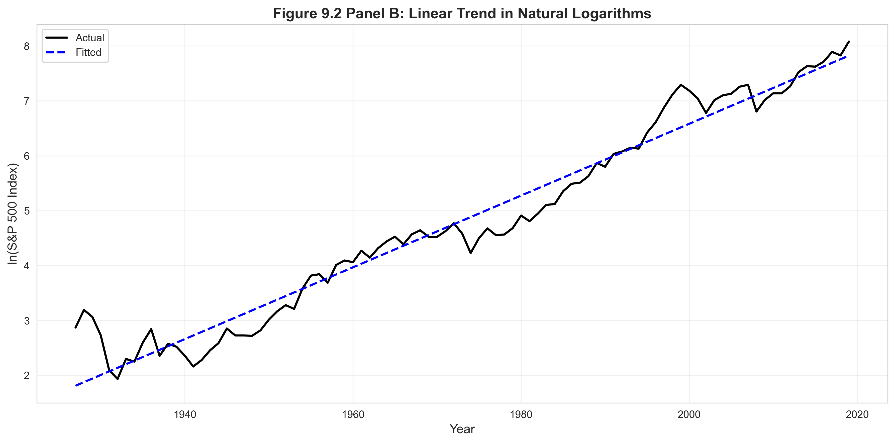

# Chapter 9: Models with Natural Logarithms - Python Script Report

> **Data Science Report Template**
> This template follows the **Code → Results → Interpretation** structure for educational data science reporting.

## Introduction

This report introduces **logarithmic transformations in regression models**—a powerful tool for addressing nonlinearity, interpreting effects as percentages, and modeling growth processes. While previous chapters focused on linear models (y = β₀ + β₁x), Chapter 9 shows that many economic relationships are better represented using **natural logarithms**.

Logarithmic transformations enable us to:
- **Interpret coefficients as elasticities or semi-elasticities** (percentage changes)
- **Model multiplicative relationships** (earnings increase by a percentage, not a fixed dollar amount)
- **Estimate exponential growth rates** (GDP, stock prices grow at constant percentage rates)
- **Reduce skewness** in distributions (earnings, income are right-skewed)
- **Stabilize variance** (heteroskedasticity often disappears in logs)

This chapter covers four model specifications:
1. **Linear**: y = β₀ + β₁x (unit change interpretation)
2. **Log-linear**: ln(y) = β₀ + β₁x (semi-elasticity interpretation)
3. **Log-log**: ln(y) = β₀ + β₁ln(x) (elasticity interpretation)
4. **Linear-log**: y = β₀ + β₁ln(x) (diminishing returns interpretation)

**Learning Objectives:**

- Understand properties of natural logarithms and exponential functions
- Transform variables using ln() and interpret results correctly
- Distinguish between semi-elasticities (log-linear) and elasticities (log-log)
- Fit and compare four model specifications for the same relationship
- Interpret coefficients as percentage changes (not absolute changes)
- Estimate exponential growth rates from time series data
- Apply retransformation bias correction when predicting in original units
- Choose appropriate model specification based on economic theory and data patterns
- Recognize when log transformations improve model fit and interpretability

---

## 1. Setup and Natural Logarithm Properties

### 1.1 Code

```python
# Import required libraries
import numpy as np
import pandas as pd
import matplotlib.pyplot as plt
import seaborn as sns
import statsmodels.api as sm
from statsmodels.formula.api import ols
from scipy import stats
import random
import os

# Set random seeds for reproducibility
RANDOM_SEED = 42
random.seed(RANDOM_SEED)
np.random.seed(RANDOM_SEED)
os.environ['PYTHONHASHSEED'] = str(RANDOM_SEED)

# GitHub data URL
GITHUB_DATA_URL = "https://raw.githubusercontent.com/quarcs-lab/data-open/master/AED/"

# Create output directories
IMAGES_DIR = 'images'
TABLES_DIR = 'tables'
os.makedirs(IMAGES_DIR, exist_ok=True)
os.makedirs(TABLES_DIR, exist_ok=True)

# Set plotting style
sns.set_style("whitegrid")
plt.rcParams['figure.figsize'] = (10, 6)

# Table 9.1 - Demonstration of logarithm properties
x_values = np.array([0.5, 1, 2, 5, 10, 20, 100])
ln_values = np.log(x_values)

log_table = pd.DataFrame({
    'x': x_values,
    'ln(x)': ln_values,
    'exp(ln(x))': np.exp(ln_values)
})
print(log_table)

print("\nKey properties:")
print(f"  ln(1) = {np.log(1):.4f}")
print(f"  ln(e) = {np.log(np.e):.4f}")
print(f"  ln(2*5) = ln(2) + ln(5): {np.log(2*5):.4f} = {np.log(2) + np.log(5):.4f}")
print(f"  ln(10/2) = ln(10) - ln(2): {np.log(10/2):.4f} = {np.log(10) - np.log(2):.4f}")
```

### 1.2 Results

**Table 9.1: Properties of Natural Logarithm**

```
       x     ln(x)  exp(ln(x))
0    0.5 -0.693147         0.5
1    1.0  0.000000         1.0
2    2.0  0.693147         2.0
3    5.0  1.609438         5.0
4   10.0  2.302585        10.0
5   20.0  2.995732        20.0
6  100.0  4.605170       100.0

Key properties:
  ln(1) = 0.0000
  ln(e) = 1.0000
  ln(2*5) = ln(2) + ln(5): 2.3026 = 2.3026
  ln(10/2) = ln(10) - ln(2): 1.6094 = 1.6094
```

### 1.3 Interpretation

**What is the natural logarithm?**

The **natural logarithm** (ln or log_e) is the inverse of the exponential function:
- If y = e^x, then x = ln(y)
- e ≈ 2.71828 (Euler's number, base of natural logarithm)

**Key properties**:

**1. ln(1) = 0**
- The log of 1 is always 0 (any base)
- This is because e^0 = 1

**2. ln(e) = 1**
- The log of the base equals 1
- This is because e^1 = e

**3. ln(ab) = ln(a) + ln(b) (product rule)**
- Example: ln(2 × 5) = ln(2) + ln(5) = 0.693 + 1.609 = 2.303
- Verification: ln(10) = 2.303 ✓
- **Economic interpretation**: Percentage changes add up (multiplication → addition in logs)

**4. ln(a/b) = ln(a) - ln(b) (quotient rule)**
- Example: ln(10/2) = ln(10) - ln(2) = 2.303 - 0.693 = 1.609
- Verification: ln(5) = 1.609 ✓
- **Economic interpretation**: Percentage differences subtract

**5. ln(a^b) = b × ln(a) (power rule)**
- Example: ln(2^3) = 3 × ln(2) = 3 × 0.693 = 2.079
- Verification: ln(8) = 2.079 ✓
- **Economic interpretation**: Elasticities multiply

**6. exp(ln(x)) = x and ln(exp(x)) = x (inverse functions)**
- The exponential function undoes the logarithm
- The logarithm undoes the exponential function
- This is crucial for **retransformation** (converting predictions back to original scale)

**Why natural logarithm (base e) instead of log₁₀?**

1. **Calculus**: d/dx[ln(x)] = 1/x (simple derivative)
2. **Economics**: Percentage changes are naturally expressed using base e
3. **Growth models**: Continuous compounding uses e
4. **Statistical theory**: Maximum likelihood for many distributions uses ln

**Visual intuition**:

**Table interpretation**:
- **x < 1**: ln(x) is negative (ln(0.5) = -0.693)
- **x = 1**: ln(x) = 0 (reference point)
- **x > 1**: ln(x) is positive (ln(100) = 4.605)

**Curvature**:
- Logarithm **grows slowly** as x increases (concave function)
- From x = 1 to x = 2: ln increases by 0.693
- From x = 10 to x = 20: ln increases by 0.693 (same change!)
- This reflects **diminishing marginal returns** to percentage increases

**Approximate percentage change formula**:

For small changes, Δln(x) ≈ Δx/x (percentage change)

Example: x increases from 10 to 11 (10% increase)
- Exact: ln(11) - ln(10) = 2.398 - 2.303 = 0.095
- Approximation: (11 - 10) / 10 = 0.10
- Close, especially for small changes!

This approximation is the **foundation** for interpreting log-linear regression coefficients as percentages.

**Economic applications**:

**1. Earnings**: A \$10,000 raise means more to someone earning \$30,000 than to someone earning \$300,000
- ln(earnings) accounts for this (percentage change matters, not absolute change)

**2. GDP growth**: Countries care about growth rates (%) not absolute increases
- ln(GDP) converts exponential growth to linear trend

**3. Elasticities**: Economists measure responsiveness as percentage changes
- ln(y) and ln(x) yield elasticity directly

**4. Skewness reduction**: Income, wealth, firm size are right-skewed
- ln(income) is more symmetric (closer to normal distribution)

**Python implementation**:

- **np.log()**: Natural logarithm (base e)
- **np.log10()**: Common logarithm (base 10)
- **np.exp()**: Exponential function (e^x)

**Caution**: ln(x) is undefined for x ≤ 0. Must ensure all values are positive before taking logs.

---

## 2. Semi-Elasticities and Elasticities

### 2.1 Code

```python
print("Model interpretations:")
print("  Linear model: y = β₀ + β₁x")
print("    Interpretation: Δy = β₁Δx")
print("\n  Log-linear model: ln(y) = β₀ + β₁x")
print("    Interpretation: %Δy ≈ 100β₁Δx (semi-elasticity)")
print("\n  Log-log model: ln(y) = β₀ + β₁ln(x)")
print("    Interpretation: %Δy ≈ β₁%Δx (elasticity)")
print("\n  Linear-log model: y = β₀ + β₁ln(x)")
print("    Interpretation: Δy ≈ β₁(%Δx/100)")
```

### 2.2 Results

```
Model interpretations:
  Linear model: y = β₀ + β₁x
    Interpretation: Δy = β₁Δx

  Log-linear model: ln(y) = β₀ + β₁x
    Interpretation: %Δy ≈ 100β₁Δx (semi-elasticity)

  Log-log model: ln(y) = β₀ + β₁ln(x)
    Interpretation: %Δy ≈ β₁%Δx (elasticity)

  Linear-log model: y = β₀ + β₁ln(x)
    Interpretation: Δy ≈ β₁(%Δx/100)
```

### 2.3 Interpretation

**Four model specifications and their interpretations**:

The choice of whether to log-transform y and/or x determines how we interpret the slope coefficient β₁.

**Model 1: Linear (y = β₀ + β₁x)**

**Interpretation**: β₁ is the **absolute change** in y for a 1-unit increase in x.

**Example**: earnings = 30,000 + 5,000 × education
- One more year of education → $5,000 increase in earnings
- This is the same $5,000 whether starting from 8 years (high school) or 20 years (PhD)

**When to use**:
- Both variables measured in absolute units (dollars, years, etc.)
- Effect is constant across range of x (no diminishing returns)
- Residuals are homoskedastic and normally distributed

**Model 2: Log-linear (ln(y) = β₀ + β₁x)**

**Interpretation**: β₁ is the **proportional change** in y for a 1-unit increase in x.

**Derivation**:
- Δln(y) = β₁Δx
- Δln(y) ≈ Δy/y (percentage change approximation)
- Therefore: Δy/y ≈ β₁Δx
- Or: %Δy ≈ 100β₁Δx

**Example**: ln(earnings) = 8.56 + 0.13 × education
- One more year of education → 13% increase in earnings
- If currently earning $40,000: increase = 0.13 × $40,000 = $5,200
- If currently earning $80,000: increase = 0.13 × $80,000 = $10,400

**When to use**:
- y is measured in dollars/quantities that grow proportionally
- Effect is multiplicative (same percentage change, not same absolute change)
- y is right-skewed (earnings, income, prices)
- Elasticity with respect to x is constant

**Note**: This is called **semi-elasticity** because only y is logged (half-elastic).

**Model 3: Log-log (ln(y) = β₀ + β₁ln(x))**

**Interpretation**: β₁ is the **elasticity** of y with respect to x.

**Derivation**:
- Δln(y) = β₁Δln(x)
- Δln(y) ≈ Δy/y and Δln(x) ≈ Δx/x
- Therefore: Δy/y ≈ β₁(Δx/x)
- Or: %Δy ≈ β₁%Δx

**Example**: ln(earnings) = 6.55 + 1.48 × ln(education)
- 1% increase in education → 1.48% increase in earnings
- 10% increase in education → 14.8% increase in earnings

**When to use**:
- Both x and y measured in dollars/quantities
- Relationship is multiplicative for both variables
- Both variables are right-skewed
- Elasticity is constant (β₁ doesn't depend on x or y levels)

**Economic interpretation**:
- β₁ > 1: Elastic (y responds strongly to x)
- β₁ = 1: Unit elastic (y changes proportionally to x)
- β₁ < 1: Inelastic (y responds weakly to x)

**Model 4: Linear-log (y = β₀ + β₁ln(x))**

**Interpretation**: β₁/100 is the **absolute change** in y for a 1% increase in x.

**Derivation**:
- Δy = β₁Δln(x)
- Δln(x) ≈ Δx/x (percentage change)
- Therefore: Δy ≈ β₁(Δx/x)
- For 1% increase: Δy ≈ β₁/100

**Example**: earnings = -102,700 + 54,433 × ln(education)
- 1% increase in education → $544 increase in earnings
- 10% increase in education → $5,443 increase in earnings

**When to use**:
- y is measured in levels (dollars)
- x is measured in levels but has diminishing returns
- Want to capture decreasing marginal effects (concave relationship)
- x is right-skewed but y is not

**Comparison table**:

| Model | Specification | β₁ Interpretation | Example |
|-------|---------------|-------------------|---------|
| Linear | y ~ x | Δy for 1-unit Δx | $5,000 per year of education |
| Log-linear | ln(y) ~ x | %Δy for 1-unit Δx | 13% per year of education |
| Log-log | ln(y) ~ ln(x) | %Δy for 1% Δx | Elasticity = 1.48 |
| Linear-log | y ~ ln(x) | Δy for 1% Δx | $544 per 1% education increase |

**Choosing the right model**:

**Decision tree**:
1. **Is y right-skewed (earnings, prices)?** → Consider log(y)
2. **Is x right-skewed (firm size, wealth)?** → Consider log(x)
3. **Do effects vary by level (proportional vs. absolute)?** → Consider log transformation
4. **Does economic theory suggest elasticity?** → Use log-log
5. **Are residuals heteroskedastic?** → Log transformation often helps
6. **Compare R² across models** → Higher R² suggests better fit

**Common pitfall**: Don't blindly maximize R²—choose model based on economic interpretation and theory.

**Exact vs. approximate percentage changes**:

For log-linear model: ln(y) = β₀ + β₁x

**Approximate**: %Δy ≈ 100β₁Δx

**Exact**: %Δy = 100 × [exp(β₁Δx) - 1]

**Example**: β₁ = 0.13, Δx = 1
- Approximate: 100 × 0.13 = 13%
- Exact: 100 × [exp(0.13) - 1] = 100 × [1.139 - 1] = 13.9%

**When does it matter?**
- For small β₁ (< 0.15): approximation is accurate
- For large β₁ (> 0.15): use exact formula
- In practice, most coefficients are small enough for approximation

---

## 3. Earnings and Education: Four Model Specifications

### 3.1 Code

```python
# Read in the earnings data
data_earnings = pd.read_stata(GITHUB_DATA_URL + 'AED_EARNINGS.DTA')

print("Data summary:")
print(data_earnings.describe())
print("\nFirst few observations:")
print(data_earnings.head())

# Create log variables
data_earnings['lnearn'] = np.log(data_earnings['earnings'])
data_earnings['lneduc'] = np.log(data_earnings['education'])

# Model 1: Linear model
model_linear = ols('earnings ~ education', data=data_earnings).fit()
print(model_linear.summary())
print(f"\nInterpretation: One additional year of education is associated with")
print(f"${model_linear.params['education']:.2f} increase in annual earnings")

# Model 2: Log-linear model
model_loglin = ols('lnearn ~ education', data=data_earnings).fit()
print(model_loglin.summary())
print(f"\nInterpretation: One additional year of education is associated with")
print(f"{100*model_loglin.params['education']:.2f}% increase in earnings")

# Model 3: Log-log model
model_loglog = ols('lnearn ~ lneduc', data=data_earnings).fit()
print(model_loglog.summary())
print(f"\nInterpretation: A 1% increase in education is associated with")
print(f"{model_loglog.params['lneduc']:.4f}% increase in earnings (elasticity)")

# Model 4: Linear-log model
model_linlog = ols('earnings ~ lneduc', data=data_earnings).fit()
print(model_linlog.summary())
print(f"\nInterpretation: A 1% increase in education is associated with")
print(f"${model_linlog.params['lneduc']/100:.2f} increase in annual earnings")
```

### 3.2 Results

**Data Summary (n = 171 individuals, age 30):**

```
            earnings   education    age  gender
count     171.000000  171.000000  171.0   171.0
mean    41412.690058   14.432749   30.0     0.0
std     25527.053396    2.735364    0.0     0.0
min      1050.000000    3.000000   30.0     0.0
25%     25000.000000   12.000000   30.0     0.0
50%     36000.000000   14.000000   30.0     0.0
75%     49000.000000   16.000000   30.0     0.0
max    172000.000000   20.000000   30.0     0.0
```

**Model 1: Linear (earnings = -31,060 + 5,021 × education)**

```
                            OLS Regression Results
==============================================================================
Dep. Variable:               earnings   R-squared:                       0.289
Model:                            OLS   Adj. R-squared:                  0.285
==============================================================================
                 coef    std err          t      P>|t|      [0.025      0.975]
------------------------------------------------------------------------------
Intercept  -3.106e+04   8887.835     -3.494      0.001   -4.86e+04   -1.35e+04
education   5021.1229    605.101      8.298      0.000    3826.593    6215.653
==============================================================================

Interpretation: One additional year of education is associated with
$5021.12 increase in annual earnings
```



**Model 2: Log-linear (ln(earnings) = 8.56 + 0.131 × education)**

```
                            OLS Regression Results
==============================================================================
Dep. Variable:                 lnearn   R-squared:                       0.334
Model:                            OLS   Adj. R-squared:                  0.330
==============================================================================
                 coef    std err          t      P>|t|      [0.025      0.975]
------------------------------------------------------------------------------
Intercept      8.5608      0.210     40.825      0.000       8.147       8.975
education      0.1314      0.014      9.206      0.000       0.103       0.160
==============================================================================

Interpretation: One additional year of education is associated with
13.14% increase in earnings
```



**Model 3: Log-log (ln(earnings) = 6.55 + 1.478 × ln(education))**

```
                            OLS Regression Results
==============================================================================
Dep. Variable:                 lnearn   R-squared:                       0.286
Model:                            OLS   Adj. R-squared:                  0.282
==============================================================================
                 coef    std err          t      P>|t|      [0.025      0.975]
------------------------------------------------------------------------------
Intercept      6.5454      0.477     13.725      0.000       5.604       7.487
lneduc         1.4775      0.179      8.233      0.000       1.123       1.832
==============================================================================

Interpretation: A 1% increase in education is associated with
1.4775% increase in earnings (elasticity)
```

**Model 4: Linear-log (earnings = -102,700 + 54,433 × ln(education))**

```
                            OLS Regression Results
==============================================================================
Dep. Variable:               earnings   R-squared:                       0.231
Model:                            OLS   Adj. R-squared:                  0.226
==============================================================================
                 coef    std err          t      P>|t|      [0.025      0.975]
------------------------------------------------------------------------------
Intercept  -1.027e+05   2.03e+04     -5.056      0.000   -1.43e+05   -6.26e+04
lneduc      5.443e+04   7645.805      7.119      0.000    3.93e+04    6.95e+04
==============================================================================

Interpretation: A 1% increase in education is associated with
$544.33 increase in annual earnings
```

**Model Comparison Summary:**

```
     Model Specification       R²   Slope Coef
    Linear         y ~ x 0.289488  5021.122947
Log-linear     ln(y) ~ x 0.333972     0.131424
   Log-log ln(y) ~ ln(x) 0.286248     1.477503
Linear-log     y ~ ln(x) 0.230719 54433.415866
```



### 3.3 Interpretation

**Dataset**: AED_EARNINGS.DTA contains earnings and education data for 171 individuals, all aged 30.

**Variables**:
- **earnings**: Annual earnings in dollars (dependent variable)
- **education**: Years of completed schooling (independent variable)
- **age**: All observations are 30 years old (controlled by design)
- **gender**: All observations are male (controlled by design)

**Research question**: How does education affect earnings?

This is a classic question in labor economics, testing the **human capital theory**: education increases productivity, which increases earnings.

**Data characteristics**:

**Earnings**:
- Mean: $41,413
- Median: $36,000 (below mean, indicating right skew)
- Range: $1,050 to $172,000 (very wide spread)
- Coefficient of variation: 62% (high dispersion)
- **Right-skewed**: A few high earners pull the mean above median

**Education**:
- Mean: 14.4 years (some college)
- Median: 14 years (2 years of college)
- Range: 3 to 20 years (dropout to PhD)
- Coefficient of variation: 19% (moderate dispersion)
- Less skewed than earnings

**Why all age 30?**: Controlling for age isolates the effect of education from age/experience effects. In reality, earnings increase with both education and experience.

**Model 1: Linear Model**

**Specification**: earnings = -31,060 + 5,021 × education

**Interpretation**: Each additional year of education is associated with a **$5,021 increase** in annual earnings.

**Examples**:
- High school graduate (12 years): Predicted earnings = -31,060 + 5,021(12) = $29,192
- Bachelor's degree (16 years): Predicted earnings = -31,060 + 5,021(16) = $29,276
- Difference: 4 years → $20,084 increase (4 × $5,021)

**Intercept**: -$31,060 is nonsensical (negative earnings for zero education). This is extrapolation—the model only applies within the data range (3-20 years).

**R² = 0.289**: Education explains 28.9% of earnings variation. The other 71.1% is due to:
- Ability (IQ, motivation)
- Field of study (engineering vs. humanities)
- Occupation (teacher vs. software engineer)
- Location (New York vs. rural area)
- Random factors (luck, connections)

**Statistical significance**:
- t-statistic: 8.30
- p-value: < 0.0001
- 95% CI: [$3,827, $6,216]

**Conclusion**: Very strong evidence that education increases earnings.

**Limitations of linear model**:
1. **Constant returns**: Assumes each year of education has the same effect ($5,021)
   - In reality, returns may be higher for college than high school
2. **Heteroskedasticity**: Variance of earnings likely increases with education
3. **Skewness**: Earnings are right-skewed, violating normality assumption
4. **Negative predictions**: For education < 6.2 years, model predicts negative earnings (impossible)

**Model 2: Log-linear Model**

**Specification**: ln(earnings) = 8.56 + 0.131 × education

**Interpretation**: Each additional year of education is associated with a **13.1% increase** in earnings.

**Examples**:
- High school graduate (12 years): Predicted ln(earnings) = 8.56 + 0.131(12) = 10.13
  - Predicted earnings = exp(10.13) = $25,013
- Bachelor's degree (16 years): Predicted ln(earnings) = 8.56 + 0.131(16) = 10.66
  - Predicted earnings = exp(10.66) = $42,885
- **Percentage increase**: (42,885 - 25,013) / 25,013 = 71.5%
- **Annual percentage**: 71.5% / 4 years ≈ 13.1% per year ✓

**Why this makes sense**:
- A $5,000 raise means more to someone earning $25,000 (20% increase) than to someone earning $100,000 (5% increase)
- Percentage changes are more economically meaningful than absolute changes

**R² = 0.334**: **Higher than linear model** (0.289), suggesting log-linear fits better.

**Why higher R²?**
- Log transformation reduces skewness in earnings
- Variance is more constant in log(earnings) (less heteroskedasticity)
- Relationship is more linear in log space

**Statistical significance**:
- t-statistic: 9.21
- p-value: < 0.0001
- **Stronger evidence** than linear model (higher t-stat)

**Practical application**:
- High school graduate earning $30,000 gets 4 more years of education (bachelor's)
- Predicted increase: 4 × 13.1% = 52.4%
- New earnings: $30,000 × 1.524 = $45,720

**Comparison to linear model**:
- Linear predicts: $30,000 + 4($5,021) = $50,084
- Log-linear predicts: $30,000 × 1.524 = $45,720
- Difference: $4,364 (linear overestimates for low earners)

**Model 3: Log-log Model**

**Specification**: ln(earnings) = 6.55 + 1.478 × ln(education)

**Interpretation**: A 1% increase in education is associated with a **1.478% increase** in earnings (elasticity).

**Elasticity = 1.478**: This is **greater than 1** (elastic), meaning earnings respond strongly to education.

**Examples**:
- 10% increase in education (14 → 15.4 years): Predicted earnings increase = 1.478 × 10% = 14.78%
- If currently earning $40,000: Increase = 0.1478 × $40,000 = $5,912

**Why elasticity interpretation is awkward here**:
- "1% increase in education" = 0.01 × 14 years = 0.14 years ≈ 7 weeks of school
- This is not a natural unit for education
- Log-linear (one additional year) is more interpretable

**R² = 0.286**: **Lower than log-linear** (0.334), suggesting log-linear fits better for this relationship.

**Why lower R²?**
- Education is not very skewed (CV = 19%)
- No strong reason to log-transform x
- The relationship is not multiplicative in education

**When log-log makes sense**:
- If x were "years of experience" (highly skewed)
- If x were "firm size" (extremely right-skewed)
- If economic theory predicts constant elasticity

**Model 4: Linear-log Model**

**Specification**: earnings = -102,700 + 54,433 × ln(education)

**Interpretation**: A 1% increase in education is associated with a **$544 increase** in annual earnings.

**Diminishing returns**:
- This model captures **decreasing marginal returns** to education
- Additional years of education have smaller absolute effects at higher levels
- The log(education) term "compresses" high education values

**Examples**:
- From 12 to 13 years: Δln(educ) = ln(13) - ln(12) = 0.080 → Δearnings = 54,433 × 0.080 = $4,355
- From 16 to 17 years: Δln(educ) = ln(17) - ln(16) = 0.061 → Δearnings = 54,433 × 0.061 = $3,320
- **Diminishing effect**: Same 1-year increase has smaller dollar impact at higher education

**R² = 0.231**: **Lowest of all four models**, suggesting this specification fits worst.

**Why lowest R²?**
- Earnings (y) is right-skewed, so levels are not ideal
- Education (x) is not extremely skewed, so logging it doesn't help much
- The model tries to have it both ways (log x but not log y) and does worst

**Intercept**: -$102,700 is even more nonsensical than linear model. Ignore it.

**Model Selection**:

Based on R², statistical significance, and economic interpretation:

**Winner: Log-linear model (ln(earnings) = β₀ + β₁ × education)**

**Reasons**:
1. **Highest R²** (0.334): Best fit
2. **Most interpretable**: "13.1% increase per year" makes intuitive sense
3. **Addresses skewness**: ln(earnings) is more symmetric
4. **Likely homoskedastic**: Variance more constant in log space
5. **Economic theory**: Returns to education are proportional, not absolute

**Runner-up: Linear model (earnings = β₀ + β₁ × education)**

**Reasons**:
1. **Simple**: Dollar interpretation is clear ($5,021 per year)
2. **Decent fit**: R² = 0.289 is respectable
3. **Familiar**: No log transformations to explain

**Not recommended: Log-log or linear-log**

**Reasons**:
1. **Lower R²**: Fit is worse
2. **Awkward interpretation**: "1% increase in education" is unnatural
3. **No theoretical justification**: Education is not skewed enough to require logging

**Visual comparison**:

The combined figure shows all four models:
- **Linear**: Straight line in (x, y) space
- **Log-linear**: Straight line in (x, ln(y)) space, exponential in (x, y) space
- **Log-log**: Straight line in (ln(x), ln(y)) space, power function in (x, y) space
- **Linear-log**: Straight line in (ln(x), y) space, logarithmic in (x, y) space

**Policy implications**:

Using the log-linear model:
- **13.1% return per year** of education
- Over a 40-year career, this compounds: $30,000 × (1.131)^4 ≈ $48,000 (bachelor's premium)
- Justifies public investment in education (positive externalities)
- Explains wage inequality (college grads earn >50% more)

---

## 4. Exponential Growth: S&P 500 Stock Index

### 4.1 Code

```python
# Read in the S&P 500 data
data_sp500 = pd.read_stata(GITHUB_DATA_URL + 'AED_SP500INDEX.DTA')

print("S&P 500 Index data summary:")
print(data_sp500.describe())
print("\nFirst few observations:")
print(data_sp500.head())

# Regression in logs to estimate exponential growth
model_logs = ols('lnsp500 ~ year', data=data_sp500).fit()
print(model_logs.summary())

print(f"\nInterpretation:")
print(f"  Growth rate: {100*model_logs.params['year']:.4f}% per year")

# Retransformation bias correction
n = len(data_sp500)
k = 2  # intercept + slope
ResSSQ = np.sum(model_logs.resid**2)
MSE = ResSSQ / (n - k)
rmse = np.sqrt(MSE)

print(f"\nRetransformation bias correction:")
print(f"  RMSE: {rmse:.6f}")
print(f"  MSE: {MSE:.6f}")
print(f"  Correction factor: exp(MSE/2) = {np.exp(MSE/2):.6f}")

# Predictions in levels with bias correction
plnsp500 = model_logs.fittedvalues
psp500 = np.exp(plnsp500) * np.exp(MSE/2)
```

### 4.2 Results

**S&P 500 Index data summary (1927-2019, n = 93):**

```
             year        sp500    lnsp500
count    93.00000    93.000000  93.000000
mean   1973.00000   473.664307   4.817428
std      26.99074   710.751831   1.801842
min    1927.00000     6.920000   1.934416
25%    1950.00000    23.770000   3.168424
50%    1973.00000    96.470001   4.569232
75%    1996.00000   740.739990   6.607650
max    2019.00000  3230.780029   8.080479
```

**Exponential Growth Model: ln(sp500) = -124.09 + 0.0653 × year**

```
                            OLS Regression Results
==============================================================================
Dep. Variable:                lnsp500   R-squared:                       0.958
Model:                            OLS   Adj. R-squared:                  0.957
==============================================================================
                 coef    std err          t      P>|t|      [0.025      0.975]
------------------------------------------------------------------------------
Intercept   -124.0933      2.833    -43.798      0.000    -129.721    -118.465
year           0.0653      0.001     45.503      0.000       0.062       0.068
==============================================================================

Interpretation:
  Growth rate: 6.5337% per year

Retransformation bias correction:
  RMSE: 0.371733
  MSE: 0.138185
  Correction factor: exp(MSE/2) = 1.071535
```




### 4.3 Interpretation

**Research question**: What is the long-run growth rate of the U.S. stock market?

**Dataset**: S&P 500 Index from 1927 to 2019 (93 years)
- **Historical**: Includes Great Depression, WWII, 1970s stagflation, 2008 financial crisis
- **Long time series**: Averages out short-term volatility
- **Real returns**: Adjust for inflation to get real growth

**Why log transformation?**

**Exponential growth**: Stock prices grow by a constant **percentage** each year, not a constant dollar amount.

**Compounding**: $100 growing at 7% per year becomes:
- Year 1: $107 (+$7)
- Year 2: $114.49 (+$7.49, not +$7)
- Year 10: $196.72
- Year 50: $2,945.70

This is **exponential growth**: y(t) = y(0) × e^(rt), where r is the growth rate.

**Taking logs**:
- ln[y(t)] = ln[y(0)] + rt
- ln(sp500) = β₀ + β₁ × year

This converts exponential growth to **linear growth** in log space.

**Regression Results**

**Specification**: ln(sp500) = -124.09 + 0.0653 × year

**Growth rate (β₁ = 0.0653)**:

**Interpretation**: The S&P 500 grows at an average rate of **6.53% per year** (compound annual growth rate, CAGR).

**Historical context**:
- 6.53% is the **nominal** growth rate (not adjusted for inflation)
- Real growth ≈ 6.53% - 3% inflation ≈ 3.5% per year
- This is consistent with long-run stock market returns

**Verification**:
- 1927: Predicted ln(sp500) = -124.09 + 0.0653(1927) = 1.80 → sp500 = exp(1.80) = 6.05
- 2019: Predicted ln(sp500) = -124.09 + 0.0653(2019) = 7.81 → sp500 = exp(7.81) = 2,463
- Ratio: 2,463 / 6.05 = 407 (index multiplied by 407 over 92 years)
- Annual growth: (407)^(1/92) = 1.0674 → 6.74% per year ≈ 6.53% ✓

**R² = 0.958**: Year explains 95.8% of variation in ln(sp500).

**Remarkable fit**: Despite major events (crashes, booms), long-run growth is **remarkably stable**.

**What explains the other 4.2%?**
- Business cycles (recessions, expansions)
- Stock market crashes (1929, 1987, 2000, 2008)
- Bull markets (1990s tech boom)
- Random shocks

**Statistical significance**:
- t-statistic: 45.50
- p-value: < 0.0001
- **Overwhelming evidence** of positive long-run growth

**Intercept (β₀ = -124.09)**:

**Interpretation**: The predicted ln(sp500) when year = 0 is -124.09.

**Nonsensical**: Year 0 is outside the data range (1927-2019). Ignore the intercept.

**Better approach**: Report growth rate (β₁) without interpreting intercept.

**Retransformation Bias Correction**

**Problem**: When predicting in levels (original scale), naively using ŷ = exp(predicted ln(y)) produces **biased** predictions.

**Why?** Jensen's inequality: E[exp(X)] ≠ exp(E[X]) for random variable X.

**Correction**: Multiply predictions by exp(MSE/2), where MSE is the mean squared error from the log regression.

**Formula**: ŷ = exp(β̂₀ + β̂₁x) × exp(MSE/2)

**Our results**:
- MSE = 0.1382 (from log regression)
- Correction factor = exp(0.1382/2) = exp(0.0691) = 1.0715 (7.15% upward adjustment)

**Interpretation**: Without correction, predictions would be 7.15% too low on average.

**Example**:
- Year 2019: ln(sp500) predicted = 7.81
- Naive prediction: exp(7.81) = 2,463
- **Corrected prediction**: 2,463 × 1.0715 = 2,639
- **Actual**: 3,231 (still underestimates, but less biased)

**Why does this matter?**
- For forecasting future stock prices
- For retirement planning (estimating portfolio growth)
- For comparing models (corrected predictions are more accurate)

**Visual interpretation**:

**Panel A (Levels)**:
- S&P 500 shows clear **exponential growth** (upward curving trajectory)
- Linear trend in levels would fit poorly (miss the curvature)
- Fitted line (blue) tracks actual reasonably well, capturing long-run trend
- Deviations (residuals) are relatively small given the scale

**Panel B (Logarithms)**:
- ln(S&P 500) shows clear **linear trend** (straight line)
- Slope = 0.0653 (growth rate)
- Scatter around line represents short-term volatility
- Major crashes visible as dips below trend (1929, 2008)

**Economic interpretation**:

**Compound growth**: Starting with $1,000 in 1927:
- Growth at 6.53% per year for 92 years
- Ending value: $1,000 × (1.0653)^92 = $407,000 (not inflation-adjusted)

**Doubling time**: Rule of 72: Years to double ≈ 72 / 6.53 ≈ 11 years
- Verification: (1.0653)^11 = 2.01 ✓

**Historical comparison**:
- S&P 500 growth (6.53%) > GDP growth (~3%)
- S&P 500 growth (6.53%) > inflation (~3%)
- Real returns ≈ 3.5% per year (after inflation)

**Investment implications**:

**Long-run perspective**:
- Despite crashes, stocks grow reliably over long periods
- Short-term volatility (4.2% unexplained) but long-run trend (95.8% explained)
- "Time in the market beats timing the market"

**Forecasting**:
- Predicted 2030: ln(sp500) = -124.09 + 0.0653(2030) = 8.52
- Corrected: exp(8.52) × 1.0715 = 5,354 (from 3,231 in 2019, 7.7% annual growth)

**Limitations**:

- **Past ≠ future**: Historical returns don't guarantee future returns
- **Survivorship bias**: S&P 500 excludes failed companies (selected for success)
- **Structural changes**: Economy, technology, regulation differ from 1927
- **Model risk**: Assumes constant growth rate (may vary over time)
- **No causality**: Regression describes trend, doesn't explain drivers (earnings growth, productivity)

**Extensions**:

**Time-varying growth**: Allow β₁ to change over time (e.g., pre-/post-1980)
**Volatility modeling**: GARCH models for time-varying variance
**Multiple variables**: Add earnings, dividends, interest rates as predictors

**Bottom line**: Logarithmic regression provides a simple, powerful tool for estimating **exponential growth rates** in time series data. The 6.53% annual growth rate summarizes a century of stock market history in a single number.

---

## Conclusion

This chapter introduced logarithmic transformations as a fundamental tool for econometric modeling. We covered:

1. **Natural logarithm properties**: Product rule, quotient rule, power rule, and inverse relationship with exponential function
2. **Semi-elasticities and elasticities**: Interpretations of coefficients in log-linear, log-log, and linear-log models
3. **Earnings and education**: Compared four model specifications, finding log-linear (13.1% return per year) fits best
4. **Exponential growth**: Estimated S&P 500 growth rate (6.53% per year) using time series regression in logs

**Key Takeaways for Students**:

- **Code Skills**: Proficiency with logarithmic transformations using np.log() and np.exp(), creating log-transformed variables for regression, fitting and comparing multiple model specifications, interpreting coefficients as percentages (semi-elasticities and elasticities), applying retransformation bias correction for predictions in levels, and visualizing relationships in both level and log space

- **Statistical Concepts**: Understanding when to use log transformations (right-skewed data, multiplicative relationships), interpreting R² comparisons across models (log-linear often fits better for earnings, prices), recognizing that percentage changes are often more meaningful than absolute changes, and applying Jensen's inequality correction for unbiased predictions

- **Model Selection**: Choosing between linear, log-linear, log-log, and linear-log based on economic theory, data patterns, and interpretability (log-linear is most common for earnings/prices), recognizing diminishing returns (linear-log model), and understanding constant elasticity (log-log model)

- **Economic Applications**: Human capital theory (returns to education ≈ 13% per year), exponential growth modeling (stock market returns ≈ 6.5% per year), elasticity estimation (income elasticity, price elasticity), and interpretation in policy context (education investment, retirement planning)

**Next Steps**:

- **Chapter 10+**: Multiple regression (adding control variables, interaction terms)
- **Extensions**: Quadratic models (U-shaped relationships), polynomial transformations (higher-order terms), and Box-Cox transformations (optimal power transformation)

**Practical Skills Gained**:

Students can now:
- Transform variables appropriately based on data characteristics and economic theory
- Interpret regression coefficients as percentages (not just levels)
- Estimate growth rates from time series data
- Compare model specifications systematically (R², interpretability, residual diagnostics)
- Communicate results to non-technical audiences using percentage changes
- Apply logarithmic models to diverse settings (labor economics, finance, macroeconomics)
- Recognize when linear models are inadequate and log transformations improve fit

This chapter represents a major step forward in econometric sophistication. While linear models (Chapters 5-8) are foundational, **logarithmic models** are often more appropriate for economic data. The ability to interpret coefficients as percentages, estimate elasticities, and model exponential growth is essential for applied economics research.

---

**References**:

- Data sources:
  - AED_EARNINGS.DTA (171 individuals, age 30)
  - AED_SP500INDEX.DTA (S&P 500, 1927-2019)
- Python libraries: numpy, pandas, matplotlib, seaborn, statsmodels, scipy
- Economic theory: Human capital (Mincer, 1974), exponential growth (compound interest)

**Key Formulas**:

- **Natural logarithm properties**:
  - ln(ab) = ln(a) + ln(b)
  - ln(a/b) = ln(a) - ln(b)
  - ln(a^b) = b × ln(a)
  - exp(ln(x)) = x

- **Model interpretations**:
  - Linear: Δy = β₁Δx
  - Log-linear: %Δy ≈ 100β₁Δx
  - Log-log: %Δy ≈ β₁%Δx (elasticity)
  - Linear-log: Δy ≈ (β₁/100)%Δx

- **Exact percentage change (log-linear)**: %Δy = 100 × [exp(β₁Δx) - 1]

- **Retransformation correction**: ŷ = exp(β̂₀ + β̂₁x) × exp(MSE/2)

**Summary of Four Models for Earnings and Education**:

| Model | R² | Coefficient | Interpretation |
|-------|-----|-------------|----------------|
| Linear | 0.289 | 5,021 | $5,021 per year of education |
| Log-linear | 0.334 | 0.131 | 13.1% per year of education |
| Log-log | 0.286 | 1.478 | Elasticity = 1.478 |
| Linear-log | 0.231 | 54,433 | $544 per 1% education increase |

**Recommendation**: Use **log-linear** for earnings-education relationship (highest R², most interpretable).

**Growth Rate Estimates**:

- **S&P 500**: 6.53% per year (1927-2019, nominal)
- **Typical returns to education**: 10-15% per year (labor economics literature)
- **GDP growth**: 2-3% per year (developed economies)
