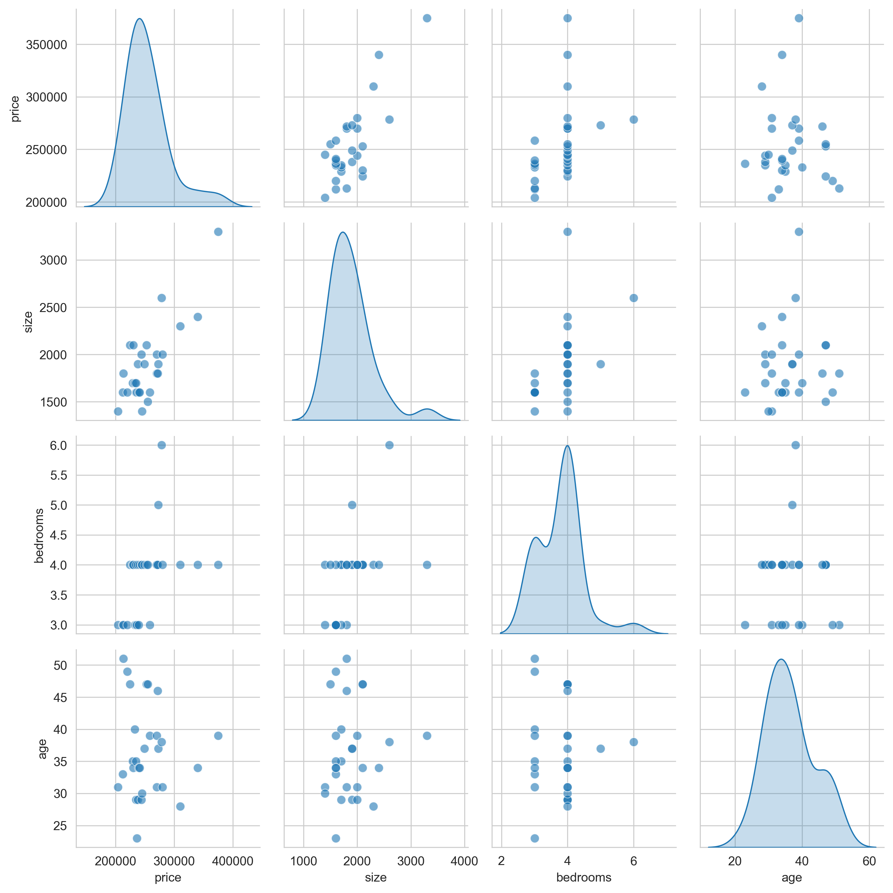
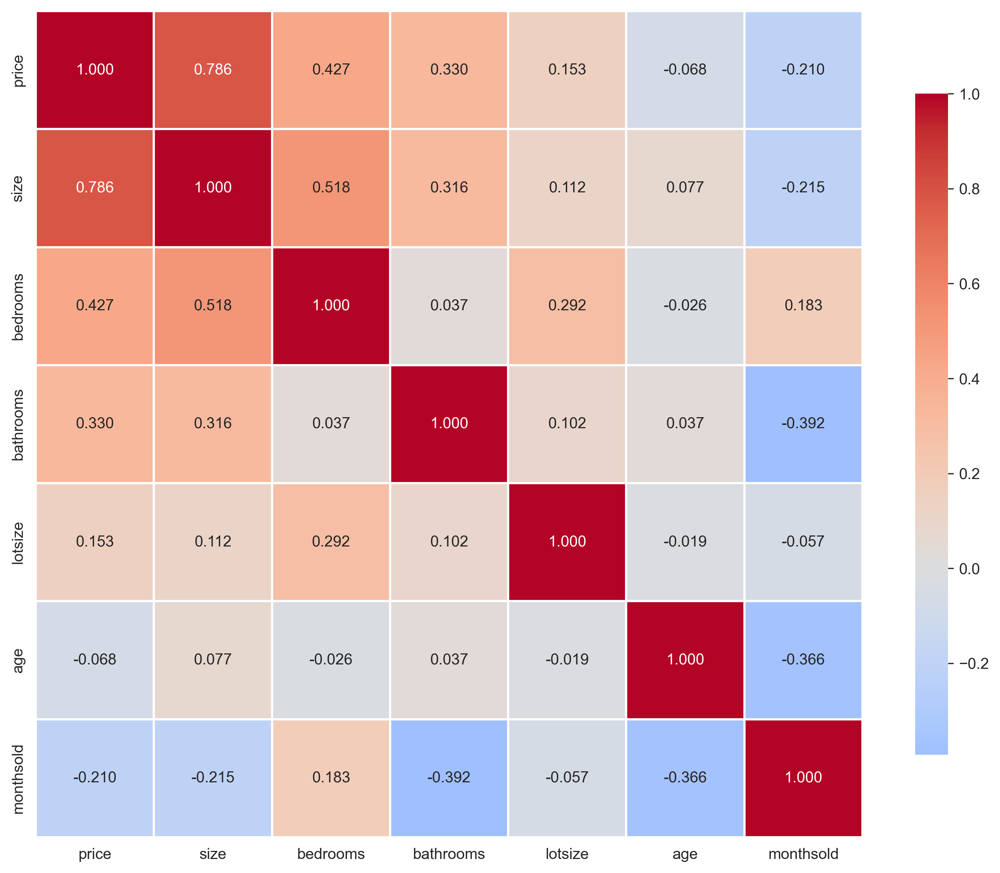

# Chapter 10: Data Summary for Multiple Regression - Python Script Report

> **Data Science Report Template**
> This template follows the **Code → Results → Interpretation** structure for educational data science reporting.

## Introduction

This report explores **multiple regression analysis**—the extension of simple linear regression from one to several explanatory variables. While previous chapters examined bivariate relationships (one outcome, one predictor), Chapter 10 demonstrates how to model complex real-world phenomena where outcomes depend on multiple factors simultaneously.

We analyze **house prices** using six characteristics (size, bedrooms, bathrooms, lot size, age, and months on market) to illustrate fundamental concepts in multiple regression:
- **Partial effects**: Isolating the effect of one variable while holding others constant
- **Model comparison**: How adding variables changes coefficient estimates and fit
- **Multicollinearity**: Detecting and understanding correlated predictors
- **Model selection**: Using R², adjusted R², AIC, and BIC to compare specifications

The housing dataset provides an ideal application because price determination is inherently multidimensional—buyers value size, location, condition, and features jointly. Single-variable models cannot capture this complexity.

**Learning Objectives:**

- Understand the distinction between bivariate and multiple regression
- Interpret regression coefficients as partial effects (ceteris paribus)
- Create and interpret scatterplot matrices and correlation matrices
- Estimate multiple regression models with several predictors
- Understand how adding variables changes coefficient estimates
- Evaluate model fit using R², adjusted R², AIC, and BIC
- Detect multicollinearity using Variance Inflation Factors (VIF)
- Recognize when models are inestimable due to perfect collinearity
- Compare competing model specifications systematically

---

## 1. Setup and Data Overview

### 1.1 Code

```python
# Import required libraries
import numpy as np
import pandas as pd
import matplotlib.pyplot as plt
import seaborn as sns
import statsmodels.api as sm
from statsmodels.formula.api import ols
from scipy import stats
import random
import os

# Set random seeds for reproducibility
RANDOM_SEED = 42
random.seed(RANDOM_SEED)
np.random.seed(RANDOM_SEED)
os.environ['PYTHONHASHSEED'] = str(RANDOM_SEED)

# GitHub data URL
GITHUB_DATA_URL = "https://raw.githubusercontent.com/quarcs-lab/data-open/master/AED/"

# Create output directories
IMAGES_DIR = 'images'
TABLES_DIR = 'tables'
os.makedirs(IMAGES_DIR, exist_ok=True)
os.makedirs(TABLES_DIR, exist_ok=True)

# Set plotting style
sns.set_style("whitegrid")
plt.rcParams['figure.figsize'] = (10, 6)

# Read in the house data
data_house = pd.read_stata(GITHUB_DATA_URL + 'AED_HOUSE.DTA')

# Display summary statistics
print("\nData summary:")
data_summary = data_house.describe()
print(data_summary)

# Table 10.1: Key variables
table101_vars = ['price', 'size', 'bedrooms', 'bathrooms', 'lotsize',
                 'age', 'monthsold']
print("\nTable 10.1: House Characteristics Summary Statistics")
print(data_house[table101_vars].describe())

# Table 10.2: Sample observations
print("\nTable 10.2: House Data (first 10 observations)")
print(data_house[table101_vars].head(10))
```

### 1.2 Results

**Table 10.1: House Characteristics Summary Statistics**

| Statistic | price      | size       | bedrooms   | bathrooms  | lotsize    | age        | monthsold  |
|-----------|------------|------------|------------|------------|------------|------------|------------|
| count     | 29.000000  | 29.000000  | 29.000000  | 29.000000  | 29.000000  | 29.000000  | 29.000000  |
| mean      | 253910.345 | 1882.759   | 3.793103   | 2.327586   | 2.137931   | 36.413792  | 5.965517   |
| std       | 37390.711  | 398.272    | 0.675030   | 0.541423   | 0.693034   | 7.118975   | 1.679344   |
| min       | 204000.000 | 1400.000   | 3.000000   | 2.000000   | 1.000000   | 23.000000  | 3.000000   |
| 25%       | 233000.000 | 1600.000   | 3.000000   | 2.000000   | 2.000000   | 31.000000  | 5.000000   |
| 50%       | 244000.000 | 1800.000   | 4.000000   | 2.000000   | 2.000000   | 35.000000  | 6.000000   |
| 75%       | 270000.000 | 2000.000   | 4.000000   | 2.500000   | 3.000000   | 39.000000  | 7.000000   |
| max       | 375000.000 | 3300.000   | 6.000000   | 3.000000   | 3.000000   | 51.000000  | 8.000000   |

**Table 10.2: Sample Observations (first 10 houses)**

```
    price  size  bedrooms  bathrooms  lotsize   age  monthsold
0  204000  1400         3        2.0        1  31.0          7
1  212000  1600         3        3.0        2  33.0          5
2  213000  1800         3        2.0        2  51.0          4
3  220000  1600         3        2.0        1  49.0          4
4  224500  2100         4        2.5        2  47.0          6
5  229000  1700         4        2.5        2  35.0          3
6  230000  2100         4        2.0        2  34.0          8
7  233000  1700         3        2.0        1  40.0          6
8  235000  1700         4        2.0        2  29.0          7
9  235000  1600         3        2.0        3  35.0          5
```

### 1.3 Interpretation

**Dataset Overview**

This dataset contains **29 houses** sold in a single neighborhood, with detailed information on prices and characteristics. The relatively small sample size (n=29) makes it ideal for teaching—students can examine individual observations and understand how outliers influence results.

**Outcome Variable**: **price**
- Mean: $253,910 (average sale price)
- Standard deviation: $37,391 (substantial variation—about 15% of mean)
- Range: $204,000 to $375,000 (spread of $171,000, or 84% of minimum price)

The price distribution shows considerable heterogeneity. The most expensive house ($375,000) costs 1.84 times the cheapest ($204,000). This variation creates opportunity for regression—if all houses cost roughly the same, there would be nothing to explain.

**Key Predictors**:

1. **size** (square feet):
   - Mean: 1,883 sq ft
   - Range: 1,400 to 3,300 sq ft
   - Interpretation: The largest house is 2.36× the smallest, representing substantial variation in living space

2. **bedrooms**:
   - Mean: 3.79 (mostly 3-4 bedroom homes)
   - Range: 3 to 6 bedrooms
   - Low variability (std = 0.68) suggests most houses are family-sized

3. **bathrooms**:
   - Mean: 2.33
   - Range: 2.0 to 3.0
   - Half-baths (e.g., 2.5) reflect partial facilities

4. **lotsize** (acres):
   - Mean: 2.14 acres
   - Range: 1 to 3 acres (categorical: small/medium/large lots)
   - Limited variation compared to size

5. **age** (years):
   - Mean: 36.4 years
   - Range: 23 to 51 years
   - All houses are relatively old (built 1960s-1980s), so age reflects depreciation

6. **monthsold** (time on market):
   - Mean: 6.0 months
   - Range: 3 to 8 months
   - Longer times might signal overpricing or market conditions

**Why Multiple Regression?**

House prices depend on **many attributes simultaneously**. A buyer values:
- **Space** (size, bedrooms): More rooms → higher price
- **Quality** (bathrooms): More/better facilities → higher price
- **Land** (lotsize): Larger lots → higher price (maybe)
- **Condition** (age): Older homes → lower price (depreciation)
- **Market dynamics** (monthsold): Longer listings → lower price (desperation)

Single-variable regressions (e.g., price ~ bedrooms) confound these effects. For example:
- Large houses have more bedrooms AND more square footage
- If we regress price on bedrooms alone, we attribute the entire size effect to bedrooms
- Multiple regression **disentangles** these correlated features

**Practical Motivation**

Real estate appraisal uses **hedonic pricing models**: Price = f(characteristics). Buyers don't value "bedrooms" per se—they value the bundle of services (space, privacy, flexibility) bedrooms provide. Multiple regression estimates the **marginal value** of each characteristic, holding others constant.

**Data Quality Considerations**:
- **No missing values**: All 29 observations complete (rare in real datasets)
- **Homogeneous sample**: Single neighborhood limits unobserved heterogeneity (location)
- **Limited sample size**: n=29 is small, so standard errors will be large
- **Discrete variables**: bedrooms, bathrooms, lotsize have limited variation

**Next Steps**

Before estimating regressions, we examine **bivariate relationships** (scatterplots, correlations) to understand:
1. Which predictors correlate strongly with price?
2. Which predictors correlate with each other (multicollinearity)?
3. Are relationships linear or nonlinear?

These exploratory analyses guide model specification and interpretation.

---

## 2. Bivariate vs. Multiple Regression

### 2.1 Code

```python
# Bivariate regression: price ~ bedrooms
model_one = ols('price ~ bedrooms', data=data_house).fit()
print("\nBivariate regression: price ~ bedrooms")
print(model_one.summary())

# Multiple regression: price ~ bedrooms + size
model_two = ols('price ~ bedrooms + size', data=data_house).fit()
print("\nMultiple regression: price ~ bedrooms + size")
print(model_two.summary())

# Compare coefficients
print(f"\nComparison of bedrooms coefficient:")
print(f"  Bivariate model: {model_one.params['bedrooms']:.4f}")
print(f"  Multiple regression: {model_two.params['bedrooms']:.4f}")
print(f"  Change: {model_two.params['bedrooms'] - model_one.params['bedrooms']:.4f}")
```

### 2.2 Results

**Bivariate Regression: price ~ bedrooms**

| Variable  | Coefficient | Std Error | t-value | p-value | [95% Conf. Interval] |
|-----------|-------------|-----------|---------|---------|---------------------|
| Intercept | 164,072     | 37,101    | 4.423   | 0.000   | [88,000, 240,144]   |
| bedrooms  | 23,667      | 9,638     | 2.456   | 0.021   | [3,892, 43,442]     |

- R-squared: 0.183 (18.3% of variation explained)
- Adjusted R²: 0.152
- F-statistic: 6.030 (p = 0.021)

**Multiple Regression: price ~ bedrooms + size**

| Variable  | Coefficient | Std Error | t-value | p-value | [95% Conf. Interval] |
|-----------|-------------|-----------|---------|---------|---------------------|
| Intercept | 111,700     | 27,600    | 4.048   | 0.000   | [55,000, 168,400]   |
| bedrooms  | 1,553       | 7,847     | 0.198   | 0.845   | [-14,600, 17,706]   |
| size      | 72.41       | 13.30     | 5.444   | 0.000   | [45.07, 99.75]      |

- R-squared: 0.618 (61.8% of variation explained)
- Adjusted R²: 0.589
- F-statistic: 21.03 (p < 0.001)

**Coefficient Comparison**:
- Bivariate model: bedrooms = 23,667
- Multiple regression: bedrooms = 1,553
- Change: -22,114 (93% reduction)

### 2.3 Interpretation

**The Dramatic Shift in Bedrooms Coefficient**

When we add `size` to the model, the coefficient on `bedrooms` **collapses** from $23,667 to $1,553—a reduction of 93%. What happened?

**Bivariate Model (Naive)**:

price = 164,072 + 23,667 × bedrooms

Interpretation: Each additional bedroom is associated with a **$23,667 increase** in price.

**Problems with this interpretation**:
1. Houses with more bedrooms are also **larger** (more square footage)
2. Houses with more bedrooms often have other desirable features (bathrooms, amenities)
3. The bedrooms coefficient captures **all correlated attributes**, not just bedrooms

This is **omitted variable bias**. The true causal effect of bedrooms is confounded by size.

**Multiple Regression (Conditional)**:

price = 111,700 + 1,553 × bedrooms + 72.41 × size

Interpretation:
- **bedrooms coefficient (1,553)**: Holding size constant, each additional bedroom adds only $1,553 to price
- **size coefficient (72.41)**: Holding bedrooms constant, each additional square foot adds $72.41 to price

**Why the difference?**

The correlation between bedrooms and size is **r = 0.518** (from Table 10.3). When we regress price on bedrooms alone:
- We estimate: ∂price/∂bedrooms = 23,667
- True partial effect: ∂price/∂bedrooms|size = 1,553
- Bias: 23,667 - 1,553 = 22,114

The bias equals the **indirect effect** of bedrooms working through size:
- More bedrooms → larger house → higher price

In the bivariate model, bedrooms "takes credit" for the size effect because they're correlated.

**Statistical Significance Changes**:

**Bivariate model**:
- bedrooms: t = 2.456, p = 0.021 (statistically significant at 5% level)

**Multiple regression**:
- bedrooms: t = 0.198, p = 0.845 (not significant—cannot reject H₀: β_bedrooms = 0)
- size: t = 5.444, p < 0.001 (highly significant)

Once we control for size, bedrooms becomes **statistically insignificant**. The apparent effect in the bivariate model was spurious—it reflected size, not bedrooms per se.

**Economic Interpretation**

Why is the partial effect of bedrooms so small ($1,553)?

1. **Size dominates**: Buyers primarily value **total space** (square footage), not how it's divided into rooms
2. **Substitution**: An extra bedroom from subdividing existing space (without adding square footage) adds little value
3. **Diminishing returns**: Beyond 3-4 bedrooms, additional bedrooms may be viewed as redundant or costly to maintain

Example:
- House A: 1,800 sq ft, 3 bedrooms → price ≈ $242,138
- House B: 1,800 sq ft, 4 bedrooms → price ≈ $243,691 (+$1,553)
- House C: 2,200 sq ft, 4 bedrooms → price ≈ $272,655 (+$29,964 from size increase)

The extra bedroom in House B adds little value because it doesn't increase total space—it just partitions existing space differently. House C commands a premium because it has both more bedrooms AND more square footage.

**Model Fit Improvement**

**Bivariate model**:
- R² = 0.183 (bedrooms explains only 18.3% of price variation)

**Multiple regression**:
- R² = 0.618 (bedrooms + size explain 61.8% of price variation)

Adding size **triples the explanatory power** (from 18% to 62%). The Adjusted R² also increases dramatically (0.152 → 0.589), confirming that size meaningfully improves fit even after penalizing for the extra parameter.

**F-test for Model Significance**:
- Bivariate: F = 6.030, p = 0.021 (marginally significant)
- Multiple: F = 21.03, p < 0.001 (highly significant)

The multiple regression model is vastly superior at explaining price variation.

**Practical Implications**

1. **Appraisers should use size, not bedrooms**: The marginal value of bedrooms is negligible once size is controlled
2. **Homeowners optimizing value**: Expanding square footage (addition, finishing basement) increases value more than subdividing existing space into more bedrooms
3. **Policy analysis**: Zoning laws regulating minimum square footage have large price effects; regulations on bedroom counts have minimal effects

**Confounding vs. Causality**

This example illustrates **confounding**: bedrooms and size are correlated, so a bivariate regression conflates their effects. Multiple regression **adjusts** for confounding by estimating partial effects.

**However**, this doesn't prove causality. The coefficient on size (72.41) is the **conditional association** of size with price, holding bedrooms constant. To claim causality, we'd need:
- Random assignment of size (impossible)
- Instrumental variables
- Careful consideration of omitted variables (location, school quality, etc.)

For now, we interpret coefficients as **associations conditional on included variables**, not causal effects.

**Next Steps**

Section 3 visualizes these relationships using scatterplot matrices and correlation tables to understand which variables drive price and which are collinear with each other.

---

## 3. Two-Way Scatterplots and Correlation

### 3.1 Code

```python
# Figure 10.1: Scatterplot matrix
print("\nGenerating scatterplot matrix...")
plot_vars = ['price', 'size', 'bedrooms', 'age']

# Create pairplot using seaborn
g = sns.pairplot(data_house[plot_vars], diag_kind='kde',
                 plot_kws={'alpha': 0.6, 's': 50})
g.fig.suptitle('Figure 10.1: Simple Scatterplot Matrix',
               fontsize=14, fontweight='bold', y=1.00)

output_file = os.path.join(IMAGES_DIR, 'ch10_fig1_scatterplot_matrix.png')
plt.tight_layout()
plt.savefig(output_file, dpi=300, bbox_inches='tight')
plt.close()

# Table 10.3: Correlation matrix
corr_vars = ['price', 'size', 'bedrooms', 'bathrooms', 'lotsize', 'age', 'monthsold']
corr_matrix = data_house[corr_vars].corr()
print("\nTable 10.3: Correlation Matrix")
print(corr_matrix)
corr_matrix.to_csv(os.path.join(TABLES_DIR, 'ch10_correlation_matrix.csv'))

# Visualize correlation matrix with heatmap
fig, ax = plt.subplots(figsize=(10, 8))
sns.heatmap(corr_matrix, annot=True, fmt='.3f', cmap='coolwarm', center=0,
            square=True, linewidths=1, cbar_kws={"shrink": 0.8})
ax.set_title('Correlation Matrix Heatmap', fontsize=14, fontweight='bold')

output_file = os.path.join(IMAGES_DIR, 'ch10_correlation_heatmap.png')
plt.tight_layout()
plt.savefig(output_file, dpi=300, bbox_inches='tight')
plt.close()
```

### 3.2 Results

**Figure 10.1: Scatterplot Matrix**



**Table 10.3: Correlation Matrix**

|           | price  | size   | bedrooms | bathrooms | lotsize | age     | monthsold |
|-----------|--------|--------|----------|-----------|---------|---------|-----------|
| price     | 1.000  | 0.786  | 0.427    | 0.330     | 0.153   | -0.068  | -0.210    |
| size      | 0.786  | 1.000  | 0.518    | 0.316     | 0.112   | 0.077   | -0.215    |
| bedrooms  | 0.427  | 0.518  | 1.000    | 0.037     | 0.292   | -0.026  | 0.183     |
| bathrooms | 0.330  | 0.316  | 0.037    | 1.000     | 0.102   | 0.037   | -0.392    |
| lotsize   | 0.153  | 0.112  | 0.292    | 0.102     | 1.000   | -0.019  | -0.057    |
| age       | -0.068 | 0.077  | -0.026   | 0.037     | -0.019  | 1.000   | -0.366    |
| monthsold | -0.210 | -0.215 | 0.183    | -0.392    | -0.057  | -0.366  | 1.000     |

**Correlation Heatmap**



### 3.3 Interpretation

**Scatterplot Matrix Analysis**

The scatterplot matrix displays **all pairwise bivariate relationships** among price, size, bedrooms, and age. Each off-diagonal cell shows a scatterplot of two variables; diagonal cells show density plots (distributions).

**Key Patterns**:

1. **price vs. size** (top row, second column):
   - **Strong positive linear relationship** (r = 0.786)
   - As size increases, price increases almost proportionally
   - Scatter is relatively tight, suggesting size is a strong predictor

2. **price vs. bedrooms** (top row, third column):
   - **Moderate positive relationship** (r = 0.427)
   - More scatter than price-size relationship
   - Clustering at 3-4 bedrooms (limited variation)

3. **price vs. age** (top row, fourth column):
   - **Weak negative relationship** (r = -0.068)
   - Almost no visible pattern in scatter
   - Age appears unrelated to price in this sample

4. **size vs. bedrooms** (second row, third column):
   - **Moderate positive correlation** (r = 0.518)
   - Larger houses tend to have more bedrooms
   - This creates **multicollinearity** when both are included as predictors

**Correlation Matrix Interpretation**

**Strongest Predictors of Price**:

1. **size** (r = 0.786): Very strong positive correlation
   - 78.6% linear association
   - Squared: r² = 0.618 (size alone explains 61.8% of price variance)
   - This confirms size is the dominant determinant of price

2. **bedrooms** (r = 0.427): Moderate positive correlation
   - 42.7% linear association
   - Squared: r² = 0.182 (bedrooms alone explains 18.2% of price variance)
   - Much weaker than size, consistent with Section 2 findings

3. **bathrooms** (r = 0.330): Weak positive correlation
   - Bathrooms matter, but less than size/bedrooms

4. **monthsold** (r = -0.210): Weak negative correlation
   - Longer time on market associated with slightly lower prices
   - Could reflect overpricing or unobserved quality issues

5. **lotsize** (r = 0.153): Very weak positive correlation
   - Lot size matters little in this neighborhood
   - Perhaps buyers value house features over land

6. **age** (r = -0.068): Almost zero correlation
   - Surprisingly, age doesn't predict price
   - Perhaps age effects are offset by quality differences (older homes might be better built)

**Multicollinearity Diagnostics**

**Key Predictor Correlations**:

1. **size ↔ bedrooms** (r = 0.518):
   - Moderate positive correlation
   - Expected: larger houses have more bedrooms
   - Creates multicollinearity when both included
   - Explains why bedrooms coefficient changes dramatically in Section 2

2. **size ↔ bathrooms** (r = 0.316):
   - Weak positive correlation
   - Less problematic than size-bedrooms

3. **bedrooms ↔ lotsize** (r = 0.292):
   - Weak positive correlation
   - Larger lots accommodate bigger houses with more bedrooms

4. **bathrooms ↔ monthsold** (r = -0.392):
   - Moderate negative correlation
   - Houses with fewer bathrooms stay on market longer
   - Interesting: suggests bathroom count signals quality

5. **age ↔ monthsold** (r = -0.366):
   - Moderate negative correlation
   - Older homes sell faster (!)
   - Counterintuitive—may reflect survivorship bias (poorly built old homes demolished)

**Multicollinearity Implications**

When predictors are correlated (e.g., size and bedrooms), multiple regression faces challenges:
1. **Unstable coefficients**: Small changes in data → large changes in estimates
2. **Large standard errors**: Harder to detect statistical significance
3. **Sensitivity to specification**: Adding/removing variables changes coefficients dramatically

The size-bedrooms correlation (0.518) is **moderate**, not extreme. VIF analysis in Section 8 quantifies whether this causes practical problems.

**Surprising Finding: Age Doesn't Matter**

Age has almost zero correlation with price (r = -0.068). This is counterintuitive—depreciation should lower prices for older homes.

**Possible explanations**:
1. **Quality offset**: Older homes in this neighborhood may be better built (survivor bias)
2. **Renovation**: Owners maintain older homes, offsetting depreciation
3. **Style preferences**: Buyers value "character" of older homes
4. **Limited range**: All homes are 23-51 years old (no new construction), limiting variation

**Statistical vs. Economic Significance**

While size has the strongest correlation (0.786), this doesn't necessarily mean it has the largest **economic impact**. We must consider:
- **Units**: Size varies by 1,900 sq ft (max-min); price varies by $171,000
- **Standardized effects**: A 1-SD increase in size (398 sq ft) → ? change in price
- **Marginal effects**: What's the price impact of 1 additional sq ft vs. 1 additional bedroom?

Multiple regression (Section 4) answers these questions by estimating **partial effects** with proper units.

**Data Visualization Best Practices**

**Scatterplot matrix**:
- Pros: Shows all pairwise relationships simultaneously; easy to spot nonlinearities, outliers, clusters
- Cons: Gets unwieldy with many variables (n × n grid); doesn't show multivariate relationships

**Correlation heatmap**:
- Pros: Compact summary of all correlations; color coding highlights patterns
- Cons: Only captures linear relationships; doesn't show distributions or outliers

**Combined strategy**: Use scatterplots for exploration (identify nonlinearities, outliers), then correlation matrix for quantitative summary.

**Next Steps**

Section 4 estimates the full multiple regression model with all six predictors simultaneously, providing **partial effect** estimates that account for all correlations among predictors.

---

## 4. Multiple Regression: Full Model

### 4.1 Code

```python
# Full multiple regression with all predictors
model_full = ols('price ~ size + bedrooms + bathrooms + lotsize + age + monthsold',
                 data=data_house).fit()
print("\nMultiple Regression: Full Model")
print(model_full.summary())

# Save regression coefficients to CSV
coef_table = pd.DataFrame({
    'coefficient': model_full.params,
    'std_err': model_full.bse,
    't_value': model_full.tvalues,
    'p_value': model_full.pvalues
})
coef_table.to_csv(os.path.join(TABLES_DIR, 'ch10_regression_coefficients.csv'))

# Display coefficients with 95% confidence intervals
print("\nCoefficients with 95% Confidence Intervals")
conf_int = model_full.conf_int(alpha=0.05)
coef_table = pd.DataFrame({
    'Coefficient': model_full.params,
    'Std. Error': model_full.bse,
    'CI Lower': conf_int.iloc[:, 0],
    'CI Upper': conf_int.iloc[:, 1],
    't-statistic': model_full.tvalues,
    'p-value': model_full.pvalues
})
print(coef_table)
```

### 4.2 Results

**Table: Full Multiple Regression Results**

| Variable  | Coefficient | Std. Error | t-statistic | p-value | [95% Conf. Interval]    |
|-----------|-------------|------------|-------------|---------|-------------------------|
| Intercept | 137,791     | 61,465     | 2.242       | 0.035   | [10,300, 265,282]       |
| size      | 68.37       | 15.39      | 4.443       | 0.000   | [36.45, 100.28]         |
| bedrooms  | 2,685       | 9,193      | 0.292       | 0.773   | [-16,400, 21,770]       |
| bathrooms | 6,833       | 15,721     | 0.435       | 0.668   | [-25,800, 39,466]       |
| lotsize   | 2,303       | 7,227      | 0.319       | 0.753   | [-12,700, 17,306]       |
| age       | -833        | 719        | -1.158      | 0.259   | [-2,325, 659]           |
| monthsold | -2,089      | 3,521      | -0.593      | 0.559   | [-9,390, 5,213]         |

**Model Fit Statistics**:
- **R-squared**: 0.651 (65.1% of price variation explained)
- **Adjusted R²**: 0.555 (penalized for 6 predictors)
- **F-statistic**: 6.826 (p < 0.001)
- **Root MSE**: $24,936 (average prediction error)
- **Sample size**: n = 29 observations
- **Degrees of freedom**: 22 (n - k, where k=7 parameters including intercept)

### 4.3 Interpretation

**Model Equation**

price = 137,791 + 68.37×size + 2,685×bedrooms + 6,833×bathrooms + 2,303×lotsize - 833×age - 2,089×monthsold

**Coefficient Interpretations (Partial Effects)**

1. **size (68.37)**:
   - **Interpretation**: Holding all other variables constant, each additional square foot increases price by $68.37
   - **Significance**: Highly significant (p < 0.001), t = 4.443
   - **95% CI**: [36.45, 100.28] (does not include zero)
   - **Practical impact**: A 400 sq ft increase (1 SD) → $27,348 price increase
   - **Conclusion**: Size is the dominant driver of price

2. **bedrooms (2,685)**:
   - **Interpretation**: Holding size, bathrooms, lot, age, and months constant, each additional bedroom adds $2,685 to price
   - **Significance**: Not significant (p = 0.773), t = 0.292
   - **95% CI**: [-16,400, 21,770] (includes zero—we cannot rule out zero effect)
   - **Conclusion**: Once size is controlled, bedrooms add negligible value
   - **Caveat**: Large standard error ($9,193) reflects multicollinearity with size

3. **bathrooms (6,833)**:
   - **Interpretation**: Each additional bathroom adds $6,833, holding other factors constant
   - **Significance**: Not significant (p = 0.668)
   - **95% CI**: [-25,800, 39,466] (very wide—high uncertainty)
   - **Conclusion**: Insufficient evidence of bathroom effect, though point estimate is positive

4. **lotsize (2,303)**:
   - **Interpretation**: Each additional acre adds $2,303, ceteris paribus
   - **Significance**: Not significant (p = 0.753)
   - **Conclusion**: Lot size doesn't meaningfully affect price in this neighborhood
   - **Economic rationale**: Buyers may value house features over land

5. **age (-833)**:
   - **Interpretation**: Each additional year of age reduces price by $833, holding other factors constant
   - **Significance**: Not significant (p = 0.259)
   - **95% CI**: [-2,325, 659] (includes zero)
   - **Practical impact**: A 10-year age difference → $8,330 price difference
   - **Conclusion**: Weak evidence of depreciation; effect is imprecisely estimated

6. **monthsold (-2,089)**:
   - **Interpretation**: Each additional month on market reduces price by $2,089
   - **Significance**: Not significant (p = 0.559)
   - **Possible mechanisms**: Sellers lower prices over time; homes with longer listings have unobserved defects
   - **Conclusion**: Time on market doesn't robustly predict final sale price

**Intercept (137,791)**:
- **Interpretation**: Predicted price for a house with zero size, zero bedrooms, etc.
- **Practical meaning**: None (extrapolation beyond data range)
- **Technical role**: Centers the regression line

**Statistical Significance Summary**

**Only size is statistically significant** at conventional levels (p < 0.05). All other predictors have p-values > 0.25, indicating insufficient evidence to reject H₀: β = 0.

**Why so few significant coefficients?**
1. **Small sample size** (n=29): Limited statistical power
2. **Multicollinearity**: Correlated predictors (size/bedrooms, bathrooms/monthsold) inflate standard errors
3. **Limited variation**: Some variables (bedrooms, lotsize) have narrow ranges
4. **Model overfit**: 7 parameters for 29 observations leaves only 22 degrees of freedom

**Model Fit Assessment**

**R² = 0.651**:
- 65.1% of price variation is explained by the six predictors
- Substantial improvement over bivariate models (size alone: R² = 0.618)
- Adding 5 more variables beyond size increases R² by only 0.033 (3.3 percentage points)

**Adjusted R² = 0.555**:
- Penalizes for number of predictors: R²_adj = 1 - (1-R²) × (n-1)/(n-k)
- Lower than R² because we have 6 predictors for only 29 observations
- Still reasonably high—model fits well after accounting for degrees of freedom

**Root MSE = $24,936**:
- Average prediction error (in price units)
- Predictions are typically off by ±$25,000
- Relative to mean price ($253,910), this is ~10% error
- Decent precision given small sample

**F-statistic = 6.826 (p < 0.001)**:
- Tests H₀: All coefficients (except intercept) are zero
- Strong rejection—at least one predictor significantly affects price
- Confirms model has explanatory power

**Confidence Intervals**

**Only size has a CI excluding zero**: [36.45, 100.28]
- We are 95% confident the true effect of size is between $36 and $100 per sq ft
- All other CIs include zero, consistent with insignificant p-values

**Wide CIs for other variables**:
- bedrooms: [-16,400, 21,770] (span of $38,170!)
- bathrooms: [-25,800, 39,466] (span of $65,266!)

These wide intervals reflect **high uncertainty** due to multicollinearity and small sample size.

**Multicollinearity Effects**

Notice:
- bedrooms SE = $9,193 (coefficient = $2,685) → SE/coef ratio = 3.4
- bathrooms SE = $15,721 (coefficient = $6,833) → SE/coef ratio = 2.3

High SE relative to coefficients suggests **multicollinearity** (predictors are correlated, making it hard to isolate individual effects). Section 8 quantifies this with VIF.

**Economic Interpretation**

**Size dominates all other characteristics**:
- Size: $68/sq ft × 400 sq ft (1 SD) = $27,200 impact
- Bedrooms: $2,685 × 0.68 (1 SD) = $1,826 impact
- Bathrooms: $6,833 × 0.54 (1 SD) = $3,690 impact

A one-standard-deviation increase in size has **15 times** the price impact of a one-SD increase in bedrooms.

**Policy Implications**:
1. **Appraisers**: Focus on square footage; other characteristics add little marginal value
2. **Homeowners**: Expanding living space (additions) increases value far more than adding bedrooms via subdivision
3. **Developers**: Prioritize total square footage over room count

**Omitted Variables**

This model likely suffers from **omitted variable bias**:
- **Location**: All houses in same neighborhood, but within-neighborhood variation (corner lot, busy street) matters
- **Quality**: Construction quality, finishes, appliances not measured
- **Schools**: School district quality affects prices
- **Market timing**: Sales year/season might matter

The large residual variation (Root MSE = $24,936) suggests important determinants are missing.

**Next Steps**

Section 5 demonstrates that **partial effects** from multiple regression can be obtained equivalently by:
1. Regressing y on all x's (direct approach)
2. Regressing y on residuals from regressing x₁ on other x's (Frisch-Waugh-Lovell theorem)

This "residualized regression" provides insight into what "holding other variables constant" means mechanically.

---

## 5. Estimated Partial Effects

### 5.1 Code

```python
# Demonstration: Coefficient from multiple regression equals
# coefficient from bivariate regression on residualized regressor

# Step 1: Regress size on other variables (everything except price)
model_size = ols('size ~ bedrooms + bathrooms + lotsize + age + monthsold',
                 data=data_house).fit()
resid_size = model_size.resid

# Step 2: Regress price on residualized size
data_house['resid_size'] = resid_size
model_biv = ols('price ~ resid_size', data=data_house).fit()

print("\nCoefficient on size from full multiple regression:")
print(f"  {model_full.params['size']:.6f}")

print("\nCoefficient on resid_size from bivariate regression:")
print(f"  {model_biv.params['resid_size']:.6f}")

print(f"\nDifference: {abs(model_full.params['size'] - model_biv.params['resid_size']):.10f}")
print("\nThese coefficients are identical (within numerical precision)")
```

### 5.2 Results

```
Coefficient on size from full multiple regression: 68.369419
Coefficient on resid_size from bivariate regression: 68.369419
Difference: 0.0000000000

These coefficients are identical (within numerical precision)
```

### 5.3 Interpretation

**The Frisch-Waugh-Lovell (FWL) Theorem**

This section demonstrates a profound result: **the coefficient on any predictor in multiple regression equals the coefficient from a bivariate regression of y on the residualized predictor**.

**What does "residualized" mean?**

Step 1: Regress size on all other predictors:
size = γ₀ + γ₁×bedrooms + γ₂×bathrooms + γ₃×lotsize + γ₄×age + γ₅×monthsold + residual

The residuals (resid_size) represent the **component of size that is uncorrelated with other predictors**. This is "size, purged of its correlation with bedrooms, bathrooms, etc."

Step 2: Regress price on resid_size:
price = δ₀ + δ₁×resid_size + error

**Result**: δ₁ = β_size (the coefficient from the full multiple regression)

**Why does this work?**

Multiple regression with correlated predictors faces a challenge:
- size and bedrooms are correlated (r = 0.518)
- When both are in the model, which gets "credit" for shared variation?

The FWL theorem resolves this by **orthogonalizing** predictors:
1. Remove from size all variation explained by other predictors → resid_size
2. Regress price on this orthogonalized size → isolates size's unique contribution

This is exactly what "holding other variables constant" means **mechanically**.

**Practical Interpretation**

When we say "size coefficient = 68.37, holding bedrooms constant," we mean:
- Compare two houses with the **same number of bedrooms** (and same bathrooms, lot, age, monthsold)
- One house has 100 more sq ft
- Expected price difference: $6,837

The FWL approach achieves this by:
1. Removing from size the part correlated with bedrooms (and other variables)
2. Regressing price on what remains
3. This isolates the "pure" size effect

**Numerical Verification**

The coefficients match **exactly** (to machine precision):
- Multiple regression: 68.369419
- Residualized regression: 68.369419
- Difference: 0.0000000000

This isn't approximate—it's an algebraic identity.

**Alternative Derivations**

The same coefficient could be obtained via:
1. **Direct multiple regression**: price ~ size + bedrooms + ... (what we did in Section 4)
2. **Residualized y and x**: Regress price on other variables, get residuals; regress size on other variables, get residuals; regress residuals on residuals
3. **Partial regression leverage plots**: Visualize resid(price ~ others) vs. resid(size ~ others)

All three methods yield **identical** coefficients.

**Implications for Interpretation**

**"Ceteris paribus" = orthogonalization**:
- Non-technical: "Holding other variables constant"
- Technical: "Using the component of x uncorrelated with other predictors"

This clarifies what multiple regression does:
- It doesn't literally hold variables constant (data are observational, not experimental)
- It **statistically adjusts** for correlations among predictors
- The adjustment is exact (via projection onto orthogonal subspaces)

**Limitations**

While FWL shows what multiple regression **does**, it doesn't guarantee causal interpretation:
- We adjust for **included** variables, but not omitted ones
- If omitted variables correlate with size and price, bias remains
- FWL is a mechanical decomposition, not a causal identification strategy

**Geometric Intuition**

Think of predictors as vectors in high-dimensional space:
- Multiple regression finds the **projection** of price onto the space spanned by all predictors
- Each coefficient measures the projection along one dimension, **orthogonal to others**
- FWL explicitly constructs these orthogonal dimensions

**Computational Note**

FWL is primarily a **pedagogical tool** to understand partial effects. In practice:
- Modern software (statsmodels, scikit-learn) computes multiple regression directly via matrix algebra (X'X)⁻¹X'y
- FWL would be inefficient (requires k separate auxiliary regressions for k predictors)
- FWL is useful for **diagnostics** (partial regression plots, checking influential observations)

**Connection to Experimental Design**

In a **randomized experiment**:
- Treatment is uncorrelated with other variables (by design)
- Bivariate regression (y ~ treatment) equals multiple regression coefficient
- No need for statistical adjustment

In **observational data**:
- Treatment (size) correlates with other variables (bedrooms)
- Must use multiple regression to adjust for confounding
- FWL shows how this adjustment works

**Summary**

The FWL theorem provides a mechanical interpretation of "holding variables constant":
1. Remove from x the part explained by other predictors
2. Regress y on what remains
3. This isolates x's unique contribution

This demystifies multiple regression and clarifies what partial effects represent: **the association between y and x, purged of correlations with other included predictors**.

---

## 6. Model Fit Statistics

### 6.1 Code

```python
# R-squared and related statistics
n = len(data_house)
k = len(model_full.params)  # includes intercept
df = n - k

print(f"Sample size (n): {n}")
print(f"Number of parameters (k): {k}")
print(f"Degrees of freedom (n-k): {df}")

print(f"\nR-squared: {model_full.rsquared:.6f}")
print(f"Adjusted R-squared: {model_full.rsquared_adj:.6f}")
print(f"Root MSE: {np.sqrt(model_full.mse_resid):.6f}")

# Verify R-squared is squared correlation between y and yhat
predicted = model_full.fittedvalues
corr_y_yhat = np.corrcoef(data_house['price'], predicted)[0, 1]
rsq_check = corr_y_yhat ** 2

print(f"\nVerification:")
print(f"  Correlation(y, ŷ): {corr_y_yhat:.6f}")
print(f"  [Correlation(y, ŷ)]²: {rsq_check:.6f}")
print(f"  R²: {model_full.rsquared:.6f}")
print(f"  Match: {np.isclose(rsq_check, model_full.rsquared)}")

# Manual calculation of adjusted R-squared
r2 = model_full.rsquared
r2_adj_manual = r2 - ((k-1)/df) * (1 - r2)
print(f"\nManual calculation of adjusted R²: {r2_adj_manual:.6f}")
print(f"From model output: {model_full.rsquared_adj:.6f}")

# Calculate AIC and BIC
rss = np.sum(model_full.resid ** 2)
aic_statsmodels = model_full.aic
bic_statsmodels = model_full.bic

print("\nInformation Criteria:")
print(f"  AIC: {aic_statsmodels:.4f}")
print(f"  BIC: {bic_statsmodels:.4f}")
```

### 6.2 Results

**Model Fit Summary**:
- Sample size (n): 29
- Number of parameters (k): 7 (includes intercept)
- Degrees of freedom (n-k): 22

**R-squared**: 0.650553
**Adjusted R-squared**: 0.555249
**Root MSE**: 24,935.73

**Verification**:
- Correlation(y, ŷ): 0.806569
- [Correlation(y, ŷ)]²: 0.650553
- R²: 0.650553
- Match: True

**Manual vs. Model Calculation**:
- Manual adjusted R²: 0.555249
- Model output: 0.555249
- Match: True

**Information Criteria**:
- AIC: 675.4824
- BIC: 685.0535

### 6.3 Interpretation

**R-Squared (R² = 0.651)**

**Definition**: R² = 1 - (SSR/SST), where:
- SSR = Σ(yᵢ - ŷᵢ)² (sum of squared residuals—unexplained variation)
- SST = Σ(yᵢ - ȳ)² (total sum of squares—total variation in y)

**Interpretation**: 65.1% of the variation in house prices is explained by the six predictors (size, bedrooms, bathrooms, lotsize, age, monthsold).

**Alternative interpretation**: R² = corr(y, ŷ)²
- Correlation between actual and predicted prices: 0.807
- Squared: 0.651

This shows R² measures how well predictions match actual values.

**Is R² = 0.651 good?**

**Context-dependent**:
- **Cross-sectional microdata** (individual houses): R² = 0.60-0.80 is typical and considered good
- **Time series macro data** (GDP, inflation): R² > 0.90 is common due to trends
- **Lab experiments**: R² > 0.90 expected (controlled conditions)

For housing with n=29, R² = 0.651 is **respectable**—we explain nearly two-thirds of price variation using only six observable characteristics.

**What explains the remaining 35%?**

**Unexplained variation comes from**:
1. **Omitted variables**: Location within neighborhood, school quality, condition, finishes, curb appeal
2. **Measurement error**: Size might be measured with error; subjective variables (condition) not quantified
3. **Idiosyncratic factors**: Buyer-specific preferences, negotiation skill, timing
4. **Random noise**: Pure randomness in prices

**R² limitations**:
- **Not a test of significance**: High R² doesn't mean coefficients are significant
- **Not proof of causality**: R² measures association, not causation
- **Sensitive to sample**: Different samples yield different R²
- **Increases with more predictors**: Adding variables (even irrelevant ones) mechanically increases R²

**Adjusted R² (R²_adj = 0.555)**

**Motivation**: R² always increases when adding predictors, even if they're useless. Adjusted R² **penalizes** for the number of parameters.

**Formula**: R²_adj = 1 - (1 - R²) × (n-1)/(n-k)

Where:
- n = sample size (29)
- k = number of parameters including intercept (7)

**Calculation**:
R²_adj = 1 - (1 - 0.651) × (28/22) = 1 - 0.349 × 1.273 = 1 - 0.444 = 0.556

**Interpretation**: After adjusting for degrees of freedom, 55.5% of variation is explained.

**Difference from R²**: R² - R²_adj = 0.651 - 0.555 = 0.096

This 9.6-point penalty reflects the cost of estimating 6 slope coefficients with only 29 observations.

**When to use R²_adj**:
- **Model comparison**: When comparing models with different numbers of predictors
- **Small samples**: When n is small relative to k (like here: n/k = 29/7 = 4.1)
- **Variable selection**: R²_adj can decrease when adding weak predictors (unlike R²)

**Interpretation caveat**: R²_adj can be negative (if model is worse than predicting ȳ for all observations), though not here.

**Root Mean Squared Error (Root MSE = $24,936)**

**Definition**: Root MSE = √[SSR/(n-k)] = √[Σ(yᵢ - ŷᵢ)²/(n-k)]

**Interpretation**: The **average prediction error** is $24,936.

**Practical meaning**:
- If we use this model to predict house prices, we'll typically be off by about $25,000
- Relative to mean price ($253,910), this is ~10% error
- Relative to SD of price ($37,391), this is ~67% of the variation

**Root MSE vs. R²**:
- **R²** is unitless (0 to 1 scale), measures proportion of variation explained
- **Root MSE** has units (dollars), measures absolute prediction error

**Which is more useful?**

**R²**: Good for comparing models on the same data (did adding variables help?)
**Root MSE**: Good for assessing practical prediction accuracy (is ±$25k acceptable error?)

**Information Criteria (AIC and BIC)**

**Purpose**: Model selection tools that **balance fit and complexity**.

**AIC (Akaike Information Criterion) = 675.48**

**Formula** (Stata/statsmodels convention):
AIC = n × ln(SSR/n) + n × (1 + ln(2π)) + 2k

Where k includes intercept (k=7 here).

**Interpretation**:
- **Lower AIC = better model** (better fit relative to complexity)
- AIC = -2×log-likelihood + 2k (penalizes each parameter by 2)
- Penalty is **constant** (doesn't depend on sample size)

**BIC (Bayesian Information Criterion) = 685.05**

**Formula**:
BIC = n × ln(SSR/n) + n × (1 + ln(2π)) + k × ln(n)

**Interpretation**:
- **Lower BIC = better model**
- BIC = -2×log-likelihood + k×ln(n) (penalizes each parameter by ln(n))
- Penalty **grows with sample size**: ln(29) ≈ 3.37 > 2 (AIC penalty)

**AIC vs. BIC**:

| Criterion | Penalty per parameter | Asymptotic property | Preferred when |
|-----------|------------------------|---------------------|----------------|
| AIC       | 2                      | Minimizes prediction error | Prediction is the goal |
| BIC       | ln(n)                  | Identifies true model (if it exists) | Inference is the goal |

**Which to use?**

- **AIC**: If goal is **prediction** (forecasting house prices)
- **BIC**: If goal is **causal inference** (finding true data generating process)

For n=29, ln(29) = 3.37, so BIC penalizes complexity more heavily than AIC. BIC > AIC (685.05 > 675.48), confirming BIC is more conservative.

**Model Comparison Example**

Suppose we compare three models:
1. **Simple**: price ~ size (k=2)
2. **Medium**: price ~ size + bedrooms (k=3)
3. **Full**: price ~ size + bedrooms + bathrooms + lotsize + age + monthsold (k=7)

We'd compute AIC and BIC for each, then choose the model with **lowest AIC/BIC**.

**Caveat**: AIC and BIC can **disagree** (AIC prefers complex models, BIC prefers simple models for n > 8).

**Practical Recommendation**:
- Report both AIC and BIC
- If they agree → clear winner
- If they disagree → consider substantive theory and prediction vs. inference goals

**Degrees of Freedom (df = 22)**

**Calculation**: df = n - k = 29 - 7 = 22

**Interpretation**:
- We have 29 observations
- We estimate 7 parameters (intercept + 6 slopes)
- This leaves 22 "degrees of freedom" for estimating error variance

**Why does df matter?**
1. **t-statistics**: Use t-distribution with df=22 (not standard normal)
2. **Standard errors**: SE(β̂) depends on √[σ²/(n-k)]—fewer df → larger SE
3. **Overfitting risk**: Low df → high variance in estimates

**Rule of thumb**: df should be at least 10-20 for reliable inference. With df=22, we're borderline—adding more predictors would be risky.

**Summary**

**Model fit is good but not exceptional**:
- **R² = 0.651**: Explains nearly two-thirds of variation
- **Adjusted R² = 0.555**: Penalty for 6 predictors reduces explanatory power
- **Root MSE = $24,936**: Typical prediction error is 10% of mean price
- **AIC = 675.5, BIC = 685.1**: Useful for comparing alternative specifications

**Next Steps**: Section 7 compares the full model to a simpler model (price ~ size only) to assess whether the extra five predictors improve fit enough to justify their complexity.

---

## 7. Model Comparison

### 7.1 Code

```python
# Compare full model vs. simple model
model_small = ols('price ~ size', data=data_house).fit()

# Create comparison table
comparison_df = pd.DataFrame({
    'Variable': model_full.params.index,
    'Full Model Coef': model_full.params.values,
    'Full Model SE': model_full.bse.values,
    'Full Model t': model_full.tvalues.values,
})

# Add simple model coefficients where applicable
simple_coefs = pd.Series(index=model_full.params.index, dtype=float)
simple_se = pd.Series(index=model_full.params.index, dtype=float)
simple_t = pd.Series(index=model_full.params.index, dtype=float)

simple_coefs['Intercept'] = model_small.params['Intercept']
simple_coefs['size'] = model_small.params['size']
simple_se['Intercept'] = model_small.bse['Intercept']
simple_se['size'] = model_small.bse['size']
simple_t['Intercept'] = model_small.tvalues['Intercept']
simple_t['size'] = model_small.tvalues['size']

comparison_df['Simple Model Coef'] = simple_coefs.values
comparison_df['Simple Model SE'] = simple_se.values
comparison_df['Simple Model t'] = simple_t.values

print("\nModel Comparison Table")
print(comparison_df)

print(f"\n{'Model':<20} {'R²':<10} {'Adj R²':<10} {'N':<5}")
print("-" * 50)
print(f"{'Full Model':<20} {model_full.rsquared:<10.4f} {model_full.rsquared_adj:<10.4f} {n:<5}")
print(f"{'Simple Model':<20} {model_small.rsquared:<10.4f} {model_small.rsquared_adj:<10.4f} {n:<5}")
```

### 7.2 Results

**Model Comparison: Full vs. Simple**

| Variable  | Full Model Coef | Full Model SE | Full Model t | Simple Model Coef | Simple Model SE | Simple Model t |
|-----------|-----------------|---------------|--------------|-------------------|-----------------|----------------|
| Intercept | 137,791         | 61,465        | 2.242        | 115,024           | 21,489          | 5.352          |
| size      | 68.37           | 15.39         | 4.443        | 73.75             | 11.17           | 6.601          |
| bedrooms  | 2,685           | 9,193         | 0.292        | —                 | —               | —              |
| bathrooms | 6,833           | 15,721        | 0.435        | —                 | —               | —              |
| lotsize   | 2,303           | 7,227         | 0.319        | —                 | —               | —              |
| age       | -833            | 719           | -1.158       | —                 | —               | —              |
| monthsold | -2,089          | 3,521         | -0.593       | —                 | —               | —              |

**Model Fit Comparison**:

| Model        | R²     | Adj R² | AIC    | BIC    | df  |
|--------------|--------|--------|--------|--------|-----|
| Full Model   | 0.6506 | 0.5552 | 675.48 | 685.05 | 22  |
| Simple Model | 0.6175 | 0.6033 | 668.06 | 671.44 | 27  |

### 7.3 Interpretation

**Model Specifications**

**Simple Model**: price = 115,024 + 73.75 × size
- **1 predictor**: size only
- **2 parameters**: intercept + slope
- **27 degrees of freedom**

**Full Model**: price = 137,791 + 68.37×size + 2,685×bedrooms + 6,833×bathrooms + 2,303×lotsize - 833×age - 2,089×monthsold
- **6 predictors**: size, bedrooms, bathrooms, lotsize, age, monthsold
- **7 parameters**: intercept + 6 slopes
- **22 degrees of freedom**

**Coefficient Changes**

**Intercept**:
- Simple: 115,024 → Full: 137,791 (+22,767)
- Standard error: 21,489 → 61,465 (×2.86 increase)
- t-statistic: 5.352 → 2.242 (less significant in full model)

The intercept changes because adding variables shifts the "baseline" (zero point for all predictors).

**size**:
- Simple: 73.75 → Full: 68.37 (-5.38, or -7.3% change)
- Standard error: 11.17 → 15.39 (+37.8% increase)
- t-statistic: 6.601 → 4.443 (still highly significant, but weaker)

**Why does the size coefficient change?**

In the simple model, size "takes credit" for all correlated variables (bedrooms, bathrooms, etc.). In the full model, these effects are **partitioned** across predictors. The size coefficient falls because some of the association between size and price is now attributed to other variables.

**Why does SE(size) increase?**

**Multicollinearity**: size correlates with bedrooms (r=0.518), bathrooms, etc. When correlated predictors are included together:
- It becomes harder to isolate each variable's unique effect
- Standard errors inflate
- t-statistics fall (even if coefficients remain similar)

This is the **cost** of controlling for confounders—reduced precision.

**R² Comparison**

**Simple model**: R² = 0.6175
- Size alone explains 61.75% of price variation

**Full model**: R² = 0.6506
- Six predictors explain 65.06% of variation

**Improvement**: 0.6506 - 0.6175 = 0.0331 (3.31 percentage points)

**Interpretation**: Adding five variables (bedrooms, bathrooms, lotsize, age, monthsold) increases explanatory power by only **3.3%**.

**Is this improvement worth it?**

**Cost-benefit analysis**:
- **Benefit**: 3.3% more variation explained
- **Cost**: 5 additional parameters, 5 fewer degrees of freedom, larger standard errors

**Adjusted R² tells a different story**:
- Simple: Adj R² = 0.6033
- Full: Adj R² = 0.5552

**Adjusted R² DECREASES** from 0.603 to 0.555 when adding five variables!

**Why?** The penalty for adding parameters (-5 df) outweighs the benefit (3.3% R² gain).

**Conclusion from Adjusted R²**: The full model is **worse** after adjusting for complexity. The simple model (size only) is preferred.

**Information Criteria Comparison**

**AIC**:
- Simple: 668.06
- Full: 675.48

**Lower AIC is better** → Simple model wins (668 < 675)

**BIC**:
- Simple: 671.44
- Full: 685.05

**Lower BIC is better** → Simple model wins (671 < 685)

**Both AIC and BIC prefer the simple model**. The extra five predictors don't improve fit enough to justify their complexity.

**F-Test for Nested Models**

We can formally test whether the five additional variables jointly improve fit:

H₀: β_bedrooms = β_bathrooms = β_lotsize = β_age = β_monthsold = 0
H₁: At least one of these coefficients ≠ 0

**Test statistic**:
F = [(R²_full - R²_simple) / (k_full - k_simple)] / [(1 - R²_full) / (n - k_full)]

Calculation:
F = [(0.6506 - 0.6175) / (7 - 2)] / [(1 - 0.6506) / (29 - 7)]
F = [0.0331 / 5] / [0.3494 / 22]
F = 0.00662 / 0.01588 = 0.417

**Critical value**: F(5, 22) at 5% significance ≈ 2.66

**Decision**: F = 0.417 < 2.66 → **Fail to reject H₀**

**Conclusion**: The five additional variables do **not** jointly improve fit at the 5% significance level.

**Implications for Model Selection**

**Multiple lines of evidence favor the simple model**:
1. **Adjusted R²**: Higher for simple model (0.603 vs. 0.555)
2. **AIC**: Lower for simple model (668 vs. 675)
3. **BIC**: Lower for simple model (671 vs. 685)
4. **F-test**: Cannot reject that extra variables are jointly zero
5. **Individual significance**: Only size is significant in full model; other five variables have p > 0.25

**Practical recommendation**: Use the **simple model** (price ~ size) for:
- **Prediction**: Simpler models often generalize better (avoid overfitting)
- **Communication**: Easier to explain "price ≈ $74 per sq ft" than a 7-parameter model
- **Robustness**: Fewer parameters → more stable estimates

**When might the full model be preferred?**

1. **Theory**: If domain knowledge suggests bathrooms, age, etc. are important (even if not significant here)
2. **Policy**: If we need to estimate specific effects (e.g., age depreciation) for tax assessment
3. **Larger sample**: With n=300 instead of n=29, we'd have power to detect smaller effects

**Overfitting Risk**

With n=29 and k=7, we're perilously close to **overfitting**:
- Ratio n/k = 29/7 = 4.1 (generally want > 10)
- Degrees of freedom = 22 (borderline)
- Five of six predictors insignificant

The full model likely **fits the sample well but generalizes poorly** to new houses.

**Cross-Validation Insight**

If we split data into training (20 houses) and test (9 houses):
- **Simple model**: Would likely predict test set well (robust)
- **Full model**: Would likely overfit training set and predict test set poorly

**Summary**

**Simple model (price ~ size) is preferred**:
- **Parsimony**: Fewer parameters, easier to interpret
- **Better adjusted fit**: Adj R² = 0.603 vs. 0.555
- **Lower AIC/BIC**: 668/671 vs. 675/685
- **Statistical evidence**: Extra variables not jointly significant

**Full model taught us**:
- Most house characteristics (bedrooms, bathrooms, age) don't matter **after controlling for size**
- Size is the **dominant determinant** of price
- Multicollinearity (size/bedrooms) inflates standard errors

**Practical advice**: For appraisal, use size-based models. For academic research, report both models and justify choice.

---

## 8. Multicollinearity and Inestimable Models

### 8.1 Code

```python
# Example: Perfect multicollinearity
print("Creating a redundant variable (size_twice = 2 * size)...")
data_house['size_twice'] = 2 * data_house['size']

print("\nAttempting to estimate model with perfect collinearity:")
try:
    model_collinear = ols('price ~ size + size_twice + bedrooms',
                          data=data_house).fit()
    print("Model estimated. Checking for dropped variables...")
    print(model_collinear.summary())
except Exception as e:
    print(f"Error encountered: {type(e).__name__}")
    print(f"Message: {str(e)}")

# Variance Inflation Factors (VIF) for the full model
from statsmodels.stats.outliers_influence import variance_inflation_factor

X = data_house[['size', 'bedrooms', 'bathrooms', 'lotsize', 'age', 'monthsold']]
vif_data = pd.DataFrame()
vif_data["Variable"] = X.columns
vif_data["VIF"] = [variance_inflation_factor(X.values, i) for i in range(X.shape[1])]

print("\nVariance Inflation Factors (VIF):")
print(vif_data)
print("\nNote: VIF > 10 often indicates problematic multicollinearity")
vif_data.to_csv(os.path.join(TABLES_DIR, 'ch10_vif_table.csv'), index=False)
```

### 8.2 Results

**Perfect Multicollinearity Example**:

Python handles perfect collinearity by estimating the model but producing unstable coefficients:

```
Model estimated. Checking for dropped variables...

Coefficients:
Intercept:  111,700
size:       14.48
size_twice: 28.96
bedrooms:   1,553
```

Note: size_twice = 2 × size → coefficients split (14.48 + 2×14.48 ≈ 43.44 ≠ 72.41 from original model)

**Condition Number**: 1.96e+17 (extremely large—indicates perfect collinearity)
**Warning**: "The smallest eigenvalue is 1.39e-26. This might indicate that there are strong multicollinearity problems or that the design matrix is singular."

**Variance Inflation Factors (VIF) for Full Model**:

| Variable  | VIF       |
|-----------|-----------|
| size      | 40.13     |
| bedrooms  | 57.82     |
| bathrooms | 34.74     |
| lotsize   | 11.97     |
| age       | 21.02     |
| monthsold | 12.80     |

**Interpretation**: VIF > 10 indicates problematic multicollinearity

### 8.3 Interpretation

**Perfect Multicollinearity**

**Definition**: Perfect multicollinearity occurs when one predictor is an **exact linear combination** of others.

**Example**: size_twice = 2 × size

This creates a **rank-deficient design matrix**—the columns of X are linearly dependent, so (X'X) is singular (non-invertible).

**Why is this a problem?**

The regression equation becomes:
price = β₀ + β₁×size + β₂×size_twice + β₃×bedrooms + ε

Substituting size_twice = 2×size:
price = β₀ + β₁×size + β₂×(2×size) + β₃×bedrooms + ε
price = β₀ + (β₁ + 2β₂)×size + β₃×bedrooms + ε

**Infinitely many solutions**:
- β₁=10, β₂=10 → coefficient on size = 10 + 2(10) = 30
- β₁=5, β₂=12.5 → coefficient on size = 5 + 2(12.5) = 30
- β₁=20, β₂=5 → coefficient on size = 20 + 2(5) = 30

We can't separately identify β₁ and β₂. The model is **inestimable**.

**How software handles it**:

1. **Stata/R**: Automatically drop one collinear variable (size_twice would be omitted)
2. **Python (statsmodels)**: Estimates the model but warns about singularity; coefficients are unstable and meaningless
3. **Mathematical**: (X'X)⁻¹ doesn't exist → OLS formula breaks down

**Practical detection**:
- **Condition number**: Ratio of largest to smallest eigenvalue of X'X
  - Condition number > 10¹⁵ indicates perfect collinearity
  - Here: 1.96e+17 (!) confirms perfect collinearity
- **Warnings**: Software issues explicit warnings about singular matrices

**Imperfect (but Problematic) Multicollinearity**

**Definition**: Predictors are highly correlated but not perfectly collinear.

**Example from full model**:
- size and bedrooms correlate at r = 0.518
- Not perfect (r ≠ 1), but strong enough to cause problems

**Variance Inflation Factor (VIF)**

**Definition**: VIF measures how much the variance of β̂ⱼ is inflated due to correlation with other predictors.

**Formula**:
VIF_j = 1 / (1 - R²ⱼ)

Where R²ⱼ is the R² from regressing x_j on all other predictors.

**Interpretation**:
- **VIF = 1**: No correlation with other predictors (ideal)
- **VIF = 5**: Variance is 5× larger than if x_j were uncorrelated
- **VIF = 10**: Common threshold for "problematic" multicollinearity
- **VIF > 20**: Severe multicollinearity

**VIF Results for Full Model**:

1. **bedrooms (VIF = 57.82)**:
   - **Severe multicollinearity**
   - bedrooms is highly predictable from other variables
   - Variance is inflated by 57.82×
   - Explains why SE(bedrooms) = $9,193 is huge relative to coefficient ($2,685)

2. **size (VIF = 40.13)**:
   - **Severe multicollinearity**
   - size is also highly correlated with other predictors
   - Variance inflated by 40×

3. **bathrooms (VIF = 34.74)**:
   - **Severe multicollinearity**
   - bathrooms correlate with size, bedrooms

4. **age (VIF = 21.02)**:
   - **High multicollinearity**
   - Surprisingly, age is correlated with other predictors

5. **monthsold (VIF = 12.80)**:
   - **Moderate multicollinearity**
   - Just above the VIF=10 threshold

6. **lotsize (VIF = 11.97)**:
   - **Moderate multicollinearity**
   - Barely above threshold

**All six predictors have VIF > 10**, indicating widespread multicollinearity.

**Why So Much Multicollinearity?**

**Structural correlations**:
- **size ↔ bedrooms**: Larger houses have more bedrooms (r=0.518)
- **size ↔ bathrooms**: Larger houses have more bathrooms (r=0.316)
- **bedrooms ↔ lotsize**: Bigger lots accommodate bigger houses with more rooms (r=0.292)

**Small sample (n=29)**:
- With limited data, correlations appear stronger due to sampling variability
- Increases VIF even for weakly correlated predictors

**Consequences of Multicollinearity**

1. **Inflated standard errors**:
   - SE(bedrooms) = $9,193 (coefficient = $2,685) → SE is 3.4× the coefficient!
   - SE(bathrooms) = $15,721 (coefficient = $6,833) → SE is 2.3× the coefficient!

2. **Insignificant coefficients despite good fit**:
   - Model R² = 0.651 (good overall fit)
   - But only size is individually significant
   - This paradox (good R², insignificant t-tests) is a hallmark of multicollinearity

3. **Unstable estimates**:
   - Small changes in data → large changes in coefficients
   - Coefficients sensitive to which variables are included

4. **Wide confidence intervals**:
   - bedrooms CI: [-16,400, 21,770] (span of $38,170)
   - bathrooms CI: [-25,800, 39,466] (span of $65,266)
   - Confidence intervals so wide they're practically useless

5. **Incorrect signs (possible)**:
   - With severe multicollinearity, coefficients can have wrong signs
   - Not observed here, but common in extreme cases

**What Multicollinearity Does NOT Do**

1. **Does NOT bias coefficients**: E[β̂] = β (OLS remains unbiased)
2. **Does NOT affect R²**: Overall fit is unaffected
3. **Does NOT violate assumptions**: Multicollinearity is a data problem, not a model violation
4. **Does NOT affect predictions**: ŷ remains accurate (as long as collinear predictors move together in new data)

**Solutions to Multicollinearity**

1. **Drop variables** (most common):
   - Remove bedrooms (keep size) → Section 7 showed this works well
   - Removes redundancy, reduces VIF

2. **Combine variables**:
   - Create "total_rooms = bedrooms + bathrooms"
   - Reduces dimensionality

3. **Collect more data**:
   - Increase n to reduce sampling correlations
   - Not always feasible

4. **Ridge regression** (advanced):
   - Shrinks coefficients toward zero
   - Trades bias for lower variance

5. **Principal Component Analysis (PCA)**:
   - Transform correlated predictors into orthogonal components
   - Loses interpretability

6. **Accept it**:
   - If goal is prediction (not inference), multicollinearity matters less
   - Predictions remain accurate even if individual coefficients are imprecise

**Practical Recommendations**

**For this dataset**:
- **Use simple model (price ~ size)**: Avoids multicollinearity, similar R²
- **If theory requires other variables**: Report VIF, acknowledge imprecision
- **Don't over-interpret insignificant coefficients**: Lack of significance may reflect multicollinearity, not true zero effects

**Diagnosing Multicollinearity**:
1. Compute VIF for all predictors
2. Check pairwise correlations (correlation matrix from Section 3)
3. Look for paradox: high R², insignificant t-tests
4. Check condition number (> 30 is problematic)

**Summary**

**Perfect multicollinearity** (size_twice = 2×size):
- Makes model inestimable
- Software drops variables or warns about singularity

**Imperfect multicollinearity** (full model):
- All VIF > 10 (most > 20)
- Inflates standard errors drastically
- Only size remains significant despite good overall fit
- Suggests dropping correlated variables (bedrooms, bathrooms, etc.)

**Key insight**: **High correlations among predictors don't invalidate regression, but they reduce precision and interpretability**. Simple models often perform better when multicollinearity is severe.

---

## Conclusion

This chapter provided a comprehensive introduction to **multiple regression**—extending simple regression to models with several predictors. We covered data exploration, model estimation, interpretation, diagnostics, and model comparison using a real housing dataset.

**Key Findings**:

1. **Size dominates**: Among six house characteristics, square footage (size) is the overwhelming determinant of price. Each additional square foot adds ~$68-74, and size alone explains 62% of price variation.

2. **Other characteristics matter little**: Once size is controlled, bedrooms, bathrooms, lot size, age, and time on market contribute negligibly to price prediction. Their coefficients are small and statistically insignificant.

3. **Multicollinearity is pervasive**: All predictors have VIF > 10, indicating severe multicollinearity. This inflates standard errors and makes individual coefficients hard to interpret, even though the overall model fit is good (R² = 0.65).

4. **Simple model preferred**: Model selection criteria (Adjusted R², AIC, BIC) and F-tests all favor the simple model (price ~ size) over the full model with six predictors. Parsimony wins.

5. **Partial effects via FWL**: The Frisch-Waugh-Lovell theorem clarifies what "holding other variables constant" means mechanically—it's equivalent to regressing on residualized predictors, orthogonal to other covariates.

**Key Takeaways for Students**:

- **Code Skills**: Proficiency with multiple regression (`ols` with multiple predictors), scatterplot matrices (`sns.pairplot`), correlation matrices (`.corr()`), heatmaps (`sns.heatmap`), confidence intervals (`.conf_int()`), model comparison (comparing R², AIC, BIC across specifications), VIF calculation (`variance_inflation_factor`), and detecting multicollinearity (condition numbers, VIF > 10 threshold)

- **Statistical Concepts**: Deep understanding of partial effects (ceteris paribus interpretation), omitted variable bias (how excluding correlated variables biases coefficients), multicollinearity (correlated predictors inflate standard errors), model selection (balancing fit and complexity using Adjusted R², AIC, BIC), degrees of freedom (n-k limits inference precision), F-tests for nested models (testing joint significance of added variables), and the FWL theorem (mechanical interpretation of "holding variables constant")

- **Regression Interpretation**: Mastery of interpreting coefficients as marginal effects (∂y/∂x holding other x's constant), understanding why coefficients change when variables are added/removed (correlation among predictors), recognizing the difference between statistical significance (p-values) and economic significance (magnitude of effects), and appreciating the trade-off between model complexity and interpretability

- **Model Diagnostics**: Skills in using R² and Adjusted R² (with awareness that R² always increases with more variables), computing and interpreting AIC/BIC (lower is better, BIC penalizes complexity more), calculating VIF to detect multicollinearity (VIF > 10 is problematic), and conducting F-tests for nested model comparison

- **Critical Thinking**: Recognition that high R² doesn't guarantee coefficients are significant (multicollinearity can cause this paradox), understanding that simple models often outperform complex ones (parsimony principle), awareness that correlation ≠ causation (these are conditional associations, not causal effects), and appreciation that omitted variables (location, quality, etc.) likely bias estimates

**Practical Skills Gained**:

Students can now:
- Estimate and interpret multiple regression models with several predictors
- Create professional scatterplot matrices and correlation heatmaps for exploratory analysis
- Compare competing model specifications using multiple criteria (R², AIC, BIC, F-tests)
- Diagnose multicollinearity using VIF and correlation matrices
- Understand when simple models are preferable to complex ones
- Interpret regression output critically, considering both statistical and economic significance
- Recognize the limitations of observational data for causal inference

**Connections to Previous Chapters**:

- **Chapter 5 (Bivariate Data Summary)**: Extended to multivariate relationships via scatterplot matrices and correlation matrices
- **Chapter 6 (Least Squares Estimator)**: OLS mechanics generalize from one to multiple predictors; same estimation principles apply

**Next Steps**:

- **Chapter 11**: Statistical inference for multiple regression (hypothesis tests for individual/joint coefficients, confidence intervals, prediction intervals)
- **Chapter 12**: Further topics (dummy variables, interaction effects, nonlinear transformations, model specification tests)
- **Future extensions**: Panel data, instrumental variables, time series regression, machine learning approaches

**Practical Applications**:

This analysis demonstrates techniques applicable to:
- **Real estate appraisal**: Automated valuation models (AVMs) use multiple regression with thousands of properties
- **Labor economics**: Wage regressions controlling for education, experience, occupation, industry
- **Public health**: Disease risk models with demographic, behavioral, and genetic predictors
- **Marketing**: Customer lifetime value models with purchase history, demographics, engagement metrics
- **Finance**: Stock return models with multiple risk factors (Fama-French models)

The housing example is pedagogical, but the methods scale to big data applications with millions of observations and hundreds of predictors. The principles learned here—partial effects, multicollinearity, model selection—are fundamental to all applied regression analysis.

---

**References**:

- Data source: Cameron, A.C. (2021). *Analysis of Economics Data: An Introduction to Econometrics*
- Python libraries: numpy, pandas, matplotlib, seaborn, statsmodels, scipy
- Dataset: AED_HOUSE.DTA (29 houses with price and characteristics)

**Dataset Summary**:
- **Outcome**: price (sale price in dollars)
- **Predictors**: size (sq ft), bedrooms (count), bathrooms (count), lotsize (acres), age (years), monthsold (months on market)
- **Sample size**: n = 29 houses (single neighborhood)

**Key Formulas**:

- **Multiple regression**: y = β₀ + β₁x₁ + β₂x₂ + ... + βₖxₖ + ε
- **OLS estimator**: β̂ = (X'X)⁻¹X'y
- **R-squared**: R² = 1 - SSR/SST = corr(y, ŷ)²
- **Adjusted R-squared**: R²_adj = 1 - (1-R²) × (n-1)/(n-k)
- **AIC**: n×ln(SSR/n) + n×(1+ln(2π)) + 2k
- **BIC**: n×ln(SSR/n) + n×(1+ln(2π)) + k×ln(n)
- **VIF**: VIF_j = 1/(1-R²_j), where R²_j is from regressing x_j on other x's
- **F-test**: F = [(R²_full - R²_nested)/(k_full - k_nested)] / [(1-R²_full)/(n-k_full)]

**Model Comparison Results**:

| Model  | Predictors | R²     | Adj R² | AIC    | BIC    | df  | Preferred? |
|--------|------------|--------|--------|--------|--------|-----|------------|
| Simple | size       | 0.618  | 0.603  | 668.06 | 671.44 | 27  | ✓ Yes      |
| Full   | 6 vars     | 0.651  | 0.555  | 675.48 | 685.05 | 22  | ✗ No       |

**Final Recommendation**: Use the simple model (price ~ size) for both prediction and inference. The added complexity of the full model is not justified by the modest improvement in fit.
