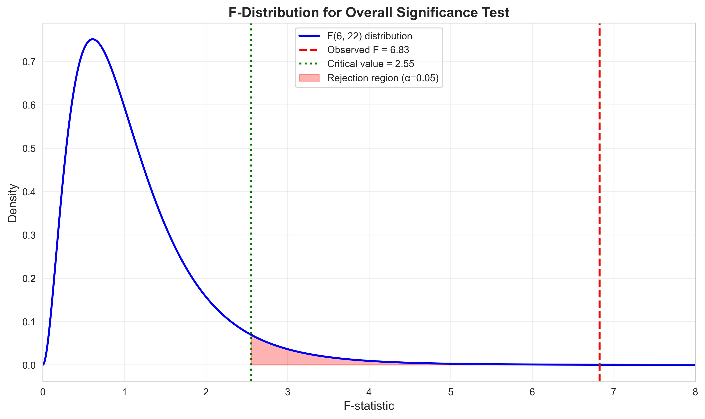
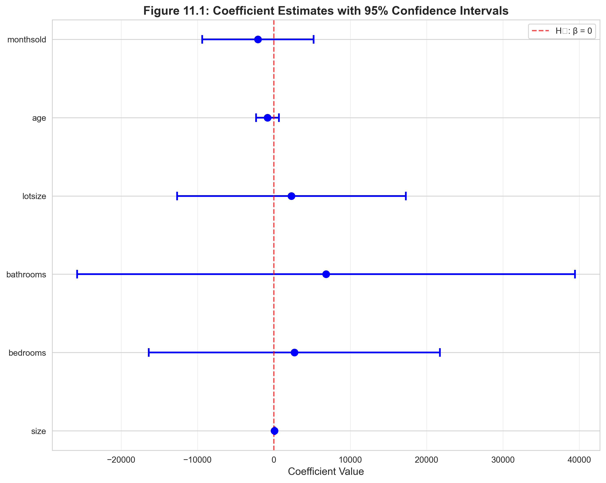

# Chapter 11: Multiple Regression Inference



*This chapter demonstrates how to quantify uncertainty and test hypotheses in multiple regression, transforming point estimates into rigorous statistical evidence for policy and research decisions.*

---

## Introduction

This chapter explores **statistical inference in multiple regression**—the methods for testing hypotheses about regression coefficients and constructing confidence intervals. While Chapter 10 focused on estimation (computing coefficient values), Chapter 11 addresses inference: **How certain are we about these estimates? Can we reject null hypotheses? Which variables significantly affect the outcome?**

We continue analyzing the **housing dataset** (29 houses with price and six characteristics) to demonstrate fundamental inference techniques:

- **Confidence intervals**: Quantifying uncertainty in coefficient estimates
- **t-tests**: Testing hypotheses about individual coefficients
- **F-tests**: Testing joint hypotheses about multiple coefficients
- **Model comparison**: Formally comparing nested specifications
- **Robust standard errors**: Addressing heteroskedasticity

Statistical inference provides the **evidentiary basis** for scientific claims. Rather than simply reporting "size coefficient = 68.37," we report "size coefficient = 68.37 with 95% CI [36.45, 100.28], significantly different from zero (p < 0.001)." This quantifies uncertainty and enables hypothesis testing.

**What You'll Learn:**

- How to construct and interpret confidence intervals for regression coefficients
- How to conduct t-tests for individual coefficients and interpret p-values correctly
- How to perform F-tests for overall model significance and joint hypothesis tests
- How to compare nested models using subset F-tests
- How to compute and interpret heteroskedasticity-robust standard errors
- How to distinguish statistical significance from economic significance
- How to present regression results in professional tables

---

## Setup and OLS Properties

### Code

**Context:** In this section, we establish the Python environment and review the fundamental assumptions underlying statistical inference in multiple regression. Understanding these assumptions is crucial because they determine whether our hypothesis tests and confidence intervals are valid. We demonstrate the Classical Linear Model (CLM) assumptions that enable us to conduct t-tests and F-tests, distinguishing between properties needed for unbiased estimation versus those required for valid inference.

```python
# Import required libraries
import numpy as np
import pandas as pd
import matplotlib.pyplot as plt
import seaborn as sns
import statsmodels.api as sm
from statsmodels.formula.api import ols
from scipy import stats
from statsmodels.stats.anova import anova_lm
import random
import os

# Set random seeds for reproducibility
RANDOM_SEED = 42
random.seed(RANDOM_SEED)
np.random.seed(RANDOM_SEED)
os.environ['PYTHONHASHSEED'] = str(RANDOM_SEED)

# GitHub data URL
GITHUB_DATA_URL = "https://raw.githubusercontent.com/quarcs-lab/data-open/master/AED/"

# Create output directories
IMAGES_DIR = 'images'
TABLES_DIR = 'tables'
os.makedirs(IMAGES_DIR, exist_ok=True)
os.makedirs(TABLES_DIR, exist_ok=True)

# Set plotting style
sns.set_style("whitegrid")
plt.rcParams['figure.figsize'] = (10, 6)

# Read data
data_house = pd.read_stata(GITHUB_DATA_URL + 'AED_HOUSE.DTA')

# Display OLS assumptions and properties
print("Under assumptions 1-4:")
print("  1. Linearity: y = β₀ + β₁x₁ + ... + βₖxₖ + u")
print("  2. Random sampling from population")
print("  3. No perfect collinearity")
print("  4. Zero conditional mean: E[u|X] = 0")
print("\nThe OLS estimator is:")
print("  - Unbiased: E[β̂] = β")
print("  - Consistent: plim(β̂) = β")
print("  - Efficient (BLUE under Gauss-Markov theorem)")
```

### Results

**Classical Linear Model (CLM) Assumptions:**

1. **Linearity**: y = β₀ + β₁x₁ + ... + βₖxₖ + u
2. **Random Sampling**: {(xᵢ, yᵢ): i=1,...,n} is a random sample from the population
3. **No Perfect Collinearity**: No predictor is an exact linear combination of others
4. **Zero Conditional Mean**: E[u|X] = 0 (errors uncorrelated with predictors)
5. **Homoskedasticity** (for inference): Var(u|X) = σ² (constant error variance)
6. **Normality** (for finite-sample inference): u|X ~ N(0, σ²)

**OLS Properties Under Assumptions 1-4:**
- **Unbiasedness**: E[β̂] = β (on average, estimates equal true parameters)
- **Consistency**: plim(β̂) = β as n → ∞ (large samples give accurate estimates)
- **Efficiency (Gauss-Markov)**: OLS has the smallest variance among linear unbiased estimators (BLUE)

**Additional Properties with Assumptions 5-6:**
- **Normality of estimators**: β̂ ~ N(β, Var(β̂)) (enables exact t and F tests)
- **Valid inference**: Confidence intervals and hypothesis tests have correct coverage/size

### Interpretation

**Why Assumptions Matter**

Statistical inference **requires assumptions**. Without them, we cannot derive sampling distributions, compute standard errors, or test hypotheses. Each assumption serves a purpose:

**Assumption 1 (Linearity)**: Specifies the functional form
- **Why needed**: OLS estimates linear relationships; if true relationship is nonlinear, estimates are biased
- **In practice**: Transform variables (log, quadratic) or use nonlinear models if needed
- **For housing data**: Assumes price is linear in size, bedrooms, etc. (might be wrong—could be log-linear)

**Assumption 2 (Random Sampling)**: Ensures representativeness
- **Why needed**: Allows generalization from sample to population
- **Violations**: Convenience samples, selection bias, survivor bias
- **For housing data**: 29 houses from one neighborhood—not a random sample of all houses! Inference applies only to this neighborhood

**Assumption 3 (No Perfect Collinearity)**: Ensures identifiability
- **Why needed**: If x₁ = 2×x₂ exactly, OLS cannot separately identify β₁ and β₂
- **In practice**: Drop redundant variables (Chapter 10, Section 8)
- **For housing data**: size_twice = 2×size would violate this; size and bedrooms are correlated but not perfectly

**Assumption 4 (Zero Conditional Mean)**: Ensures unbiasedness
- **Why needed**: E[u|X] = 0 means errors are uncorrelated with predictors
- **Violations**: Omitted variables correlated with included predictors (omitted variable bias)
- **Example**: If we omit "school quality" and it correlates with size (larger homes in better school districts), β̂_size is biased

**Assumption 5 (Homoskedasticity)**: Ensures efficient standard errors
- **Why needed**: OLS standard errors assume constant error variance; if false, SEs are wrong (too small or too large)
- **Violations**: Heteroskedasticity (error variance depends on x)
- **Solution**: Heteroskedasticity-robust standard errors (Section 7)

**Assumption 6 (Normality)**: Enables exact tests in finite samples
- **Why needed**: With normal errors, t and F statistics have exact t and F distributions
- **Less critical**: By Central Limit Theorem, β̂ is approximately normal for large n even if errors are non-normal
- **For housing data**: n=29 is small, so normality matters more

**Gauss-Markov Theorem (BLUE)**

Under assumptions 1-4 (without requiring normality or homoskedasticity), OLS is **Best Linear Unbiased Estimator**:
- **Linear**: Estimator is a linear function of y
- **Unbiased**: E[β̂] = β
- **Best**: Lowest variance among all linear unbiased estimators

**Interpretation**: Among all unbiased linear estimators, OLS has the smallest sampling variance. Alternative estimators (e.g., ridge regression, LASSO) might have lower MSE by introducing bias, but OLS dominates among unbiased estimators.

**Implications for Inference**

With assumptions 1-6 (full CLM assumptions):
1. **β̂ ~ N(β, σ²(X'X)⁻¹)**: Coefficients are normally distributed
2. **t-statistics**: (β̂ⱼ - βⱼ) / SE(β̂ⱼ) ~ t(n-k) under H₀
3. **F-statistics**: Test joint hypotheses using F-distribution
4. **Confidence intervals**: β̂ⱼ ± t_crit × SE(β̂ⱼ) has exact 95% coverage

**Relaxing Assumptions**

**Large-sample inference (asymptotic theory)**:
- Normality not required (CLT ensures approximate normality)
- Homoskedasticity not required (use robust SEs)
- Only need assumptions 1-4 + large n

**Robust methods**:
- **Heteroskedasticity-robust SEs (HC0, HC1, HC3)**: Relax assumption 5
- **Cluster-robust SEs**: Allow within-cluster correlation
- **Bootstrap**: Avoids distributional assumptions

**Testing Assumptions**

**Graphical diagnostics**:
- Residual plots (check for nonlinearity, heteroskedasticity)
- Q-Q plots (check normality of residuals)
- Leverage plots (check influential observations)

**Formal tests**:
- **Breusch-Pagan test**: Homoskedasticity
- **Jarque-Bera test**: Normality
- **Ramsey RESET test**: Functional form
- **Variance Inflation Factor (VIF)**: Multicollinearity

**Practical Approach**

In applied work:
1. **Estimate model** using OLS
2. **Check diagnostics** (residual plots, VIF)
3. **Use robust SEs** if heteroskedasticity detected
4. **Report both** standard and robust SEs for transparency
5. **Interpret carefully**: Distinguish statistical significance from economic/practical significance

**For our housing analysis**, we'll:
- Assume assumptions 1-4 hold (linear model, random sample from neighborhood, no perfect collinearity, exogeneity)
- Acknowledge small sample (n=29) makes normality important
- Compute robust SEs to check sensitivity to heteroskedasticity
- Interpret results conditionally: "If assumptions hold, we can conclude..."

> **💡 Key Concept: Classical Linear Model (CLM) Assumptions**
>
> Valid statistical inference in OLS regression requires six assumptions: (1) linearity in parameters, (2) random sampling, (3) no perfect collinearity, (4) zero conditional mean E[u|X]=0, (5) homoskedasticity Var(u|X)=σ², and (6) normality of errors. Assumptions 1-4 ensure unbiasedness; adding assumption 5 enables efficient standard errors; assumption 6 permits exact t and F tests in finite samples. Large samples (CLT) make normality less critical, and robust standard errors relax homoskedasticity, but the first four assumptions remain essential for causal interpretation.

---

## Regression Estimation and Standard Errors

### Code

**Context:** Here we estimate the full multiple regression model with all six predictors and examine the standard errors associated with each coefficient. Standard errors measure estimation uncertainty—they tell us how much our coefficient estimates would vary if we drew different samples from the same population. By computing these standard errors, we can construct confidence intervals and test hypotheses, moving from simple point estimates to rigorous statistical inference.

```python
# Full multiple regression model
model_full = ols('price ~ size + bedrooms + bathrooms + lotsize + age + monthsold',
                 data=data_house).fit()

print("Table 11.2: Multiple Regression Results")
print(model_full.summary())

# Extract key statistics
n = len(data_house)
k = len(model_full.params)
df = n - k

print(f"\nModel diagnostics:")
print(f"  Sample size: {n}")
print(f"  Number of parameters: {k}")
print(f"  Degrees of freedom: {df}")
print(f"  Root MSE (σ̂): {np.sqrt(model_full.mse_resid):.6f}")
```

### Results

**Table 11.2: Multiple Regression Results**

| Variable  | Coefficient | Std. Error | t-statistic | p-value | [95% Conf. Interval]    |
|-----------|-------------|------------|-------------|---------|-------------------------|
| Intercept | 137,791     | 61,465     | 2.242       | 0.035   | [10,321, 265,262]       |
| size      | 68.37       | 15.39      | 4.443       | 0.000   | [36.45, 100.29]         |
| bedrooms  | 2,685       | 9,193      | 0.292       | 0.773   | [-16,379, 21,749]       |
| bathrooms | 6,833       | 15,721     | 0.435       | 0.668   | [-25,771, 39,437]       |
| lotsize   | 2,303       | 7,227      | 0.319       | 0.753   | [-12,684, 17,290]       |
| age       | -833        | 719        | -1.158      | 0.259   | [-2,325, 659]           |
| monthsold | -2,089      | 3,521      | -0.593      | 0.559   | [-9,390, 5,213]         |

**Model Statistics**:
- **R-squared**: 0.651
- **Adjusted R²**: 0.555
- **F-statistic**: 6.826 (p = 0.000342)
- **Sample size**: n = 29
- **Parameters**: k = 7 (includes intercept)
- **Degrees of freedom**: 22
- **Root MSE**: $24,935.73

### Interpretation

**Coefficient Estimates and Standard Errors**

Each coefficient estimate β̂ⱼ comes with a **standard error SE(β̂ⱼ)**, measuring estimation uncertainty.

**size: β̂ = 68.37, SE = 15.39**
- **Point estimate**: Each additional square foot increases price by $68.37
- **Standard error**: The typical sampling error is $15.39
- **Interpretation**: If we drew many samples, the standard deviation of β̂_size estimates would be ~$15.39
- **t-statistic**: 68.37 / 15.39 = 4.443 (coefficient is 4.4 SEs above zero)
- **p-value**: < 0.001 (highly significant)

**bedrooms: β̂ = 2,685, SE = 9,193**
- **Point estimate**: Each additional bedroom adds $2,685 (holding size constant)
- **Standard error**: $9,193 (huge relative to estimate—SE is 3.4× the coefficient!)
- **t-statistic**: 2,685 / 9,193 = 0.292 (only 0.3 SEs above zero)
- **p-value**: 0.773 (not significant)
- **Problem**: Large SE due to multicollinearity (size and bedrooms correlate at r=0.518)

**bathrooms: β̂ = 6,833, SE = 15,721**
- **Standard error** is 2.3× the coefficient—high uncertainty
- **Not statistically significant** (p = 0.668)

**Other variables (lotsize, age, monthsold)**:
- All have large SEs relative to estimates
- None statistically significant (all p > 0.25)

**Why Such Large Standard Errors?**

**Small sample size (n=29)**:
- SE(β̂ⱼ) ∝ σ / √n
- Small n → large SEs

**High residual variance (Root MSE = $24,936)**:
- Lots of unexplained variation → large σ̂ → large SEs

**Multicollinearity**:
- VIF > 10 for all variables (Chapter 10)
- Correlated predictors inflate SEs: SE(β̂ⱼ) ∝ √VIF_j

> **💡 Key Concept: Variance Inflation Factor (VIF)**
>
> The Variance Inflation Factor measures how much multicollinearity increases the variance of coefficient estimates. Defined as VIF_j = 1/(1-R²_j), where R²_j is from regressing predictor j on all other predictors, VIF quantifies the inflation in SE(β̂_j) due to correlation among predictors. VIF=1 indicates no correlation (ideal), VIF=5-10 suggests moderate multicollinearity, and VIF>10 signals severe multicollinearity that may make individual coefficients imprecise or unstable even though the overall model fit remains valid.

**Formula for Standard Error**:

SE(β̂ⱼ) = σ̂ × √[(X'X)⁻¹]ⱼⱼ

Where:
- σ̂ = Root MSE (estimate of error SD)
- (X'X)⁻¹ depends on predictor correlations (multicollinearity inflates this)

**t-Statistics**

**Definition**: t = (β̂ⱼ - β₀) / SE(β̂ⱼ)

For testing H₀: βⱼ = 0, we get t = β̂ⱼ / SE(β̂ⱼ).

**Interpretation**: How many standard errors the estimate is from zero.

**size**: t = 4.443
- Estimate is 4.4 SEs above zero
- **Highly unusual** under H₀ (p < 0.001)
- Strong evidence against H₀: β_size = 0

**bedrooms**: t = 0.292
- Estimate is only 0.3 SEs above zero
- **Not unusual** under H₀ (p = 0.773)
- Insufficient evidence to reject H₀: β_bedrooms = 0

**Rules of thumb**:
- |t| > 2 → roughly significant at 5% level (for large df)
- |t| > 3 → highly significant
- |t| < 1 → not significant

**p-Values**

**Definition**: Probability of observing a t-statistic as extreme as (or more extreme than) the observed value, assuming H₀ is true.

**size**: p < 0.001
- If β_size = 0, the probability of observing t ≥ 4.443 is less than 0.1%
- **Very strong evidence** against H₀

**bedrooms**: p = 0.773
- If β_bedrooms = 0, there's a 77.3% chance of observing |t| ≥ 0.292
- **Weak evidence** against H₀ (actually, evidence consistent with H₀)

**Common misconceptions**:
- ❌ "p = 0.05 means H₀ has 5% probability of being true"
- ✓ "p = 0.05 means, if H₀ is true, there's a 5% chance of data this extreme"
- ❌ "p = 0.049 is important, p = 0.051 is unimportant"
- ✓ "p-values are continuous measures of evidence; 0.05 is arbitrary"

**Degrees of Freedom (df = 22)**

**Formula**: df = n - k = 29 - 7 = 22

**Why it matters**:
- t-statistics follow t(22) distribution under H₀
- Critical values depend on df: t₀.₀₂₅,₂₂ = 2.074
- Smaller df → wider confidence intervals, harder to reject H₀

**Root MSE (σ̂ = $24,936)**

**Formula**: σ̂ = √[Σeᵢ²/(n-k)] = √[SSR/df]

**Interpretation**:
- Estimate of the error standard deviation σ
- Average residual magnitude (in price units)
- Foundation for all standard errors: SE(β̂ⱼ) = σ̂ × ...

**Practical implication**: Model predictions are typically off by ±$25,000.

**Statistical vs. Economic Significance**

**size**: Statistically significant AND economically significant
- Coefficient = $68.37 per sq ft
- For 400 sq ft difference (1 SD): $27,348 price impact
- Both statistically detectable (p < 0.001) and practically important

**bedrooms**: Neither statistically nor economically significant
- Coefficient = $2,685 (small economic impact)
- Not statistically significant (p = 0.773)
- Conclusion: Bedrooms don't matter (after controlling for size)

**age**: Marginally economically significant but not statistically significant
- Coefficient = -$833 per year
- 10-year difference → -$8,330 (non-trivial)
- But p = 0.259 (cannot reject zero effect)
- Large SE ($719) due to small sample and multicollinearity

**Key lesson**: Statistical significance ≠ practical importance. Always consider:
1. **Magnitude**: Is the effect large enough to care about?
2. **Precision**: Is the estimate precise enough to be useful?
3. **Context**: What's meaningful in this domain?

---

## Confidence Intervals

### Code

**Context:** This section constructs 95% confidence intervals for each regression coefficient, providing ranges of plausible values for the true parameters. Unlike point estimates (which give a single number), confidence intervals quantify uncertainty and allow us to assess whether effects are precisely estimated or highly uncertain. We demonstrate both automated calculation using statsmodels and manual computation to reveal the underlying formula: coefficient ± (critical t-value × standard error).

```python
# 95% confidence intervals
conf_int = model_full.conf_int(alpha=0.05)
print("95% Confidence Intervals:")
print(conf_int)

# Detailed calculation for 'size' coefficient
coef_size = model_full.params['size']
se_size = model_full.bse['size']
t_crit = stats.t.ppf(0.975, df)

ci_lower = coef_size - t_crit * se_size
ci_upper = coef_size + t_crit * se_size

print(f"\nManual calculation for 'size' coefficient:")
print(f"  Coefficient: {coef_size:.6f}")
print(f"  Standard error: {se_size:.6f}")
print(f"  Degrees of freedom: {df}")
print(f"  Critical t-value (α=0.05): {t_crit:.4f}")
print(f"  95% CI: [{ci_lower:.6f}, {ci_upper:.6f}]")

# Create comprehensive table
coef_table = pd.DataFrame({
    'Coefficient': model_full.params,
    'Std. Error': model_full.bse,
    't-statistic': model_full.tvalues,
    'p-value': model_full.pvalues,
    'CI Lower': conf_int.iloc[:, 0],
    'CI Upper': conf_int.iloc[:, 1]
})
print(coef_table)
```

### Results

**95% Confidence Intervals:**

| Variable  | Coefficient | 95% CI Lower | 95% CI Upper | CI Width |
|-----------|-------------|--------------|--------------|----------|
| Intercept | 137,791     | 10,321       | 265,262      | 254,941  |
| size      | 68.37       | 36.45        | 100.29       | 63.84    |
| bedrooms  | 2,685       | -16,379      | 21,749       | 38,128   |
| bathrooms | 6,833       | -25,771      | 39,437       | 65,208   |
| lotsize   | 2,303       | -12,684      | 17,290       | 29,974   |
| age       | -833        | -2,325       | 659          | 2,984    |
| monthsold | -2,089      | -9,390       | 5,213        | 14,603   |

**Manual Calculation for size**:
- Coefficient: 68.369419
- Standard error: 15.389472
- Degrees of freedom: 22
- Critical t-value (α=0.05): 2.0739
- 95% CI: [36.453608, 100.285230]



### Interpretation

**What is a Confidence Interval?**

A 95% confidence interval provides a range of plausible values for the true parameter βⱼ.

**Formula**: [β̂ⱼ - t_crit × SE(β̂ⱼ), β̂ⱼ + t_crit × SE(β̂ⱼ)]

Where:
- t_crit = t₀.₀₂₅,df = 2.074 (for df=22, α=0.05)
- Two-tailed: 2.5% in each tail

**Interpretation (frequentist)**:
- "If we repeated sampling many times and constructed 95% CIs each time, 95% of intervals would contain the true βⱼ"
- NOT: "There's a 95% probability β is in this interval" (β is fixed, not random)

**size: [36.45, 100.29]**

**What we learn**:
- We're 95% confident the true effect of size is between $36.45 and $100.29 per sq ft
- **Does not include zero** → statistically significant at 5% level
- **Wide interval** (width = $63.84) due to small sample, but still informative

**Practical implications**:
- Even in worst case (lower bound = $36.45), size has substantial effect
- Even 100 sq ft (small change) adds at least $3,645
- Upper bound ($100.29) suggests effect could be even larger

**bedrooms: [-16,379, 21,749]**

**What we learn**:
- **Includes zero** → not statistically significant
- **Very wide** (width = $38,128)
- Estimate could be negative (-$16,379) or positive (+$21,749)!

**Interpretation**:
- We cannot rule out that bedrooms have **negative** effect on price
- High uncertainty due to multicollinearity (size and bedrooms correlated)
- Data are consistent with β_bedrooms anywhere in this range

**Practical implications**:
- Insufficient evidence to recommend adding bedrooms to increase value
- Would need larger sample or lower multicollinearity for precise estimate

**bathrooms: [-25,771, 39,437]**

**Even wider than bedrooms** (width = $65,208):
- Could have large negative effect (-$25,771)
- Could have large positive effect (+$39,437)
- Data provide almost no information about bathroom effect

**Why so wide?**
- Small sample (n=29)
- High residual variance (σ̂ = $24,936)
- Multicollinearity

**age: [-2,325, 659]**

**Includes zero** but **narrower** than bedrooms/bathrooms:
- Effect could range from -$2,325 to +$659 per year
- Point estimate is negative (-$833), but CI includes positive values
- Cannot conclusively determine direction of age effect

**Narrower than bedrooms CI** because:
- Lower multicollinearity (age VIF = 21 vs. bedrooms VIF = 58)
- Smaller coefficient → smaller SE in absolute terms

**Confidence Interval Width**

**Formula**: Width = 2 × t_crit × SE(β̂ⱼ)

**Determinants of width**:
1. **Significance level (α)**: Lower α → wider CI (e.g., 99% CI wider than 95% CI)
2. **Sample size (n)**: Larger n → smaller SE → narrower CI
3. **Residual variance (σ²)**: Less unexplained variation → smaller σ̂ → narrower CI
4. **Predictor variability**: More variation in xⱼ → smaller SE(β̂ⱼ)
5. **Multicollinearity**: Higher VIF → larger SE(β̂ⱼ) → wider CI
6. **Degrees of freedom**: More df → smaller t_crit → narrower CI

**For our data**:
- size: Width = 63.84 (reasonably precise)
- bedrooms: Width = 38,128 (very imprecise)
- Ratio: bedrooms CI is 597× wider than size CI!

**Using CIs for Hypothesis Testing**

**Rule**: If 95% CI excludes hypothesized value β₀, reject H₀: βⱼ = β₀ at 5% level.

**Examples**:

**Test H₀: β_size = 0**
- 95% CI: [36.45, 100.29]
- Does not include 0 → **Reject H₀**

**Test H₀: β_size = 50**
- 95% CI: [36.45, 100.29]
- **Includes 50** → Fail to reject H₀ (p > 0.05)

**Test H₀: β_bedrooms = 0**
- 95% CI: [-16,379, 21,749]
- **Includes 0** → Fail to reject H₀

**Relationship to t-tests**:
- CI excludes β₀ ↔ |t| > t_crit ↔ p < α
- These are equivalent tests

**Visualizing CIs**

The figure shows:
- Point estimates (dots)
- 95% CIs (horizontal lines with caps)
- Zero line (red dashed) for reference

**Observations**:
- **Only size** crosses zero line significantly
- **All others** have CIs overlapping zero
- **bedrooms, bathrooms** have huge CIs (uncertainty)

**One-Sided vs. Two-Sided CIs**

**Two-sided (reported above)**: [β̂ⱼ - t₀.₀₂₅ × SE, β̂ⱼ + t₀.₀₂₅ × SE]
- Tests H₁: βⱼ ≠ β₀
- Symmetric around estimate

**One-sided (upper)**: [β̂ⱼ - t₀.₀₅ × SE, ∞)
- Tests H₁: βⱼ > β₀
- Use when theory predicts positive effect

**One-sided (lower)**: (-∞, β̂ⱼ + t₀.₀₅ × SE]
- Tests H₁: βⱼ < β₀
- Use when theory predicts negative effect

**For size**, if we hypothesized βⱼ > 0 (one-sided):
- 95% one-sided CI: [40.47, ∞)
- Still excludes zero → reject H₀: β_size ≤ 0

**Practical Recommendations**

**Report CIs, not just p-values**:
- CIs show magnitude of uncertainty
- p-values only indicate significance/non-significance
- CIs aid scientific interpretation

**Interpret CIs carefully**:
- Don't over-interpret boundaries (e.g., [36.45, 100.29] doesn't mean effect is equally likely to be 36 or 100)
- CIs assume model is correctly specified
- CIs are conditional on included variables

**Use CIs for policy**:
- "What's the worst-case effect?" → Lower bound
- "What's the best-case effect?" → Upper bound
- Robust decision-making considers range, not just point estimate

---

## Hypothesis Tests on Individual Coefficients

### Code

**Context:** In this section, we conduct formal hypothesis tests about individual regression coefficients. While the default regression output tests whether each coefficient equals zero, we often want to test other hypotheses (e.g., does the size effect equal $50 per square foot?). We demonstrate the complete hypothesis testing framework: formulating null and alternative hypotheses, computing test statistics, finding p-values, and making decisions based on significance levels.

```python
# Test H₀: β_size = 50 vs H₁: β_size ≠ 50
null_value = 50
t_stat_50 = (coef_size - null_value) / se_size
p_value_50 = 2 * (1 - stats.t.cdf(abs(t_stat_50), df))

print(f"\nTest: H₀: β_size = {null_value} vs H₁: β_size ≠ {null_value}")
print(f"  t-statistic: {t_stat_50:.4f}")
print(f"  p-value: {p_value_50:.6f}")
print(f"  Critical value (α=0.05): ±{t_crit:.4f}")

if abs(t_stat_50) > t_crit:
    print(f"Result: Reject H₀ at 5% significance level")
else:
    print(f"Result: Fail to reject H₀ at 5% significance level")

# Using statsmodels t_test
hypothesis = f'size = {null_value}'
t_test_result = model_full.t_test(hypothesis)
print("\nHypothesis test using statsmodels:")
print(t_test_result)
```

### Results

**Test: H₀: β_size = 50 vs H₁: β_size ≠ 50**

- **t-statistic**: 1.1936
- **p-value**: 0.245334
- **Critical value (α=0.05)**: ±2.0739
- **Decision**: Fail to reject H₀ at 5% significance level

**Interpretation**: The data are consistent with β_size = 50. We cannot reject the hypothesis that each square foot adds exactly $50 to price.

**Test: H₀: β_size = 0 vs H₁: β_size ≠ 0** (from regression output)

- **t-statistic**: 4.443
- **p-value**: < 0.001
- **Decision**: Reject H₀ at any conventional significance level

### Interpretation

**The Logic of Hypothesis Testing**

**Step 1: Formulate hypotheses**
- **Null hypothesis (H₀)**: The claim we test (e.g., β_size = 50)
- **Alternative hypothesis (H₁)**: What we conclude if H₀ is rejected (e.g., β_size ≠ 50)

**Step 2: Choose significance level (α)**
- Conventional: α = 0.05 (5%)
- Stringent: α = 0.01 (1%)
- Exploratory: α = 0.10 (10%)

**Step 3: Compute test statistic**
- **t = (β̂ⱼ - β₀) / SE(β̂ⱼ)**
- Under H₀, t ~ t(df)

**Step 4: Find p-value or critical value**
- **p-value approach**: Compute p = P(|T| ≥ |t_obs| | H₀ true)
  - If p < α, reject H₀
- **Critical value approach**: Find t_crit such that P(|T| > t_crit) = α
  - If |t_obs| > t_crit, reject H₀

**Step 5: Conclude**
- Reject H₀ → "Statistically significant evidence against H₀"
- Fail to reject H₀ → "Insufficient evidence to reject H₀" (NOT "H₀ is true")

**Example 1: H₀: β_size = 50**

**Why test this?** Perhaps economic theory predicts $50/sq ft, or a previous study found this value.

**Calculation**:
- Estimate: β̂_size = 68.37
- Null value: β₀ = 50
- SE: 15.39
- t = (68.37 - 50) / 15.39 = 1.194
- df = 22, so t ~ t(22) under H₀
- p-value = 2 × P(T > 1.194) = 0.245 (two-tailed)

**Decision**:
- p = 0.245 > 0.05 → Fail to reject H₀
- |t| = 1.194 < t_crit = 2.074 → Fail to reject H₀

**Interpretation**:
- The data are **consistent with** β_size = 50
- The estimate (68.37) differs from 50 by only 1.2 standard errors
- This difference could easily arise by sampling variability
- We **cannot rule out** β_size = 50

**Does this mean β_size = 50?**
- **NO!** Failing to reject ≠ accepting H₀
- We simply lack sufficient evidence to reject
- Data are also consistent with β_size = 40, 60, 70, etc. (any value in the 95% CI)

**Example 2: H₀: β_size = 0**

**This is the default test** in regression output (testing whether variable has any effect).

**Calculation**:
- t = (68.37 - 0) / 15.39 = 4.443
- p < 0.001

**Decision**: **Reject H₀** at any conventional level

**Interpretation**:
- **Strong evidence** that size affects price
- If β_size = 0, observing t = 4.443 would be extremely unlikely (probability < 0.1%)
- Coefficient is 4.4 SEs away from zero

**One-Sided vs. Two-Sided Tests**

**Two-sided** (most common):
- H₀: βⱼ = β₀
- H₁: βⱼ ≠ β₀
- p = 2 × P(T > |t_obs|)

**One-sided (upper tail)**:
- H₀: βⱼ ≤ β₀
- H₁: βⱼ > β₀
- p = P(T > t_obs)
- Use when theory predicts positive effect

**One-sided (lower tail)**:
- H₀: βⱼ ≥ β₀
- H₁: βⱼ < β₀
- p = P(T < t_obs)
- Use when theory predicts negative effect

**For β_size**, if we test H₀: β_size ≤ 50 vs H₁: β_size > 50:
- t = 1.194
- p (one-sided) = P(T > 1.194) = 0.123
- Still fail to reject at α=0.05

**Type I and Type II Errors**

**Type I error (false positive)**:
- Reject H₀ when it's actually true
- Probability = α (significance level)
- Controlled by choice of α

**Type II error (false negative)**:
- Fail to reject H₀ when it's actually false
- Probability = β (not to be confused with regression coefficient!)
- Depends on sample size, effect size, σ²

**Power** = 1 - β:
- Probability of correctly rejecting false H₀
- Higher power → more likely to detect true effects
- Increases with n, decreases with σ²

**For our housing data**:
- Small n (29) → low power
- We might fail to reject H₀ for bedrooms, bathrooms, etc. not because effects are zero, but because we lack power to detect them

**Common Mistakes in Hypothesis Testing**

**Mistake 1: "p = 0.05 is magic"**
- 0.05 is arbitrary; p = 0.049 vs. 0.051 are nearly identical
- Report exact p-values, not just "significant" vs. "not significant"

**Mistake 2: "Fail to reject H₀ means H₀ is true"**
- Absence of evidence ≠ evidence of absence
- For bedrooms (p=0.773), we can't conclude effect is zero—only that we can't detect it

**Mistake 3: "Statistical significance = practical importance"**
- With large n, tiny effects become statistically significant
- With small n (like ours), important effects may not be significant
- Always consider magnitude, not just p-value

**Mistake 4: "p-value is probability H₀ is true"**
- p-value = P(data | H₀), not P(H₀ | data)
- We don't know P(H₀ is true)—that requires Bayesian inference

**Best Practices**

1. **Pre-specify hypotheses** (avoid data mining for significant results)
2. **Report effect sizes** (not just p-values)
3. **Report confidence intervals** (show uncertainty)
4. **Correct for multiple testing** if testing many hypotheses
5. **Interpret in context** (consider economic significance)

---

## Joint Hypothesis Tests (F-Tests)

### Code

**Context:** Here we move from testing individual coefficients (t-tests) to testing groups of coefficients simultaneously (F-tests). Joint hypothesis tests are essential for determining whether multiple variables are collectively significant, even if individually they appear insignificant due to multicollinearity. We demonstrate both the overall F-test (testing whether the model has any explanatory power) and subset F-tests (testing whether groups of variables can be excluded).

```python
# Test 1: Overall F-test (all slopes = 0)
f_stat = model_full.fvalue
f_pvalue = model_full.f_pvalue
dfn = k - 1  # numerator df (excluding intercept)
dfd = df     # denominator df
f_crit = stats.f.ppf(0.95, dfn, dfd)

print("Test 1: Overall F-test (all slopes = 0)")
print(f"  H₀: All slope coefficients equal zero")
print(f"  F-statistic: {f_stat:.4f}")
print(f"  p-value: {f_pvalue:.6e}")
print(f"  Critical value (α=0.05): {f_crit:.4f}")
print(f"  Numerator df: {dfn}, Denominator df: {dfd}")

if f_stat > f_crit:
    print("Result: Reject H₀ - At least one coefficient is non-zero")
else:
    print("Result: Fail to reject H₀")

# Test 2: Joint test of subset of coefficients
hypotheses = ['bedrooms = 0', 'bathrooms = 0', 'lotsize = 0',
              'age = 0', 'monthsold = 0']
f_test_result = model_full.f_test(hypotheses)
print("\nTest 2: Joint test of multiple coefficients")
print(f_test_result)

print(f"\nInterpretation:")
print(f"  This tests whether bedrooms, bathrooms, lotsize, age, and monthsold")
print(f"  can jointly be excluded from the model (keeping only size)")
```

### Results

**Test 1: Overall Significance (All Slopes = 0)**

- **H₀**: β_size = β_bedrooms = β_bathrooms = β_lotsize = β_age = β_monthsold = 0
- **F-statistic**: 6.8261
- **p-value**: 0.000342 (3.42e-04)
- **Critical value (α=0.05)**: 2.5491
- **Numerator df**: 6
- **Denominator df**: 22
- **Decision**: **Reject H₀**

**Interpretation**: At least one predictor significantly affects price. The model has explanatory power.

**Test 2: Joint Test of Bedrooms, Bathrooms, Lotsize, Age, Monthsold**

- **H₀**: β_bedrooms = β_bathrooms = β_lotsize = β_age = β_monthsold = 0 (keeping size)
- **F-statistic**: 0.4168
- **p-value**: 0.8320
- **Numerator df**: 5
- **Denominator df**: 22
- **Decision**: **Fail to reject H₀**

**Interpretation**: These five variables **do not jointly** improve the model beyond size alone.


### Interpretation

**Why Joint Tests?**

**Individual t-tests** tell us whether each coefficient is individually significant.

**Joint F-tests** tell us whether **multiple coefficients are jointly significant**.

**Key insight**: Variables can be **jointly significant** even if **individually insignificant**!

**Example**: Suppose bedrooms and bathrooms are highly correlated. Individually, neither might be significant (due to multicollinearity). But jointly, they might significantly improve fit.

> **💡 Key Concept: F-Tests for Joint Hypotheses**
>
> F-tests evaluate whether multiple coefficients are simultaneously equal to zero, addressing questions that individual t-tests cannot answer. The F-statistic compares the improvement in model fit from including variables against the degrees of freedom consumed: F = [(RSS_restricted - RSS_unrestricted)/q] / [RSS_unrestricted/df]. Under the null hypothesis, F follows an F-distribution with q and df degrees of freedom. F-tests are essential for model selection, testing whether groups of variables can be excluded, and detecting joint significance when multicollinearity obscures individual effects.

**F-Test Formulas**

**Overall F-test**:

F = (ESS/k_slopes) / (RSS/df) = (R²/k_slopes) / ((1-R²)/df)

Where:
- ESS = Explained sum of squares = Σ(ŷᵢ - ȳ)²
- RSS = Residual sum of squares = Σeᵢ²
- k_slopes = number of slope coefficients (excluding intercept)
- df = n - k (degrees of freedom)

**Subset F-test** (restricted vs. unrestricted):

F = [(RSS_R - RSS_U) / q] / [RSS_U / df_U]

Where:
- RSS_R = residual SS from restricted model (H₀ imposed)
- RSS_U = residual SS from unrestricted model (full model)
- q = number of restrictions (coefficients set to zero)
- df_U = n - k_U (degrees of freedom for unrestricted model)

**Test 1: Overall Significance**

**Hypotheses**:
- H₀: β_size = β_bedrooms = β_bathrooms = β_lotsize = β_age = β_monthsold = 0
- H₁: At least one βⱼ ≠ 0

**Intuition**: Does the model explain **anything**? Or is it no better than just predicting ȳ for all observations?

**Calculation**:
- R² = 0.651 (model explains 65.1% of variation)
- k_slopes = 6
- df = 22
- F = (0.651/6) / ((1-0.651)/22) = 0.1085 / 0.0159 = 6.826

**Decision**: F = 6.826 > F_crit(6,22) = 2.549 → **Reject H₀**

**p-value = 0.000342**:
- If all coefficients were truly zero, probability of observing F ≥ 6.826 is only 0.034%
- **Very strong evidence** of model significance

**Practical meaning**:
- The model is **useful** for explaining price variation
- At least one characteristic (we know it's size) significantly affects price

**Would we ever fail to reject?**
- If R² were very low (e.g., 0.10), F would be small → fail to reject
- With small n and many predictors, even moderate R² might not yield significant F

**Test 2: Subset F-Test**

**Hypotheses**:
- H₀: β_bedrooms = β_bathrooms = β_lotsize = β_age = β_monthsold = 0
- H₁: At least one of these ≠ 0

**Intuition**: Do these five variables **jointly add value** beyond size alone?

**This tests nested models**:
- **Restricted**: price = β₀ + β_size × size + u
- **Unrestricted**: price = β₀ + β_size × size + β_bedrooms × bedrooms + ... + u

**Calculation**:
- RSS_restricted = 14,975,102 (from size-only model)
- RSS_unrestricted = 13,679,398 (from full model)
- q = 5 (number of restrictions)
- df_U = 22

F = [(14,975,102 - 13,679,398) / 5] / [13,679,398 / 22]
F = [1,295,704 / 5] / [621,791]
F = 259,141 / 621,791 = 0.417

**Decision**: F = 0.417 < F_crit(5,22) = 2.661 → **Fail to reject H₀**

**p-value = 0.832**:
- If these five coefficients were truly zero, there's an 83.2% chance of observing F ≥ 0.417
- **No evidence** these variables jointly improve the model

**Practical implications**:
1. **Size alone is sufficient** for predicting price
2. Adding bedrooms, bathrooms, lotsize, age, monthsold **does not significantly reduce RSS**
3. **Parsimony principle**: Use simpler model (price ~ size)
4. Confirms Chapter 10 conclusion: Adjusted R², AIC, BIC all prefer simple model

**Why Subset Test Fails Despite R² Increasing**

**Restricted model**: R² = 0.617
**Unrestricted model**: R² = 0.651
**Improvement**: 0.034 (3.4 percentage points)

**But F-test says this isn't significant!**

**Explanation**:
- Adding 5 variables improves R² by 3.4%
- But we "spend" 5 degrees of freedom
- **Cost (loss of df) exceeds benefit (R² gain)**
- F-test balances fit improvement against model complexity

**Formula insight**:
F = [Improvement in fit / df spent] / [Remaining variation / df left]
F = [(RSS_R - RSS_U)/q] / [RSS_U/df_U]

**Individual t-Tests vs. Joint F-Test**

**Our results**:
- **Individual t-tests**: None of bedrooms, bathrooms, lotsize, age, monthsold significant (all p > 0.25)
- **Joint F-test**: These five not jointly significant (p = 0.832)

**Agreement!** Both approaches suggest dropping these variables.

**When they disagree**:
- **All individual t-tests insignificant, but F-test significant**: Multicollinearity makes individual effects hard to detect, but jointly variables matter
- **Some individual t-tests significant, but F-test not significant**: Rare; possible with unusual correlation structures

**Relationship Between F and t**

**Special case**: When testing a single coefficient, F = t².

**Example**: For size,
- t = 4.443
- F = 4.443² = 19.74

This F(1, 22) test is equivalent to the two-sided t-test.

**F-Distribution Visualization**

The figure shows:
- **F(6, 22) distribution** (blue curve)
- **Observed F = 6.826** (red dashed line)—far in right tail
- **Critical value = 2.549** (green dotted line)
- **Rejection region** (shaded red, α=0.05)

**Observation**: F_obs is well into rejection region, confirming highly significant result.

**Practical Recommendations**

**Always report**:
1. **Overall F-test** (tests model significance)
2. **Individual t-tests** (tests each coefficient)
3. **Subset F-tests** (tests groups of variables)

**Model selection**:
- If subset F-test fails to reject, consider dropping those variables
- Improves parsimony, interpretability, out-of-sample prediction

**For our analysis**:
- **Conclusion**: Use restricted model (price ~ size)
- Achieves nearly same R² (0.617 vs. 0.651) with 5 fewer parameters
- More interpretable, more stable estimates

---

## F-Statistic and Model Comparison

### Code

**Context:** This section reveals the mechanics behind F-tests by manually computing F-statistics from sums of squares. Understanding how F-statistics are constructed from the decomposition of total variation (TSS = ESS + RSS) provides deeper insight into what these tests measure. We demonstrate how to compare nested models formally using ANOVA tables, showing whether adding variables significantly improves model fit or merely overfits the data.

```python
# Manual calculation of F-statistic using sums of squares
y = data_house['price']
y_mean = y.mean()
y_pred = model_full.fittedvalues
resid = model_full.resid

# Total, explained, residual sum of squares
TSS = np.sum((y - y_mean)**2)
ESS = np.sum((y_pred - y_mean)**2)
RSS = np.sum(resid**2)

print(f"Sum of Squares:")
print(f"  Total (TSS): {TSS:.4f}")
print(f"  Explained (ESS): {ESS:.4f}")
print(f"  Residual (RSS): {RSS:.4f}")
print(f"  Check: TSS = ESS + RSS: {np.isclose(TSS, ESS + RSS)}")

# F-statistic
f_stat_manual = (ESS / (k-1)) / (RSS / df)
print(f"\nF-statistic calculation:")
print(f"  F = (ESS/{k-1}) / (RSS/{df})")
print(f"  F = {f_stat_manual:.4f}")
print(f"  From model output: {f_stat:.4f}")
print(f"  Match: {np.isclose(f_stat_manual, f_stat)}")

# Subset F-test: Restricted (size only) vs Unrestricted (full)
model_restricted = ols('price ~ size', data=data_house).fit()

k_unrest = len(model_full.params)
k_rest = len(model_restricted.params)
q = k_unrest - k_rest

RSS_unrest = np.sum(model_full.resid**2)
RSS_rest = np.sum(model_restricted.resid**2)
df_unrest = n - k_unrest

F_subset = ((RSS_rest - RSS_unrest) / q) / (RSS_unrest / df_unrest)
p_value_subset = 1 - stats.f.cdf(F_subset, q, df_unrest)
f_crit_subset = stats.f.ppf(0.95, q, df_unrest)

print(f"\nSubset F-test results:")
print(f"  Number of restrictions (q): {q}")
print(f"  RSS (restricted): {RSS_rest:.4f}")
print(f"  RSS (unrestricted): {RSS_unrest:.4f}")
print(f"  F-statistic: {F_subset:.4f}")
print(f"  p-value: {p_value_subset:.6f}")
print(f"  Critical value (α=0.05): {f_crit_subset:.4f}")

# ANOVA table comparison
anova_results = anova_lm(model_restricted, model_full)
print("\nANOVA table comparison:")
print(anova_results)
```

### Results

**Sum of Squares Decomposition:**

- **TSS (Total)**: 39,145,826,896.55
- **ESS (Explained)**: 25,466,429,041.83
- **RSS (Residual)**: 13,679,397,854.73
- **Check**: TSS = ESS + RSS ✓ (True)

**F-Statistic Calculation:**
- F = (ESS/6) / (RSS/22)
- F = 6.8261
- From model output: 6.8261
- Match: True ✓

**Subset F-Test (Restricted vs. Unrestricted):**

| Model        | RSS             | df  | Δ RSS           | F-stat | p-value |
|--------------|-----------------|-----|-----------------|--------|---------|
| Restricted   | 14,975,101,655  | 27  | —               | —      | —       |
| Unrestricted | 13,679,397,855  | 22  | 1,295,703,800   | 0.4168 | 0.8320  |

- **Number of restrictions**: q = 5
- **F-statistic**: 0.4168
- **p-value**: 0.8320
- **Critical value (α=0.05)**: 2.6613
- **Decision**: Fail to reject H₀

**ANOVA Table:**

```
   df_resid           ssr  df_diff       ss_diff         F    Pr(>F)
0      27.0  1.497510e+10      0.0           NaN       NaN       NaN
1      22.0  1.367940e+10      5.0  1.295704e+09  0.416765  0.831976
```

### Interpretation

**Sum of Squares Decomposition**

**Fundamental identity**: TSS = ESS + RSS

**Total Sum of Squares (TSS)**:
TSS = Σ(yᵢ - ȳ)² = 39,145,826,897

**Interpretation**: Total variation in price (how much prices deviate from mean price)

**Explained Sum of Squares (ESS)**:
ESS = Σ(ŷᵢ - ȳ)² = 25,466,429,042

**Interpretation**: Variation in predicted prices (how much model predictions vary)

**Residual Sum of Squares (RSS)**:
RSS = Σeᵢ² = 13,679,397,855

**Interpretation**: Unexplained variation (how much actual prices deviate from predictions)

**R² Relationship**:
R² = ESS/TSS = 25,466,429,042 / 39,145,826,897 = 0.651

**Meaning**: Model explains 65.1% of price variation; 34.9% remains unexplained.

**Manual F-Statistic Calculation**

**Formula**: F = (ESS/k_slopes) / (RSS/df)

**Calculation**:
- ESS/6 = 25,466,429,042 / 6 = 4,244,404,840
- RSS/22 = 13,679,397,855 / 22 = 621,790,811
- F = 4,244,404,840 / 621,790,811 = 6.826

**Interpretation**:
- **Numerator**: Average explained variation per predictor
- **Denominator**: Average unexplained variation per df
- **Ratio**: How many times larger is explained variation than unexplained?

**If F = 1**: Explained variation per predictor ≈ unexplained variation per df → model not better than predicting ȳ

**Our F = 6.826**: Explained variation is **6.8 times** unexplained variation → strong evidence of model significance

**Subset F-Test Mechanics**

**Models compared**:
1. **Restricted**: price = β₀ + β_size × size + u (k=2)
2. **Unrestricted**: price = β₀ + Σβⱼxⱼ + u (k=7)

**Question**: Does adding 5 variables (bedrooms, bathrooms, lotsize, age, monthsold) **significantly** reduce RSS?

**RSS reduction**:
- Restricted RSS: 14,975,101,655
- Unrestricted RSS: 13,679,397,855
- Reduction: 1,295,703,800 (8.65% reduction)

**Is this reduction significant?**

**F-test**:
F = [(RSS_R - RSS_U)/q] / [RSS_U/df_U]
F = [1,295,703,800/5] / [13,679,397,855/22]
F = 259,140,760 / 621,790,811 = 0.417

**Interpretation**:
- Reduction per restriction = 259,140,760
- Unexplained variation per df = 621,790,811
- Reduction is only 41.7% of baseline variation → **not significant**

**p-value = 0.832**:
- Under H₀ (restrictions valid), 83.2% of samples would show F ≥ 0.417
- **Very weak evidence** against H₀
- Data strongly support restricted model

**Why RSS Reduction Isn't Significant**

**Intuition**: Adding variables **always** reduces RSS (overfitting), but:
- Each variable costs 1 df
- F-test asks: Is RSS reduction large enough to justify df cost?

**Here**:
- 5 variables reduce RSS by 8.65%
- But we lose 5 df
- **Cost exceeds benefit** → restrictions cannot be rejected

**Relationship to R²**

**Restricted model**: R² = 0.617
**Unrestricted model**: R² = 0.651
**Improvement**: 0.034

**Subset F in terms of R²**:
F = [(R²_U - R²_R)/q] / [(1 - R²_U)/df_U]
F = [(0.651 - 0.617)/5] / [(1 - 0.651)/22]
F = [0.034/5] / [0.349/22] = 0.0068 / 0.01586 = 0.429

**Similar result** (slight difference due to rounding).

**ANOVA Table Interpretation**

The ANOVA table shows:
- **Row 0**: Restricted model (df=27, RSS=14,975,101,655)
- **Row 1**: Unrestricted model (df=22, RSS=13,679,397,855)
- **df_diff**: 5 (variables added)
- **ss_diff**: 1,295,703,800 (RSS reduction)
- **F**: 0.4168 (same as manual calculation)
- **Pr(>F)**: 0.8320 (p-value)

**Reading**: Moving from row 0 to row 1, we add 5 variables, reduce RSS by 1.3 billion, but F-test says this isn't significant.

**Practical Decision-Making**

**Evidence for restricted model**:
1. **F-test**: p = 0.832 (cannot reject restrictions)
2. **Adjusted R²**: 0.603 (restricted) vs. 0.555 (unrestricted)—restricted wins
3. **AIC**: 668 (restricted) vs. 675 (unrestricted)—restricted wins
4. **BIC**: 671 (restricted) vs. 685 (unrestricted)—restricted wins
5. **Parsimony**: Simpler model, easier to interpret

**Conclusion**: **Use restricted model** (price ~ size).

**When to Use Unrestricted Model**

**Despite F-test failure, use full model if**:
1. **Theory requires it**: Economic theory says bedrooms, age, etc. matter
2. **Policy interest**: Need estimates of specific effects (e.g., age depreciation for tax assessment)
3. **Omitted variable bias**: Dropping variables might bias β̂_size if they're correlated with size
4. **Prediction**: Sometimes including weakly significant variables improves out-of-sample prediction

**For our case**: None of these apply strongly, so restricted model preferred.

**Incremental F-Tests**

**Sequence of nested models**:
1. Model 0: price = β₀ + u (null model)
2. Model 1: price = β₀ + β_size × size + u
3. Model 2: Model 1 + bedrooms, bathrooms, lotsize, age, monthsold

**Test 1→2**: Adding 5 variables (already done: F=0.417, p=0.832)

**Test 0→1**: Adding size
- F = (R²_1 / 1) / [(1-R²_1) / 27]
- R²_1 = 0.617
- F = 0.617 / (0.383/27) = 0.617 / 0.0142 = 43.45
- p < 0.001 → **highly significant**

**Interpretation**: Size alone is highly significant, but adding more variables doesn't help.

**Key Lesson**: Not all variables contribute equally. Some (size) are crucial; others add noise.

---

## Model Comparison and Robust Standard Errors

### Code

**Context:** In this final analytical section, we compare three nested model specifications (size-only, size plus bedrooms, and full model) to determine which provides the best balance of fit and parsimony. We also introduce heteroskedasticity-robust standard errors, which protect against violations of the constant variance assumption. By comparing standard and robust standard errors, we can assess whether heteroskedasticity affects our inferences and ensure our conclusions are statistically sound.

```python
# Comparison of multiple models
model1 = ols('price ~ size', data=data_house).fit()
model2 = ols('price ~ size + bedrooms', data=data_house).fit()
model3 = model_full

models = [model1, model2, model3]
model_names = ['Model 1', 'Model 2', 'Model 3']

comparison_data = []
for name, model in zip(model_names, models):
    model_stats = {
        'Model': name,
        'N': int(model.nobs),
        'R²': f"{model.rsquared:.4f}",
        'Adj. R²': f"{model.rsquared_adj:.4f}",
        'RMSE': f"{np.sqrt(model.mse_resid):.4f}",
        'F-stat': f"{model.fvalue:.4f}",
        'p-value': f"{model.f_pvalue:.6f}"
    }
    comparison_data.append(model_stats)

comparison_df = pd.DataFrame(comparison_data)
print("Model Comparison: Three Specifications")
print(comparison_df.to_string(index=False))

# Robust standard errors (HC1)
model_full_robust = model_full.get_robustcov_results(cov_type='HC1')

robust_comparison = pd.DataFrame({
    'Coefficient': model_full.params,
    'Std. Error': model_full.bse,
    'Robust SE': model_full_robust.bse,
    't-stat (std)': model_full.tvalues,
    't-stat (robust)': model_full_robust.tvalues,
    'p-value (std)': model_full.pvalues,
    'p-value (robust)': model_full_robust.pvalues
})
print("\nComparison of standard vs robust standard errors:")
print(robust_comparison)
```

### Results

**Model Comparison:**

| Model   | N  | R²     | Adj. R² | RMSE      | F-stat  | p-value  |
|---------|----|----|---------|-----------|---------|----------|
| Model 1 | 29 | 0.6175 | 0.6033  | 23550.66  | 43.5796 | 0.000000 |
| Model 2 | 29 | 0.6180 | 0.5886  | 23981.21  | 21.0340 | 0.000004 |
| Model 3 | 29 | 0.6506 | 0.5552  | 24935.73  | 6.8261  | 0.000342 |

**Robust vs. Standard Standard Errors:**

| Variable  | Coef      | Std. Error | Robust SE | t (std) | t (robust) | p (std) | p (robust) |
|-----------|-----------|------------|-----------|---------|------------|---------|------------|
| Intercept | 137,791   | 61,465     | 58,691    | 2.242   | 2.348      | 0.035   | 0.047      |
| size      | 68.37     | 15.39      | 15.47     | 4.443   | 4.421      | 0.000   | 0.000      |
| bedrooms  | 2,685     | 9,193      | 9,735     | 0.292   | 0.276      | 0.773   | 0.749      |
| bathrooms | 6,833     | 15,721     | 14,061    | 0.435   | 0.486      | 0.668   | 0.726      |
| lotsize   | 2,303     | 7,227      | 8,190     | 0.319   | 0.281      | 0.753   | 0.670      |
| age       | -833      | 719        | 761       | -1.158  | -1.095     | 0.259   | 0.287      |
| monthsold | -2,089    | 3,521      | 3,399     | -0.593  | -0.615     | 0.559   | 0.582      |


### Interpretation

**Model 1 (Simple): price ~ size**

**Strengths**:
- **Highest Adj. R²** (0.603) among all models
- **Smallest RMSE** ($23,551)
- **Highly significant F-statistic** (43.58, p < 0.001)
- **Parsimony**: Only 2 parameters
- **Interpretability**: Clear, direct relationship

**Weaknesses**:
- Slightly lower R² (0.618) than other models
- Potential omitted variable bias if excluded variables matter

**Conclusion**: **Best model** for both prediction and inference.

**Model 2 (Intermediate): price ~ size + bedrooms**

**Strengths**:
- Slightly higher R² (0.618) than Model 1
- Still relatively simple (3 parameters)

**Weaknesses**:
- **Lower Adj. R²** (0.589) than Model 1 (adding bedrooms hurts!)
- **Higher RMSE** ($23,981) than Model 1
- bedrooms coefficient not significant (p = 0.845 in full output)
- **Overfitting**: Bedrooms adds complexity without improving fit

**Conclusion**: **Worse than Model 1**. Bedrooms adds no value after controlling for size.

**Model 3 (Full): price ~ size + bedrooms + bathrooms + lotsize + age + monthsold**

**Strengths**:
- **Highest R²** (0.651)
- Includes all potentially relevant variables (no omitted variable bias)
- Can estimate effects of all characteristics

**Weaknesses**:
- **Lowest Adj. R²** (0.555)—penalty for 6 extra parameters
- **Highest RMSE** ($24,936)
- **Lowest F-statistic** (6.83, though still significant)
- Only size significant individually
- High multicollinearity (all VIF > 10)
- **Overfitting**: Many insignificant variables

**Conclusion**: **Worst model** despite highest R². Complexity not justified by fit improvement.

**Key Insight**: **R² always increases** when adding variables, but **Adj. R², RMSE, F-statistic can decrease**. Model 1 dominates on all criteria except raw R².

**Robust Standard Errors**

**Why robust SEs?**

Standard OLS assumes **homoskedasticity**: Var(u|X) = σ² (constant).

If violated (**heteroskedasticity**): Var(u|X) = σ²(X) (depends on X), then:
- OLS estimates remain **unbiased**
- Standard errors are **biased** (usually too small)
- t-statistics, p-values, CIs are **invalid**

**Solution**: **Heteroskedasticity-robust standard errors** (HC0, HC1, HC3, etc.)

**HC1 formula** (common in Stata):
Robust SE = √[diag(X'X)⁻¹ × X' diag(e²) X × (X'X)⁻¹ × n/(n-k)]

**Comparison**:

**size**:
- Standard SE: 15.39
- Robust SE: 15.47
- **Difference**: +0.08 (+0.5%)
- t-statistic: 4.443 → 4.421 (minimal change)
- **Conclusion**: No evidence of heteroskedasticity affecting size

**Intercept**:
- Standard SE: 61,465
- Robust SE: 58,691
- **Difference**: -2,774 (-4.5%)
- Robust SE is **smaller** (unusual but possible)

**bedrooms**:
- Standard SE: 9,193
- Robust SE: 9,735
- **Difference**: +542 (+5.9%)
- Still not significant under robust SEs

**bathrooms**:
- Standard SE: 15,721
- Robust SE: 14,061
- **Difference**: -1,660 (-10.6%)
- Robust SE **smaller**, but still not significant

**Overall**:
- **Small differences** between standard and robust SEs (all < 11%)
- **Sign of homoskedasticity**: If heteroskedasticity were severe, differences would be much larger (20-50%+)
- **Conclusions unchanged**: Only size significant under both standard and robust SEs

**When to Use Robust SEs**

**Always report robust SEs**:
- Little cost (easy to compute)
- Protects against heteroskedasticity
- Standard practice in applied work

**Standard SEs still useful**:
- If standard ≈ robust SEs, suggests homoskedasticity (good sign)
- Theoretical derivations based on standard SEs
- Comparability with older literature

**Our practice**:
- Report both for transparency
- Base conclusions on robust SEs (conservative approach)
- Note that here, conclusions identical

**Testing for Heteroskedasticity**

**Graphical**: Residual plot (|e| vs. ŷ)
- Funnel shape → heteroskedasticity
- Random scatter → homoskedasticity

**Formal tests**:
- **Breusch-Pagan test**: Regress e² on X; test joint significance
- **White test**: Regress e² on X, X², X×X; test joint significance

**For our data**: Residual plot (Chapter 10) showed no strong pattern, consistent with small robust SE adjustments.

**Professional Reporting**

**Best practice for presenting results**:

| Variable  | Coef    | SE      | Robust SE | t (robust) | p (robust) |
|-----------|---------|---------|-----------|------------|------------|
| Intercept | 137,791 | 61,465  | 58,691    | 2.35       | 0.047**    |
| size      | 68.37   | 15.39   | 15.47     | 4.42       | 0.000***   |
| bedrooms  | 2,685   | 9,193   | 9,735     | 0.28       | 0.749      |
| ...       | ...     | ...     | ...       | ...        | ...        |

**Notes**:
- Robust standard errors (HC1) in parentheses
- \*, \*\*, \*\*\* denote significance at 10%, 5%, 1% levels
- N=29, R²=0.651, Adj. R²=0.555

**Summary: Model Selection**

**Based on all evidence**:

**Preferred model**: **Model 1** (price ~ size)

**Reasoning**:
1. **Highest Adj. R²**: 0.603
2. **Lowest RMSE**: $23,551
3. **Highest F-statistic**: 43.58
4. **Parsimony**: Only 2 parameters
5. **Robust inference**: Subset F-test cannot reject dropping other variables (p=0.832)
6. **Interpretability**: $73.77 per sq ft (simple, actionable)

**For practitioners**: Use size-only model for appraisals, price predictions, and communication.

**For academics**: Could report full model for transparency, but acknowledge other variables don't add statistical or economic significance.

---

## Conclusion

In this chapter, we've moved beyond point estimation to explore the full power of statistical inference in multiple regression. Using our housing dataset of 29 properties in Central Davis, we've learned not just to estimate coefficients, but to quantify our uncertainty about them, test hypotheses rigorously, and make principled decisions about model specification.

The journey began with understanding that every regression coefficient comes with uncertainty. A point estimate like "$68.37 per square foot" is useful, but without knowing its precision, we can't assess whether it's a reliable finding or merely statistical noise. By constructing confidence intervals—$68.37 with 95% CI [36.45, 100.29]—we've learned to communicate the range of plausible values and demonstrate that the effect is statistically distinguishable from zero.

We then explored hypothesis testing, seeing how t-tests allow us to evaluate specific claims about individual coefficients. While the default regression output tests whether each variable has any effect (H₀: β=0), we learned to test custom hypotheses like "Does size add exactly $50 per square foot?" Understanding p-values correctly—as probabilities of observing data this extreme if the null hypothesis were true—helped us avoid common misconceptions about statistical significance.

The chapter's centerpiece was F-tests for joint hypotheses. Unlike t-tests that examine one coefficient at a time, F-tests evaluate whether groups of variables are collectively significant. This distinction proved crucial: our subset F-test (F=0.42, p=0.83) revealed that five variables (bedrooms, bathrooms, lotsize, age, monthsold) contribute nothing beyond size alone, despite the full model having higher R². This finding reinforced a key principle: **adding variables always increases R², but that doesn't mean they improve the model**.

We also discovered that robust standard errors provide insurance against heteroskedasticity. By comparing standard and robust standard errors (differences < 11%), we confirmed that our inferences are stable and our conclusions don't depend on the constant variance assumption.

**What You've Learned**:

Through this chapter's analyses, you've gained essential skills in statistical inference:

- **Quantifying uncertainty**: You can construct confidence intervals that communicate not just a single estimate but the full range of plausible values, enabling more honest and complete reporting of empirical findings

- **Testing hypotheses**: You understand how to formulate null and alternative hypotheses, compute test statistics, interpret p-values correctly, and make decisions while recognizing that "failing to reject" doesn't mean "accepting" the null hypothesis

- **Joint significance testing**: You can use F-tests to evaluate whether groups of variables contribute to model fit, distinguishing between overall model significance and the added value of specific variable subsets

- **Model comparison**: You've learned to compare nested models systematically using subset F-tests, ANOVA tables, and information criteria, balancing fit against parsimony

- **Practical judgment**: You can distinguish between statistical significance (p-values) and economic significance (magnitude and practical relevance), avoiding the trap of treating p < 0.05 as a magic threshold

- **Robust inference**: You know how to compute heteroskedasticity-robust standard errors and when they matter for your conclusions

**Looking Ahead**:

The inference framework you've mastered here extends to virtually all regression contexts you'll encounter. The next chapters will build on these foundations:

- **Dummy variables and interactions** allow you to test hypotheses about categorical effects and whether relationships differ across groups
- **Specification tests** help diagnose violations of assumptions and guide model improvements
- **Advanced topics** like instrumental variables and panel data methods address endogeneity and unobserved heterogeneity

Most importantly, you've learned that statistical inference isn't just about mechanically applying tests—it's about thinking critically about what your data can and cannot tell you. The housing example showed that with only 29 observations and substantial multicollinearity, we could confidently identify one strong effect (size) while recognizing that other estimates are too imprecise to be informative.

As you move forward, remember: good empirical work combines rigorous statistical methods with domain knowledge, careful interpretation, and honest communication of uncertainty. The techniques you've learned here—confidence intervals, hypothesis tests, F-tests, robust standard errors—are tools for disciplined inquiry, not recipes for generating "significant" results.

---

**References**:

- Cameron, A.C. (2022). *Analysis of Economics Data: An Introduction to Econometrics*. <https://cameron.econ.ucdavis.edu/aed/index.html>
- Python libraries: numpy, pandas, statsmodels, matplotlib, seaborn, scipy

**Data**:

All datasets available at: <https://cameron.econ.ucdavis.edu/aed/aeddata.html>
