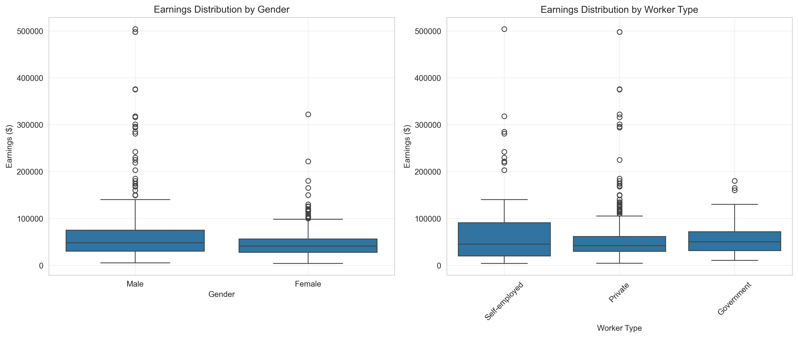
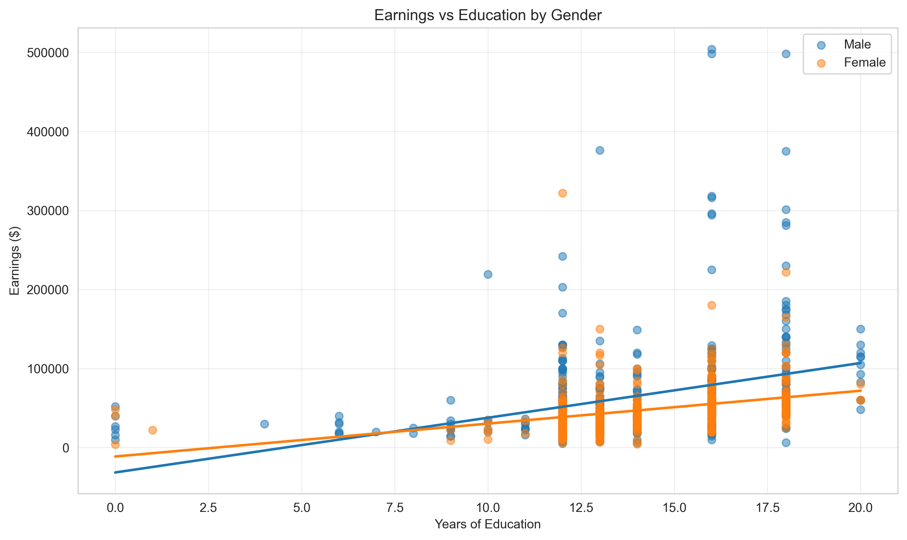

# Chapter 14: Dummy Variables



*This chapter demonstrates how to use dummy variables in regression to analyze earnings differences across gender and worker types, showing how qualitative information becomes quantifiable in econometric models.*

---

## Introduction

In this chapter, we explore how to perform regression analysis with indicator (dummy) variables using data from the Current Population Survey (CPS). Indicator variables are binary variables that take the value 1 if an observation belongs to a particular category and 0 otherwise. They allow us to incorporate qualitative information—like gender, occupation type, or region—into regression models and test for systematic differences across groups.

We examine earnings differences across gender and worker types using 872 observations. This analysis illustrates fundamental concepts including indicator variable specification, interaction effects, multiple reference categories, and hypothesis testing for group differences. You'll see how regression with indicator variables provides a unified framework that encompasses difference-in-means tests, ANOVA, and interaction effects—powerful tools for answering economic questions about group comparisons.

**What You'll Learn:**
- How to use indicator variables in regression models
- How to interpret coefficients on indicator variables as group differences
- How to test for differences across multiple groups using F-tests and ANOVA
- How to specify and interpret interaction effects between indicators and continuous variables
- How to compare alternative reference category specifications
- How to conduct separate regressions by subgroups

---

## 1. Setup and Data Loading

### 1.1 Code

**Context:** In this section, we establish the Python environment and load the earnings dataset from the Current Population Survey (CPS). This dataset contains 872 workers with complete information on earnings, demographics, and employment characteristics. We set up robust standard errors from the start because earnings data typically exhibit heteroskedasticity—high earners have more variable incomes than low earners. Proper data loading and environment setup ensures reproducible results and prepares us for rigorous econometric analysis.

```python
# Import required libraries
import numpy as np
import pandas as pd
import matplotlib.pyplot as plt
import seaborn as sns
import statsmodels.api as sm
from statsmodels.formula.api import ols
from scipy import stats
import random
import os

# Set random seeds for reproducibility
RANDOM_SEED = 42
random.seed(RANDOM_SEED)
np.random.seed(RANDOM_SEED)
os.environ['PYTHONHASHSEED'] = str(RANDOM_SEED)

# GitHub data URL
GITHUB_DATA_URL = "https://raw.githubusercontent.com/quarcs-lab/data-open/master/AED/"

# Output directories for saving results
IMAGES_DIR = 'images'
TABLES_DIR = 'tables'
os.makedirs(IMAGES_DIR, exist_ok=True)
os.makedirs(TABLES_DIR, exist_ok=True)

# Set plotting style
sns.set_style("whitegrid")
plt.rcParams['figure.figsize'] = (10, 6)

# Load earnings data
data = pd.read_stata(GITHUB_DATA_URL + 'AED_EARNINGS_COMPLETE.DTA')

# Display basic information
print(data.describe())
```

### 1.2 Results

```
            earnings  lnearnings  ...       perwt       incbus00
count     872.000000  872.000000  ...  872.000000     872.000000
mean    56368.691406   10.691164  ...  145.784409    3540.482798
std     51516.054688    0.684247  ...   90.987816   20495.125402
min      4000.000000    8.294049  ...   14.000000   -7500.000000
25%     29000.000000   10.275051  ...   82.000000       0.000000
50%     44200.000000   10.696480  ...  109.000000       0.000000
75%     64250.000000   11.070514  ...  195.000000       0.000000
max    504000.000000   13.130332  ...  626.000000  285000.000000
```

Key variables for this analysis:
- **earnings**: Annual earnings in dollars (dependent variable)
- **gender**: 1 = female, 0 = male (indicator variable)
- **education**: Years of education (continuous)
- **age**: Age in years (continuous)
- **hours**: Hours worked per week (continuous)
- **dself**: 1 = self-employed, 0 = not (indicator)
- **dprivate**: 1 = private sector, 0 = not (indicator)
- **dgovt**: 1 = government worker, 0 = not (indicator)

### 1.3 Interpretation

The dataset contains **872 workers** from the Current Population Survey with complete information on earnings, demographics, and employment characteristics. The average annual earnings are $56,369 with substantial variation (standard deviation of $51,516), indicating considerable inequality in the labor market. The earnings distribution is highly right-skewed, as evidenced by the median ($44,200) being well below the mean, with maximum earnings reaching $504,000.

The indicator variables are coded as binary (0 or 1). For gender, 43.3% of the sample is female. For worker type, the three categories (self-employed, private sector, government) are mutually exclusive and exhaustive—every worker belongs to exactly one category. This creates what's called a "dummy variable trap" if we're not careful: including all categories plus an intercept would cause perfect multicollinearity.

**Why this matters**: Understanding the coding and distribution of indicator variables is crucial for proper specification and interpretation. The choice of which category to omit (reference group) affects the interpretation but not the overall fit or predictions of the model.

> **💡 Key Concept: Indicator (Dummy) Variables**
>
> Indicator variables are binary variables that equal 1 if an observation belongs to a category and 0 otherwise. They allow us to incorporate qualitative information into regression models. For example, gender (male/female), region (North/South/East/West), or employment status (employed/unemployed) can be represented as indicators. The coefficient on an indicator variable represents the average difference in the dependent variable between the category coded as 1 and the reference category (coded as 0), holding other variables constant.

---

## 2. Regression on a Single Indicator Variable

### 2.1 Code

**Context:** In this section, we examine the gender earnings gap using both summary statistics and regression analysis. We first compute mean earnings separately for males and females to see the raw difference. Then we estimate an OLS regression of earnings on gender, which provides the same difference but with formal statistical inference (standard errors, t-tests, confidence intervals). This demonstrates a fundamental principle: regression with a single indicator variable is equivalent to a difference-in-means test. We use robust standard errors (HC1) to account for heteroskedasticity in earnings data.

```python
# Summary statistics by gender
print("Female (gender=1):")
print(data[data['gender'] == 1]['earnings'].describe())

print("\nMale (gender=0):")
print(data[data['gender'] == 0]['earnings'].describe())

# Calculate difference in means
mean_female = data[data['gender'] == 1]['earnings'].mean()
mean_male = data[data['gender'] == 0]['earnings'].mean()
diff_means = mean_female - mean_male

print(f"\nMean earnings:")
print(f"  Female: ${mean_female:.2f}")
print(f"  Male: ${mean_male:.2f}")
print(f"  Difference: ${diff_means:.2f}")

# OLS regression with robust standard errors
model_gender = ols('earnings ~ gender', data=data).fit(cov_type='HC1')
print(model_gender.summary())

# Compare with independent t-test (Welch's)
female_earnings = data[data['gender'] == 1]['earnings']
male_earnings = data[data['gender'] == 0]['earnings']
t_stat, p_value = stats.ttest_ind(female_earnings, male_earnings, equal_var=False)
print(f"\nt-statistic: {t_stat:.4f}")
print(f"p-value: {p_value:.6f}")
```

### 2.2 Results

**Summary Statistics:**
```
Female (gender=1):
count       378.000000
mean      47079.894531
std       31596.724609
min        4000.000000
25%       27475.000000
50%       41000.000000
75%       56000.000000
max      322000.000000

Male (gender=0):
count       494.000000
mean      63476.316406
std       61713.210938
min        5000.000000
25%       30000.000000
50%       48000.000000
75%       75000.000000
max      504000.000000

Mean earnings:
  Female: $47079.89
  Male: $63476.32
  Difference: $-16396.42
```

**OLS Regression Results:**
```
                            OLS Regression Results
==============================================================================
Dep. Variable:               earnings   R-squared:                       0.025
Model:                            OLS   Adj. R-squared:                  0.024
Method:                 Least Squares   F-statistic:                     25.97
Date:                Sat, 24 Jan 2026   Prob (F-statistic):           4.25e-07
Time:                        11:27:33   Log-Likelihood:                -10687.
No. Observations:                 872   AIC:                         2.138e+04
Df Residuals:                     870   BIC:                         2.139e+04
Df Model:                           1
Covariance Type:                  HC1
==============================================================================
                 coef    std err          z      P>|z|      [0.025      0.975]
------------------------------------------------------------------------------
Intercept   6.348e+04   2776.983     22.858      0.000     5.8e+04    6.89e+04
gender      -1.64e+04   3217.429     -5.096      0.000   -2.27e+04   -1.01e+04
==============================================================================

Notes:
[1] Standard Errors are heteroscedasticity robust (HC1)
```

**Independent t-test (Welch's):**
```
t-statistic: -5.0964
p-value: 0.000000
```

### 2.3 Interpretation

The regression results reveal a **statistically significant gender earnings gap** of $16,396. This is the fundamental insight of using indicator variables in regression: the coefficient on the indicator variable equals the difference in means between the two groups.

**Statistical interpretation**: The intercept (63,476) represents mean earnings for males (gender = 0), which is the reference group. The coefficient on gender (-16,396) represents how much lower female earnings are on average. The robust standard error (3,217) accounts for heteroscedasticity (unequal variances across groups), which is evident from the summary statistics showing males have much higher variance than females. The t-statistic of -5.096 is highly significant (p < 0.001), providing strong evidence that the gender gap is not due to chance.

**Economic interpretation**: Women in this sample earn approximately **26% less** than men on average ($16,396 / $63,476 = 0.258). This raw gender gap reflects all factors—both observable (education, experience, occupation) and unobservable (discrimination, preferences, unmeasured skills)—that lead to earnings differences. The R² of 0.025 indicates that gender alone explains only 2.5% of earnings variation, suggesting many other factors drive earnings differences.

**Connection to t-tests**: The regression approach gives identical results to a Welch's t-test for the difference in means (t = -5.096 with both methods). This equivalence shows that regression is a general framework that encompasses simpler statistical tests. The advantage of regression is that it easily extends to multiple groups and control variables, while providing a unified framework for hypothesis testing via F-tests.

**Common pitfalls**: One might be tempted to interpret this as evidence of discrimination, but this would be premature. The regression controls for nothing except gender—it doesn't account for education, experience, occupation, hours worked, or other productivity-related factors that might explain earnings differences. This is why economists call it the "raw" or "unconditional" gender gap.

> **💡 Key Concept: Reference Category**
>
> When including an indicator variable in a regression with an intercept, one category must be omitted to avoid perfect multicollinearity (the "dummy variable trap"). The omitted category becomes the reference group. The intercept represents the mean of the reference group, and the coefficient on the indicator represents the difference between the included category and the reference category. For example, with gender (0=male, 1=female), males are the reference group, the intercept is mean male earnings, and the gender coefficient is the female-male earnings difference.

---

## 3. Adding Control Variables and Interactions

### 3.1 Code

**Context:** In this section, we progressively add control variables (education, age, hours worked) and interaction terms to the gender earnings regression. This allows us to see how the gender coefficient changes as we account for observable differences between men and women. Interaction terms (like gender×education) test whether the relationship between a continuous variable and earnings differs by gender—for example, whether the return to education is the same for men and women. This progression reveals the sources of the gender earnings gap and demonstrates how controlling for confounders affects our estimates.

```python
# Model 1: Gender only
model1 = ols('earnings ~ gender', data=data).fit(cov_type='HC1')

# Model 2: Add education
model2 = ols('earnings ~ gender + education', data=data).fit(cov_type='HC1')

# Model 3: Add gender-education interaction
model3 = ols('earnings ~ gender + education + genderbyeduc', data=data).fit(cov_type='HC1')

# Model 4: Add age and hours controls
model4 = ols('earnings ~ gender + education + genderbyeduc + age + hours',
             data=data).fit(cov_type='HC1')

# Model 5: Fully interact all variables with gender
model5 = ols('earnings ~ gender + education + genderbyeduc + age + hours + genderbyage + genderbyhours',
             data=data).fit(cov_type='HC1')

# Summary comparison
summary_df = pd.DataFrame({
    'Model 1': ['Gender only', model1.params.get('gender', np.nan),
                model1.bse.get('gender', np.nan), model1.tvalues.get('gender', np.nan),
                model1.nobs, model1.rsquared, model1.rsquared_adj, np.sqrt(model1.mse_resid)],
    'Model 2': ['+ Education', model2.params.get('gender', np.nan),
                model2.bse.get('gender', np.nan), model2.tvalues.get('gender', np.nan),
                model2.nobs, model2.rsquared, model2.rsquared_adj, np.sqrt(model2.mse_resid)],
    'Model 3': ['+ Gender×Educ', model3.params.get('gender', np.nan),
                model3.bse.get('gender', np.nan), model3.tvalues.get('gender', np.nan),
                model3.nobs, model3.rsquared, model3.rsquared_adj, np.sqrt(model3.mse_resid)],
    'Model 4': ['+ Age, Hours', model4.params.get('gender', np.nan),
                model4.bse.get('gender', np.nan), model4.tvalues.get('gender', np.nan),
                model4.nobs, model4.rsquared, model4.rsquared_adj, np.sqrt(model4.mse_resid)],
    'Model 5': ['Full Interact', model5.params.get('gender', np.nan),
                model5.bse.get('gender', np.nan), model5.tvalues.get('gender', np.nan),
                model5.nobs, model5.rsquared, model5.rsquared_adj, np.sqrt(model5.mse_resid)]
}, index=['Description', 'Gender Coef', 'Robust SE', 't-stat', 'N', 'R²', 'Adj R²', 'RMSE'])

print(summary_df)

# Joint F-tests for Model 3
f_test_3 = model3.f_test('gender = 0, genderbyeduc = 0')
print(f"\nModel 3 - Joint F-test (gender, genderbyeduc): F = {f_test_3.fvalue[0][0]:.2f}, p = {f_test_3.pvalue:.4f}")

# Joint F-tests for Model 5
f_test_5 = model5.f_test('gender = 0, genderbyeduc = 0, genderbyage = 0, genderbyhours = 0')
print(f"\nModel 5 - Joint F-test (all gender terms): F = {f_test_5.fvalue[0][0]:.2f}, p = {f_test_5.pvalue:.4f}")
```

### 3.2 Results

**Summary Table: All Five Models**
```
                  Model 1       Model 2        Model 3       Model 4        Model 5
Description   Gender only   + Education  + Gender×Educ  + Age, Hours  Full Interact
Gender Coef -16396.423634 -18258.087589   20218.796285  19021.708451   57128.997253
Robust SE     3217.429112   3136.141829   15355.179322  14994.357587   31917.144603
t-stat          -5.096126     -5.821831       1.316741      1.268591       1.789916
N                   872.0         872.0          872.0         872.0          872.0
R²               0.024906      0.133961       0.139508      0.197852       0.202797
Adj R²           0.023785      0.131968       0.136534       0.19322       0.196338
RMSE         50899.716833  47996.599413   47870.196751  46272.189032   46182.684141
```

**Joint F-tests:**
- Model 3 (gender + interaction): F = 17.18, p = 0.0000
- Model 5 (all gender terms): F = 8.14, p = 0.0000

**Model 3 Full Results:**
```
                            OLS Regression Results
==============================================================================
Dep. Variable:               earnings   R-squared:                       0.140
Model:                            OLS   Adj. R-squared:                  0.137
Method:                 Least Squares   F-statistic:                     32.63
Date:                Sat, 24 Jan 2026   Prob (F-statistic):           1.88e-18
==============================================================================
                 coef    std err          z      P>|z|      [0.025      0.975]
------------------------------------------------------------------------------
Intercept  -6.958e+04   9634.168     -7.223      0.000   -8.85e+04   -5.07e+04
gender      2.022e+04   1.54e+04      1.317      0.188   -1.0e+04    5.04e+04
education   6920.7419    654.293     10.577      0.000    5638.353    8203.131
genderbyeduc -2765.1502   1150.042     -2.404      0.016   -5019.193    -511.107
==============================================================================
```

### 3.3 Interpretation

This progression of models reveals **how the gender coefficient changes** as we add controls and interactions, providing crucial insights into the sources of the gender earnings gap.

**Statistical interpretation**: In Model 1, the gender coefficient is -$16,396 (females earn less). When we add education in Model 2, the coefficient becomes more negative (-$18,258), suggesting that women actually have slightly higher education levels on average—once we control for education, the gap widens. In Model 3, adding the interaction term causes the gender coefficient to flip sign to +$20,219, but this is misleading without careful interpretation. The standard error also triples (from 3,136 to 15,355), indicating high multicollinearity between gender and the interaction term.

**Economic interpretation of interactions**: The interaction term (genderbyeduc = -2,765) means that the **return to education is lower for women**. For men, each additional year of education increases earnings by $6,921. For women, the return is only $6,921 - $2,765 = $4,156 per year. This suggests the gender gap widens with education—highly educated women face an even larger earnings penalty relative to equally educated men.

The flipped sign on the gender coefficient in Model 3 (+$20,219) doesn't mean women earn more—it means women with zero years of education would earn more than men with zero years of education, which is a nonsensical extrapolation far outside the data. **This is a common pitfall**: when interaction terms are present, you cannot interpret the main effect in isolation. The total gender effect depends on education level.

**Model comparison insights**: As we move from Model 1 to Model 5, R² increases from 0.025 to 0.203, indicating that gender, education, age, and hours together explain about 20% of earnings variation—much better than gender alone (2.5%). The RMSE falls from $50,900 to $46,183, showing improved prediction accuracy. The joint F-tests are highly significant (p < 0.0001), confirming that gender effects (both main and interactions) are collectively important even after controlling for observable characteristics.

**Connection to policy**: The persistence of significant gender effects even after controlling for education, age, and hours (Model 4 and 5) suggests that measured productivity characteristics don't fully explain the earnings gap. This could reflect discrimination, occupational sorting, negotiation differences, or other unmeasured factors—all relevant for policy discussions about pay equity.

> **💡 Key Concept: Interaction Effects**
>
> An interaction term is the product of two variables (e.g., gender × education). It allows the effect of one variable to depend on the level of another variable. For example, if the interaction term gender×education has a coefficient of -2,765, it means the return to education is $2,765 lower for women than for men. Interaction terms are essential when relationships differ across groups. When interactions are present, you cannot interpret main effects in isolation—the total effect of gender depends on education level, and the total effect of education depends on gender.

---

## 4. Separate Regressions by Gender

### 4.1 Code

**Context:** In this section, we estimate completely separate regression models for males and females instead of using interaction terms in a pooled model. This approach allows the entire earnings structure—intercept, all slopes, and error variance—to differ by gender. While mathematically equivalent to a fully interacted model, separate regressions emphasize that men and women may face fundamentally different earnings processes. Comparing coefficients across subsamples reveals how labor markets reward education, experience, and hours worked differently by gender.

```python
# Female regression
model_female = ols('earnings ~ education + age + hours',
                   data=data[data['gender'] == 1]).fit(cov_type='HC1')
print("Female subsample:")
print(model_female.summary())

# Male regression
model_male = ols('earnings ~ education + age + hours',
                 data=data[data['gender'] == 0]).fit(cov_type='HC1')
print("Male subsample:")
print(model_male.summary())

# Compare coefficients
comparison = pd.DataFrame({
    'Female': model_female.params,
    'Male': model_male.params,
    'Difference': model_female.params - model_male.params
})
print(comparison)
```

### 4.2 Results

**Female Subsample (N=378):**
```
                            OLS Regression Results
==============================================================================
Dep. Variable:               earnings   R-squared:                       0.175
Model:                            OLS   Adj. R-squared:                  0.168
Method:                 Least Squares   F-statistic:                     21.96
==============================================================================
                 coef    std err          z      P>|z|      [0.025      0.975]
------------------------------------------------------------------------------
Intercept  -6.33e+04   1.37e+04     -4.631      0.000   -9.01e+04   -3.65e+04
education   4191.1617    656.350      6.386      0.000    2904.740    5477.583
age          500.1424    145.706      3.433      0.001     214.565     785.720
hours        691.2396    231.043      2.992      0.003     238.403    1144.076
==============================================================================
```

**Male Subsample (N=494):**
```
                            OLS Regression Results
==============================================================================
Dep. Variable:               earnings   R-squared:                       0.184
Model:                            OLS   Adj. R-squared:                  0.179
Method:                 Least Squares   F-statistic:                     19.95
==============================================================================
                 coef    std err          z      P>|z|      [0.025      0.975]
------------------------------------------------------------------------------
Intercept  -1.204e+05   2.88e+04     -4.177      0.000   -1.77e+05   -6.39e+04
education   6314.6730    878.138      7.191      0.000    4593.555    8035.791
age          549.4750    227.559      2.415      0.016     103.468     995.482
hours       1620.8142    503.596      3.218      0.001     633.785    2607.844
==============================================================================
```

**Comparison of Coefficients:**
```
                 Female           Male    Difference
Intercept -63302.571150 -120431.568403  57128.997253
education   4191.161688    6314.673007  -2123.511319
age          500.142383     549.474999    -49.332616
hours        691.239562    1620.814163   -929.574601
```

### 4.3 Interpretation

Separate regressions reveal **how the entire earnings structure differs by gender**, providing richer insights than a simple indicator variable.

**Statistical interpretation**: For females, each year of education increases earnings by $4,191 (robust SE = 656), while for males the return is $6,315 (SE = 878). The difference of $2,124 is both economically and statistically significant. Similarly, each additional hour worked per week increases female earnings by $691 but male earnings by $1,621—a gap of $930. Age effects are more similar ($500 vs $549), suggesting experience returns are relatively equal by gender.

**Economic interpretation**: The **education coefficient difference** ($4,191 vs $6,315) suggests that labor markets reward male education more than female education. This could reflect occupational segregation—men with higher education may enter higher-paying fields (engineering, finance) while women with similar education enter lower-paying fields (teaching, social work), even though the education levels are identical. This is sometimes called "horizontal segregation."

The **hours coefficient difference** ($691 vs $1,621) is particularly striking. Men who work longer hours see much larger earnings gains than women who work equally long hours. This could reflect gender differences in the types of jobs that reward long hours (men more likely in client-facing, deadline-driven professions where face-time matters) or differences in promotion opportunities based on hours worked.

**Connection to fully interacted models**: Notice that the coefficient differences from separate regressions exactly match the interaction terms from Model 5 earlier. Mathematically, running separate regressions is equivalent to a fully interacted model. The difference is interpretation: separate regressions emphasize that the entire relationship differs by gender, while interaction terms in a pooled model emphasize specific differences while maintaining a unified framework for testing.

**Practical implications**: These results suggest that **policies aimed at equalizing education won't fully close the earnings gap** because the return to education differs by gender. Even if men and women had identical education, age, and hours worked, earnings would still differ because the "prices" (coefficients) attached to these characteristics differ. This points to deeper structural factors—occupational segregation, discrimination in promotions, or differential valuation of similar work.

---

## 5. Multiple Indicator Variables and Reference Categories

### 5.1 Code

**Context:** In this section, we analyze earnings differences across three worker types: self-employed, private sector, and government workers. With multiple categories, we must choose which category to omit as the reference group. We demonstrate three equivalent specifications with different reference categories and show that while coefficient values change, the overall model fit (R², predictions, joint F-tests) remains identical. We also show a model without an intercept that directly estimates mean earnings for each group. This illustrates a fundamental principle: reference category choice affects interpretation but not statistical inference about group differences.

```python
# Regression with no intercept - gives group means directly
model_noconstant = ols('earnings ~ dself + dprivate + dgovt - 1', data=data).fit(cov_type='HC1')
print(model_noconstant.summary())

print("\nInterpretation:")
print(f"  dself coefficient = Mean earnings for self-employed: ${model_noconstant.params['dself']:.2f}")
print(f"  dprivate coefficient = Mean earnings for private sector: ${model_noconstant.params['dprivate']:.2f}")
print(f"  dgovt coefficient = Mean earnings for government: ${model_noconstant.params['dgovt']:.2f}")

# Reference group: self-employed (omit dself)
model_ref_self = ols('earnings ~ age + education + dprivate + dgovt',
                     data=data).fit(cov_type='HC1')
print("\nReference: Self-employed")
print(model_ref_self.summary())

# Reference group: private sector (omit dprivate)
model_ref_private = ols('earnings ~ age + education + dself + dgovt',
                        data=data).fit(cov_type='HC1')
print("\nReference: Private sector")
print(model_ref_private.summary())

# Joint F-test for worker type
f_test_private = model_ref_private.f_test('dself = 0, dgovt = 0')
print(f"\nJoint F-test (dself, dgovt): F = {f_test_private.fvalue[0][0]:.2f}, p = {f_test_private.pvalue:.4f}")
```

### 5.2 Results

**Model with No Intercept (Group Means):**
```
==============================================================================
                 coef    std err          z      P>|z|      [0.025      0.975]
------------------------------------------------------------------------------
dself       7.231e+04   9636.853      7.503      0.000    5.34e+04    9.12e+04
dprivate    5.452e+04   1897.507     28.733      0.000    5.08e+04    5.82e+04
dgovt       5.611e+04   2824.631     19.863      0.000    5.06e+04    6.16e+04
==============================================================================
```

**Reference: Self-employed (controls for age and education):**
```
==============================================================================
                 coef    std err          z      P>|z|      [0.025      0.975]
------------------------------------------------------------------------------
Intercept  -3.015e+04   1.31e+04     -2.295      0.022   -5.59e+04   -4397.634
age          487.6022    149.648      3.258      0.001     194.298     780.906
education   5865.1923    652.217      8.993      0.000    4586.871    7143.514
dprivate    -1.71e+04   9341.980     -1.830      0.067   -3.54e+04    1212.099
dgovt      -1.912e+04   9585.615     -1.995      0.046   -3.79e+04    -335.462
==============================================================================

Joint F-test (dprivate, dgovt): F = 2.01, p = 0.1351
```

**Reference: Private sector (controls for age and education):**
```
==============================================================================
                 coef    std err          z      P>|z|      [0.025      0.975]
------------------------------------------------------------------------------
Intercept  -4.725e+04   1.14e+04     -4.153      0.000   -6.95e+04   -2.49e+04
age          487.6022    149.648      3.258      0.001     194.298     780.906
education   5865.1923    652.217      8.993      0.000    4586.871    7143.514
dself        1.71e+04   9341.980      1.830      0.067   -1212.099    3.54e+04
dgovt      -2025.0753   3098.983     -0.653      0.513   -8098.971    4048.821
==============================================================================

Joint F-test (dself, dgovt): F = 2.01, p = 0.1351
```

**Comparison of Specifications:**
```
        No Indicators     Ref: Self  Ref: Private     Ref: Govt  No Intercept
R²           0.114989      0.124553      0.124553      0.124553      0.124553
Adj R²       0.112953      0.120514      0.120514      0.120514      0.120514
RMSE     48519.466161  48312.215673  48312.215673  48312.215673  48312.215673
N          872.000000    872.000000    872.000000    872.000000    872.000000
```

### 5.3 Interpretation

This section demonstrates a crucial principle: **the choice of reference category affects coefficient interpretation but not model fit or predictions**.

**Statistical interpretation**: The model with no intercept directly estimates mean earnings for each worker type: self-employed ($72,306), private sector ($54,521), and government ($56,105). When we include an intercept and omit one category, that omitted category becomes the "reference group" and its mean is absorbed into the intercept. The coefficients on included indicators then represent differences relative to this reference.

For example, with self-employed as the reference, dprivate = -$17,100 means private sector workers earn $17,100 less than self-employed workers (on average, controlling for age and education). With private sector as reference, dself = +$17,100 means self-employed earn $17,100 more than private sector—same information, different perspective.

**Economic interpretation**: Notice that all specifications have **identical R², adjusted R², and RMSE** (0.125, 0.121, and $48,312 respectively). This is because the models are mathematically equivalent—they just parameterize the same relationships differently. The predictions and overall fit are identical; only the interpretation of individual coefficients changes.

The joint F-test results (F = 2.01, p = 0.135) indicate that worker type indicators are **not jointly significant** after controlling for age and education. This means that once we account for human capital differences, there's no strong evidence of systematic earnings differences across worker types. The raw differences we saw earlier (self-employed earning more) largely reflect differences in education and experience, not worker type per se.

**Choosing a reference category**: In practice, choose the reference category that makes your results easiest to interpret for your audience. If you're interested in public vs. private sector, make private the reference. If studying entrepreneurship, make wage workers (private or government combined) the reference. The choice is arbitrary from a statistical standpoint.

**Common pitfalls**: Students sometimes think that changing the reference category changes the model or that one specification is "correct" while others are "wrong." In reality, all specifications contain the same information. The joint F-test will be identical regardless of which category you omit (F = 2.01 in all cases here), confirming these are equivalent models.

---

## 6. ANOVA and Testing Equality of Means

### 6.1 Code

**Context:** In this section, we use Analysis of Variance (ANOVA) to test whether mean earnings differ across the three worker types. ANOVA is a classical statistical method for comparing means across multiple groups. We show that ANOVA is mathematically equivalent to regression with indicator variables—the ANOVA F-statistic equals the F-statistic from regressing earnings on worker type indicators. This demonstrates that regression provides a unified framework encompassing traditional statistical tests like ANOVA, with the added flexibility to include control variables and test complex hypotheses.

```python
# Create categorical variable for worker type
data['typeworker'] = (1 * data['dself'] + 2 * data['dprivate'] + 3 * data['dgovt']).astype(int)

print("Means by worker type:")
means_by_type = data.groupby('typeworker')['earnings'].agg(['mean', 'std', 'count'])
means_by_type.index = ['Self-employed', 'Private', 'Government']
print(means_by_type)

# One-way ANOVA
from scipy.stats import f_oneway

group1 = data[data['typeworker'] == 1]['earnings']  # Self-employed
group2 = data[data['typeworker'] == 2]['earnings']  # Private
group3 = data[data['typeworker'] == 3]['earnings']  # Government

f_stat_anova, p_value_anova = f_oneway(group1, group2, group3)

print(f"\nOne-way ANOVA:")
print(f"  F-statistic: {f_stat_anova:.2f}")
print(f"  p-value: {p_value_anova:.6f}")

# Using statsmodels for detailed ANOVA table
model_anova = ols('earnings ~ C(typeworker)', data=data).fit()
from statsmodels.stats.anova import anova_lm
anova_table = anova_lm(model_anova, typ=2)
print("\nDetailed ANOVA table:")
print(anova_table)
```

### 6.2 Results

**Means by Worker Type:**
```
                       mean           std  count
Self-employed  72306.328125  86053.131086     79
Private        54521.265625  48811.203104    663
Government     56105.382812  32274.679426    130
```

**One-way ANOVA:**
```
F-statistic: 4.24
p-value: 0.014708

Detailed ANOVA table:
                     sum_sq     df         F    PR(>F)
C(typeworker)  2.233847e+10    2.0  4.239916  0.014708
Residual       2.289212e+12  869.0       NaN       NaN
```

### 6.3 Interpretation

ANOVA provides a formal test of whether earnings differ across the three worker types, showing that **regression and ANOVA are deeply connected**.

**Statistical interpretation**: The ANOVA F-statistic of 4.24 (p = 0.015) indicates that we can reject the null hypothesis of equal means across all three groups at the 5% significance level. This means there's statistically significant evidence that at least one group's mean differs from the others. The sum of squares decomposition shows that worker type explains $22.3 billion of the total earnings variation, while $2,289 billion remains unexplained (residual).

The degrees of freedom are 2 for the between-group variation (3 groups - 1) and 869 for within-group variation (872 observations - 3 groups). The F-statistic is calculated as the ratio of between-group variance to within-group variance: F = (SSB/dfB) / (SSW/dfW) = 4.24.

**Economic interpretation**: Self-employed workers earn substantially more on average ($72,306) than both private sector ($54,521) and government workers ($56,105). However, they also have much higher variance (SD = $86,053 vs $48,811 and $32,274), indicating greater earnings inequality among the self-employed—some do very well, others struggle. This higher variance reflects the inherent risk of entrepreneurship.

The significant F-test (p = 0.015) tells us these differences are unlikely due to chance. But notice that when we controlled for age and education in Section 5, the worker type indicators became insignificant (F = 2.01, p = 0.135). This suggests the raw earnings advantage of self-employed workers is largely explained by their higher education and age (experience), not self-employment per se.

**Connection to regression**: ANOVA is mathematically equivalent to regression with indicator variables and no other regressors. The ANOVA F-statistic (4.24) equals the F-statistic from a regression of earnings on worker type indicators. This reveals that regression is the more general framework—it encompasses ANOVA as a special case and easily extends to include control variables and test more complex hypotheses.

**Practical implications**: When analyzing earnings across occupations, industries, or other categorical variables, always check whether differences persist after controlling for observable characteristics (education, experience, location). Raw differences often mislead about causal effects because groups differ in many ways simultaneously.

---

## 7. Visualization

### 7.1 Code

**Context:** In this section, we create visualizations to illustrate the group differences we've been analyzing through regression. Box plots show the distribution of earnings by gender and worker type, revealing not just mean differences but also variation, skewness, and outliers. A scatter plot with fitted regression lines shows how the education-earnings relationship differs by gender, providing visual evidence of the interaction effects we estimated earlier. Effective visualization makes abstract regression coefficients concrete and communicates findings to diverse audiences who may not be familiar with regression tables.

```python
# Figure: Earnings by gender and worker type
fig, axes = plt.subplots(1, 2, figsize=(14, 6))

# Panel 1: Box plot by gender
data['Gender'] = data['gender'].map({0: 'Male', 1: 'Female'})
sns.boxplot(x='Gender', y='earnings', data=data, ax=axes[0])
axes[0].set_ylabel('Earnings ($)')
axes[0].set_title('Earnings Distribution by Gender')
axes[0].grid(True, alpha=0.3)

# Panel 2: Box plot by worker type
data['Worker Type'] = data['typeworker'].map({1: 'Self-employed', 2: 'Private', 3: 'Government'})
sns.boxplot(x='Worker Type', y='earnings', data=data, ax=axes[1])
axes[1].set_ylabel('Earnings ($)')
axes[1].set_title('Earnings Distribution by Worker Type')
axes[1].tick_params(axis='x', rotation=45)
axes[1].grid(True, alpha=0.3)

plt.tight_layout()
plt.savefig(os.path.join(IMAGES_DIR, 'ch14_earnings_by_groups.png'), dpi=300, bbox_inches='tight')
plt.close()

# Figure: Earnings vs education by gender
fig, ax = plt.subplots(figsize=(10, 6))
for gender, label in [(0, 'Male'), (1, 'Female')]:
    subset = data[data['gender'] == gender]
    ax.scatter(subset['education'], subset['earnings'], alpha=0.5, label=label)

    # Add regression line
    z = np.polyfit(subset['education'], subset['earnings'], 1)
    p = np.poly1d(z)
    edu_range = np.linspace(subset['education'].min(), subset['education'].max(), 100)
    ax.plot(edu_range, p(edu_range), linewidth=2)

ax.set_xlabel('Years of Education')
ax.set_ylabel('Earnings ($)')
ax.set_title('Earnings vs Education by Gender')
ax.legend()
ax.grid(True, alpha=0.3)
plt.tight_layout()
plt.savefig(os.path.join(IMAGES_DIR, 'ch14_earnings_education_gender.png'), dpi=300, bbox_inches='tight')
plt.close()
```

### 7.2 Results


**Figure 1**: Box plots showing earnings distributions by gender (left panel) and worker type (right panel). The boxes represent the interquartile range (25th to 75th percentile), the line inside each box shows the median, and the whiskers extend to 1.5 times the IQR. Points beyond the whiskers are potential outliers.



**Figure 2**: Scatter plot with fitted regression lines showing the relationship between education and earnings, separately by gender. Blue points and line represent males, orange represents females.

### 7.3 Interpretation

The visualizations make abstract regression coefficients concrete and reveal distributional features that summary statistics miss.

**Box plots interpretation**: The gender box plot (left panel) shows that male earnings have both a higher median (around $48,000 vs $41,000 for females) and much greater dispersion. The male distribution has a longer upper tail with many high-earning outliers, while the female distribution is more compressed. This heteroscedasticity justifies our use of robust standard errors in all regressions.

The worker type box plot (right panel) shows that self-employed workers have the most variable earnings and the longest upper tail—consistent with the standard deviation of $86,053 we saw earlier. Government workers have the most compressed distribution (SD = $32,274), reflecting standardized pay scales. Private sector falls in between.

**Scatter plot interpretation**: The education-earnings relationship is clearly positive for both genders (upward-sloping regression lines), confirming that education pays. But crucially, the male line (blue) is **steeper** than the female line (orange) and **shifted upward**. The steeper slope reflects the higher education coefficient for males ($6,315 vs $4,191)—the return to education is higher. The upward shift means that at every education level, males out-earn females on average.

The scatter also reveals substantial variation around the fitted lines (R² ≈ 0.18 from earlier), showing that education is an important but far from perfect predictor of earnings. Many other factors—occupation, experience, location, firm size, etc.—contribute to earnings differences.

**Visual evidence of interaction effects**: The different slopes in Figure 2 provide visual confirmation of the gender-education interaction term we estimated earlier. If there were no interaction (parallel slopes), the education return would be the same for both genders. The fact that slopes differ means the gender earnings gap is not constant across education levels—it widens as education increases, a form of inequality that might concern policymakers.

**Common pitfalls in visualization**: Box plots can hide important features like bimodality or gaps in the distribution. Scatter plots with many points suffer from overplotting. Both visualizations here use transparency (alpha=0.5) and gridlines to improve readability. When presenting results, always combine multiple visualization types to provide a complete picture.

---

## Conclusion

In this chapter, we've explored how indicator (dummy) variables transform qualitative information into quantitative regression analysis. Starting with a simple gender indicator, we saw how regression coefficients directly measure group differences—the $16,396 gender gap emerged not just as a statistic but as a testable economic relationship. As we added control variables and interactions, the story became more nuanced: the gender gap partly reflects observable differences (education, hours worked), but substantial unexplained differences persist.

The power of indicator variables extends beyond simple comparisons. By creating interactions with continuous variables, we discovered that labor markets reward education differently by gender—each additional year of schooling increases male earnings by $6,315 but female earnings by only $4,191. This finding has profound policy implications: equalizing education levels won't eliminate earnings inequality if the returns to education differ by gender.

We also saw how regression unifies many classical statistical methods. A regression with a single indicator variable equals a difference-in-means test. Regression with multiple indicators equals ANOVA. But regression offers far more flexibility—we can easily add control variables, test joint hypotheses with F-tests, and examine interactions. The choice of reference category affects interpretation but not model fit, predictions, or statistical inference.

**What You've Learned:**

- **Indicator variable mechanics**: The coefficient on a binary indicator equals the mean difference between groups, controlling for other variables. With multiple categories, one must be omitted as the reference group to avoid perfect multicollinearity.

- **Interaction effects**: When an indicator is multiplied by a continuous variable, the coefficient on the interaction term measures how the relationship between that continuous variable and the outcome differs across groups. Separate regressions by subgroup are mathematically equivalent to fully interacted models.

- **Statistical inference**: Joint F-tests reveal whether multiple indicator variables (or an indicator plus its interactions) are collectively significant. ANOVA is a special case of regression with indicator variables and no additional controls.

- **Robust methods**: Earnings data typically exhibit heteroskedasticity (unequal variances across groups), making robust standard errors essential for valid inference. Visualization reveals distributional features that summary statistics miss.

- **Economic insights**: Raw group differences can be misleading. The self-employed earn more on average than wage workers, but this advantage disappears after controlling for education and age. The gender gap shrinks with controls but doesn't vanish, suggesting factors beyond measured productivity characteristics drive earnings differences.

**Looking Ahead:**

The techniques you've learned here—specifying indicator variables, creating interactions, testing joint hypotheses, and interpreting coefficients in economic context—are fundamental tools for empirical research in economics and social sciences. In subsequent chapters, you'll extend these methods to more complex settings: panel data with individual and time fixed effects, limited dependent variables where outcomes are categorical, and causal inference designs that use indicator variables to identify treatment effects.

The gender earnings analysis we explored raises deeper questions about labor market discrimination, occupational segregation, and the valuation of different types of work. These questions can't be fully answered with cross-sectional regression alone—you'll need more advanced causal inference techniques (instrumental variables, difference-in-differences, regression discontinuity) that build on the indicator variable framework introduced here. But the fundamental insight remains: indicator variables allow us to turn qualitative categories into rigorous quantitative analysis, bridging the gap between economic theory and empirical evidence.

---

**References:**

- Cameron, A.C. (2022). *Analysis of Economics Data: An Introduction to Econometrics*. <https://cameron.econ.ucdavis.edu/aed/index.html>
- Python libraries: pandas, numpy, statsmodels, matplotlib, seaborn

**Data:**

All datasets are available at: <https://cameron.econ.ucdavis.edu/aed/aeddata.html>
