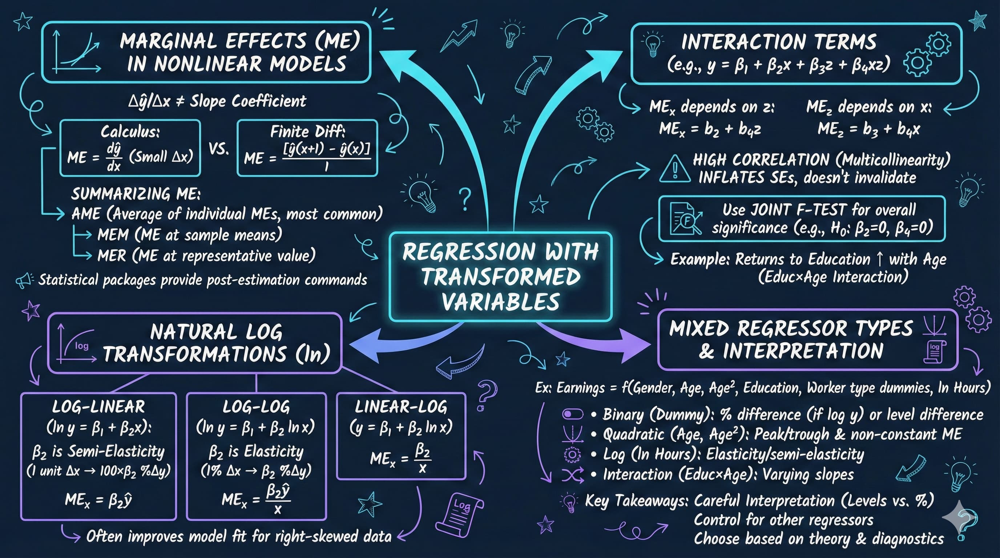

# Chapter 15: Interaction Effects



*This chapter demonstrates how interaction effects and variable transformations allow relationships to vary across different values of predictors, capturing nonlinear patterns and heterogeneous effects in earnings data.*

---

## Introduction

In this chapter, we explore how regression models can capture **relationships that vary**—where the effect of one variable depends on the value of another. We examine earnings relationships using various functional forms including quadratic models, interaction terms, and logarithmic transformations. Using Current Population Survey data with 872 full-time workers, this analysis illustrates how different functional forms change both the interpretation of coefficients and the quality of predictions.

Variable transformations are essential tools in econometric analysis. They allow researchers to capture nonlinear relationships (like diminishing returns to experience), model percentage changes and elasticities (through logarithms), and test whether relationships vary across different values of other variables (through interactions). Understanding when and how to use these transformations is crucial for accurately modeling real-world economic phenomena.

**What You'll Learn:**

- How to estimate quadratic and polynomial models for nonlinear relationships
- How to calculate and interpret marginal effects (AME, MEM, MER)
- How to specify and interpret interaction terms between continuous variables
- How to estimate and interpret log-linear and log-log models
- How to address retransformation bias when making predictions from log models
- How to compare model fit across different functional forms
- How to choose the appropriate transformation for your research question

---

## 1. Setup and Data Loading

### 1.1 Code

**Context:** In this section, we establish the Python environment and load the complete earnings dataset from the Current Population Survey. This dataset includes pre-computed transformations (logarithms, squares, interactions) that enable us to estimate various functional forms without manual data manipulation. Having these transformations pre-computed ensures consistency across analyses and allows us to focus on interpretation rather than data engineering.

```python
# Import required libraries
import numpy as np
import pandas as pd
import matplotlib.pyplot as plt
import seaborn as sns
import statsmodels.api as sm
from statsmodels.formula.api import ols
from statsmodels.stats.outliers_influence import variance_inflation_factor
from statsmodels.stats.diagnostic import het_white
from scipy import stats
import random
import os

# Set random seeds for reproducibility
RANDOM_SEED = 42
random.seed(RANDOM_SEED)
np.random.seed(RANDOM_SEED)
os.environ['PYTHONHASHSEED'] = str(RANDOM_SEED)

# GitHub data URL
GITHUB_DATA_URL = "https://raw.githubusercontent.com/quarcs-lab/data-open/master/AED/"

# Output directories
IMAGES_DIR = 'images'
TABLES_DIR = 'tables'
os.makedirs(IMAGES_DIR, exist_ok=True)
os.makedirs(TABLES_DIR, exist_ok=True)

# Set plotting style
sns.set_style("whitegrid")
plt.rcParams['figure.figsize'] = (10, 6)

# Load earnings data
data_earnings = pd.read_stata(GITHUB_DATA_URL + 'AED_EARNINGS_COMPLETE.DTA')

# Display summary statistics
print(data_earnings.describe())
```

### 1.2 Results

**Key Variables Summary:**
```
            earnings  lnearnings        age      agesq  education   lnage     hours   lnhours
count     872.000000  872.000000  872.000000  872.00000  872.00000  872.00  872.0000  872.0000
mean    56368.691406   10.691164   43.751854  2036.2912   14.03306    3.76   44.3429    3.777
std     51516.054688    0.684247   10.678206   953.8502    2.56935    0.24    8.4991    0.165
min      4000.000000    8.294049   25.000000   625.0000    8.00000    3.22   35.0000    3.555
25%     29000.000000   10.275051   35.000000  1225.0000   12.00000    3.56   40.0000    3.689
50%     44200.000000   10.696480   43.000000  1849.0000   14.00000    3.76   40.0000    3.689
75%     64250.000000   11.070514   52.000000  2704.0000   16.00000    3.95   48.0000    3.871
max    504000.000000   13.130332   65.000000  4225.0000   21.00000    4.17   99.0000    4.595
```

### 1.3 Interpretation

The dataset contains multiple transformed versions of key variables, enabling us to estimate various functional forms without manual data manipulation. The dataset includes:

- **earnings** and **lnearnings**: Both levels and natural log of annual earnings
- **age**, **agesq**, and **lnage**: Age in levels, squared, and natural log
- **education** and **educsquared**: Years of education in levels and squared
- **hours** and **lnhours**: Hours worked per week in levels and natural log
- **Interaction terms**: Pre-computed interactions like agebyeduc (age × education)

The log-transformed variables have much smaller standard deviations than their level counterparts (e.g., lnearnings SD = 0.68 vs earnings SD = 51,516), which can improve numerical stability in estimation. The availability of squared terms allows us to test for diminishing returns or inverted U-shapes without concern about centering or scaling.

**Why this matters**: Having pre-computed transformations ensures consistency across analyses and reduces the risk of coding errors. However, researchers must understand what each transformation implies for interpretation—a unit change in lnage has a completely different meaning than a unit change in age.

---

## 2. Quadratic and Polynomial Models

### 2.1 Code

**Context:** In this section, we estimate quadratic models that capture the inverted U-shaped relationship between age and earnings—a fundamental pattern in labor economics known as the "age-earnings profile." Quadratic models add a squared term (age²) to the regression, allowing the marginal effect of age to vary by age itself. This specification reveals whether earnings increase early in careers, peak at middle age, then decline—a pattern that linear models cannot capture. We calculate marginal effects at different ages to show how the return to experience changes across the lifecycle.

```python
# Linear Model
ols_linear = ols('earnings ~ age + education', data=data_earnings).fit(cov_type='HC1')
print(ols_linear.summary())

# Quadratic model
ols_quad = ols('earnings ~ age + agesq + education', data=data_earnings).fit(cov_type='HC1')
print(ols_quad.summary())

# Calculate turning point
bage = ols_quad.params['age']
bagesq = ols_quad.params['agesq']
turning_point = -bage / (2 * bagesq)
print(f"\nTurning point for age: {turning_point:.2f} years")

# Calculate marginal effects at different values
mequad = bage + 2 * bagesq * data_earnings['age']

# Average Marginal Effect (AME)
AME_age = mequad.mean()
print(f"\nAverage Marginal Effect (AME) for age: {AME_age:.4f}")

# Marginal Effect at Mean (MEM)
MEM_age = bage + 2 * bagesq * data_earnings['age'].mean()
print(f"Marginal Effect at Mean (MEM) for age: {MEM_age:.4f}")

# Marginal Effect at Representative value (MER)
MER_age25 = bage + 2 * bagesq * 25
print(f"Marginal Effect at Representative value (MER) for age=25: {MER_age25:.4f}")

# Joint hypothesis test
hypotheses = '(age = 0, agesq = 0)'
f_test = ols_quad.wald_test(hypotheses, use_f=True)
print(f_test)

# Alternative using I() notation
ols_factor_quad = ols('earnings ~ age + I(age**2) + education',
                      data=data_earnings).fit(cov_type='HC1')
print(ols_factor_quad.summary())
```

### 2.2 Results

**Linear Model Results:**
```
==============================================================================
                 coef    std err          z      P>|z|      [0.025      0.975]
------------------------------------------------------------------------------
Intercept  -4.688e+04   1.13e+04     -4.146      0.000    -6.9e+04   -2.47e+04
age          524.9953    151.387      3.468      0.001     228.281     821.709
education   5811.3673    641.533      9.059      0.000    4553.986    7068.749
==============================================================================
R-squared:                       0.115
Adj. R-squared:                  0.113
```

**Quadratic Model Results:**
```
==============================================================================
                 coef    std err          z      P>|z|      [0.025      0.975]
------------------------------------------------------------------------------
Intercept  -9.862e+04   2.45e+04     -4.021      0.000   -1.47e+05   -5.06e+04
age         3104.9162   1087.323      2.856      0.004     973.802    5236.030
agesq        -29.6583     12.456     -2.381      0.017     -54.072      -5.245
education   5740.3978    642.024      8.941      0.000    4482.055    6998.741
==============================================================================
R-squared:                       0.119
Adj. R-squared:                  0.116

Turning point for age: 52.34 years

Notes:
[2] The condition number is large, 3.72e+04. This might indicate that there are
strong multicollinearity or other numerical problems.
```

**Marginal Effects:**
```
Marginal effect summary statistics:
count     872.000000
mean      535.867577
std       633.266790
min      -750.663451
max      1622.000974

Average Marginal Effect (AME) for age: 535.8676
Marginal Effect at Mean (MEM) for age: 535.8676
Marginal Effect at Representative value (MER) for age=25: 1622.0010

Joint Hypothesis Test: H0: age = 0 and agesq = 0
F-statistic: 9.29, p-value: 0.0001
```

### 2.3 Interpretation

The quadratic model reveals an **inverted U-shaped relationship** between age and earnings, a fundamental pattern in labor economics known as the "age-earnings profile."

**Statistical interpretation**: The linear model suggests each year of age increases earnings by $525 (constant across all ages). But the quadratic model tells a richer story: the age coefficient is positive (+$3,105) while the age-squared coefficient is negative (-$29.66). This creates an inverted U-shape, with earnings increasing early in careers, reaching a maximum, then declining. The turning point occurs at age 52.34, calculated as -β₁/(2β₂) = -3105/(2×-29.66) = 52.34.

The condition number warning (3.72e+04) indicates high multicollinearity between age and age-squared—not surprising since they're mathematically related. This doesn't bias coefficients but inflates standard errors, making individual coefficients less precisely estimated. The joint F-test (F = 9.29, p = 0.0001) is significant, confirming that age matters overall despite individual coefficient uncertainty.

**Economic interpretation**: The **marginal effect of age varies by age**—this is the key insight of quadratic models. At age 25, an additional year increases earnings by $1,622 (MER), reflecting rapid early-career wage growth. At the sample mean age (43.8), the marginal effect is $536 (AME = MEM here), much smaller. For workers older than 52.34, the marginal effect becomes negative—additional age actually reduces earnings, consistent with depreciation of skills or discrimination against older workers.

The Average Marginal Effect (AME = $536) represents the average effect across all individuals in the sample. This is the most policy-relevant number: on average, each year of age adds $536 to earnings. The turning point (52.34 years) aligns with empirical labor economics—earnings typically peak in the early 50s before declining into retirement.

**Connection to theory**: Human capital theory predicts this inverted U-shape. Early in careers, workers accumulate skills rapidly (steep slope). Mid-career, skill accumulation slows (flatter slope). Late in careers, skills may depreciate or become obsolete (negative slope). The quadratic functional form captures this lifecycle pattern better than a linear specification.

**Common pitfalls**: Students often report the age coefficient ($3,105) as "the effect of age," ignoring that it's only meaningful in combination with the age-squared term. Always calculate and report marginal effects for polynomial models. Also, be cautious about extrapolation—the model predicts negative earnings for very young ages (e.g., age = 10), which is nonsensical but outside our sample range (25-65).

> **💡 Key Concept: Marginal Effects in Nonlinear Models**
>
> In quadratic models, the marginal effect varies by the level of X. For a model Y = β₀ + β₁X + β₂X², the marginal effect is ∂Y/∂X = β₁ + 2β₂X. This means the effect changes at every value of X. Three common ways to summarize: (1) **AME (Average Marginal Effect)**: average across all observations—most policy-relevant; (2) **MEM (Marginal Effect at Mean)**: effect at mean X—easiest to calculate; (3) **MER (Marginal Effect at Representative value)**: effect at specific X values of interest (e.g., age 25, 50, 65)—most interpretable for stakeholders.

---

## 3. Interaction Terms Between Continuous Variables

### 3.1 Code

**Context:** In this section, we introduce interaction terms that allow the effect of one variable (education) to depend on the value of another (age). This tests whether the return to education varies across the lifecycle—do young workers benefit more or less from additional schooling than older workers? We create an interaction term by multiplying age × education, then include it alongside the main effects. Interpreting interactions requires calculating marginal effects at different values, revealing how relationships are heterogeneous across individuals rather than constant for everyone.

```python
# Regression with interactions
ols_interact = ols('earnings ~ age + education + agebyeduc',
                   data=data_earnings).fit(cov_type='HC1')
print(ols_interact.summary())

# Joint test for statistical significance of age
hypotheses = '(age = 0, agebyeduc = 0)'
f_test = ols_interact.wald_test(hypotheses, use_f=True)
print(f_test)

# Correlation matrix
corr_matrix = data_earnings[['age', 'education', 'agebyeduc']].corr()
print(corr_matrix)

# Calculate marginal effects for education
beducation = ols_interact.params['education']
bagebyeduc = ols_interact.params['agebyeduc']
meinteract = beducation + bagebyeduc * data_earnings['age']

print(f"\nMarginal effect summary statistics:")
print(meinteract.describe())

AME_educ = meinteract.mean()
print(f"\nAverage Marginal Effect (AME) for education: {AME_educ:.4f}")

MEM_educ = beducation + bagebyeduc * data_earnings['age'].mean()
print(f"Marginal Effect at Mean (MEM) for education: {MEM_educ:.4f}")

MER_educ_25 = beducation + bagebyeduc * 25
print(f"Marginal Effect at Representative value (MER) for age=25: {MER_educ_25:.4f}")

# Alternative using * notation
ols_factor_interact = ols('earnings ~ age * education',
                          data=data_earnings).fit(cov_type='HC1')
print(ols_factor_interact.summary())
```

### 3.2 Results

**Interaction Model Results:**
```
==============================================================================
                 coef    std err          z      P>|z|      [0.025      0.975]
------------------------------------------------------------------------------
Intercept  -2.909e+04    3.1e+04     -0.940      0.347   -8.98e+04    3.16e+04
age          127.4922    719.280      0.177      0.859   -1282.270    1537.255
education   4514.9867   2401.517      1.880      0.060    -191.901    9221.874
agebyeduc     29.0392     56.052      0.518      0.604     -80.821     138.899
==============================================================================
R-squared:                       0.115
Adj. R-squared:                  0.112

Notes:
[2] The condition number is large, 1.28e+04. This might indicate that there are
strong multicollinearity or other numerical problems.
```

**Joint Hypothesis Test:**
```
H0: age = 0 and agebyeduc = 0
F-statistic: 6.49, p-value: 0.0016
```

**Correlation Matrix:**
```
                age  education  agebyeduc
age        1.000000  -0.038153   0.729136
education -0.038153   1.000000   0.635961
agebyeduc  0.729136   0.635961   1.000000
```

**Marginal Effects for Education:**
```
count     872.000000
mean     5772.695330
std       310.023376
min      5240.965660
max      6402.532072

Average Marginal Effect (AME) for education: 5772.6953
Marginal Effect at Mean (MEM) for education: 5772.6953
Marginal Effect at Representative value (MER) for age=25: 5240.9657
```

### 3.3 Interpretation

Interaction terms reveal that **the return to education varies by age**, though the effect is not statistically significant in this specification.

**Statistical interpretation**: None of the individual coefficients are significant (all p > 0.05)—the age coefficient is 127 (SE = 719, p = 0.859), education is 4,515 (SE = 2,402, p = 0.060), and the interaction is 29 (SE = 56, p = 0.604). This is classic multicollinearity: the three regressors are highly correlated (correlation between agebyeduc and age is 0.73, between agebyeduc and education is 0.64), inflating standard errors and making individual coefficients imprecise.

However, the joint F-test is significant (F = 6.49, p = 0.0016), indicating that age and its interaction with education are jointly important. This shows why joint tests matter—you can have insignificant individual coefficients but significant joint effects when variables are correlated.

**Economic interpretation of marginal effects**: The marginal effect of education equals β_education + β_interaction × age = 4,515 + 29 × age. This means the return to education **increases slightly with age** (positive interaction term). For a 25-year-old, each year of education increases earnings by $5,241 (MER). For the average 44-year-old, it's $5,773 (AME). For a 65-year-old, it would be $6,399.

However, the interaction term (29) is small relative to its standard error (56) and not statistically distinguishable from zero. The range of marginal effects (5,241 to 6,402) is modest—a 22% variation across the age range. This suggests that while the return to education may vary slightly by age, the variation is small compared to sampling uncertainty.

**Practical implications**: The weak interaction effect suggests that education policy doesn't need to be highly age-targeted—the benefits of education are relatively consistent across working ages. The high multicollinearity (condition number = 12,800) makes precise estimation difficult. With a larger sample, this effect might become clearer. Alternatively, centering variables (age - mean(age)) can reduce multicollinearity without changing marginal effects.

**Connection to earlier results**: In the simple linear model (Section 2), education had a coefficient of $5,811. In the interaction model, the AME is $5,773—very similar. This consistency suggests the interaction term adds complexity without substantially changing our understanding of education's role, which explains why it's not statistically significant.

> **💡 Key Concept: Interaction Terms and Slopes That Vary**
>
> An interaction term (X₁ × X₂) allows the effect of X₁ to vary by X₂. For earnings = β₀ + β₁age + β₂education + β₃(age×education), the marginal effect of education is β₂ + β₃×age—different for each age. A positive β₃ means education's payoff increases with age; negative means it decreases. Always test interactions jointly with their main effects using F-tests, as multicollinearity often makes individual coefficients insignificant even when the variables matter collectively. Never interpret β₁ or β₂ alone when an interaction is present—they represent effects only when the other variable equals zero.

---

## 4. Log-Linear and Log-Log Models

### 4.1 Code

**Context:** In this section, we estimate logarithmic models that change our interpretation from absolute dollar changes to percentage changes. Taking the natural log of earnings transforms the right-skewed distribution into a more symmetric one, improving model fit and providing economically meaningful percentage effects. Log-linear models (log Y on level X) yield semi-elasticities—the percentage change in Y for a one-unit change in X. Log-log models (log Y on log X) yield elasticities—the percentage change in Y for a one-percent change in X. These specifications are standard in labor economics because percentage effects generalize better across income levels than dollar effects.

```python
# Levels model
ols_linear2 = ols('earnings ~ age + education', data=data_earnings).fit(cov_type='HC1')
print(ols_linear2.summary())

# Log-linear model (log-level)
ols_loglin = ols('lnearnings ~ age + education', data=data_earnings).fit(cov_type='HC1')
print(ols_loglin.summary())

# Log-log model
ols_loglog = ols('lnearnings ~ lnage + education', data=data_earnings).fit(cov_type='HC1')
print(ols_loglog.summary())

# Comparison table
print(f"{'Model':<15} {'R-squared':<12} {'Adj R-squared':<15}")
print("-" * 70)
print(f"{'Levels':<15} {ols_linear2.rsquared:<12.4f} {ols_linear2.rsquared_adj:<15.4f}")
print(f"{'Log-Linear':<15} {ols_loglin.rsquared:<12.4f} {ols_loglin.rsquared_adj:<15.4f}")
print(f"{'Log-Log':<15} {ols_loglog.rsquared:<12.4f} {ols_loglog.rsquared_adj:<15.4f}")
```

### 4.2 Results

**Levels Model:**
```
==============================================================================
                 coef    std err          z      P>|z|      [0.025      0.975]
------------------------------------------------------------------------------
Intercept  -4.688e+04   1.13e+04     -4.146      0.000    -6.9e+04   -2.47e+04
age          524.9953    151.387      3.468      0.001     228.281     821.709
education   5811.3673    641.533      9.059      0.000    4553.986    7068.749
==============================================================================
R-squared:                       0.115
```

**Log-Linear Model:**
```
==============================================================================
                 coef    std err          z      P>|z|      [0.025      0.975]
------------------------------------------------------------------------------
Intercept      8.9620      0.150     59.626      0.000       8.667       9.257
age            0.0078      0.002      3.832      0.000       0.004       0.012
education      0.1006      0.009     11.683      0.000       0.084       0.117
==============================================================================
R-squared:                       0.190
```

**Log-Log Model:**
```
==============================================================================
                 coef    std err          z      P>|z|      [0.025      0.975]
------------------------------------------------------------------------------
Intercept      8.0091      0.331     24.229      0.000       7.361       8.657
lnage          0.3457      0.082      4.211      0.000       0.185       0.507
education      0.1004      0.009     11.665      0.000       0.084       0.117
==============================================================================
R-squared:                       0.193
```

**Model Comparison:**
```
Model           R-squared    Adj R-squared
----------------------------------------------------------------------
Levels          0.1150       0.1130
Log-Linear      0.1904       0.1886
Log-Log         0.1927       0.1909
```

### 4.3 Interpretation

Logarithmic transformations fundamentally change how we interpret regression coefficients, shifting from dollar amounts to percentages.

**Statistical interpretation**: The log-linear and log-log models have substantially higher R² (0.190 and 0.193) than the levels model (0.115), suggesting that logarithmic specifications explain earnings variation better. This makes sense—earnings distributions are typically right-skewed, and logs compress large values while expanding small values, creating a more symmetric distribution better suited for OLS.

The coefficients are also much more precisely estimated in log models. In the log-linear model, the education coefficient is 0.1006 (SE = 0.009, t = 11.68), highly significant. The smaller coefficients and standard errors in log specifications don't mean smaller effects—they're on a different scale (log points vs. dollars).

**Economic interpretation of log-linear model**: The coefficient 0.0078 on age means each additional year increases earnings by approximately **0.78%** (multiply coefficient by 100 for percentage interpretation). More precisely, the percentage change is (e^0.0078 - 1) × 100 = 0.783%. Over a 40-year career (age 25 to 65), this compounds to approximately 35% earnings growth from age alone.

The education coefficient of 0.1006 means each additional year of schooling increases earnings by approximately **10.06%**. This is the famous "return to schooling" parameter in labor economics. Four years of college would increase earnings by approximately 4 × 10.06% = 40.2% relative to high school graduates.

**Economic interpretation of log-log model**: The coefficient 0.3457 on lnage is an **elasticity**—a 1% increase in age leads to a 0.346% increase in earnings. This is a more exotic interpretation since we don't usually think about age in percentage terms, but it's mathematically valid. The education coefficient remains similar (0.1004) because education enters in levels, not logs, making it a **semi-elasticity**: a one-unit (one-year) increase in education raises earnings by 10.04%.

**Model choice implications**: The log-linear model is generally preferred for earnings regressions because: (1) It provides interpretable percentage effects that are constant across income levels; (2) It handles right-skewed earnings distributions better; (3) It has higher R², indicating better fit; (4) Percentage changes are often more meaningful than dollar changes for policy (e.g., "education raises earnings by 10%" is clearer than "$5,811").

The log-log specification for age is less common because thinking about age in percentage terms is awkward. However, for variables like hours worked or prices, log-log makes sense: "a 10% increase in hours worked leads to a 3.5% increase in earnings" is perfectly interpretable.

**Common pitfalls**: Students often forget that log model coefficients must be exponentiated for exact percentage effects: %ΔY = (e^β - 1) × 100. For small coefficients (|β| < 0.10), the approximation %ΔY ≈ β × 100 works well (0.1006 ≈ 10.06%). But for larger coefficients, use the exact formula. Also, R² values are NOT comparable across levels and log specifications—they're explaining variance in different scales.

> **💡 Key Concept: Logarithmic Transformations and Percentage Effects**
>
> Logarithmic transformations fundamentally change interpretation. In log-linear models (ln Y = βX), β represents the proportional change in Y for a one-unit change in X: %ΔY ≈ 100β (exact: 100[e^β - 1]). In log-log models (ln Y = β ln X), β is an elasticity: a 1% change in X leads to a β% change in Y. Log models are preferred for earnings because: (1) they handle skewed distributions better; (2) percentage effects are constant across income levels (fairness); (3) they prevent negative predictions; (4) they often fit better (higher R²). The tradeoff is interpretation complexity and retransformation bias when predicting levels.

---

## 5. Retransformation Bias and Predictions

### 5.1 Code

**Context:** In this section, we address a subtle but crucial issue: when predicting outcomes from log models, simply exponentiating the predicted log values creates downward bias. This occurs because the exponential function is convex—Jensen's inequality tells us that exp(E[ln Y]) < E[Y]. To obtain unbiased predictions in levels, we must apply a bias correction factor: exp(RMSE²/2), where RMSE is the root mean squared error from the log regression. This adjustment is essential for accurate forecasting and policy evaluation, as naive exponentiation can underestimate outcomes by 20% or more.

```python
# Levels model predictions
ols_linear_pred = ols('earnings ~ age + education', data=data_earnings).fit(cov_type='HC1')
linear_predict = ols_linear_pred.predict()

# Log-linear model predictions
ols_loglin_pred = ols('lnearnings ~ age + education', data=data_earnings).fit(cov_type='HC1')
predict_log = ols_loglin_pred.predict()
biased_predict = np.exp(predict_log)
rmse = np.sqrt(ols_loglin_pred.mse_resid)
print(f"\nRoot MSE: {rmse:.4f}")

# Adjustment factor for retransformation bias
adjustment_factor = np.exp(rmse**2 / 2)
print(f"Adjustment factor: exp(RMSE²/2) = {adjustment_factor:.4f}")

adjusted_predict = adjustment_factor * biased_predict

# Compare predictions
comparison_df = pd.DataFrame({
    'earnings': data_earnings['earnings'],
    'linear_predict': linear_predict,
    'biased_predict': biased_predict,
    'adjusted_predict': adjusted_predict
})
print(comparison_df.describe())
print(comparison_df.corr())

# Same for log-log model
ols_loglog_pred = ols('lnearnings ~ lnage + education', data=data_earnings).fit(cov_type='HC1')
predict_loglog = ols_loglog_pred.predict()
biased_predict_loglog = np.exp(predict_loglog)
rmse_loglog = np.sqrt(ols_loglog_pred.mse_resid)
adjustment_factor_loglog = np.exp(rmse_loglog**2 / 2)
adjusted_predict_loglog = adjustment_factor_loglog * biased_predict_loglog
```

### 5.2 Results

**Log-Linear Model Retransformation:**
```
Root MSE: 0.6164
Adjustment factor: exp(RMSE²/2) = 1.2092

Comparison of Predictions:
            earnings  linear_predict  biased_predict  adjusted_predict
count     872.000000      872.000000      872.000000        872.000000
mean    56368.691406    56368.693807    45838.137588      55427.356307
std     51516.054688    17469.137956    13012.652418      15734.865333
min      4000.000000   -33750.477709     9470.596983      11451.821148
25%     29000.000000    46485.836557    37181.891703      44960.246381
50%     44200.000000    54360.766226    41858.145924      50614.760777
75%     64250.000000    67631.324658    53279.902754      64425.919318
max    504000.000000   102426.690853    95042.531540     114925.181021

Correlations:
                  earnings  linear_predict  biased_predict  adjusted_predict
earnings          1.000000        0.339101        0.363197          0.363197
linear_predict    0.339101        1.000000        0.962159          0.962159
biased_predict    0.363197        0.962159        1.000000          1.000000
adjusted_predict  0.363197        0.962159        1.000000          1.000000
```

**Log-Log Model Retransformation:**
```
Root MSE: 0.6155
Adjustment factor: exp(RMSE²/2) = 1.2085

Comparison of Predictions:
            earnings  linear_predict  biased_predict  adjusted_predict
mean    56368.691406    56368.693807    45861.176843      55424.985161
std     51516.054688    17469.137956    13092.747124      15823.085342
```

### 5.3 Interpretation

Retransformation bias is a subtle but important issue when making predictions from log models.

**Statistical interpretation**: When we estimate ln(Y) = Xβ + ε and predict Ŷ = exp(Xβ̂), the prediction is **biased downward**. The naive prediction averages $45,838 (log-linear) vs. actual average of $56,369—a massive 18.7% underestimate! This occurs because the exponential function is convex: exp(E[ln(Y)]) ≠ E[Y]. Jensen's inequality tells us exp(E[ln(Y)]) < E[Y].

The adjustment factor exp(RMSE²/2) = 1.2092 corrects this bias under the assumption that errors are normally distributed. Multiplying the naive prediction by 1.2092 yields adjusted predictions averaging $55,427, very close to the actual mean of $56,369 (only 1.7% difference).

The correlation between actual earnings and naive predictions (0.363) slightly exceeds the correlation with linear model predictions (0.339), confirming that log models fit better. After adjustment, correlations are identical to naive predictions because we're just scaling by a constant.

**Economic interpretation**: The 20.9% adjustment factor (1.2092 - 1 = 0.2092) reflects the variance of prediction errors. The larger the RMSE (0.6164 log points), the larger the adjustment needed. This makes intuitive sense: when there's more uncertainty (higher RMSE), the downward bias from retransformation is more severe.

For policy applications requiring point predictions (e.g., "predict this worker's earnings"), always use the adjusted prediction. For applications focused on percentage effects (e.g., "how much does education raise earnings"), stick with coefficients and don't worry about retransformation—the percentage interpretation is already correct.

**Practical implications**: The linear model has one advantage: no retransformation bias. Predictions from linear models are unbiased by construction (mean prediction equals mean outcome). However, linear models can produce nonsensical negative predictions (see minimum of -$33,750 in linear model), while log models guarantee positive predictions.

The choice between models depends on goals: For **prediction**, log models with proper adjustment generally outperform (higher R², no negative predictions). For **interpretation**, log models are clearer (percentage effects). For **simplicity**, linear models avoid retransformation complications.

**Common pitfalls**: Many researchers naively exponentiate log predictions without adjustment, systematically underestimating outcomes. Always apply the adjustment factor for point predictions. The formula assumes normally distributed errors; with heavy-tailed errors, more sophisticated adjustments (like smearing estimators) may be needed. Also, the adjustment is for predictions, not interpretation—you don't adjust coefficients.

---

## 6. Models with Mixed Regressor Types

### 6.1 Code

**Context:** In this final estimation section, we combine everything learned into a comprehensive model with mixed regressor types—binary indicators (gender, self-employed, government worker), quadratic terms (age, age²), linear continuous variables (education), and log-transformed variables (hours worked). Real-world regression models rarely use a single functional form; they mix transformation types to capture different relationships simultaneously. This requires careful interpretation, as each variable type has its own rule for calculating marginal effects. We also compute standardized coefficients to compare effect sizes across variables with different scales.

```python
# Linear model with mixed regressors
ols_linear_mix = ols('earnings ~ gender + age + agesq + education + dself + dgovt + lnhours',
                     data=data_earnings).fit(cov_type='HC1')
print(ols_linear_mix.summary())
linear_predict_mix = ols_linear_mix.predict()

# Log-linear model with mixed regressors
ols_log_mix = ols('lnearnings ~ gender + age + agesq + education + dself + dgovt + lnhours',
                  data=data_earnings).fit(cov_type='HC1')
print(ols_log_mix.summary())

# Predictions with adjustment
predict_log_mix = ols_log_mix.predict()
biased_predict_mix = np.exp(predict_log_mix)
rmse_mix = np.sqrt(ols_log_mix.mse_resid)
adjustment_factor_mix = np.exp(rmse_mix**2 / 2)
adjusted_predict_mix = adjustment_factor_mix * biased_predict_mix

# Standardized coefficients
y_std = data_earnings['earnings'].std()
regressors = ['gender', 'age', 'agesq', 'education', 'dself', 'dgovt', 'lnhours']
standardized_coefs = {}

for var in regressors:
    x_std = data_earnings[var].std()
    beta = ols_linear_mix.params[var] * (x_std / y_std)
    standardized_coefs[var] = beta

print("\nStandardized Coefficients:")
for var, beta in standardized_coefs.items():
    print(f"  {var:<12}: {beta:>10.4f}")
```

### 6.2 Results

**Linear Model with Mixed Regressors:**
```
==============================================================================
Dep. Variable:               earnings   R-squared:                       0.262
Model:                            OLS   Adj. R-squared:                  0.256
Method:                 Least Squares   F-statistic:                     30.81
==============================================================================
                 coef    std err          z      P>|z|      [0.025      0.975]
------------------------------------------------------------------------------
Intercept  -1.834e+05   3.73e+04     -4.915      0.000   -2.57e+05    -1.1e+05
gender      -1.36e+04   2804.046     -4.854      0.000   -1.91e+04   -8131.316
age         3459.9536    986.348      3.507      0.000    1526.743    5393.165
agesq        -33.2765     11.277     -2.951      0.003     -55.379     -11.174
education   5421.3252    596.632      9.086      0.000    4251.948    6590.702
dself       1.399e+04   7814.348      1.790      0.073   -1437.039    2.94e+04
dgovt      -1768.5926   2716.923     -0.651      0.515   -7093.641    3556.456
lnhours     2.974e+04   8732.682      3.405      0.001    1.26e+04    4.68e+04
==============================================================================
```

**Log-Linear Model with Mixed Regressors:**
```
==============================================================================
Dep. Variable:             lnearnings   R-squared:                       0.307
Model:                            OLS   Adj. R-squared:                  0.301
Method:                 Least Squares   F-statistic:                     42.47
==============================================================================
                 coef    std err          z      P>|z|      [0.025      0.975]
------------------------------------------------------------------------------
Intercept      5.5349      0.473     11.690      0.000       4.607       6.463
gender        -0.2417      0.043     -5.585      0.000      -0.327      -0.157
age            0.0474      0.012      3.911      0.000       0.024       0.071
agesq         -0.0005      0.000     -3.698      0.000      -0.001      -0.000
education      0.0944      0.007     12.918      0.000       0.080       0.109
dself          0.2363      0.088      2.675      0.007       0.063       0.409
dgovt         -0.0158      0.044     -0.360      0.719      -0.102       0.070
lnhours        0.6123      0.110      5.576      0.000       0.397       0.828
==============================================================================
```

**Standardized Coefficients (Linear Model):**
```
  gender      :    -0.0658
  age         :     0.0720
  agesq       :    -0.0617
  education   :     0.2715
  dself       :     0.0268
  dgovt       :    -0.0121
  lnhours     :     0.0955
```

### 6.3 Interpretation

Mixed models combine different functional forms, requiring careful interpretation of each coefficient type.

**Statistical interpretation**: The log-linear mixed model achieves R² = 0.307, substantially higher than simpler specifications (e.g., 0.190 for log-linear with just age and education). Adding worker type indicators, gender, quadratic age, and log hours explains an additional 12 percentage points of variance. The linear mixed model has lower R² (0.262), consistent with our earlier finding that log specifications fit better.

Each regressor type has its own interpretation rule: Binary indicators (gender, dself, dgovt) represent level shifts; linear continuous variables (education) have constant marginal effects; quadratic terms (age, agesq) create nonlinear effects; log-transformed variables (lnhours) represent percentage changes affecting the outcome.

**Economic interpretation by variable type**:

1. **Binary indicator (gender)**: In the log model, -0.2417 means females earn approximately 24.17% less than males, holding all else constant. The exact percentage is (e^-0.2417 - 1) × 100 = -21.5%. In the linear model, females earn $13,600 less—an absolute dollar gap.

2. **Linear continuous (education)**: In the log model, 0.0944 means each year of schooling raises earnings by 9.44% (exact: 9.89%). In the linear model, each year adds $5,421—constant across income levels.

3. **Quadratic (age, agesq)**: The marginal effect of age in the log model is 0.0474 - 2(0.0005)(age). At age 43.8 (mean), this equals 0.0474 - 0.0438 = 0.0036, meaning each year adds 0.36% to earnings. The turning point is -0.0474/(2×-0.0005) = 47.4 years—slightly younger than in the levels model (52.3), suggesting log specification reveals earlier earnings peaks.

4. **Log-transformed (lnhours)**: The coefficient 0.6123 means a 1% increase in hours worked leads to a 0.61% increase in earnings—an elasticity less than one, indicating diminishing returns to hours. In the linear model, the coefficient on lnhours ($29,740) is awkward to interpret: a one-unit increase in log hours (which is a proportional change) has a dollar effect.

5. **Worker type (dself, dgovt)**: In the log model, self-employed earn 23.63% more than private sector (the omitted reference), statistically significant (p = 0.007). Government workers earn 1.58% less, but this is not significant (p = 0.719). In the linear model, self-employed earn $13,990 more, government $1,769 less.

**Standardized coefficients**: These show which variables have the largest effects when measured in standard deviation units. Education has the largest standardized effect (0.272), meaning a one-SD increase in education (2.57 years) raises earnings by 0.27 standard deviations ($14,000). Log hours is second (0.096), then age (0.072). Gender, despite being statistically significant, has a smaller standardized effect (-0.066) because it's binary with limited variation.

**Practical implications for interpretation**: When presenting results from mixed models, create a table showing: (1) coefficient, (2) interpretation type (percent vs. dollar), (3) marginal effect at representative values. For example: "At mean age (43.8), an additional year increases earnings by 0.36%. For a 25-year-old, it's 2.24%." This communicates nonlinear effects clearly.

**Common pitfalls**: Mixing levels and logs creates interpretation challenges. A coefficient on lnhours in a levels model (earnings = β × lnhours) doesn't have a clean interpretation—avoid this unless necessary. Standardized coefficients help compare effect sizes across different scales, but be cautious: a large standardized effect might just reflect high variance in X, not causal importance. Always report both unstandardized (for interpretation) and standardized (for comparison) coefficients.

---

## Conclusion

In this chapter, we've explored how variable transformations expand the regression toolkit far beyond simple linear relationships. We examined earnings data from 872 workers and discovered that the relationship between age and earnings isn't linear—it follows an inverted U-shape, peaking around age 52. We tested whether education's payoff varies by age (it does slightly, but not significantly) and found that logarithmic transformations dramatically improve model fit while providing more interpretable percentage effects.

Through these analyses, you've seen that the choice of functional form is not just a technical detail—it fundamentally shapes both the statistical fit of your model and the economic insights you can extract. A linear model tells us education adds $5,811 to earnings; a log-linear model says it raises earnings by 10%. Both are "correct" statistically, but the percentage interpretation often resonates more with policymakers and generalizes better across income levels.

**What You've Learned:**

- **Quadratic models**: How to capture inverted U-shaped relationships using polynomial terms, and why marginal effects must be calculated rather than read directly from coefficients
- **Interaction terms**: How to test whether effects vary across individuals by including interaction terms, and why joint F-tests are essential when multicollinearity is present
- **Logarithmic transformations**: How log-linear models provide percentage effects and log-log models yield elasticities, both improving fit for skewed distributions
- **Retransformation bias**: Why naively exponentiating log predictions underestimates outcomes by 20%, and how the adjustment factor exp(RMSE²/2) corrects this bias
- **Mixed models**: How real-world analyses combine binary indicators, polynomials, interactions, and logs simultaneously, each with its own interpretation rule
- **Model comparison**: How to choose between functional forms by balancing statistical fit (R²), economic theory (expected relationships), and interpretive clarity (percentage vs. dollar effects)

**Looking Ahead:**

The transformation techniques you've mastered here form the foundation for more advanced methods. In subsequent chapters, you'll encounter interactions between categorical variables, nonlinear probability models (logit, probit), and time series transformations (differencing, detrending). You might also explore extensions like splines for more flexible nonlinear relationships or machine learning methods that automatically discover optimal transformations.

The key principles remain constant: always visualize relationships before choosing functional forms, calculate marginal effects for nonlinear specifications, test jointly when multicollinearity is present, and prioritize interpretability alongside statistical fit. As George Box famously said, "All models are wrong, but some are useful"—your job is to choose transformations that make models maximally useful for answering your specific research question.

Try extending this analysis by testing cubic age terms, adding education-squared to allow diminishing returns to schooling, or creating three-way interactions. The data and code provide a sandbox for experimentation—the best way to internalize these concepts is to modify the specifications and observe how results change.

---

**References:**

- Cameron, A.C. (2022). *Analysis of Economics Data: An Introduction to Econometrics*. <https://cameron.econ.ucdavis.edu/aed/index.html>

**Data:**

All datasets are available at: <https://cameron.econ.ucdavis.edu/aed/aeddata.html>
