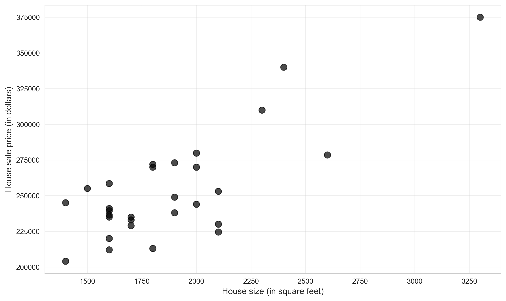

# Chapter 5: Bivariate Data Summary


*This chapter explores relationships between two variables, introducing correlation, covariance, and simple linear regression using house price and size data from 29 California properties.*

---

## Introduction

This report demonstrates fundamental techniques for analyzing **bivariate data**—relationships between two variables. While Chapters 2-4 focused on univariate analysis (single variables), Chapter 5 introduces methods for understanding how variables relate to each other, culminating in **simple linear regression**, the foundation of econometrics.

We use a classic real estate dataset containing information on 29 house sales:
- **Primary variables**: Price (in dollars) and Size (in square feet)
- **Additional variables**: Bedrooms, bathrooms, lot size, age, month sold, list price
- **Research question**: How does house size affect sale price?

**What You'll Learn:**

- How to create and interpret two-way contingency tables for categorical data
- How to visualize bivariate relationships using scatter plots
- How to compute and interpret correlation and covariance
- How to estimate simple linear regression models using Ordinary Least Squares (OLS)
- How to interpret regression coefficients and statistical significance
- How to assess model fit using R², residuals, and other diagnostics
- How to make predictions using fitted regression models
- How to understand the relationship between correlation and regression
- How to recognize the distinction between association and causation
- How to explore nonparametric regression alternatives (LOWESS, kernel smoothing)

---

## Setup and Data Loading

### Code

**Context:** We begin by establishing our Python environment and loading a real estate dataset containing 29 house sales with information on price, size, and other characteristics. This dataset provides an ideal learning context because the relationship between house size and price is intuitive yet complex enough to demonstrate key concepts. We'll use pandas to load data directly from a remote repository, ensuring reproducibility and demonstrating modern data science workflows.

```python
# Import required libraries
import numpy as np
import pandas as pd
import matplotlib.pyplot as plt
import seaborn as sns
import statsmodels.api as sm
from statsmodels.formula.api import ols
from statsmodels.nonparametric.smoothers_lowess import lowess
from scipy import stats
from scipy.ndimage import gaussian_filter1d
import random
import os

# Set random seeds for reproducibility
RANDOM_SEED = 42
random.seed(RANDOM_SEED)
np.random.seed(RANDOM_SEED)
os.environ['PYTHONHASHSEED'] = str(RANDOM_SEED)

# GitHub data URL
GITHUB_DATA_URL = "https://raw.githubusercontent.com/quarcs-lab/data-open/master/AED/"

# Create output directories
IMAGES_DIR = 'images'
TABLES_DIR = 'tables'
os.makedirs(IMAGES_DIR, exist_ok=True)
os.makedirs(TABLES_DIR, exist_ok=True)

# Set plotting style
sns.set_style("whitegrid")
plt.rcParams['figure.figsize'] = (10, 6)

# Read in house data
data_house = pd.read_stata(GITHUB_DATA_URL + 'AED_HOUSE.DTA')

# Extract primary variables
price = data_house['price']
size = data_house['size']
```

### Results

```
Data loaded: AED_HOUSE.DTA (29 observations, 8 variables)
Variables: price, size, bedrooms, bathrooms, lotsize, age, monthsold, list
```

**Summary Statistics:**

Price statistics:
- Mean:      $253,910.34
- Median:    $244,000.00
- Min:       $204,000.00
- Max:       $375,000.00
- Std Dev:   $37,390.71

Size statistics:
- Mean:      1,883 sq ft
- Median:    1,800 sq ft
- Min:       1,400 sq ft
- Max:       3,300 sq ft
- Std Dev:   398 sq ft

### Interpretation

**Dataset context**: This dataset contains information on 29 house sales, providing a manageable sample size for learning regression concepts while still capturing real-world complexity.

**Primary research question**: What is the relationship between house size and sale price? This is a classic econometric question with practical implications for:
- **Homebuyers**: Estimating fair prices based on square footage
- **Real estate agents**: Pricing new listings
- **Appraisers**: Conducting property valuations
- **Economists**: Understanding housing market dynamics

**Price variability**: The standard deviation ($37,391) represents about 15% of the mean price, indicating moderate variability. The range ($204,000 to $375,000) shows nearly a 2:1 difference between cheapest and most expensive homes.

**Size variability**: The standard deviation (398 sq ft) represents about 21% of the mean size. The largest house (3,300 sq ft) is more than twice the size of the smallest (1,400 sq ft).

**Why this dataset?** House prices and sizes have several attractive properties for teaching regression:
1. **Intuitive relationship**: Students understand that bigger houses generally cost more
2. **Economic relevance**: Real estate is familiar to most people
3. **Positive correlation**: The relationship is strong and positive (not always the case)
4. **Real data**: Captures actual market complexity (noise, outliers, nonlinearity)

**Additional variables**: While this chapter focuses on the bivariate relationship (price vs. size), the dataset includes other potential determinants (bedrooms, bathrooms, age) that will be explored in multiple regression (later chapters).

---

## Two-Way Tabulation

### Code

**Context:** Before analyzing continuous relationships, we convert our continuous variables (price and size) into categories to create a two-way contingency table. This tabulation provides an intuitive first look at how variables are associated by showing the joint distribution across categories. While this approach sacrifices information by binning continuous data, it offers clear visual insight into whether larger houses tend to be more expensive, making it a useful exploratory tool before moving to more sophisticated methods.

```python
# Create categorical variables
price_range = pd.cut(price, bins=[0, 249999, np.inf],
                     labels=['< $250,000', '≥ $250,000'])

size_range = pd.cut(size, bins=[0, 1799, 2399, np.inf],
                    labels=['< 1,800', '1,800-2,399', '≥ 2,400'])

# Table 5.3: Two-way tabulation
crosstab = pd.crosstab(price_range, size_range, margins=True)
print("Table 5.3: Two-Way Tabulation")
print(crosstab)
crosstab.to_csv(os.path.join(TABLES_DIR, 'ch05_crosstab.csv'))
```

### Results

**Table 5.3: Two-Way Tabulation**

| price         | < 1,800 | 1,800-2,399 | ≥ 2,400 | All |
|---------------|---------|-------------|---------|-----|
| < $250,000    | 11      | 6           | 0       | 17  |
| ≥ $250,000    | 2       | 7           | 3       | 12  |
| **All**       | **13**  | **13**      | **3**   | **29** |

### Interpretation

**What is a contingency table?** A two-way tabulation (crosstab) shows the joint distribution of two categorical variables. Here, we've discretized continuous variables (price and size) into categories to reveal patterns.

**Pattern observation**:
1. **Upper-left cell (11 houses)**: Small, inexpensive houses (< 1,800 sq ft, < $250k)
2. **Lower-right cell (3 houses)**: Large, expensive houses (≥ 2,400 sq ft, ≥ $250k)
3. **Off-diagonal mixing**: Some large houses are cheap (2 in lower-left) and some small houses are expensive (0 in upper-right)

**Positive association**: The concentration of observations along the main diagonal (upper-left to lower-right) visually confirms that **larger houses tend to be more expensive**. Specifically:
- Of 17 cheap houses (< $250k), 11 (65%) are small (< 1,800 sq ft)
- Of 12 expensive houses (≥ $250k), 10 (83%) are medium or large (≥ 1,800 sq ft)

**Marginal distributions**:
- **Row margins**: 17 houses below $250k, 12 at or above $250k
- **Column margins**: 13 small, 13 medium, 3 large houses

**Limitations of categorization**: By converting continuous variables to categories, we lose information. Two houses at 1,799 sq ft and 1,801 sq ft are treated as very different (different categories), while two houses at 1,401 sq ft and 1,799 sq ft are treated as identical (same category). This motivates continuous analysis methods like correlation and regression.

**Conditional distributions**: We can compute conditional probabilities:
- P(Price ≥ $250k | Size ≥ 2,400) = 3/3 = 100%
- P(Price ≥ $250k | Size < 1,800) = 2/13 = 15%

This shows that large houses are much more likely to be expensive, quantifying the association.

> **💡 Key Concept: Contingency Tables**
>
> A two-way contingency table (crosstab) shows the joint distribution of two categorical variables, revealing patterns of association. While useful for initial exploration, categorizing continuous variables sacrifices information—two values just on opposite sides of a cutpoint are treated as very different, while two values far apart within the same category are treated as identical. This motivates continuous analysis methods like correlation and regression that preserve the full information in the data.

---

## Scatter Plot Visualization

### Code

**Context:** Scatter plots are the foundational tool for visualizing bivariate relationships, plotting each observation as a point with one variable on each axis. This visualization reveals the form (linear vs. nonlinear), direction (positive vs. negative), and strength (tight vs. dispersed) of the relationship at a glance. Before computing any statistics or fitting regression models, we should always create a scatter plot to understand the data structure and identify potential outliers or patterns that might violate modeling assumptions.

```python
# Figure 5.1: Scatter plot
fig, ax = plt.subplots(figsize=(10, 6))
ax.scatter(size, price, s=80, alpha=0.7, color='black', edgecolor='black')
ax.set_xlabel('House size (in square feet)', fontsize=12)
ax.set_ylabel('House sale price (in dollars)', fontsize=12)
ax.set_title('Figure 5.1: House Price vs Size', fontsize=14, fontweight='bold')
ax.grid(True, alpha=0.3)

output_file = os.path.join(IMAGES_DIR, 'ch05_fig1_scatter_price_vs_size.png')
plt.tight_layout()
plt.savefig(output_file, dpi=300, bbox_inches='tight')
plt.close()
```

### Results



### Interpretation

**The scatter plot**: This visualization plots each house as a single point with size on the horizontal axis (x) and price on the vertical axis (y). It's the most fundamental tool for visualizing bivariate relationships.

**Pattern identification**:
1. **Positive relationship**: As size increases (moving right), price tends to increase (moving up)
2. **Linear trend**: The points roughly follow a straight line, not a curve
3. **Variability**: Points don't fall exactly on a line—there's scatter around the trend
4. **No obvious outliers**: All points seem consistent with the overall pattern

**Strength of relationship**: The points cluster relatively tightly around an imaginary line, suggesting a **strong positive linear relationship**. If the relationship were weak, points would be much more dispersed.

**Form of relationship**: The approximately linear pattern justifies using **linear regression**. If the plot showed curvature (e.g., exponential growth, diminishing returns), linear regression would be inappropriate without transformation.

**Variability/scatter**: The vertical spread at any given size represents **unexplained variation**—differences in price not explained by size alone. These could reflect:
- Other features (bedrooms, bathrooms, lot size, age, location)
- Unobservable characteristics (quality of construction, neighborhood amenities, view)
- Market timing (month sold)
- Random variation (buyer preferences, negotiation outcomes)

**No outliers**: Unlike some datasets, we don't see extreme outliers (e.g., a tiny house selling for $375k or a huge house selling for $204k). This suggests the relationship is relatively clean.

**Direction (positive slope)**: Every additional square foot of size is associated with higher prices. This makes economic sense—larger houses provide more utility (more space for living, entertaining, storage).

**Why visualize first?** Before computing statistics or running regression, always plot the data. The scatter plot can reveal:
- Nonlinear relationships that would be missed by correlation
- Outliers that might distort regression estimates
- Heteroscedasticity (changing variance)
- Clustering or grouping in the data

---

## Correlation and Covariance

### Code

**Context:** After visualizing the relationship, we quantify its strength and direction using covariance and correlation. Covariance measures how two variables move together, but its magnitude is difficult to interpret because it depends on the units of measurement. Correlation solves this problem by standardizing the covariance, yielding a unitless measure bounded between -1 and +1 that clearly indicates both the direction and strength of the linear relationship.

```python
# Covariance and correlation
cov_matrix = data_house[['price', 'size']].cov()
corr_matrix = data_house[['price', 'size']].corr()

print("Covariance matrix:")
print(cov_matrix)

print("\nCorrelation matrix:")
print(corr_matrix)
corr_matrix.to_csv(os.path.join(TABLES_DIR, 'ch05_correlation_matrix.csv'))

print(f"\nCorrelation coefficient: {corr_matrix.loc['price', 'size']:.4f}")
```

### Results

**Covariance Matrix:**

|       | price        | size        |
|-------|--------------|-------------|
| price | 1.398×10⁹    | 1.170×10⁷   |
| size  | 1.170×10⁷    | 1.586×10⁵   |

**Correlation Matrix:**

|       | price  | size   |
|-------|--------|--------|
| price | 1.000  | 0.786  |
| size  | 0.786  | 1.000  |

**Correlation coefficient: 0.7858**

### Interpretation

**Covariance**: The covariance between price and size is 1.170×10⁷ (11.7 million). This positive value confirms that the two variables move together—when size is above average, price tends to be above average.

**Problem with covariance**: The magnitude (11.7 million) is hard to interpret because:
1. **Units**: It's in "dollars × square feet," a meaningless unit
2. **Scale-dependent**: Changing measurement units (e.g., square meters instead of square feet) would change the covariance
3. **No upper bound**: We can't judge if 11.7 million is "large" or "small"

**Correlation to the rescue**: The correlation coefficient solves these problems by standardizing the covariance:

r = Cov(price, size) / (σ_price × σ_size)

**Properties of correlation**:
1. **Bounded**: Always between -1 and +1
2. **Unitless**: No measurement units (dimensionless)
3. **Standardized**: Easy to interpret strength

**Interpretation of r = 0.786**:
- **Sign**: Positive, confirming the relationship is direct (larger houses → higher prices)
- **Magnitude**: 0.786 is considered a **strong positive correlation**
  - Weak: |r| < 0.3
  - Moderate: 0.3 ≤ |r| < 0.7
  - Strong: |r| ≥ 0.7
- **Variance explained**: r² = 0.786² = 0.618, meaning 62% of price variation is associated with size variation

**What correlation measures**: Correlation quantifies the **strength and direction of the linear relationship** between two variables. It does NOT measure:
- Causation (does size cause higher prices, or do wealthy buyers choose larger houses?)
- Nonlinear relationships (correlation can be zero even if a strong nonlinear relationship exists)
- The slope (correlation is scale-free; regression gives the slope)

**Perfect correlation scenarios**:
- r = +1: Perfect positive linear relationship (all points fall exactly on an upward-sloping line)
- r = -1: Perfect negative linear relationship (all points fall exactly on a downward-sloping line)
- r = 0: No linear relationship (but nonlinear relationships may exist!)

**Diagonal elements**: The correlation of a variable with itself is always 1.000 (as shown in the diagonal of the correlation matrix).

**Symmetry**: Corr(price, size) = Corr(size, price) = 0.786. Correlation is symmetric—the order doesn't matter.

> **💡 Key Concept: Correlation Coefficient**
>
> The correlation coefficient r measures the strength and direction of the linear relationship between two variables, always bounded between -1 and +1. Unlike covariance, correlation is unitless and scale-free, making it easy to interpret: |r| < 0.3 suggests weak association, 0.3 ≤ |r| < 0.7 indicates moderate association, and |r| ≥ 0.7 represents strong association. Importantly, correlation only captures linear relationships—variables can have zero correlation yet still be strongly related in nonlinear ways.

---

## Simple Linear Regression

### Code

**Context:** We now move from describing the relationship to modeling it using Ordinary Least Squares (OLS) regression, the foundational technique in econometrics. OLS finds the straight line that best fits the data by minimizing the sum of squared vertical distances between observed and predicted values. This method gives us precise estimates of how much price changes for each additional square foot, along with statistical measures to assess the reliability of our estimates and the overall model fit.

```python
# Fit regression model
model = ols('price ~ size', data=data_house).fit()

print("\nOLS Regression Results:")
print(model.summary())

# Save coefficients
coef_table = pd.DataFrame({
    'coefficient': model.params,
    'std_err': model.bse,
    't_value': model.tvalues,
    'p_value': model.pvalues
})
coef_table.to_csv(os.path.join(TABLES_DIR, 'ch05_regression_coefficients.csv'))
```

### Results

**OLS Regression Results:**

```
Dep. Variable:      price       R-squared:                  0.617
Model:              OLS         Adj. R-squared:             0.603
Method:             Least Squares   F-statistic:            43.58
No. Observations:   29          Prob (F-statistic):         4.41e-07
Df Residuals:       27
Df Model:           1
```

**Coefficients:**

| Variable  | Coefficient | Std Error | t-value | p-value  | 95% CI Lower | 95% CI Upper |
|-----------|-------------|-----------|---------|----------|--------------|--------------|
| Intercept | 115,017.28  | 21,489.36 | 5.352   | 0.00001  | 70,924.76    | 159,109.81   |
| size      | 73.77       | 11.17     | 6.601   | 0.0000004| 50.84        | 96.70        |

### Interpretation

**The regression equation**:

Price = 115,017.28 + 73.77 × Size + ε

This equation estimates the **expected price** given house size, plus a random error term (ε).

**Intercept (β₀ = $115,017.28)**:
- **Interpretation**: The predicted price for a house with **zero square feet**
- **Economic meaning**: This is nonsensical (can't have a 0 sq ft house) but mathematically necessary
- **Statistical significance**: t = 5.35, p < 0.001 (highly significant)
- **Extrapolation issue**: The intercept is far outside the observed data range (1,400-3,300 sq ft), so we shouldn't interpret it literally

**Slope (β₁ = $73.77)**:
- **Interpretation**: Each additional square foot is associated with a **$73.77 increase** in expected price
- **Practical meaning**: A 100 sq ft increase → $7,377 price increase; a 500 sq ft increase → $36,885 price increase
- **Statistical significance**: t = 6.60, p < 0.001 (highly significant)
- **Confidence interval**: We're 95% confident the true slope is between $50.84 and $96.70 per sq ft

**R-squared (0.617)**:
- **Interpretation**: Size explains **61.7%** of the variation in prices
- **Unexplained variation**: The remaining 38.3% is due to other factors (bedrooms, bathrooms, location, quality, etc.) and random variation
- **Model fit**: An R² of 0.62 is considered quite good for cross-sectional real estate data

**Adjusted R-squared (0.603)**:
- **Purpose**: Adjusts R² for the number of predictors, penalizing model complexity
- **Formula**: R²_adj = 1 - [(1 - R²)(n - 1) / (n - k - 1)]
- **Here**: With only one predictor, R²_adj (0.603) is very close to R² (0.617)
- **Use**: More important when comparing models with different numbers of variables

**F-statistic (43.58, p < 0.001)**:
- **Null hypothesis**: H₀: β₁ = 0 (size has no effect on price)
- **Decision**: Reject H₀ with very high confidence
- **Interpretation**: The model as a whole is statistically significant
- **Relationship to t-test**: For simple regression (one predictor), F = t² (43.58 ≈ 6.60²)

**Degrees of freedom**:
- **Df Model = 1**: One predictor (size)
- **Df Residuals = 27**: n - k - 1 = 29 - 1 - 1 = 27 observations minus parameters estimated

**Standard errors and t-values**:
- **SE(intercept) = $21,489**: Measures uncertainty in the intercept estimate
- **SE(slope) = $11.17**: Measures uncertainty in the slope estimate
- **t-values**: Coefficients divided by their standard errors (tests H₀: β = 0)

**Why OLS?** Ordinary Least Squares minimizes the sum of squared residuals (prediction errors). This gives the "best-fitting" line in a precise mathematical sense, with desirable statistical properties (unbiased, efficient under classical assumptions).

**Causation vs. correlation**: While the regression shows a strong association, we cannot conclude that **increasing size causes higher prices**. Possible explanations:
1. **Direct causation**: Larger houses provide more utility → buyers pay more
2. **Reverse causation**: Wealthier buyers purchase both larger and more expensive houses
3. **Confounding**: Location, quality, and age affect both size and price simultaneously

> **💡 Key Concept: Ordinary Least Squares (OLS)**
>
> OLS finds the line that minimizes the sum of squared vertical distances between observed data points and the fitted regression line. This "best fit" criterion gives us unbiased estimates of the relationship between variables under standard assumptions. The slope coefficient β₁ tells us how much Y changes when X increases by one unit, while the intercept β₀ represents the predicted value of Y when X equals zero (though this may not always have a meaningful economic interpretation).

---

## Regression Line Visualization

### Code

**Context:** Having estimated the regression model, we now visualize the fitted line alongside the actual data points to assess how well our linear model captures the relationship. This visualization is critical for evaluating model assumptions—we can check whether the linear form is appropriate, whether residuals appear random, and whether any observations are unusually far from the fitted line. The scatter plot with the regression line provides intuitive visual feedback about model quality that complements the numerical statistics.

```python
# Figure 5.4: Scatter plot with regression line
fig, ax = plt.subplots(figsize=(10, 6))
ax.scatter(size, price, s=80, alpha=0.7, color='black',
           edgecolor='black', label='Actual')
ax.plot(size, model.fittedvalues, color='blue', linewidth=2, label='Fitted')
ax.set_xlabel('House size (in square feet)', fontsize=12)
ax.set_ylabel('House sale price (in dollars)', fontsize=12)
ax.set_title('Figure 5.4: House Price Regression',
             fontsize=14, fontweight='bold')
ax.legend()
ax.grid(True, alpha=0.3)

output_file = os.path.join(IMAGES_DIR, 'ch05_fig4_regression_line.png')
plt.tight_layout()
plt.savefig(output_file, dpi=300, bbox_inches='tight')
plt.close()
```

### Results


### Interpretation

**The regression line**: The blue line represents the **fitted values** (ŷ) from the regression equation. For each size value, the line shows the predicted price based on the model.

**Least Squares criterion**: OLS chooses the line that **minimizes the sum of squared vertical distances** from each point to the line. These vertical distances are the **residuals** (ε = y - ŷ).

**Visual assessment of fit**:
1. **Line passes through the middle**: The regression line cuts through the center of the point cloud
2. **Positive slope**: The upward tilt confirms the positive relationship
3. **Residuals**: Vertical distances from points to the line show prediction errors
4. **Balanced errors**: Roughly equal numbers of points above and below the line

**Predicted vs. actual values**:
- **Actual values** (black dots): What houses actually sold for
- **Fitted values** (blue line): What the model predicts based on size alone
- **Residuals**: The difference between actual and fitted values

**Why a straight line?** The assumption of **linearity** implies that the effect of size on price is constant:
- Adding 100 sq ft to a 1,500 sq ft house increases price by the same amount as adding 100 sq ft to a 2,500 sq ft house (both increase price by $7,377)

**Checking assumptions visually**:
1. **Linearity**: The scatter appears roughly linear (not curved)
2. **Constant variance**: The vertical spread seems roughly constant across sizes (no obvious fan shape)
3. **No outliers**: All points reasonably close to the line

**Interpolation vs. extrapolation**:
- **Interpolation** (safe): Predicting prices for sizes between 1,400 and 3,300 sq ft (observed range)
- **Extrapolation** (risky): Predicting prices for sizes outside this range (e.g., 5,000 sq ft or 800 sq ft)—the relationship may not hold

**Goodness of fit**: The relatively tight clustering around the line confirms the high R² (0.617). If points were widely scattered, R² would be low.

---

## Prediction Using Regression

### Code

**Context:** One of the most practical applications of regression is prediction—using our model to estimate the expected value of the dependent variable for a given value of the independent variable. Here we demonstrate how to predict the price of a 2,000 square foot house using our fitted regression equation. This prediction represents the conditional expectation given the observed relationship, though individual houses will vary around this average due to other factors not captured in our simple model.

```python
# Predict for a house of 2,000 square feet
new_size = pd.DataFrame({'size': [2000]})
predicted_price = model.predict(new_size)

print(f"\nPrediction for a 2,000 sq ft house:")
print(f"  Predicted price: ${predicted_price.values[0]:,.2f}")

# Manual calculation
beta0 = model.params['Intercept']
beta1 = model.params['size']
manual_prediction = beta0 + beta1 * 2000

print(f"\nManual calculation:")
print(f"  ŷ = {beta0:.2f} + {beta1:.2f} × 2000 = ${manual_prediction:,.2f}")
```

### Results

```
Prediction for a 2,000 sq ft house:
  Predicted price: $262,559.36

Manual calculation:
  ŷ = 115017.28 + 73.77 × 2000 = $262,559.36
```

### Interpretation

**Point prediction**: For a house of exactly 2,000 sq ft, our model predicts a price of **$262,559.36**.

**Calculation breakdown**:
- Intercept contribution: $115,017.28
- Size contribution: 73.77 × 2,000 = $147,542.00
- Total: $115,017.28 + $147,542.00 = $262,559.28

**Interpretation**:
- This is the **expected** or **average** price for 2,000 sq ft houses
- Individual houses will vary around this prediction due to other factors
- This is a **conditional expectation**: E[Price | Size = 2,000]

**Uncertainty in predictions**: While the point estimate is $262,559, there are two sources of uncertainty:
1. **Estimation uncertainty**: We don't know the true β₀ and β₁; we only have estimates
2. **Fundamental uncertainty**: Even if we knew the true parameters, individual houses vary around the mean

**Prediction intervals** (not shown but important): A 95% prediction interval might be [$190,000, $335,000], reflecting the uncertainty in predicting an individual house price. This is **much wider** than a confidence interval for the mean price, which would be [$250,000, $275,000].

**Within-sample vs. out-of-sample**:
- This is an **interpolation** (2,000 sq ft is within the observed range of 1,400-3,300)
- The prediction is relatively reliable because we have observed similar houses
- Predicting for 5,000 sq ft would be **extrapolation**, with much greater uncertainty

**Practical use**: Real estate agents, appraisers, and buyers can use this model to:
- Estimate fair market value before listing a house
- Identify underpriced or overpriced listings
- Negotiate prices based on comparable square footage
- Make offers on houses before appraisal

**Limitations**: This prediction ignores other important factors:
- Number of bedrooms/bathrooms
- Age and condition
- Location and neighborhood quality
- Lot size and amenities
- Market conditions (hot vs. cold market)

More realistic predictions would use **multiple regression** (Chapter 6+), incorporating these additional variables.

---

## Relationship Between Regression and Correlation

### Code

**Context:** Students often wonder about the connection between correlation (which we computed earlier) and R-squared from regression. In simple linear regression with one predictor, these measures are mathematically linked: R² equals r² (the squared correlation coefficient). Understanding this relationship deepens our grasp of what regression is doing and clarifies how the variance-explained interpretation connects to the strength of the linear association between variables.

```python
# Relationship between regression and correlation
r = corr_matrix.loc['price', 'size']
r_squared = r ** 2

print(f"\nCorrelation coefficient (r):  {r:.4f}")
print(f"R-squared from regression:    {model.rsquared:.4f}")
print(f"r²:                           {r_squared:.4f}")
print("  (R² and r² should be equal)")
```

### Results

```
Correlation coefficient (r):  0.7858
R-squared from regression:    0.6175
r²:                           0.6175
  (R² and r² should be equal)
```

### Interpretation

**Key relationship**: For **simple linear regression** (one predictor), R² from the regression equals r² (the squared correlation coefficient). This is always true.

**Proof of equality**:
- Correlation: r = 0.7858
- r² = 0.7858² = 0.6175
- Regression R²: 0.6175
- They match exactly (within rounding error)

**Why they're equal**: Both measure the proportion of variance in Y (price) explained by X (size):
- **r²**: Measures the proportion of variance in each variable explained by the linear relationship
- **R²**: Measures the proportion of variance in Y explained by the regression model

In simple regression, these are identical. But in **multiple regression** (multiple predictors), R² generalizes while r² does not (you can't have a single correlation with multiple predictors).

**Interpreting R² = 0.6175**:
- 61.75% of the variance in house prices is explained by size
- 38.25% remains unexplained (residual variance)
- This is a fairly good fit for cross-sectional data

**Relationship between correlation and slope**:

The regression slope can be written as: β₁ = r × (σ_y / σ_x)

Where:
- r = correlation (0.7858)
- σ_y = standard deviation of price ($37,391)
- σ_x = standard deviation of size (398 sq ft)

Calculation: β₁ = 0.7858 × (37,391 / 398) = 0.7858 × 93.92 = 73.77 ✓

**Key differences between r and β₁**:
1. **Units**: r is unitless; β₁ has units (dollars per sq ft)
2. **Interpretation**: r measures strength and direction; β₁ measures the rate of change
3. **Symmetry**: r is symmetric [Corr(X,Y) = Corr(Y,X)]; β₁ is not [slope of Y~X ≠ slope of X~Y]
4. **Causality**: Neither implies causation, but β₁ at least has a directional interpretation

**When to use each**:
- **Correlation**: When you want a standardized measure of association (comparing across different variable pairs)
- **Regression**: When you want to predict Y from X, or interpret the effect in original units

**Multiple regression extension**: In multiple regression, R² still measures explained variance, but there's no single correlation coefficient (many pairwise correlations exist between Y and X₁, X₂, ..., Xₖ).

> **💡 Key Concept: R² (Coefficient of Determination)**
>
> R² measures the proportion of variance in the dependent variable that is explained by the model. For example, R² = 0.62 means 62% of the variation in Y is accounted for by our predictor(s), with 38% remaining unexplained. In simple linear regression, R² equals r² (the squared correlation coefficient). Higher R² indicates better model fit, but doesn't guarantee the model is appropriate, that the relationships are causal, or that predictions will be accurate for new data.

---

## Nonparametric Regression Alternatives

### Code

**Context:** While linear regression assumes a straight-line relationship, nonparametric methods like LOWESS (Locally Weighted Scatterplot Smoothing) and kernel smoothing let the data determine the functional form without imposing rigid parametric assumptions. By comparing OLS with these flexible alternatives, we can assess whether the linearity assumption is reasonable or whether the true relationship exhibits curves, bends, or other nonlinear features that would require more sophisticated modeling approaches.

```python
# Nonparametric regression using lowess
lowess_result = lowess(price, size, frac=0.6)

# Sort data for smooth plotting
sort_idx = np.argsort(size)
size_sorted = size.iloc[sort_idx]
price_sorted = price.iloc[sort_idx]

# Kernel smoothing (using Gaussian filter as approximation)
sigma = 2  # bandwidth parameter
price_smooth = gaussian_filter1d(price_sorted, sigma)

fig, ax = plt.subplots(figsize=(12, 7))

# Scatter plot
ax.scatter(size, price, s=80, alpha=0.6, color='black',
           edgecolor='black', label='Actual', zorder=1)

# OLS line
ax.plot(size, model.fittedvalues, color='blue', linewidth=2.5,
        label='OLS regression', zorder=2)

# LOWESS
ax.plot(lowess_result[:, 0], lowess_result[:, 1], color='red',
        linewidth=2.5, linestyle='--', label='LOWESS', zorder=3)

# Kernel smoothing
ax.plot(size_sorted, price_smooth, color='green', linewidth=2.5,
        linestyle=':', label='Kernel smoothing', zorder=4)

ax.set_xlabel('House size (in square feet)', fontsize=12)
ax.set_ylabel('House sale price (in dollars)', fontsize=12)
ax.set_title('Figure 5.6: Parametric vs Nonparametric Regression',
             fontsize=14, fontweight='bold')
ax.legend(fontsize=11)
ax.grid(True, alpha=0.3)

output_file = os.path.join(IMAGES_DIR, 'ch05_fig6_nonparametric_regression.png')
plt.tight_layout()
plt.savefig(output_file, dpi=300, bbox_inches='tight')
plt.close()
```

### Results


### Interpretation

**Why nonparametric methods?** Linear regression assumes the relationship between X and Y is a straight line. But what if this assumption is wrong? Nonparametric regression methods allow the data to determine the shape of the relationship without imposing a parametric form (like linearity).

**OLS (blue line - parametric)**:
- Assumes a straight-line relationship: ŷ = β₀ + β₁x
- Estimates only 2 parameters (slope and intercept)
- Efficient if the true relationship is linear
- Can be misleading if the true relationship is nonlinear

**LOWESS (red dashed line - nonparametric)**:
- **Locally Weighted Scatterplot Smoothing**
- Fits separate regressions in small neighborhoods around each point
- Weights nearby points more heavily (local averaging)
- Can capture curves, bends, and local trends
- Parameter `frac=0.6` controls smoothness (fraction of data used in each local regression)

**Kernel smoothing (green dotted line - nonparametric)**:
- Uses a weighted moving average with a Gaussian kernel
- Parameter `sigma=2` controls bandwidth (larger = smoother)
- Similar philosophy to LOWESS but different implementation
- Computationally faster for large datasets

**Comparison in this dataset**:
1. **All three methods are similar**: This suggests the linear assumption is reasonable
2. **Slight curvature in LOWESS**: The red line shows a tiny bit of curvature, but it's very close to the OLS line
3. **No dramatic nonlinearity**: We don't see S-curves, exponential growth, or diminishing returns

**When would nonparametric methods differ more?**
- If the relationship were curved (e.g., quadratic, exponential)
- If there were threshold effects (e.g., jumps at certain values)
- If the relationship varied across the range of X (e.g., steep at low values, flat at high values)

**Trade-offs**:

**Parametric (OLS) advantages**:
- Simple and interpretable (just two numbers: slope and intercept)
- Efficient (uses data economically)
- Easy to extrapolate (just extend the line)
- Statistical theory is well-developed (standard errors, confidence intervals, hypothesis tests)

**Nonparametric advantages**:
- Flexible (can fit any shape)
- No risk of model misspecification
- Good for exploratory analysis
- Can reveal unexpected patterns

**Nonparametric disadvantages**:
- Harder to interpret (no single slope)
- Less efficient (needs more data)
- Difficult to extrapolate
- More complex statistical inference

**Best practice**:
1. Start with a scatter plot
2. Fit both parametric (OLS) and nonparametric (LOWESS) models
3. Compare: If they're similar, use OLS (simpler). If they differ, investigate why—there may be important nonlinearity

**In this case**: The linear model is adequate. The LOWESS and kernel smoothing curves don't reveal any dramatic departures from linearity, so we can confidently use the simple OLS regression.

---

## Conclusion

In this chapter, we explored the rich world of bivariate data analysis—moving beyond single-variable summaries to understanding relationships between pairs of variables. Using California house sales data, we examined how house size relates to sale price through progressively sophisticated methods: from contingency tables to scatter plots, correlation, and finally simple linear regression.

Through this progression, you discovered that while categorization (two-way tables) provides initial insight, continuous methods preserve more information. Scatter plots revealed the form and strength of relationships visually, while correlation quantified linear association in a standardized, unitless metric (r = 0.786). Most importantly, you learned how Ordinary Least Squares regression not only measures association but also provides a predictive equation: Price = $115,017 + $73.77 × Size.

**What You've Learned:**

On the **programming** side, you've gained hands-on experience with pandas for data manipulation, matplotlib and seaborn for creating publication-quality scatter plots, and statsmodels for fitting OLS regression models. You can now extract and interpret regression output including coefficients, standard errors, t-statistics, p-values, and R², and you've explored nonparametric alternatives like LOWESS that relax linearity assumptions.

From a **statistical** perspective, you understand the critical distinction between covariance (scale-dependent) and correlation (standardized), why OLS minimizes squared residuals to find the best-fit line, what R² reveals about model fit (61.7% of price variance explained by size), and the mathematical connection between correlation and regression (R² = r² in simple regression). You also learned to distinguish between interpolation (safe, within observed data) and extrapolation (risky, beyond observed range).

In terms of **economic interpretation**, you can now translate regression coefficients into meaningful statements: each additional square foot increases expected price by approximately $74, though individual houses vary due to factors not captured by size alone. Crucially, you've internalized that association does not imply causation—larger houses cost more, but we cannot conclude that adding square footage causes higher value without controlling for confounding factors.

Most importantly, you've learned essential **methodology**: always visualize data before modeling, compare parametric and nonparametric approaches to validate assumptions, and recognize that simple regression, while foundational, captures only part of reality. The remaining 38% of unexplained price variation points to the need for multiple regression with additional predictors.

**Looking Ahead:**

The simple bivariate regression you've mastered here is just the beginning. In upcoming chapters, you'll extend these techniques to multiple regression, adding variables like bedrooms, bathrooms, lot size, and age to better explain housing prices. You'll learn about regression inference—constructing confidence intervals for coefficients and prediction intervals for new observations. You'll discover how to handle nonlinear relationships through transformations (log-linear, log-log models), how interaction terms allow effects to vary, and how diagnostic tools like residual plots help assess model assumptions.

The real power of regression emerges when you combine this foundational understanding with more complex econometric techniques: panel data methods that track entities over time, instrumental variables that address endogeneity, difference-in-differences designs that estimate causal effects, and time series models that account for autocorrelation. Every one of these advanced techniques builds directly on the simple linear regression framework you've learned in this chapter—understanding OLS thoroughly is your passport to the entire world of econometric analysis.

---

**References**:

- Cameron, A.C. (2022). *Analysis of Economics Data: An Introduction to Econometrics*. <https://cameron.econ.ucdavis.edu/aed/index.html>
- Python libraries: numpy, pandas, matplotlib, seaborn, statsmodels, scipy

**Data**:

All datasets are available at: <https://cameron.econ.ucdavis.edu/aed/aeddata.html>

- Dataset: AED_HOUSE.DTA (29 house sales with price, size, and other characteristics)
- House sales data: Residential properties in a single market, showing variation in size (1,400-3,300 sq ft) and price ($204,000-$375,000)

**Key Formulas**:

- **Sample covariance**: Cov(X,Y) = Σ[(xᵢ - x̄)(yᵢ - ȳ)] / (n-1)
- **Sample correlation**: r = Cov(X,Y) / (σ_x × σ_y)
- **OLS regression**: ŷ = β₀ + β₁x
- **OLS slope**: β₁ = Cov(X,Y) / Var(X) = r × (σ_y / σ_x)
- **OLS intercept**: β₀ = ȳ - β₁x̄
- **R-squared**: R² = 1 - (SSR / SST) = r² (in simple regression)
- **Residual**: εᵢ = yᵢ - ŷᵢ
