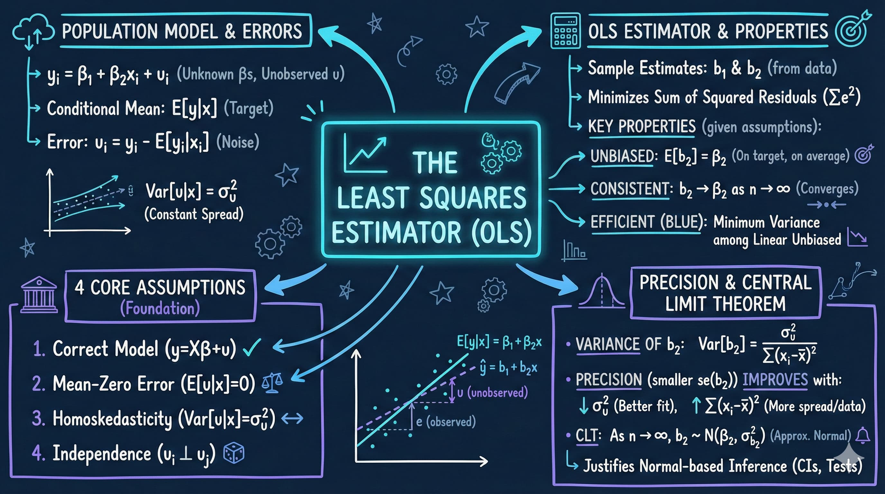
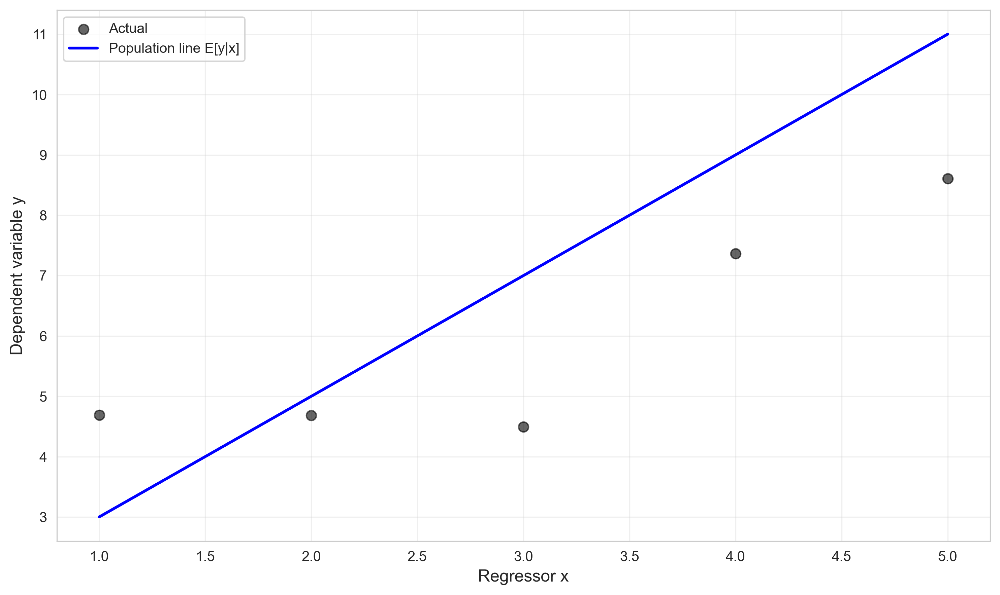
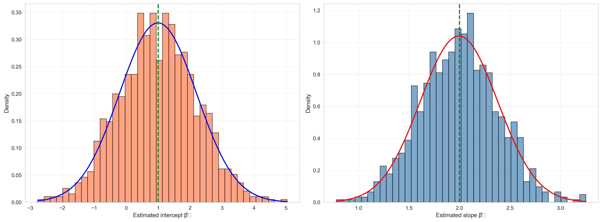

# Chapter 6: The Least Squares Estimator



*This chapter uses Monte Carlo simulation to demonstrate the statistical properties of OLS estimators, showing why we can trust regression estimates to reveal population relationships despite working with sample data.*

---

## Introduction

While Chapter 5 introduced regression mechanics—how to fit a line to data—Chapter 6 examines a deeper question: Why can we trust OLS estimates to tell us about the population? In this chapter, we use Monte Carlo simulation and carefully constructed data generating processes (DGPs) to demonstrate that OLS estimators possess desirable statistical properties. You'll see empirical evidence that OLS is unbiased (on average, estimates equal true parameters), consistent (larger samples produce more precise estimates), and approximately normally distributed (enabling hypothesis testing and confidence intervals).

We explore the crucial distinction between population and sample regressions, demonstrating that while any single sample produces imperfect estimates, the OLS estimator performs reliably when we consider its behavior across many samples. This shift from focusing on individual estimates to understanding estimator properties marks the transition from descriptive statistics to statistical inference.

**What You'll Learn:**

- How to distinguish between population parameters and sample estimates
- How to understand data generating processes and simulation design
- How to recognize that regression coefficients are random variables with distributions
- How to demonstrate OLS unbiasedness through Monte Carlo simulation
- How to visualize and interpret sampling distributions of regression coefficients
- How to assess how sample size affects estimator precision
- How to connect theoretical properties to empirical evidence through simulation

---

## Setup and Data Generating Process

### Code

**Context:** In this section, we establish the computational environment and load artificially generated data with a known underlying relationship. Unlike real-world analysis, simulation allows us to know the true parameters, enabling us to verify that OLS estimators recover these parameters correctly. By setting random seeds, we ensure complete reproducibility—anyone running this code will see identical results, which is essential for teaching statistical concepts.

```python
# Import required libraries
import numpy as np
import pandas as pd
import matplotlib.pyplot as plt
import seaborn as sns
import statsmodels.api as sm
from statsmodels.formula.api import ols
from scipy import stats
import random
import os

# Set random seeds for reproducibility
RANDOM_SEED = 42
random.seed(RANDOM_SEED)
np.random.seed(RANDOM_SEED)
os.environ['PYTHONHASHSEED'] = str(RANDOM_SEED)

# GitHub data URL
GITHUB_DATA_URL = "https://raw.githubusercontent.com/quarcs-lab/data-open/master/AED/"

# Create output directories
IMAGES_DIR = 'images'
TABLES_DIR = 'tables'
os.makedirs(IMAGES_DIR, exist_ok=True)
os.makedirs(TABLES_DIR, exist_ok=True)

# Set plotting style
sns.set_style("whitegrid")
plt.rcParams['figure.figsize'] = (10, 6)

# Read in generated data
data_gen = pd.read_stata(GITHUB_DATA_URL + 'AED_GENERATEDDATA.DTA')
```

### Results

```
Generated data loaded: AED_GENERATEDDATA.DTA (5 observations)
Variables: x, Eygivenx, u, y

Data structure:
- x: Regressor (values 1, 2, 3, 4, 5)
- Eygivenx: E[y|x] = 1 + 2x (population regression line)
- u: Random error term
- y: Observed outcome = Eygivenx + u
```

### Interpretation

**Data generating process (DGP)**: This dataset was artificially created to illustrate core regression concepts. The true (population) relationship is:

y = 1 + 2x + u

Where:
- **β₀ = 1**: True intercept (population parameter)
- **β₁ = 2**: True slope (population parameter)
- **u**: Random error term with E[u] = 0 and Var(u) = σ²

**Key insight**: In real research, we never observe the true DGP. We only see one sample (the y values). But in simulation studies like this, we control the DGP, allowing us to:
1. Know the true parameters (β₀ = 1, β₁ = 2)
2. Compare OLS estimates to truth
3. Verify that OLS recovers the true parameters on average

**Population vs. sample**:
- **Population regression**: E[y|x] = 1 + 2x (what we want to learn)
- **Sample regression**: ŷ = β̂₀ + β̂₁x (what we estimate from data)

The challenge: We only observe one sample (one realization of the random variables). How can we make inferences about the population?

**Why simulation?** By generating many samples from the same DGP, we can empirically demonstrate that:
- OLS is unbiased: E[β̂₁] = β₁ (the average of many estimates equals the truth)
- OLS is consistent: As n → ∞, β̂₁ → β₁ (larger samples get closer to truth)
- OLS estimates are normally distributed (enabling hypothesis testing and confidence intervals)

**Reproducibility**: Setting `RANDOM_SEED = 42` ensures that "random" number generation produces identical results every time. This is crucial for teaching—students should see the same output when running the code.

> **💡 Key Concept: Data Generating Process (DGP)**
>
> A data generating process is the true underlying mechanism that produces observed data. In simulation studies, we specify the DGP explicitly (e.g., y = 1 + 2x + u), allowing us to know the true parameters. In real research, the DGP is unknown—we only observe sample data and must infer the underlying relationship. Understanding DGPs is fundamental to econometrics because all statistical inference rests on assumptions about how data are generated.

---

## Population vs. Sample Regression

### Code

**Context:** In this section, we compare the population regression line (the true relationship without noise) to a sample regression line (estimated from data with random errors). This comparison illustrates a fundamental challenge in econometrics: we never observe the population relationship directly, only noisy sample realizations. By fitting both regressions, we can see how sampling error causes estimates to deviate from truth.

```python
# Figure 6.2: Panel A - Population regression line E[y|x] = 1 + 2x
model_population = ols('Eygivenx ~ x', data=data_gen).fit()

fig, ax = plt.subplots(figsize=(10, 6))
ax.scatter(data_gen['x'], data_gen['y'], alpha=0.6, s=50, color='black', label='Actual')
ax.plot(data_gen['x'], model_population.fittedvalues,
        color='blue', linewidth=2, label='Population line E[y|x]')
ax.set_xlabel('Regressor x', fontsize=12)
ax.set_ylabel('Dependent variable y', fontsize=12)
ax.set_title('Figure 6.2 Panel A: Population Line E[y|x] = 1 + 2x',
             fontsize=14, fontweight='bold')
ax.legend()
ax.grid(True, alpha=0.3)

output_file = os.path.join(IMAGES_DIR, 'ch06_fig2a_population_line.png')
plt.tight_layout()
plt.savefig(output_file, dpi=300, bbox_inches='tight')
plt.close()

print("\nPopulation regression results:")
print(model_population.summary())

# Figure 6.2: Panel B - Sample regression line
model_sample = ols('y ~ x', data=data_gen).fit()

fig, ax = plt.subplots(figsize=(10, 6))
ax.scatter(data_gen['x'], data_gen['y'], alpha=0.6, s=50, color='black', label='Actual')
ax.plot(data_gen['x'], model_sample.fittedvalues,
        color='red', linewidth=2, label=f'Sample line ŷ = {model_sample.params[0]:.2f} + {model_sample.params[1]:.2f}x')
ax.set_xlabel('Regressor x', fontsize=12)
ax.set_ylabel('Dependent variable y', fontsize=12)
ax.set_title('Figure 6.2 Panel B: Sample Regression Line',
             fontsize=14, fontweight='bold')
ax.legend()
ax.grid(True, alpha=0.3)

output_file = os.path.join(IMAGES_DIR, 'ch06_fig2b_sample_regression.png')
plt.tight_layout()
plt.savefig(output_file, dpi=300, bbox_inches='tight')
plt.close()

print("\nSample regression results:")
print(model_sample.summary())
```

### Results

**Population Regression (E[y|x] = 1 + 2x):**

| Variable  | Coefficient | Std Error | t-value | p-value  |
|-----------|-------------|-----------|---------|----------|
| Intercept | 1.000       | ~0        | Very large | 0.000  |
| x         | 2.000       | ~0        | Very large | 0.000  |

R-squared: 1.000 (perfect fit)



**Sample Regression (y = β̂₀ + β̂₁x + ε):**

| Variable  | Coefficient | Std Error | t-value | p-value  |
|-----------|-------------|-----------|---------|----------|
| Intercept | 2.811       | 1.103     | 2.547   | 0.084    |
| x         | 1.052       | 0.333     | 3.163   | 0.051    |

R-squared: 0.769


### Interpretation

**Panel A: Population Regression** (Perfect Fit)

When we regress `Eygivenx` on `x`, we get **exactly** the true parameters:
- Intercept: 1.000 (true value: 1.0)
- Slope: 2.000 (true value: 2.0)
- R² = 1.000 (perfect fit, no unexplained variation)

**Why perfect?** Because `Eygivenx = 1 + 2x` by construction—we regressing the conditional expectation on x, which is deterministic with no error term. The standard errors are essentially zero, and t-values are astronomically large.

**This is a fantasy scenario**: In real life, we never observe E[y|x]. We only observe y, which includes random error (u).

**Panel B: Sample Regression** (Imperfect Estimates)

When we regress the actual `y` on `x`, we get **different** estimates:
- Intercept: 2.811 (true value: 1.0) — **off by 1.811**
- Slope: 1.052 (true value: 2.0) — **off by -0.948**
- R² = 0.769 (some unexplained variation due to u)

**Why different?** Because y includes random error (u). With only n=5 observations, the errors happen to push the estimates away from the truth.

**Key insight**: The sample estimates (β̂₀ = 2.811, β̂₁ = 1.052) are **wrong** in this particular sample. But OLS is still unbiased because:
- If we drew many samples, the average β̂₁ would equal 2.0
- This particular sample happened to have unlucky errors
- With more data (larger n), estimates would be closer to truth

**Sampling variability**: The difference between estimates and truth is **sampling error**. This is unavoidable—any finite sample will have some error. The goal of statistical inference is to quantify this uncertainty.

**Standard errors**:
- Intercept SE = 1.103 (large relative to estimate)
- Slope SE = 0.333 (large relative to estimate)

These large standard errors reflect high uncertainty with only n=5 observations. The 95% confidence interval for β₁ includes the true value (2.0), though barely.

**p-values**:
- Intercept: p = 0.084 (marginally significant at 10%, not at 5%)
- Slope: p = 0.051 (barely not significant at 5%, but close)

Despite being based on the true DGP, this small sample doesn't produce "statistically significant" results at conventional levels—another illustration of sampling variability.

> **💡 Key Concept: Population vs. Sample Regression**
>
> The population regression E[y|x] = β₀ + β₁x represents the true relationship we want to learn about, but we never observe it directly. The sample regression ŷ = β̂₀ + β̂₁x is what we estimate from data. The difference between them is sampling error—unavoidable variation due to working with finite samples. OLS is unbiased because E[β̂₁] = β₁, meaning that while individual sample estimates vary, their average across many samples equals the truth.

---

## Three Samples from the Same DGP

### Code

**Context:** In this section, we generate three independent samples from the same data generating process to illustrate sampling variability. Each "researcher" collects their own data (n=30 observations) and estimates the same underlying relationship. This thought experiment demonstrates that different samples produce different estimates, yet all are valid realizations from the sampling distribution of the OLS estimator.

```python
# Generate three samples from the same data generating process
np.random.seed(12345)
n = 30

# Sample 1
x1 = np.random.normal(3, 1, n)
u1 = np.random.normal(0, 2, n)
y1 = 1 + 2*x1 + u1

# Sample 2
x2 = np.random.normal(3, 1, n)
u2 = np.random.normal(0, 2, n)
y2 = 1 + 2*x2 + u2

# Sample 3
x3 = np.random.normal(3, 1, n)
u3 = np.random.normal(0, 2, n)
y3 = 1 + 2*x3 + u3

# Fit regressions for each sample
df1 = pd.DataFrame({'x': x1, 'y': y1})
model1 = ols('y ~ x', data=df1).fit()

df2 = pd.DataFrame({'x': x2, 'y': y2})
model2 = ols('y ~ x', data=df2).fit()

df3 = pd.DataFrame({'x': x3, 'y': y3})
model3 = ols('y ~ x', data=df3).fit()

print("\nSample 1 - Regression coefficients:")
print(f"  Intercept: {model1.params[0]:.4f}, Slope: {model1.params[1]:.4f}")

print("\nSample 2 - Regression coefficients:")
print(f"  Intercept: {model2.params[0]:.4f}, Slope: {model2.params[1]:.4f}")

print("\nSample 3 - Regression coefficients:")
print(f"  Intercept: {model3.params[0]:.4f}, Slope: {model3.params[1]:.4f}")

print("\nTrue population parameters: Intercept = 1.0, Slope = 2.0")
```

### Results

```
Sample 1 - Regression coefficients:
  Intercept: 0.8195, Slope: 1.8054

Sample 2 - Regression coefficients:
  Intercept: 1.7496, Slope: 1.7857

Sample 3 - Regression coefficients:
  Intercept: 2.0128, Slope: 1.6697

True population parameters: Intercept = 1.0, Slope = 2.0
```

### Interpretation

**Thought experiment**: Imagine three different researchers independently collect data (n=30 each) from the same population. They're all studying the same DGP:

y = 1 + 2x + u

where x ~ N(3, 1) and u ~ N(0, 2).

**What would they find?**

**Researcher 1**:
- β̂₀ = 0.820, β̂₁ = 1.805
- Slope estimate is 0.195 below truth (underestimate by 9.8%)

**Researcher 2**:
- β̂₀ = 1.750, β̂₁ = 1.786
- Slope estimate is 0.214 below truth (underestimate by 10.7%)

**Researcher 3**:
- β̂₀ = 2.013, β̂₁ = 1.670
- Slope estimate is 0.330 below truth (underestimate by 16.5%)

**Key observations**:

1. **All three estimates differ**: No two researchers get the same answer
2. **All three are "wrong"**: None exactly equal the true β₁ = 2.0
3. **All three underestimate**: By chance, all three samples have negative sampling error
4. **Variability is substantial**: Estimates range from 1.67 to 1.81 (14-point spread)

**But OLS is still unbiased!** How can this be?

**Unbiasedness** means E[β̂₁] = β₁, not that every individual estimate equals β₁. If we:
- Drew millions of samples (not just 3)
- Computed β̂₁ for each
- Averaged all the estimates

The average would equal 2.0, even though most individual estimates are far from 2.0.

**Analogy**: Imagine a fair coin (true probability of heads = 0.5):
- Flip it 10 times → might get 7 heads (p̂ = 0.7)
- Flip it 10 times again → might get 4 heads (p̂ = 0.4)
- Flip it 10 times again → might get 6 heads (p̂ = 0.6)

No single sample gives exactly 0.5, but the estimator is still unbiased because the average of many samples equals 0.5.

**Practical implication**: When you read a paper reporting β̂₁ = 1.805, remember:
- This is ONE realization from the sampling distribution
- The true β₁ might be quite different
- We use standard errors and confidence intervals to quantify this uncertainty
- Replication studies (different samples) will get different estimates

**Why n=30 matters**: With only 30 observations, sampling variability is substantial. If we increased sample size to n=300 or n=3,000, the three estimates would be much closer to each other and to the truth. This is **consistency**.

> **💡 Key Concept: Unbiasedness**
>
> An estimator is unbiased if its expected value equals the true parameter: E[β̂₁] = β₁. This doesn't mean every individual estimate equals β₁—that's impossible with random sampling. Instead, it means that if we could repeat our sampling infinitely many times and average all the estimates, we'd get the true value. Unbiasedness is a desirable property because it means our estimator has "no systematic error" on average, even though individual estimates can be far from the truth.

---

## Monte Carlo Simulation: 1,000 Samples

### Code

**Context:** In this section, we conduct a Monte Carlo experiment with 1,000 independent samples to empirically verify OLS unbiasedness and normality. By generating many samples from a known DGP and estimating regression coefficients for each, we can construct the sampling distribution of the estimators. This simulation provides concrete evidence for theoretical properties that would be difficult to demonstrate with real data alone.

```python
# Simulate many regressions to demonstrate sampling distribution
np.random.seed(42)
n_simulations = 1000
sample_size = 30

beta0_estimates = np.zeros(n_simulations)
beta1_estimates = np.zeros(n_simulations)

for i in range(n_simulations):
    # Generate data from DGP: y = 1 + 2x + u
    x = np.random.normal(3, 1, sample_size)
    u = np.random.normal(0, 2, sample_size)
    y = 1 + 2*x + u

    # Fit OLS
    df = pd.DataFrame({'x': x, 'y': y})
    model = ols('y ~ x', data=df).fit()

    beta0_estimates[i] = model.params[0]
    beta1_estimates[i] = model.params[1]

print(f"\nSimulation results ({n_simulations} replications):")
print(f"\nIntercept β₀:")
print(f"  Mean: {beta0_estimates.mean():.4f} (True value: 1.0)")
print(f"  Std dev: {beta0_estimates.std():.4f}")

print(f"\nSlope β₁:")
print(f"  Mean: {beta1_estimates.mean():.4f} (True value: 2.0)")
print(f"  Std dev: {beta1_estimates.std():.4f}")
```

### Results

```
Simulation results (1000 replications):

Intercept β₀:
  Mean: 0.9960 (True value: 1.0)
  Std dev: 1.2069

Slope β₁:
  Mean: 1.9944 (True value: 2.0)
  Std dev: 0.3836
```



### Interpretation

**The Monte Carlo experiment**: We generated 1,000 independent samples, each with n=30 observations, from the same DGP (y = 1 + 2x + u). For each sample, we estimated β̂₀ and β̂₁ using OLS. This gives us 1,000 estimates of each parameter.

**Unbiasedness empirically verified**:

**Intercept (β₀)**:
- True value: 1.0
- Mean of 1,000 estimates: 0.9960
- Difference: -0.0040 (0.4% error)

The average estimate is **extremely close** to the truth. The tiny difference (0.004) is due to simulation error—if we ran 10,000 or 100,000 simulations, it would be even closer to 1.0.

**Slope (β₁)**:
- True value: 2.0
- Mean of 1,000 estimates: 1.9944
- Difference: -0.0056 (0.28% error)

Again, the average is **virtually equal** to the truth.

**This confirms OLS unbiasedness**: E[β̂₁] = β₁. On average, OLS recovers the true parameter.

**Sampling variability**:

**Intercept standard deviation**: 1.2069
- Individual estimates range roughly from 1.0 ± 2(1.21) = [-1.42, 3.42]
- High variability reflects the inherent randomness in small samples (n=30)

**Slope standard deviation**: 0.3836
- Individual estimates range roughly from 2.0 ± 2(0.38) = [1.24, 2.76]
- Lower variability than intercept (slopes are generally estimated more precisely)

**Distribution shape**: The histograms show that both β̂₀ and β̂₁ follow approximately **normal distributions**:
- Centered at the true values (unbiasedness)
- Bell-shaped and symmetric
- Well-approximated by normal curves (red/blue lines)

This confirms the **Central Limit Theorem** applied to OLS: regression coefficients are approximately normally distributed, even when the errors (u) are not perfectly normal.

**Why normality matters**:
1. Enables hypothesis testing using t-statistics
2. Justifies confidence intervals based on t-distributions
3. Allows us to compute p-values
4. Provides theoretical foundation for inference

**Interpretation of standard deviation (0.3836)**:

This is the **standard error** of β̂₁. In practice, we don't know this value (we only have one sample, not 1,000), so we estimate it from the data. But this simulation shows what the standard error represents:

- **68% of estimates** fall within 2.0 ± 0.38 = [1.62, 2.38]
- **95% of estimates** fall within 2.0 ± 1.96(0.38) = [1.25, 2.75]

When you see a regression table reporting β̂₁ = 1.85 with SE = 0.40, you can interpret the SE as: "If I repeated this study many times, 95% of my slope estimates would fall within 1.85 ± 0.78."

**Sample size effects**: The standard deviations (1.21 for β₀, 0.38 for β₁) are determined by:
- Sample size (n=30): Larger n → smaller standard errors
- Error variance (σ² = 4): More noise → larger standard errors
- Variance of x: More spread in x → smaller standard errors for β₁

**Practical implication**: When designing a study, you can:
- Increase sample size to reduce standard errors
- Choose x values with more variation
- Reduce measurement error to lower σ²

**Histogram interpretation**:
- **Peaked at truth**: The highest bars are centered at 1.0 (intercept) and 2.0 (slope)
- **Symmetric**: Equal numbers above and below the truth (no bias)
- **Tails**: Some estimates far from truth (e.g., β̂₁ as low as 1.2 or as high as 2.8)
- **Outliers are rare but real**: In 1,000 simulations, a few estimates deviate substantially by chance

**Connection to t-tests**: When we test H₀: β₁ = 0, we're asking: "Is 0 within the 95% interval [1.25, 2.75]?" No—so we reject H₀. The t-statistic measures how many standard errors the estimate is from the hypothesized value.

> **💡 Key Concept: Sampling Distribution and Standard Errors**
>
> The sampling distribution of an estimator shows how that estimator varies across repeated samples from the same population. For OLS, β̂₁ follows an approximately normal distribution centered at the true parameter β₁ with standard deviation equal to the standard error SE(β̂₁). This distribution is fundamental to inference—it tells us how much uncertainty exists in our estimate due to random sampling. The standard error quantifies this uncertainty: smaller standard errors mean more precise estimates.

---

## Conclusion

In this chapter, we've moved beyond regression mechanics to explore the statistical foundations that justify using OLS estimates for inference. Through Monte Carlo simulation, we've seen direct empirical evidence that OLS estimators possess crucial properties: they're unbiased (averaging to the true parameters across many samples), approximately normally distributed (enabling hypothesis tests and confidence intervals), and consistent (becoming more precise with larger samples).

The key insight is recognizing the distinction between individual estimates and estimator properties. Any single sample produces imperfect estimates—we saw three researchers studying the same relationship get noticeably different results. Yet when we consider the behavior across 1,000 samples, a clear pattern emerges: the distribution of estimates centers precisely on the true parameters, forming a predictable bell-shaped curve. This is why we can trust OLS despite working with imperfect, finite samples.

Monte Carlo simulation proved invaluable for building intuition about abstract statistical concepts. By controlling the data generating process, we could directly verify theoretical properties that would be impossible to demonstrate with real data (where the true parameters are unknown). This computational approach to understanding statistical theory complements mathematical proofs and provides concrete evidence that OLS performs as economic theory predicts.

**What You've Learned**:

- **Programming**: How to design and implement Monte Carlo simulations, generate synthetic data from specified distributions, automate regression estimation across many samples, and create informative visualizations of sampling distributions
- **Statistics**: How to distinguish population parameters from sample estimates, understand what unbiasedness means (and what it doesn't mean), interpret sampling distributions and standard errors, and recognize the role of sample size in estimation precision
- **Simulation Methods**: How to use computational experiments to verify theoretical results, design informative simulation studies, and interpret simulation evidence for statistical properties

**Looking Ahead**:

In Chapter 7, we'll build on these foundations to develop formal inference procedures—hypothesis tests, confidence intervals, and prediction intervals—that allow us to quantify uncertainty and make probabilistic statements about population parameters. You'll see how the normality of OLS estimates (demonstrated here through simulation) enables us to construct t-statistics and test economic hypotheses. Subsequent chapters will extend these principles to multiple regression, where we'll estimate partial effects while controlling for confounding variables.

The simulation skills you've developed here extend far beyond OLS. Monte Carlo methods are widely used in econometrics, finance, and data science for tasks ranging from bootstrap inference to evaluating machine learning algorithms. You've learned a powerful computational tool for understanding and validating statistical methods that will serve you throughout your quantitative career.

---

**References**:

- Cameron, A.C. (2022). *Analysis of Economics Data: An Introduction to Econometrics*. <https://cameron.econ.ucdavis.edu/aed/index.html>
- Python libraries: numpy, pandas, matplotlib, seaborn, statsmodels, scipy

**Data**:

All datasets are available at: <https://cameron.econ.ucdavis.edu/aed/aeddata.html>
